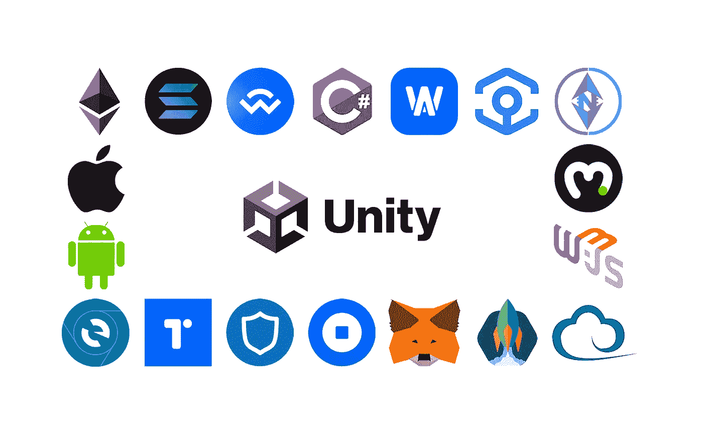
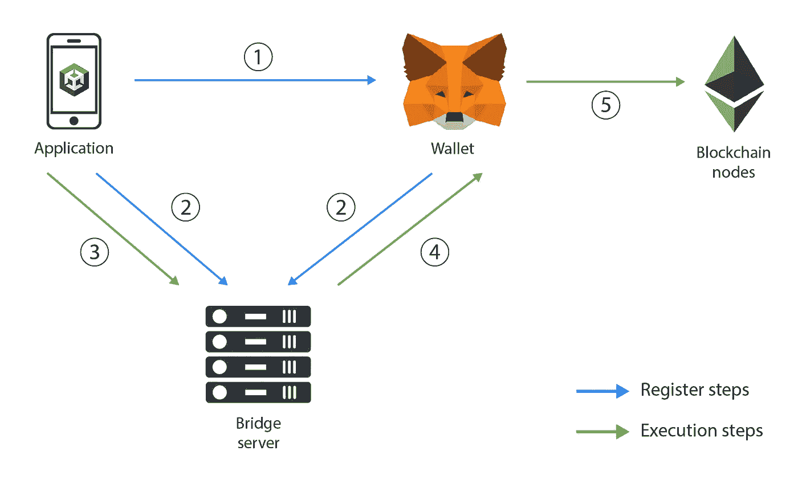

# Web3 在 Unity 中的状态

> 原文：<https://betterprogramming.pub/state-of-web3-in-unity-28475f89ffea>

## 让我们深入 web3 SDKs 的当前状态，并了解我们如何在 Unity 中提供最好的区块链功能



根据 2022 年的 NewzooTrend 报告，49%与去中心化应用程序交互的独特钱包已在区块链游戏中使用。该报告还指出，音乐和娱乐领域的大品牌对元宇宙的项目越来越感兴趣。

我的愿景是，沿着 Web3 游戏和元宇宙的道路前进的唯一方式是继续增强用户体验，使其清晰、直观、符合逻辑，是的，你是对的——娱乐性！让我们深入了解这条道路上的当前事态，并找出我们如何能够将 Web3 技术引入并为最受欢迎的游戏引擎之一——Unity 提供最佳的区块链功能。

我的这篇文章适用于 EVM 兼容的区块链，因为我们知道它在引擎盖下的工作方式，不是吗？:)在这里，我主要关注 Unity 库和特性；但是，有些信息也可能适用于其他发动机。此外，我们都喜欢开源，所以我只写了我可以测试的开源库。

# 结构

首先，让我们先来看看如何在不同的平台上连接到区块链。我想强调一下，我通常用钱包来存放私人钥匙。当然，您可以使用不同的方法，但是在这种情况下，您需要自担风险。此外，我要说的是，我从最简单的解决方案开始，并继续增加复杂性，以除了武士之路之外不能被称为其他解决方案的解决方案结束。

# 网

网络平台与区块链合作的历史最长。最先进的 Web3 库是为 Web 创建的。一切从 [web3.js](https://github.com/ChainSafe/web3.js) 开始，接着是 [ether.js](https://github.com/ethers-io/ethers.js) ，然后是 [Embark](https://framework.embarklabs.io/) 。网络提供了大量不同的钱包，从浏览器插件(Metamask，比特币基地)到 dApps (MyEtherWallet)，再到服务(Torus)。

## ***Ankr Gaming SDK***

除了部署智能合约之外，Ankr Gaming SDK 提供了与区块链交互的所有基本功能。它支持从 C#代码中调用 web3.js 方法，这将 SDK 扩展到 web3 世界中最著名的库的功能。同时，它支持所有注入钱包，如 Metamask，比特币基地等。，以及环面。Ankr Gaming SDK 是作为通用 SDK 的一部分实现的，不需要任何特定的集成先决条件。值得一提的是，Ankr 也为虚幻引擎提供了相同功能的 SDK。

SDK:[https://github.com/Ankr-network/game-unity-sdk](https://github.com/Ankr-network/game-unity-sdk) 举例:[https://github.com/Ankr-network/game-unity-demo](https://github.com/Ankr-network/game-unity-demo)文档:[https://www.ankr.com/docs/game/ankr-game/](https://www.ankr.com/docs/game/ankr-game/)

## ***道德游戏套装***

Moralis 是一项服务，允许管理以太坊和索拉纳区块链上的 Web3 应用程序，使用各种钱包，并与 Firebase 或 PlayFab 等其他服务连接。你唯一需要注意的是，他们有一个非常特殊的高级 API，你最好研究一下它的兼容性。

SDK:[https://github.com/MoralisWeb3/unity-web3-game-kit](https://github.com/MoralisWeb3/unity-web3-game-kit)
举例:[https://github.com/MoralisWeb3/web3-unity-sdk-examples](https://github.com/MoralisWeb3/web3-unity-sdk-examples)
文档:[https://docs.moralis.io/reference/evm-api-overview](https://docs.moralis.io/reference/evm-api-overview)

## ***自定义方式***

如果您有非常具体的用例、良好的 JavaScript 体验，并且不想使用第三方解决方案，您可以使用 WebGL 平台开发自己的集成。正如你可能已经知道的，Unity 提供了一种从 C#脚本直接调用 JavaScript 代码[的极好方法。还有，可以使用我之前提到的 JS 库:](https://docs.unity3d.com/Manual/webgl-interactingwithbrowserscripting.html) [web3.js](https://github.com/ChainSafe/web3.js) 、 [ether.js](https://github.com/ethers-io/ethers.js) 、 [Embark](https://framework.embarklabs.io/) 等。

要开始项目开发，您可以使用 meta mask——最流行的钱包，里面有相当好的文档。但是为了扩展支持的钱包，我推荐使用像[web 3 mode](https://github.com/WalletConnect/web3modal)这样的库。

# 安卓/ iOS

没有必要区分 Android 和 iOS 平台，因为它们使用单一的方法来连接区块链— [WalletConnect](https://walletconnect.com/) 。

WalletConnect 是一个非常简单的协议，它使用移动钱包用用户的私钥签署交易。当然，您可以将它存储在您的应用程序中，但是这将意味着许多安全问题都落在您的肩上。

WalletConnect 由 3 个参与者组成:您的应用程序、桥服务器和移动钱包。我认为唯一需要解释的参与者是桥接服务器。它是一个注册应用程序和钱包的专用服务器，就像一个钱包-应用程序互联的代理一样工作。



让我们深入了解协议工作的五个步骤:

1.  您的应用程序与移动钱包共享桥服务器的会话 ID 和地址(使用深度链接或 QR 码)。
2.  然后，您的应用程序和移动钱包在桥服务器上以相同的会话 ID 注册。
3.  您的应用程序准备一个事务，并将其发送到桥服务器。
4.  桥服务器将此交易转移到您的移动钱包。
5.  移动钱包执行交易。

当然，这是一个过于简化的协议，但是对于本文的目的来说已经足够了。让我们来看看您可以用于当前平台的 SDK。

## ***Ankr 游戏 SDK***

我之前提到过，它是一个通用的 SDK。网络平台也是如此——它提供了与区块链互联的所有重要功能。它基于 WalletConnect 和 Nethereum 库，并提供了一个取自 web3.js 最佳实践的方便的 API。

SDK 被实现为拥有一个处理契约事件的内部系统，这使您能够通过灵活的查询来请求和订阅事件。此外，SDK 支持所有与 WalletConnect 协议(元掩码、信任等)兼容的钱包。).最重要的是——开发是由 Ankr 进行的，Ankr 确保定期更新，为 Web3 新来者提供体面的示例、最佳实践和文章。

SDK:[https://github.com/Ankr-network/game-unity-sdk](https://github.com/Ankr-network/game-unity-sdk) 举例:[https://github.com/Ankr-network/game-unity-demo](https://github.com/Ankr-network/game-unity-demo)
文档:[https://www.ankr.com/docs/game/ankr-game/](https://www.ankr.com/docs/game/ankr-game/)

## ***道德游戏套装***

这和我在网络平台部分提到的游戏套件是一样的。它具有相同的功能，并与 WalletConnect 和 Nethereum 库集成。这意味着您拥有开箱即用的所有 Nethereum 功能，并支持所有与 WalletConnect 协议(元掩码、信任等)兼容的钱包。).

SDK:[https://github.com/MoralisWeb3/unity-web3-game-kit](https://github.com/MoralisWeb3/unity-web3-game-kit)
举例:[https://github.com/MoralisWeb3/web3-unity-sdk-examples](https://github.com/MoralisWeb3/web3-unity-sdk-examples)文档:[https://docs.moralis.io/reference/evm-api-overview](https://docs.moralis.io/reference/evm-api-overview)

## ***Web3Auth SDK***

Web3Auth 是一个平台，其使命是利用 Web2 互联网的便利来扩展 Web3。他们通过社交登录提供商(谷歌、脸书等)提供登录功能。)，允许在钱包内购买加密货币。但是根据经验，在 Web3 中，更多的便利总是意味着更少的安全。对于这个套件来说是绝对正确的。登录后，它会向您返回登录用户的私钥。这意味着现在你负责存储和保护用户钱包的主要秘密。我甚至没有谈论通过网络发送私钥，这是一种容易受到中间人和其他攻击的操作。但是如果你的目标是用户体验而不是安全，你可以使用这个解决方案。此外，您可以与 Nethereum 集成，并在您的项目中获得该库的所有优势——它允许您使用私钥来设置 Web3 提供者。

SDK:[https://github.com/Web3Auth/web3auth-unity-sdk](https://github.com/Web3Auth/web3auth-unity-sdk)
文档:[https://web3auth.io/docs/index.html](https://web3auth.io/docs/index.html)

## ***自定义方式***

如果你打算为 Android 或 iOS 平台创建自己的解决方案，你有几条路可以走:

*   使用第三方钱包签署交易。在这种情况下，WalletConnect 协议将帮助您。
*   请用户与您共享私钥。在这种情况下，只有高水平的密码学和安全专家才能帮助你。

让我们把 WalletConnect 协议作为最常见的方式。您必须将几个库导入到您的项目中，例如 [WalletConnect。核心](https://github.com/WalletConnect/WalletConnectSharp)， [WalletConnect。团结](https://github.com/WalletConnect/WalletConnectUnity)，和[幽冥](https://github.com/Nethereum/Nethereum)。然后你会有一个迷人的追求，去解决依赖关系并找到合适的库版本。我建议您从 Ankr Gaming SDK 或 Moralis game kit 中获取它们，因为这些库已经设置了互操作性。除此之外，您还需要部署一个桥服务器来连接钱包。

# 单独的

事实上，我不会将独立平台划分为不同的类别，因为它们与钱包的连接方式与 Android 和 iOS 相同。在独立平台上使用 WalletConnect 的一个特别之处是使用二维码而不是深层链接来连接钱包。老实说，我还没有针对所有独立平台测试过上一个类别中的库，但是 Ankr SDK 实现为支持所有这些，Web3Auth SDK 承诺在 Windows 上工作。据我所知，在独立平台上使用尼瑟姆没有问题，这就是为什么 Moralis 也可以使用，尽管我不是百分之百确定。上一节中关于定制开发的建议也适用于独立平台。

# 结论

我想说的是，GameFi 的工具目前还处于早期开发阶段。市场上没有无可争议的领导者，开发自己的 SDK 不会被认为是疯狂的行为，就像它肯定会被认为是更成熟的开发部分一样。但这是区块链行业本身的现状，每天都会带来新的解决方案和工具。达到高度成熟需要一段时间。

当然，这并不是 Unity 的 Web3 解决方案的完整列表，但我试图找到与 Web3 和 Unity 相关的最有趣的项目，并按照成熟度对其进行分类。如果你知道其他值得关注的项目，或者想表达自己的观点，那就在评论里见面吧。

```
**Authors**[Kirill Sidorov](https://www.linkedin.com/in/sidorovk/) (material selection, experiments with SDKs, technical writing)[Evgeni Danilov](https://www.linkedin.com/in/gene-danilov/) (editing, breathed life in text)
```