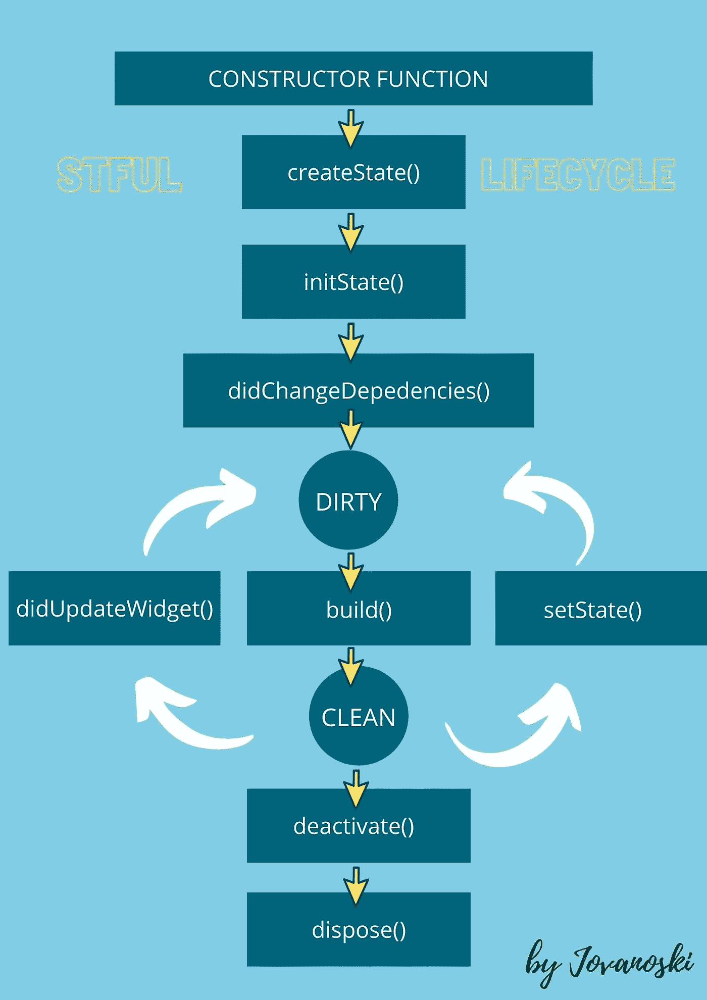

# 有状态小部件生命周期

> 原文：<https://betterprogramming.pub/stateful-widget-lifecycle-a01c44dc89b0>

## 发现颤动——第 13 周

## 求职面试中最常见的问题之一


[张艺](https://unsplash.com/@kencheungphoto?utm_source=unsplash&utm_medium=referral&utm_content=creditCopyText)在 [Unsplash](https://unsplash.com/@kencheungphoto?utm_source=unsplash&utm_medium=referral&utm_content=creditCopyText) 上拍照。

不像无状态窗口小部件，每当我们想要做一些改变时，我们必须销毁并重新创建，有状态窗口小部件具有可变的状态。

工作面试中经常出现的一个问题是关于有状态小部件的生命周期，因此这篇文章专门讨论这个主题。

# StatefulWidget 的七个周期

当 Flutter 构建有状态小部件时，它首先执行小部件的`constructor`函数，然后调用`createState()`方法。如果我们看一下有状态小部件，首先执行构造函数。另一方面，如果我们看一下有状态小部件的`State`对象，它的生命周期从调用`createState()`方法时开始。

*注意:* `*constructor*` *函数不是生命周期的一部分，因为* `*widget*` *属性的状态在那时是空的。*



图片由贾云馨·约万诺斯基提供。

## 1.创建状态()

这个方法创建了一个`[State](https://docs.flutter.io/flutter/widgets/State-class.html)`对象。这个对象保存了该小部件的所有可变状态。这个方法是`StatefulWidget`内的`required`:

```
*class* MyHomePage *extends* StatefulWidget {
  @override
  _MyHomePageState createState() => _MyHomePageState();
}
```

## 已安装(真)

一旦我们创建了一个`State`对象，框架就会通过将名为`mounted`的布尔属性设置为`true`来将`State`对象与`BuildContext`相关联。这个属性告诉我们这个`[State](https://api.flutter.dev/flutter/widgets/State-class.html)`对象当前是否在小部件树中。

*注意:这一步并没有被标记为生命周期中的一个真正的步骤，但是知道后台正在发生什么是很重要的。*

## 2.initState()

当对象被插入到树中时(`mounted`属性被设置为`true`)，该方法在类构造函数之后自动执行。`initState()`只被调用一次，当状态对象第一次被创建时。

*注意:不能从该方法中使用* `*BuildContext*` *。*

*提示:使用这个方法来管理 HTTP 请求和订阅流或任何其他可能改变这个小部件上的数据的对象。*

```
@override
*void* initState() {
  *super*.initState();
  *// TODO: implement initState* }
```

## 3.didChangeDependencies()

框架会在`initState()`之后立即调用这个方法。当小部件所依赖的对象发生变化时，也会调用它。`build`方法总是在这个方法之后被调用，所以很少需要这个方法。然而，这个方法是第一个可以用来调用`BuildContext.inheritFromWidgetOfExactType`的方法。

## 4.构建()

这个方法是`required`，在生命周期中会被调用很多次，但是第一次是在`didChangeDependencies()`方法之后。所以每当属于状态的小部件被更新时，框架总是会执行这个方法(即每次调用`didUpdateWidget()`或`setState()`方法)。

## 5.didUpdateWidget()

如果父小部件更改了其配置并且必须重新构建小部件，则调用该函数。框架将旧的小部件作为一个参数提供给你，你可以用它与新的小部件进行比较。Flutter 会在它之后调用`build()`方法。

*提示:如果你需要比较新旧部件，可以使用这个方法。*

```
@override
*void* didUpdateWidget(*covariant* MyHomePage *oldWidget*) {
  *super*.didUpdateWidget(*oldWidget*);
  *// TODO: implement didUpdateWidget* }
```

## setState()

这个方法通常从 Flutter 框架本身和开发人员那里调用。`setState()`方法通知框架当前对象的内部状态是“脏的”，这意味着它已经以一种可能影响 UI 的方式被改变。在这个通知之后，框架将调用`build()`方法来更新和重建一个小部件。

*提示:每当你改变一个* `[*State*](https://api.flutter.dev/flutter/widgets/State-class.html)` *对象的内部状态时，在* `*setState()*` *方法中进行改变。*

```
setState(() {
  *// implement setState* });
```

*注意:我不会将* `*setState*` *标记为生命周期方法中的一个步骤，因为它是开发人员调用的唯一方法。*

## 6.停用()

当小部件从小部件树中移除时，调用该方法，但是当状态从树中的一点移动到另一点时，可以在当前帧更改完成之前重新插入该方法。

```
@override
*void* deactivate() {
  *super*.deactivate();
  *// TODO: implement deactivate* }
```

## 7.处置()

当`State`对象从窗口小部件树中永久删除时，就会调用这个函数。

*提示:使用这个方法来清理数据监听器或生命连接。*

```
@override
*void* dispose() {
  *super*.dispose();
  *// TODO: implement dispose* }
```

## 已安装(假)

在`dispose()`方法之后，`[State](https://api.flutter.dev/flutter/widgets/State-class.html)`对象当前不在树中，所以`mounted`属性现在是`false`。状态对象永远不能重新挂载。

# 结论

如果你是涵盖各种 Flutter 主题的简短有趣文章的粉丝，并且你想养成在接下来的 18 周内和我一起学习 Flutter 的习惯，你可以每周二阅读我的文章。

如果你对这篇文章有任何问题或评论，请在评论区告诉我。

对于那些想加入我们的颤振之旅的人，可以在下面找到前几周的链接:

*   [第一周](https://medium.com/the-innovation/discover-flutter-roadmap-for-learning-flutter-why-textalign-property-does-not-work-aa055a469025)——“学习颤振路线图”
*   [第 2 周](https://medium.com/@jelenajjovanoski/discover-flutter-how-to-create-sliders-how-to-create-cool-text-designs-8adb0e1feea3)——“如何创建简介滑块”
*   [第三周](https://medium.com/@jelenajjovanoski/discover-flutter-how-to-easily-generate-routes-how-to-flatten-deeply-nested-widget-trees-9c66dae99a73)——“如何轻松生成路线”
*   [第 4 周](https://medium.com/datadriveninvestor/discover-flutter-great-packages-for-pdf-viewing-tagging-flush-bar-26066e3c0d3b)——“某些颤振包的建议”
*   第五周——“底部导航栏”
*   第六周——“每个动画的神圣三位一体”
*   [第 7 周](https://medium.com/@jelenajjovanoski/discover-flutter-new-material-buttons-in-flutter-version-1-22-39b8f1887d8)——“Flutter 版本 1.22 中的新材料按钮”
*   [第 8 周](https://medium.com/@jelenajjovanoski/discover-flutter-october-recommendation-for-flutter-packages-9d1b07f3490f)——“我 10 月份对颤振套件的建议”
*   [第九周](https://levelup.gitconnected.com/discover-flutter-flutter-version-manager-fvm-411dc2bff4b4)——“Flutter 版本经理——FVM”

下周见。不要打破记录！