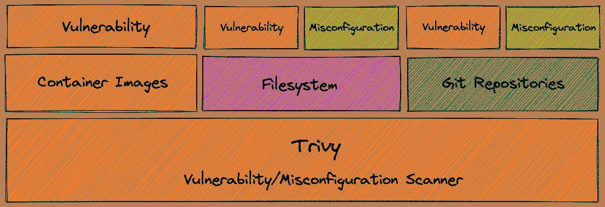
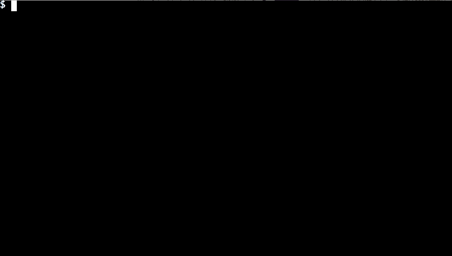
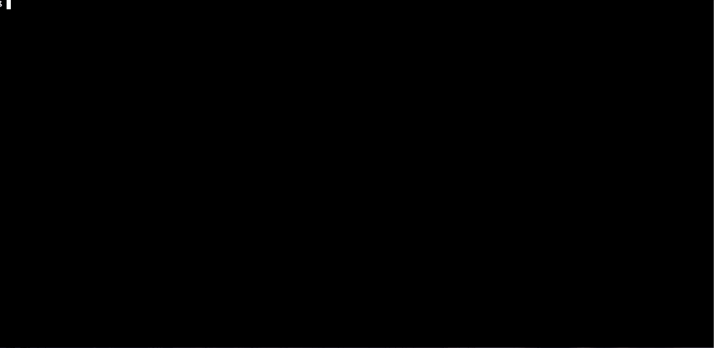
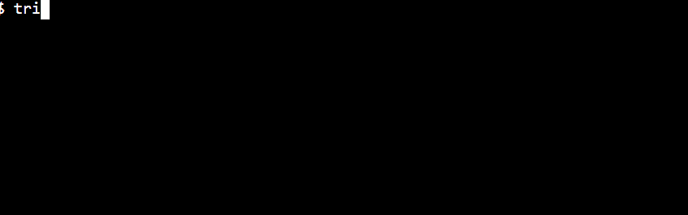
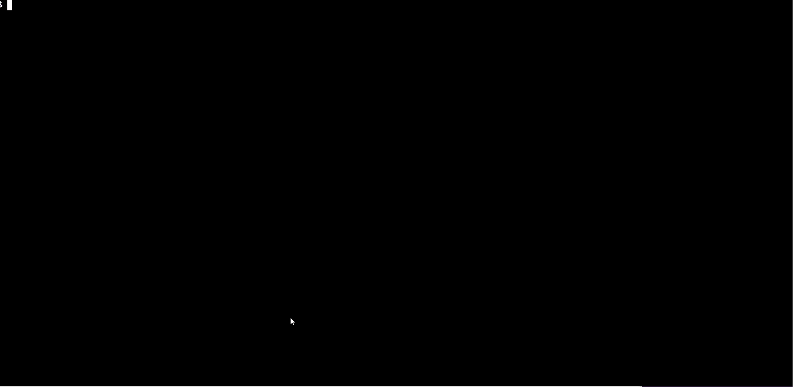

# 基于 Trivy 的集装箱图像静态分析

> 原文：<https://betterprogramming.pub/static-analysis-of-container-images-with-trivy-8d297c4f1dd3>

## 在您的容器工作负载中实现安全性


摄影:[飞:D](https://unsplash.com/@flyd2069?utm_source=medium&utm_medium=referral) 上 [Unsplash](https://unsplash.com?utm_source=medium&utm_medium=referral)

随着科技行业以越来越快的速度转向容器，容器安全是网络安全的一个重要方面。容器映像是从基础映像派生出来的，在基础映像中有很多东西可能是易受攻击的。因此，出现了扫描图像的需要，因为大量的图像不在开发者的控制之下。这并不意味着我们不需要扫描开发人员的配置。我们需要扫描 other 文件、Kubernetes 清单和其他 IaC 配置，发现任何可能潜入的漏洞，并实施安全最佳实践。

[Aquasecurity Trivy](https://github.com/aquasecurity/trivy) 就是这样一款工具，可以帮你解决所有这些问题。它是一个漏洞和安全错误配置扫描器，可以扫描容器映像、文件系统和 Git 存储库，查找 IaC、Kubernetes 清单和 docker 文件中的漏洞和错误配置。下图很好地描述了范围:



图片来源:[繁琐的官方文件](https://aquasecurity.github.io/trivy/v0.19.2/imgs/overview.png)

尽管市场上有很多容器漏洞扫描器，但这是目前为止最轻量级和功能最丰富的工具之一。都需要安装`trivy`命令行，就可以上手了。它还与 CI 管道完美集成，您可以将其与几个 CI 工具集成，如 Travis CI、CircleCI、Jenkins、GitLab CI 等。

在本文中，我们将使用`trivy`命令行安装并探索该工具。那么，我们开始吧。

# 先决条件

Trivy 运行于多个 Linux 平台，包括 RHEL/CentOs、Ubuntu/Debian、Arch Linux、MacOs、Nix 等。在这个练习中，我们将使用 Ubuntu 18.04 Bionic Beaver LTS，但也可以随意使用任何支持的 Linux 操作系统。

# 安装三脚架

在不同的平台上安装 Trivy 有不同的方式。你可以参考[官方文档](https://aquasecurity.github.io/trivy/v0.19.2/getting-started/installation/)来了解你的操作系统。

要在 Ubuntu 上安装 Trivy，请使用以下命令:

```
$ sudo apt-get install wget apt-transport-https gnupg lsb-release
$ wget -qO - [https://aquasecurity.github.io/trivy-repo/deb/public.key](https://aquasecurity.github.io/trivy-repo/deb/public.key) | sudo apt-key add -
$ echo deb [https://aquasecurity.github.io/trivy-repo/deb](https://aquasecurity.github.io/trivy-repo/deb) $(lsb_release -sc) main | sudo tee -a /etc/apt/sources.list.d/trivy.list
$ sudo apt-get update
$ sudo apt-get install trivy
```



正如我们所见，Trivy 已经成功安装在我们的系统中。

现在，让我们来探索这个工具的第一个功能—运行漏洞扫描。

# 运行漏洞扫描

要运行 Docker 映像的漏洞扫描，请使用以下命令:

```
$ trivy image <image>
```

例如，如果我们想要运行对`nginx:latest`图像的漏洞扫描，使用以下命令:

```
$ trivy image nginx:latest
```



正如我们所见，存在大量漏洞。用更轻量级的图像怎么样？让我们试着在阿尔卑斯山上运行它:



我们还可以使用 Trivy 来发现您的 IaC 配置、Dockerfile 和 Kubernetes 清单中的安全错误配置。接下来让我们看看:

# 发现安全错误配置

我们可以在文件系统和 git 存储库上运行安全错误配置。让我们试着在文件系统上运行一次扫描。为此，您需要派生并克隆这个存储库:

git 存储库包含一个 Dockerfile 文件和一个 deployment.yaml k8s 清单文件。

`Dockerfile`看起来如下:

注意，我们已经从 nginx 基本映像开始，并将用户设置为 root。然而，这不是安全的最佳实践，并且不鼓励使用 root 用户来运行您的容器。

`deployment.yaml`文件如下所示:

在这个清单中，我们特意将`securityContext`中的`privileged`属性设置为`true`。不幸的是，这也是安全弊端，应该避免。

现在，让我们尝试运行扫描，看看特里维告诉我们什么。为此，请使用以下命令:

```
$ trivy config <config_dir>
```



如我们所见，我们得到了配置中列出的一组漏洞。我需要指出的是，已经检测到 Dockerfile 中有 root 用户，这不是安全最佳实践。我们还试图在特权模式下运行 Kubernetes 部署，它已经检测到了这一点。

# 结论

Trivy 作为一个针对容器映像和相关配置的全面的静态安全分析工具工作得非常好，并且它与您的 CI 管道很好地结合在一起。如果有效实施，它可以大大增强您的安全态势。

感谢阅读！我希望你喜欢这篇文章。