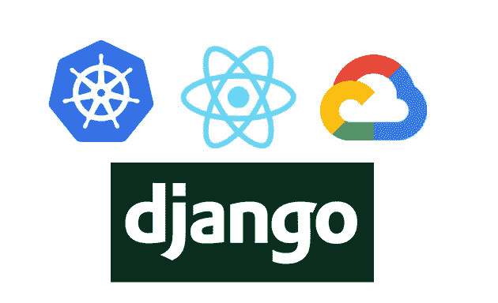

# 与 Kubernetes 一起为 Django 的静态资产服务

> 原文：<https://betterprogramming.pub/static-assets-in-django-and-kubernetes-c05480d2e224>

## 姜戈、React 和 GKE 的 Kubernetes



图片来源:作者

本文关注于部署静态资产的策略，特别是使用 [create-react-app](https://github.com/facebook/create-react-app) 工具链生成的资产。这些资产由部署在谷歌云 [GKE](https://cloud.google.com/kubernetes-engine) 平台上的 [Kubernetes](https://kubernetes.io/) 集群中的 [Django](https://www.djangoproject.com/) 提供服务。

使用的技术有 Django，React， [Docker](https://www.docker.com/) ， [gcloud](https://cloud.google.com/sdk/gcloud) 及其相关的 CLIs，如 [gsutil](https://cloud.google.com/storage/docs/gsutil) 。它探索了一个 Docker 构建管道的示例，该管道生成图像并将静态资产推送到 gcloud bucket。这篇文章大量借用了谷歌自己的指南，名为“[在谷歌 Kubernetes 引擎上运行 Django](https://cloud.google.com/python/django/kubernetes-engine)*”*(文章其余部分参考为*Django GKE*)*。*

我们发现,《GKE 指南》中有一些盲点，或者更确切地说，有一些具体的使用案例，这些都是指南中没有涉及到的，这里将解决其中的一些差距。本文中没有提到的内容都被假定在 Django GKE 指南中涵盖了(例如，创建 GKE 集群以及存储桶和数据库),所以如果您需要了解全貌，请参考该指南。

本文分为三个主要部分:React 应用程序部分、Django 部分以及构建和部署部分。本文中的所有内容都可以在[django _ react _ k8s](https://github.com/gitumarkk/django_react_k8s)GitHub 资源库中找到。因此，我们将只看核心点，而不是进入如何设置它的细节。

# React 应用程序设置

在 [django_react_k8s](https://github.com/gitumarkk/django_react_k8s) 存储库中，静态资产可以在`./static`文件夹中找到，并且是使用以下命令创建的。

```
npx create-react-app static
```

这将安装一个标准的 React 应用程序，但是我们需要做一些修改，以便在生产环境中为 Django 提供静态资产。第一组修改是安装允许我们定制 create-react-app 配置的包。可以通过运行以下命令来安装这些软件包:

```
yarn add -D react-app-rewired customize-cra webpack-bundle-tracker@0.4.3 write-file-webpack-plugin
```

*   第一个包是 [react-app-rewired](https://github.com/timarney/react-app-rewired) ，它会覆盖 create-react-app webpack 配置，而无需将其弹出。
*   [customize-cra](https://github.com/arackaf/customize-cra) 与 [react-app-rewired](https://github.com/timarney/react-app-rewired) 协同工作，并提供有用的实用程序来执行覆盖。
*   webpack-bundle-tracker 将一些关于 webpack 编译过程的统计信息输出到一个文件中。在这种情况下，stats 文件将提供一个接口，让 Django 知道已经生成的不同资产，包括它们在磁盘或云中的位置。这很有用，因为在产品构建过程中，文件名往往会被动态散列，在 Django 应用程序中硬编码更改会很麻烦。请注意，由于较新版本中的软件包存在缺陷，要安装的版本为 0.4.3(请参见[问题 227](https://github.com/owais/django-webpack-loader/issues/227) )。
*   [write-file-web pack-plugin](https://github.com/gajus/write-file-webpack-plugin)是一个方便的包，它在开发周期中将生成的静态文件写入文件系统。使用`yarn start`允许从 Django 本地访问和提供静态内容。

下一组定制与 React `package.json`文件有关。它需要更新如下(阅读 [react-app-rewired](https://github.com/timarney/react-app-rewired) 了解更多细节)。

```
"scripts": {
  "start": "react-app-rewired start",
  "build": "react-app-rewired build",
  "test": "react-app-rewired test",
  "eject": "react-app-rewired eject",
}
```

为了实际覆盖 webpack 设置，我们需要在静态文件夹中创建一个`config-override.js`文件。它应该是这样的(查看 [customize-cra](https://github.com/arackaf/customize-cra) 文档以了解更多细节)。

如果您以前使用过 React，或者如果您通读了各个包的文档，这应该非常简单。重要的修改在`config.output.publicPath`设置中。在生产中，`publicPath`应该指向 Google 云桶，否则，在开发周期中，应该是原始设置。此外，变量`REACT_GCLOUD_BUCKET`在 npm 构建过程中被传入，并且是有用的，因为它允许设置不同的存储桶位置，例如，一个用于暂存，另一个用于生产部署。将`output.path`改为`buildPath`允许 Django 找到静态文件。

需要对`optimization.splitChunks.name`、`optimization.runtimeChunk`和`output.futureEmitAsset`进行配置，以使设置在 Django 中工作。我没有时间调查为什么会出现这种情况的根本原因。如果你知道，也许可以添加一条注释来说明原因。

# Django 设置

除了`django-admin startproject`命令和生成的样板代码之外，还做了一些修改。唯一需要的 Python 包是 [django-webpack-loader](https://github.com/owais/django-webpack-loader) ，它允许在 django 中透明地使用 webpack。这可以通过运行`pip install django-webpack-loader`来安装。如何设置它的文档可以在[django-web pack-loader](https://github.com/owais/django-webpack-loader)GitHub 页面找到。然而，对于这个用例，对设置文件的修改应该如下:

```
INSTALLED_APPS = [
  ...,
  'webpack_loader'
]REACT_STATIC_PATH = STATIC_PATH / 'dancelogue' / 'build'
REACT_STATS_PATH = DANCELOGUE_STATIC_PATH / 'webpack-stats.json'WEBPACK_LOADER = {
  'DEFAULT': {
     'CACHE': not DEBUG,
     'BUNDLE_DIR_NAME': str(REACT_STATIC_PATH),
     'STATS_FILE': str(REACT_STATS_PATH),
     'POLL_INTERVAL': 0.1,
     'TIMEOUT': None,
     'IGNORE': [r'.+\.hot-update.js', r'.+\.map']
  },
}
```

首先，将 `webpack_loader`包添加到已安装的应用程序中。接下来，使用`WEBPACK_LOADER`变量设置配置加载器行为。在字典中，`BUNDLE_DIR_NAME`应该指向 React 构建文件夹，即指向`static/build/`而不是根静态文件夹，因为我们只对 React 构建过程的输出感兴趣。在构建文件夹中，可以找到使用 React 部分的`webpack-bundle-tracker`生成的`webpack-stats.json`。这个配置允许 Django 提供在`yarn start`或`yarn build`期间生成的散列文件。

此外，Django 需要知道收集静态文件的位置，以及在生产中从哪里提供这些文件。这是通过将以下内容添加到`settings.py`文件来完成的。

```
STATICFILES_DIRS = [ REACT_STATIC_PATH / 'static' ]
STATIC_ROOT = BASE_DIR / 'collectstatic'if IS_DEPLOYED:
  bucket = os.environ.get('GCLOUD_ASSET_BUCKET')
  STATIC_URL = f'https://storage.googleapis.com/{bucket}/static/' else:
 STATIC_URL = '/static/'
```

`STATICFILES_DIRS`告诉 Django 感兴趣的静态文件的位置，并被设置为 React 构建路径。哪该下决心`static/build/static`。这有点复杂，但事实就是如此。接下来，`STATIC_ROOT`非常简单，它只是告诉 Django 将静态文件收集到哪里。重要的一点是在部署时给 Django 提供静态文件的位置，如`IS_DEPLOYED`变量所示。在这里，`GCLOUD_ASSET_BUCKET`被设置为一个环境变量，在将 staging 从 production buckets 中分离出来时非常有用。 [python-dotenv](https://pypi.org/project/python-dotenv/) 包可用于存储和读取环境变量。检查 [django_react_k8s](https://github.com/gitumarkk/django_react_k8s) 以获得更多关于`env`文件应该在`./env/.env`下的详细信息。注意使用了 [python-f-strings](https://realpython.com/python-f-strings/) 格式，所以至少需要 Python 3.6。

最后需要修改的是 Django 应用程序的基本 HTML 文件，如下所示。

```
<!DOCTYPE html>
<html lang="en">
  <body>
    <div id="root"></div>
    
    
  </body>
</html>
```

更多可用的配置可以通过阅读 django-webpack-loader 文档找到。

# 测试设置

在本地环境中测试应用程序非常简单。首先，运行`yarn start`以确保它正在运行，默认的 create-react-app 页面可以在`[http://localhost:3000/](http://localhost:8000/)`上看到。下一步是运行`python manage.py runserver`，它应该在默认端口`8000`上运行。导航到`[http://localhost:8000/](http://localhost:8000/)`应该显示与默认的 create-react-app 页面完全相同的页面。

# 构建和部署

在这一节中，与 Django GKE 指南有所重叠，后者更深入地介绍了如何部署到 Kubernetes。本节将更多地关注于确保 docker 映像构建正确，一旦部署到集群中，就可以为静态资产提供服务。

## 码头工人

首先要看的是`Dockerfile`，如下:

```
FROM python:3.6.11-slim
ENV PYTHONUNBUFFERED 1
RUN mkdir /django_react_k8s
WORKDIR /django_react_k8s
RUN pip install --upgrade pip
COPY requirements.txt /django_react_k8s/
RUN pip install -r requirements.txt
COPY . /django_react_k8s/
CMD python manage.py runserver 0.0.0.0:8000
```

这是一个相当标准的配置，所以我不会详细介绍它。

下一个文件是`.dockerignorefile`。这很重要，因为它有助于保持 docker 图像较小，并防止敏感数据进入文件。

```
... # standard excludes e.g. .git and such
# custom
*Dockerfile*
**/node_modules
static
!static/build/webpack-stats.json
collectstatic
# env
```

这包括常见的忽略模式，以及一些特定于项目的模式。出于显而易见的原因，主要的例外是`node_modules`。

静态文件夹被忽略，除了由感叹号指示的`webpack-stats.json`文件。`webpack-stats.json`是`docker image`需要包含的唯一静态文件。其他一切，包括构建的静态资产的位置，都包含在 stats 文件中，如`publicPath`中所定义的。这意味着如果中间有一个 npm 构建步骤，理论上每个 Docker 容器应该有一个唯一的 stats 文件。在实践中，我通常还会将`env`文件添加到`ignore`文件中，因为它包含 API 密钥等敏感数据，然后根据需要将其作为 Kubernetes 秘密或配置映射。

## 构建脚本

下面是一个构建和部署管道的基本示例。

构建阶段的步骤如下:

*   使用`rm -rf static/build/*`清理 React 构建文件夹。这可以防止旧文件在`collectstatic`阶段被复制，并保持精简。
*   通过删除所有已编译的文件来清理 Python 环境。
*   运行 npm 构建命令，即`REACT_GCLOUD_BUCKET={get_bucket(env)} npm run — prefix static build`。静态文件的桶是作为环境变量提供的，即`REACT_GCLOUD_BUCKET`。由于该命令是在静态文件夹之外运行的，因此需要使用`--prefix`参数来指示构建源，即静态文件的位置。这将在`./static/build/`下生成静态文件，只有`./static/build/webpack-stats.json`被复制到 docker 映像中。
*   然后构建 docker 映像。这是一个相当标准的流程，即`docker build -t {get_docker_image(tag, env)} .`。

部署阶段如下:

*   清理静态文件夹，防止旧文件转移到服务器，即`rm -rf collectstatic/*`。
*   使用`python manage.py collectstatic -i node_modules — noinput`收集静态文件。忽略`node_modules`很重要，因为它不再需要，并且在上传过程中为 bucket 增加了大量冗余。
*   使用`gsutil -m cp -Z -a public-read -r ./collectstatic/* gs://{get_bucket(env)}/static`将文件复制到 gcloud bucket。该部分不同于 [Django GKE 指南](https://cloud.google.com/python/django/kubernetes-engine)中规定的方法，该指南建议执行`rsync`命令，该命令仅复制变更，而不是执行`cp`命令，该命令执行完整的复制和替换。尽管`rsync`可以工作，但是`cp`在这个用例中更胜一筹，这完全是因为`-Z`参数。根据文档，`-Z`将 gzip 内容编码应用于文件上传。它不仅应用 gzip 编码，而且每当用户请求文件时，Google 都会根据客户端提供的内容类型返回正确的文件。因此，不再需要使用 webpack 配置文件来生成 gzipped 资产，或者使用 nginx(或类似的服务器)配置来提供 gzipped 资产——所有这些都为您完成了。第二个不同点是`-a public-read`参数。Django GKE 指南中没有提到这一点，但是它使得你复制到桶中的单个对象是公开的，而桶中的其他所有东西都是私有的。
*   最后，将 docker 图像推送到桶中，即`docker push {get_docker_image(tag, env)}`。

这就是构建和部署阶段。

# 库伯内特斯

这一部分将简要强调 Kubernetes 部署阶段。因为它已经在[姜戈 GKE 指南](https://cloud.google.com/python/django/kubernetes-engine)中有所涉及，所以不会有太多关于它的细节。为了简单起见，在这种情况下的例子将是单个 pod 和指向该 pod 的服务，其中规范文件是:

这非常简单，可以部署到 Minikube 集群(参见我以前关于 [Docker 和 Minikube](https://medium.com/@markgituma/kubernetes-local-to-production-with-django-2-docker-and-minikube-ba843d858817) 的文章)或 GKE 集群，正如 [Django GKE 指南](https://cloud.google.com/python/django/kubernetes-engine)中所强调的。

这些文件位于本文的示例报告中，可以通过从根文件夹运行以下命令部署到集群中:

```
kubectl apply -f k8/
```

如果您遵循 GKE 指南并已部署到集群，为了在不创建负载平衡器等的情况下查看部署的 pod 的运行情况，请运行以下[端口转发](https://kubernetes.io/docs/tasks/access-application-cluster/port-forward-access-application-cluster/)命令:

```
kubectl port-forward <name_of_pod> 8000:8000
```

您应该会在`http://localhost:8000/`的开发环境中看到相同的结果。

# 结论

这篇文章很好地概述了在 Django 和 Kubernetes 应用程序中部署静态资产的一种方法。这种策略不仅与 Kubernetes 相关，也可以用于裸机安装。

主要的焦点是将静态内容从 Django 应用程序上下文中分离出来，从而创建一个关注点分离，其中一些责任被转移到 Google 云平台。该平台已针对内容交付进行了优化，因此应用程序可以专注于其他流量。不需要担心缓存失效，因为静态文件是散列的。因此，每当包含`webpack-stats.json`文件的新部署推出时，假设文件中定义的资产存在于 bucket 中，用户将总是获得新资产，而旧资产将继续存在，以防需要对部署进行回滚。

如果你有任何问题或需要澄清的事情，你可以在[https://mbele.io/mark](https://mbele.io/mark)和我预约时间