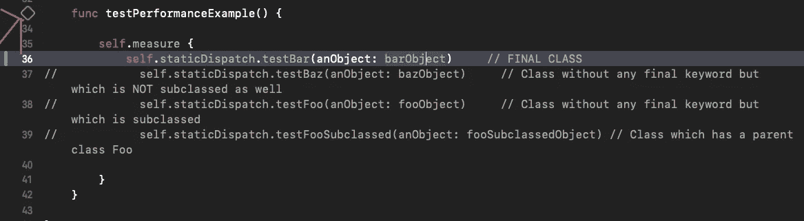
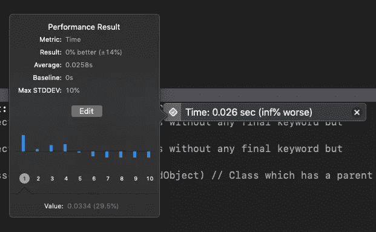

# 静态调度优于动态调度

> 原文：<https://betterprogramming.pub/static-dispatch-over-dynamic-dispatch-a-performance-analysis-47f9fee3803a>

## 性能分析

照片由[罗宾·皮尔](https://unsplash.com/@robinpierre?utm_source=medium&utm_medium=referral)在 [Unsplash](https://unsplash.com?utm_source=medium&utm_medium=referral) 上拍摄

在我的[上一篇文章](https://medium.com/@bakshioye/static-vs-dynamic-dispatch-in-swift-a-decisive-choice-cece1e872d?source=friends_link&sk=d31cc5924ef21455b0c12b1fcdd6c1d5)中，我解释了 Swift 编程语言中可用的各种*分派技术*。每当我们听到术语*调度技术*时，脑海中浮现的两个是*静态*和*动态*。

如果您还没有阅读我的[上一篇文章](https://medium.com/@bakshioye/static-vs-dynamic-dispatch-in-swift-a-decisive-choice-cece1e872d)，我强烈推荐您阅读，这样您可以获得一些调度技术的知识。

但是如果你认为你知道它们是什么，那么让我们继续！

# 这一切是如何开始的

很久以前有[一篇*苹果*的文章](https://developer.apple.com/swift/blog/?id=27)，说静态调度胜过动态调度。因此，您应该始终默认使用静态调度，只有在必要时才切换到动态调度。

当我们选择静态分派而不是动态分派时，我们获得性能提升的核心原因是，在静态分派的情况下，编译器知道，在编译时，某个类的哪个方法实现将被调用。通过这种方式，编译器可以调整一些优化技术，比如设置一些标志，或者可能的话，将调用转换为*内联分派*(这是最快的)！

然而，在动态分派的情况下，编译器只能在运行时计算出某个类要调用哪个方法实现，即基类方法还是子类方法。

这使得静态调度的性能优于动态调度。

# 如何实现静态调度

现在，根据本文，有三种方法可以实现静态调度或减少动态调度:

*   关键字:这确保了特定的类永远不会被子类化，特定的方法永远不会被覆盖，因此永远不会有动态调度。
*   关键字:这限制了方法或变量对类本身的可见性。根据文章:

> 这允许编译器找到所有潜在的重写声明。没有任何这样的重写声明，使得编译器能够自动推断出 final 关键字，并移除对方法和属性访问的间接调用。

这意味着，无论何时我们将方法或变量标记为`private`，如果该方法或变量在任何地方被覆盖，编译器都会执行搜索。如果是，它将产生一个*编译时错误*。如果它没有发现任何被覆盖的行为，它将隐式地用`final`标记它。

*   整体模块优化技术:这是一个编译器标志，`-whole-module-optimization`，它现在默认为 Xcode 8 的新项目启用。总而言之，当我们不使用这个标志(`-wmo`)时，Swift 编译器会单独编译属于一个模块的所有`.swift`文件。这限制了编译器添加某些优化，如内联，因为它将单独编译所有文件，因此编译器不知道不同的类及其方法是如何相关的。每当我们使用`-wmo`时，Swift 编译器将所有这些`.swift`文件编译在一起，因此可以添加优化。如果你想了解更多关于`-wmo`的内容，这里有很好的详细文档。

# 最后

在我读完这篇文章后，我脑子里只有一件事——证据在哪里？

我知道我们到现在为止已经经历了很多理论概念，但是我们是程序员。我们热爱代码。还有什么比证明所有这些概念的代码更好的证明呢！

## 小测验

我创建了一个小的 [**性能测试器**项目](https://github.com/bakshioye/PerformanceTester.git)，无非就是一堆 Swift 类和一些单元测试。这是我能找到的测试代码性能/速度的唯一方法。您可以克隆存储库并亲自查看。

我只使用了`final`关键字，但是您也可以使用其他两种方法。我将简要地告诉你项目组件是什么，以及如何运行测试用例。

在这个项目中，只有两个文件对我们很重要:

1.  这包含了我们将用于测试用例的所有类。
2.  `PerformanceTesterTests.swift` —它出现在`PerformanceTesterTests`组下，这是我们的单元测试组，包含我们的测试用例。

我在这两个文件中都添加了注释，使其更加不言自明。

来运行一个测试案例—

*   取消`PerformanceTesterTests.swift`文件中第 36 行的注释，它属于我们的静态分派。
*   点击第 33 行的菱形图标来运行测试用例。

这将启动 iPhone 模拟器。模拟器一上线，就会运行测试用例。

*   在测试用例完成之后，您将在右边看到运行该测试用例所花费的时间。

最后一节课

*   它可能会说“没有固定的基线”或类似的话，但你需要**点击像图中的灰色勾号**(你可能需要在第一个勾号后再点击一次)，，这将打开一个弹出窗口，如下所示:

*   现在点击`Edit -> Accept -> Save`。这将以此时间为基准，所有比较都将基于我们保存的基准时间进行。
*   就是这样！注释当前行(第 36 行)，取消下一行的注释(记住，一次只取消一行的注释)，使用第 33 行再次运行测试用例，并亲自查看性能差异。它将向您显示我们设置的基线(我们的静态调度基线)和我们当前的测试用例之间的%差异。

# 一些观察

类既不是最终类也不是子类

类别不是最终类别，但已被子类化

派生类(或子类)

所以，总而言之，作为一个好的实践，你应该首先将你的类标记为`final`，如果需要继承，就去掉`final`关键字。这确保了编译器的优化，从而提高了代码的性能。