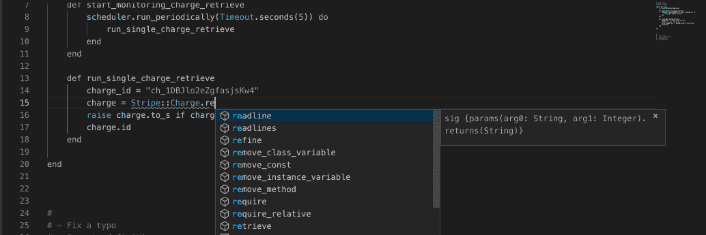
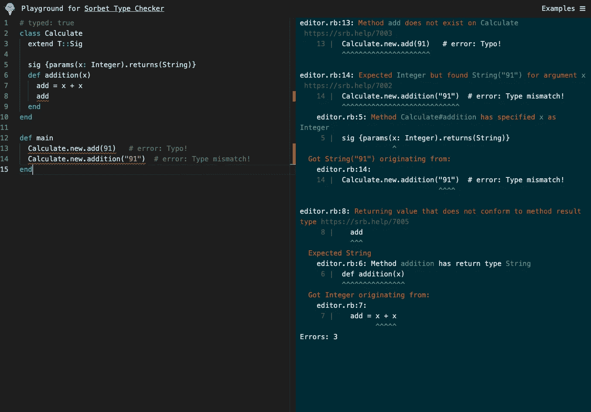
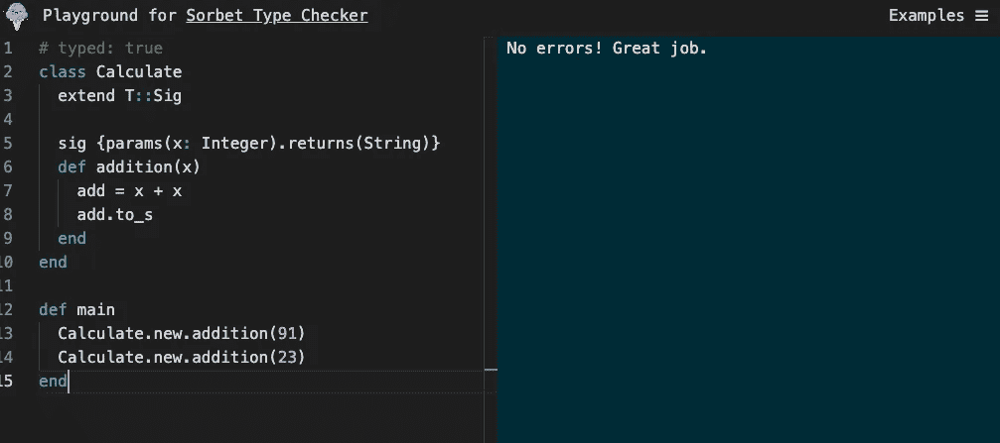

# 静态类型的 Ruby:介绍 Sorbet

> 原文：<https://betterprogramming.pub/static-typed-ruby-introducing-sorbet-from-stripe-eeb4ffd8644>

## Sorbet，来自 Stripe——一个快速、强大的类型检查器，专为 Ruby 设计


由[莎伦·麦卡琴](https://unsplash.com/@sharonmccutcheon?utm_source=unsplash&utm_medium=referral&utm_content=creditCopyText)在 [Unsplash](https://unsplash.com/s/photos/ice-cream?utm_source=unsplash&utm_medium=referral&utm_content=creditCopyText) 上拍摄的照片

Ruby 是一种令人惊叹的语言:

> 一种动态的开源编程语言，专注于简单性和生产力。它有一个优雅的语法，读起来很自然，写起来很容易。

Ruby 对于初学者来说相当容易接受。正如我的一些同事所说，Ruby 握着新开发人员的手，为他们指出正确的方向。作为一种动态语言，这意味着在运行代码之前，您不会知道代码是否有问题。例如，如果你在一个类的实例上调用一个未定义的实例方法，在你运行它之前，你不会在你的代码中得到任何错误。但是当你在一个小的代码库上工作时，这可能会被忽略——这是像 Java 和 C#这样的静态类型语言在 Ruby 上闪耀的地方。

作为软件工程师，我们写的代码越多，引入代码库的错误就越多。正如有人曾经说过的，最好的代码就是不写任何代码。静态类型让我们定义我们期望从代码中得到的数据类型和返回值。这给了我们信心，使协作变得容易，也意味着我们可以在出错时得到反馈，甚至在我们运行代码之前。多酷啊。它为我们节省了大量调试可避免的错误的时间，并且我们可以更快地交付高质量的代码。

# **介绍冰糕**

> [Sorbet](https://sorbet.org/) 是一个为 Ruby 设计的快速、强大的类型检查器。
> 建有💜在[条纹](https://stripe.com/)处。

## 冰糕快速且可扩展

Sorbet 是多线程的，可以在您的 CPU 内核之间线性扩展。它在几秒钟内检查你的类型，在你编码时给你反馈。

## IDE 就绪

Sorbet 与您最喜欢的编辑器一起工作，提供 ide 特性，如自动完成和跳转到定义。很容易添加到您的配置项设置中。

那么，我们如何开始使用冰糕呢？您可以从您现有的代码库开始:Sorbet 可以与普通的 Ruby 一起工作，并且与您已经在使用的其他 Ruby 工具或 Gems 兼容。或者你可以把它用于一个新的项目。

## **安装**

```
# -- Gemfile --gem 'sorbet', :group => :development
gem 'sorbet-runtime'# Install the gems 
❯ bundle install# Initialize Sorbet 
❯ srb init# Type check the project 
❯ srb tc
```

将冰糕宝石添加到开发组。运行 bundle install，`rub srb init`初始化 Sorbet 并键入。检查项目，最后运行`srb tc`。



来自冰糕网站:sorbet.org

## **举例:冰糕在线经由** [**游乐场**](https://sorbet.run/)



冰糕游乐场

在上面的例子中，我们有一个简单的`Calculate`类，它有一个加法的实例方法。为了在我们的类中使用 Sorbet，我们需要在 Ruby 文件的顶部添加`# typed: true`。然后，在类定义之后，我们添加`extend T::Sig`。因为 Sorbet 是非侵入性的，所以您可以定义类型化的类和方法。在`addition`实例方法的顶部，我们定义了`sig {params(x: Integer).returns(String)}`。这通知 Sorbet 我们的方法需要一个整数数据类型的参数`x`，并且该方法需要返回一个`String`数据类型。然后我们有一个 main 方法，在我们的类之外，它初始化了`Calculate`类的两个实例。

甚至在运行代码之前，我们就能获得关于代码中哪里出错的即时反馈。多酷啊！

当您将鼠标悬停在突出显示的错误上时，您会获得有关该错误的更多信息，以及需要采取哪些措施来修复该错误。这对于避免错误地将一个错误的参数或数据类型传递给一个方法有很大的帮助——您总是确切地知道您的方法将会返回哪种类型的值。那就是我所说的**超酷**！

## 让我们修复这些错误吧！



成功！

Sorbet 真的是一个很棒的工具，可以给开发者带来很好的体验。希望对你的下一个项目有帮助。

# **有用链接**

[官网](https://sorbet.org/)
[文档](https://sorbet.org/docs/overview)
[游乐场](https://sorbet.run/)

感谢阅读！