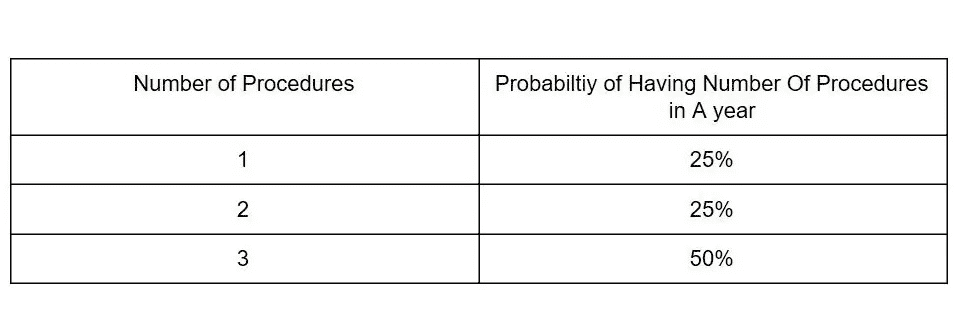
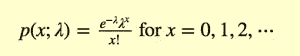
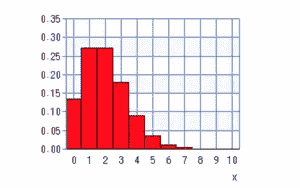
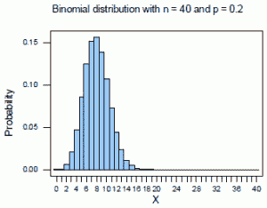
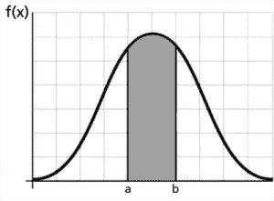
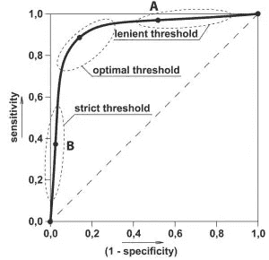
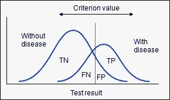
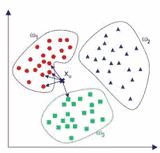

# 每个数据科学家都应该知道的基本统计学

> 原文：<https://betterprogramming.pub/statistics-review-for-data-scientists-and-management-df8f94760221>

## 数据科学团队和领导层的统计学

美国宇航局在 [Unsplash](https://unsplash.com/search/photos/data?utm_source=unsplash&utm_medium=referral&utm_content=creditCopyText) 拍摄的照片

数据科学、适马六、分析和商业智能都是多边多边形的不同侧面。每个都有不同的工具、词汇、[项目](http://www.acheronanalytics.com/acheron-blog/a-guide-to-designing-a-data-science-project)和认证。

但是，它们都是为企业降低成本和增加收入服务的。这些实用的工具可以帮助企业更有效地开展工作！

每个人都有自己的新风格的[管理实践和领导的必要性](http://www.acheronanalytics.com/acheron-blog/top-32-reasons-data-science-projects-fail)来理解正确使用这些工具可以获得的实际价值。

我们希望帮助创建一个快速指南，以帮助管理和刷新数据科学家对数据科学利用的一些概念的记忆。

如果你是数据科学家，你至少应该对统计学有一个[的基本了解。你只需要在晚宴上能够描述一些基本的算法。](https://www.lynchburg.edu/academics/majors-and-minors/data-science-and-statistics/)

我们希望用概念、方程和定理来武装你，让你听起来像是在大学里通过了高级统计计算课程。

例如，什么是概率密度函数？联合分布函数以及它们在现代数据科学中的作用如何？

了解任何主题的关键是理解它的基础部分。

像 [scki-learn](https://www.kaggle.com/getting-started/5243) 和 tensorflow 这样的库从用户那里抽象出了几乎所有复杂的数学。这很棒，因为你不用担心会不小心忘记携带 1 或者记住微积分中的每条规则。

对可以利用的一些方程、可以建模的分布以及可以帮助清理数据的一般统计规则有一个大致的了解仍然是很棒的！

# 加入我们的时事通讯

在继续滚动之前，为什么不加入我们团队的时事通讯，了解数据科学、数据工程和技术的最新动态！[在此了解更多信息](https://seattledataguy.substack.com/)。

# 离散与连续

我们需要快速地列出一些定义。

在这篇文章中，我们将讨论离散变量。如果你在这些引用变量之前没有听说过这个术语，它们是一个有限的集合。

它实际上可以包括你所使用的变量集合中的小数。然而，需要建立这些规则。

例如，在现实生活中你不可能有 3.5783123 个医疗程序。那不会发生。即使是平均值，它也有误导性。

你真的不能说，现实生活中有人会有 3.5783123 个程序的概率是多少。我们不是这样计算程序的。他们要么有 3 个要么有 4 个。

你实际上必须说一些类似这样的话:

相比之下，一个连续的变量不能像上面那样用表格的方式真实地显示出来。

相反，连续变量必须作为公式引用，因为变量可能是无限的。

输入变量可以是 1，1.9，1.99，1.999，1.99999…n。

这方面的例子可以是体重、年龄等。你不是 25 岁。你通常是 25 岁，200 天，1 小时，3 秒，2 毫秒，等等。从技术上讲，它可能是时间上的任何时刻，每个区间内部都有无限个区间。

# 统计分布

## 泊松分布

[泊松分布](http://www.probabilityformula.org/Poisson-distribution.html)用于计算连续时间间隔内可能发生的事件数量。例如，在任何特定时间段可能会有多少电话，或者有多少人可能会排队。

这确实是一个容易记忆的方程式。

这个等式λ中看起来很有趣的符号叫做[λ](https://en.wikipedia.org/wiki/Lambda)。这表示每个时间间隔内发生的平均事件数。

另一个可以用来计算制造业损失的好例子是，一台机器生产的金属板每码有 X 个缺陷。例如，如果误差率是每码金属板 2 个误差。

一个码中出现两个错误的概率是多少？

上图显示了特定时间间隔内特定数量的错误发生的概率。

## 二项分布

二项分布是一种非常常见的分布，也是基础统计课上教授的第一批分布之一。

假设你做了一个实验。就像扔硬币一样。

更具体地说，你正在进行一项实验，你将一枚硬币抛三次。

你的硬币正面朝上的概率分布是多少？

首先，基于[组合学](http://www.coolmath.com/algebra/20-combinatorics)。我们可以发现有 2 或 8 种可能的结果组合。

现在，如果我们画出概率，结果会有 0 个头，1 个头，2 个头，最后 3 个头。

这就给出了你的二项分布。当绘制图表时，你会注意到它看起来非常类似于你的典型正态分布。

这是因为二项式分布与正态分布非常相似。

一个是离散版本(例如，我们只有 5 次抛硬币，测试有限制)另一个是连续的。

# 概率密度函数和累积密度函数

## 概率密度函数

概率密度函数，也称为 PDF，是一个函数，如果你上过基础统计学课程，你实际上比你想象的更了解它。

你还记得标准差吗？

你还记得计算平均值和标准差之间的概率吗？你知道你在实现一个叫做积分的微积分概念吗？

**曲线下面的面积是多少？**

在这种情况下，假设曲线下的面积可以是从-∞到+∞或一组数字。

但是曲线下面的值是 1。因此，您正在计算曲线中两点下方的面积。

让我们回到泊松的例子。

我们可以问，在这种情况下，两个错误发生的概率是多少？嗯，这是一个棘手的问题。这些变量是离散的，而不是连续的。

如果该值是连续的，它将是 0%！！

但是，因为这个值是[离散的，这意味着它是一个整数](http://www.henry.k12.ga.us/ugh/apstat/chapternotes/7supplement.html)。因此在 1–2 和 2–3 之间没有值。相反，对于 2 美元的人来说，这一比例约为 27%。

现在，如果你在 2-3 之间问，会是什么？

PDF，以及我们将讨论的下一个函数，称为累积分布函数，可以采用离散和连续的形式。

无论哪种方式，目的都是计算出一个离散点或离散点范围下的概率密度。

## 累积分布函数

[累积分布函数](https://math.stackexchange.com/questions/52400/what-is-cdf-cumulative-distribution-function)是 PDF 的积分。PDF 和 CDF 都用于显示随机变量。

累积分布函数告诉我们随机变量小于某个值的概率。

顾名思义，这个图显示的是累积概率。因此，当提到离散变量时，如六面骰子，我们会有一个类似楼梯的图形。每一个向上的步骤将有价值的⅙+先前的概率。

到最后，第六步将达到 100%。这表明每个离散变量都有一个面朝上滚动的⅙机会，并且在最后，总共有 100%(它应该总是以 1-100%结束)。

# 准确性分析和测试数据科学模型

## ROC 曲线分析

ROC 分析曲线在统计学和数据科学中都非常重要。它通过测量测试或模型的总体灵敏度(真阳性)与其脱落率或(假阳性)率来表示测试或模型的性能。

这在确定模型的可行性时至关重要。

像许多技术上的巨大飞跃一样，这是由于战争而发展起来的。

在第二次世界大战中，他们需要能够探测到敌机。从那以后，它的应用扩展到了多个领域。我们已经用它来检测鸟鸣的相似性、神经元的反应、测试的准确性等等。

**中华民国是如何运作的？**

当你运行机器学习模型时，你会有不准确的预测。有些不准确的预测是因为，举例来说，它应该被标为真，但却被标为假。

其他的应该是真的时候都是假的。

既然预测和统计实际上只是很好支持的猜测，那么你的预测是正确的概率是多少呢？

知道自己有多正确是很重要的！

使用 ROC 曲线，你可以看到你的预测有多准确，通过这两个不同的比喻，你可以知道你的阈值在哪里。

您的阈值是决定您的二元分类是正还是负，是真还是假的地方。

这也是为 ROC 曲线创建 X 和 Y 变量的原因。

随着两条抛物线越来越近，你的曲线将失去其下方的面积。

这意味着你的模型越来越不准确。无论你把门槛放在哪里。

ROC 曲线是用大多数算法建模时首先使用的测试之一。通过告诉您模型是否准确，它有助于及早发现问题。

# 定理和算法

我们不会在这里花太多时间。谷歌有太阳底下每种算法的大量信息！

有[分类算法](http://dataaspirant.com/2014/09/27/classification-and-prediction/)，聚类算法，决策树，神经网络，基本演绎，布尔，等等。如果您有具体问题，请告诉我们！

## 贝叶斯定理

好吧，这可能是最受欢迎的一个，大多数专注于计算机的人应该知道！

在过去的几年里，已经有几本书对此进行了深入的讨论。

我们个人喜欢贝叶斯定理的地方在于它简化复杂概念的能力。

它从很少的简单变量中提炼出大量的统计数据。

它符合“[条件概率](https://www.mathsisfun.com/data/probability-events-conditional.html)”(例如，如果这种情况已经发生，它在发生的一些其他动作中起作用)

我们喜欢它的事实是，当给定某些数据点时，它让你预测一个假设的概率。

贝叶斯可以用来根据年龄判断某人患癌症的概率，或者根据邮件中的单词判断一封电子邮件是否是垃圾邮件。

该定理用于减少不确定性。它在第二次世界大战中被用来帮助预测德国潜艇的位置，以及预测恩尼格玛机是如何被配置来翻译德国代码的。

正如你所看到的，它是非常依赖的。即使在现代数据科学中，我们也使用贝叶斯及其各种变体来解决各种问题和算法！

## k-最近邻算法

k 近邻算法是最容易理解和实现的算法之一。

维基百科甚至将其称为“懒惰算法”。

这个概念较少基于统计，更多基于合理的演绎。

通俗地说。它寻找彼此最接近的组。

如果我们在二维模型上使用 k-NN。然后它依赖于叫做[欧几里德距离](http://www.improvedoutcomes.com/docs/WebSiteDocs/Clustering/Clustering_Parameters/Euclidean_and_Euclidean_Squared_Distance_Metrics.htm)(欧几里德是很久以前的希腊数学家！).

这只是在你特别提到 1-norm 距离时，因为它指的是正方形街道和汽车一次只能向一个方向移动的事实。

关键是，这个空间中的物体和模型依赖于两个维度。就像你经典的 x，y 坐标图。

k-NN 在指定数量的焦点周围寻找局部组。指定的焦点数量是 k。

有特定的方法来计算 k 应该有多大，因为这是用户或自动化数据科学系统必须决定的输入变量。

该模型尤其适用于基本的市场细分、特征聚类和在特定数据条目中寻找群体。

大多数编程语言都允许您用一两行代码来实现这一点。

## 打包/引导汇总

打包包括创建单个算法的多个模型，如[决策树](http://www.saedsayad.com/decision_tree_reg.htm)。每个在不同的[引导](https://en.wikipedia.org/wiki/Bootstrapping_(statistics))数据样本上被训练。因为引导涉及替换采样，所以样本中的一些数据被排除在每个树之外。

因此，所创建的决策树是使用不同的样本来制作的，这将解决过度适应样本大小的问题。以这种方式集成决策树有助于减少总误差，因为方差随着每个新树的增加而继续减少，而集成的偏差没有增加。

使用子空间采样的一组决策树被称为随机森林。在对森林中的树去相关的每个节点分裂处，只考虑选择特征。

随机森林的另一个优点是它们有内置的验证机制。因为每个模型只使用了一定百分比的数据，所以可以使用每个模型中 37%的样本来计算模型性能的误差。

# 基础数据科学复习，现在呢？

这是一些基本统计属性的基本运行，可以帮助数据科学项目经理和/或高管更好地了解他们的数据科学团队背后的运行情况。

事实上，一些数据科学团队纯粹通过 python 和 R 库运行算法。他们中的大多数人甚至不需要考虑潜在的数学问题。

然而，能够理解统计分析的基础知识会给你的团队一个更好的方法。

深入了解最小的部分可以更容易地操作和抽象。

我们希望这份基础数据科学统计指南能给你一个像样的理解。如果我们的团队能为您提供更多帮助，请告诉我们！