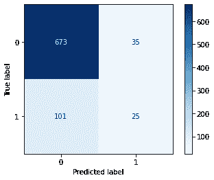
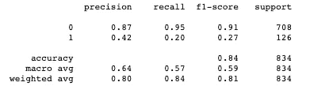

# 逐步分类建模

> 原文：<https://betterprogramming.pub/step-by-step-classification-modeling-6d820c5bea2>

## 如何创建任何分类模型


照片来自 [AOE](https://www.aoe.com/en/blog/solving-problems-and-improving-customer-relationships-with-machine-learning-000718.html) 。

如果您是机器学习领域的初学者，并且正在为分类建模的机制而奋斗，那么这篇文章就是您分类冒险的路线图。

在开始之前，知道你在寻找什么是很重要的。确定您的问题，并开始探索与您的问题相关的数据。这样可以省去你很多时间和困惑。

对于任何数据集，您首先要做的是清理数据集并进行探索性数据分析:

*   检查空值
*   占位符
*   检查异常值
*   特征工程
*   绘制有意义的图形

# 1.训练测试数据集

## 确定目标变量和预测值

在列车试运行前，确定目标变量`y`和自变量`X`。

*注意:如果你曾经想知道为什么一个目标变量用小写* `*y*` *定义，而预测变量用大写* `*X*` *定义，那是因为* `*X*` *是一个矩阵，矩阵用大写字母命名。*

```
y = df['target']X = df.drop('target', axis=1)
```

## 列车测试分离

训练测试分割是任何建模中最重要的步骤之一。这一步将允许您比较模型的性能。在训练集上训练该模型，然后将结果与测试集进行比较。训练测试分割有助于避免过度适应或适应不足。

Sklearn 有一个内置的函数叫做`train_test_split`。训练模型时，必须设置`random_state`参数，以获得相同的训练和测试数据集。

这是一个训练测试分割数据集，比率为 80/20，并且`random_state`设置为`123`:

```
X_train, X_test, y_train, y_test = train_test_split(X, y,  test_size=.2, random_state=123)
```

# 2.预处理数据

将预处理步骤分别应用于训练和测试数据集，以避免数据泄漏。

## OneHotEncoder()

如果用于分类模型的数据集包括分类和/或布尔类型的列，使用`OneHotEncoder`将它们转换成数字数组。

下面，确定分类列并启动`OneHotEncoder`:

```
categorical_columns = df.select_dtypes(include=[‘object’,    ‘bool’]).columnsohe = OneHotEncoder(handle_unknown=’ignore’)
```

## 数据标准化

如果数据集具有不同大小范围的数值要素，则应归一化数据以在相同比例下创建数据集。

`StandardScaler`和`MinMaxScaler`是非常流行的数据归一化方法:

```
numerical_columns = df.select_dtypes(include=[‘int64’,             ‘float64’]).columnsscaler = StandardScaler()
```

## 列变压器()

这会将转换器应用于数组或 pandas 数据帧的列。

更多信息参见[文档](https://scikit-learn.org/stable/modules/generated/sklearn.compose.ColumnTransformer.html)。

```
preprocessor = ColumnTransformer(
               transformers =[
                          ('num', 'scaler', 'numeric_columns),
                          ('cat', 'ohe', 'categorical_columns')])
```

## 递归特征消除

预测目标变量时，递归要素消除(简称 RFE)可确定数据集中最重要的要素。

下面，通过选择 *n* 个特征来演示 RFE 算法的启动:

```
rfe = RFE(estimator = LogisticRegression(), 
          n_features_to_select = n)
```

# 3.建模

## 实例化分类算法

用合适的参数实例化你的分类算法。如果您的预测值不够好，您可以使用网格搜索来找到适合模型的最佳参数:

```
model = LogisticRegression(fit_intercept = True,
                           solver = 'liblinear',
                           class_weight = 'balanced',
                           random_state = 123)
```

## 创建管道

在实例化适当的分类算法之后，您需要创建一个管道。该管道将允许数据转换、特征选择和获取分类模型属性:

```
pipeline = Pipeline(steps=[('preprocessor', preprocessor),
                           ('s', rfe), 
                           ('m', model)])
```

## 拟合模型

记得在训练集上安装模型。使用测试数据集进行预测:

```
pipeline.fit(X_train, y_train)
```

使用`.score`方法控制训练和测试数据集的分数。高训练和测试分数表明你的模型是好的。需要进一步评估以确定模型是否可信:

```
Train Score: 
pipeline.score(X_train, y_train)Test Score:
pipeline.score(X_test, y_test))
```

# 4.模型检查

## 模型预测和残差

`.predict`方法将提供模型预测器:

```
y_hat_train = pipeline.predict(X_train)y_hat_test = pipeline.predict(X_test)
```

残差可以通过从原始值中减去预测值来计算，它们是`y_train`和`y_test`。

## 混淆矩阵

要绘制混淆矩阵，使用`sklearn.metrics`中的`plot_confusion_matrix`功能:

```
plot_confusion_matrix(pipeline, X_test, y_test, cmap=plt.cm.Blues)
```

这是可视化实际标注和预测标注的一种很好的方式。



混淆矩阵

上面，你可以看到一个混淆矩阵图。根据您的分类模型，y 轴是真实标签，x 轴是预测标签。目标在 0 类中有 708 (673+35)个值，在 1 类中有 126 (101+25)个值。

左上角的框(673)表示由分类模型正确预测的 0 值。右上角的框(35)表示分类模型预测不正确的 0 值。你的目标是减少错误预测值的数量。

## 分类报告

使用`sklearn.metrics` 中的`classification_report`功能创建评估指标表。下表显示了模型的质量:

```
classification_report(y_test, y_test_pred)
```



分类矩阵

`Precision`测量预测值的精确程度:

```
Precision = Number of True Positives / Number of Predicted Positives
```

`Recall`表示模型捕获的类别百分比:

```
Recall = Number of True Positives / Number of Actual Total Positives
```

`F1-Score`是`Precision`和`Recall`的加权平均值:

```
F1-Score = 2 * (Precision * Recall) / (Precision + Recall)
```

检查模型质量时，必须确定哪些评估指标对数据集更重要。

## AUC 评分和 ROC 曲线

AUC 得分和 ROC 曲线是提供模型质量信息的其他评估指标:

如果您的模型没有`decision_function` 属性，您可以尝试使用`model.predict_proba`功能。

对于完美的 ROC 曲线，曲线下面积应为 1.0。AUC 值在 0.5 到 1 之间，其中 0.5 表示差的分类器，1 表示好的分类器。


受试者工作特征曲线

上图显示了分类模型的 ROC 曲线。很明显模型做的不是很好。目标是获得接近 1 的 AUC 分数和曲线下最大面积(1.0)的 ROC 曲线。大约 0.5 的 AUC 分数并不比预测随机掷硬币好多少。

## 特征重要性

这将评估分类模型中功能的重要性:

```
pipeline.feature_importances_
```

# 5.模型调整

如果分类模型结果不令人满意，下一步就是模型调整。每个问题都需要依赖于数据集和所选分类算法的解决方案。有时，该模型不适合为您拥有的数据集获得良好的预测。你可能需要一种新的数据处理方法。

# 结论

恭喜你！您已经完成了您的分类模型。请参考我的[客户流失分析回购](https://github.com/ulkuguneysu/Customer_Churn_Analysis)看更详细的例子。

# 资源

*   [https://github.com/ulkuguneysu/Customer_Churn_Analysis](https://github.com/ulkuguneysu/Customer_Churn_Analysis)
*   [https://scikit-learn.org/](https://scikit-learn.org/)
*   [machinelearningmastery.com](https://machinelearningmastery.com/)