# Python 中的逐步面部识别

> 原文：<https://betterprogramming.pub/step-by-step-face-recognition-in-images-ad0ad302058a>

## 使用 Python、Pillow 和几行代码的简单方法…

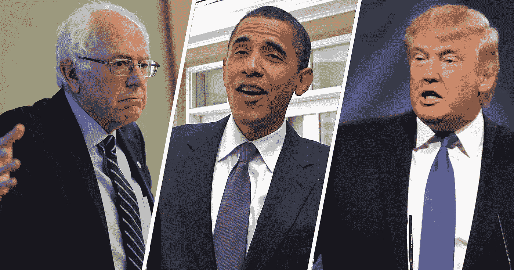

来源:[经办人](https://archive.attn.com/stories/5803/obama-speculates-bernie-sanders-donald-trump)

在本文中，我将指导您创建自己的图像人脸识别。为此，我将使用 [Python 人脸识别库](https://pypi.org/project/face_recognition/)和 [Pillow](https://pillow.readthedocs.io/en/stable/) 、Python 图像库(PIL)。

我选择使用 Visual Studio 代码，因为我需要使用集成终端。首先，我从设置一个虚拟环境开始，并在我的终端上安装`pipenv`。

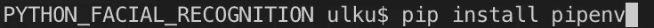

运行`pipenv shell`启动你的虚拟环境，安装人脸识别库。

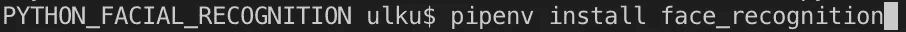

对于本教程，我创建了两个名为`known`和`unknown`的文件夹。第一个文件夹包括一些政界名人的照片，如巴拉克·奥巴马、唐纳德·川普、伯尼·桑德斯、乔·拜登和伊丽莎白·沃伦。后者包括来自第一个文件夹的不同照片，一些 2020 年总统候选人，以及一些 SNL 角色(由不同的演员扮演)唐纳德·川普、巴拉克·奥巴马和伯尼·桑德斯。

我将对`known`和`unknown`文件夹进行匹配，看看未知文件夹中是否有任何已知人物的照片。我可以通过命令行轻松地做到这一点，运行:

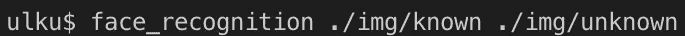

这将遍历所有图像，并向我们显示第二个文件夹中的匹配项。

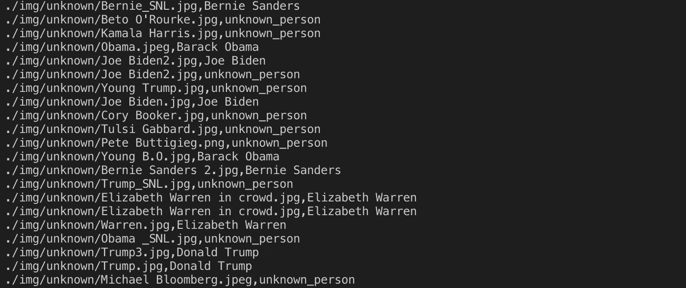

从输出中可以看到，`Bernie_SNL.jpg`—由拉里·戴维 *—* 执行，匹配为伯尼·桑德斯。为了避免这种情况，我将通过运行以下命令来检查每个匹配的距离，这基本上说明了图像的匹配程度:

`face_recognition — show-distance true ./img/known ./img/unknown`

我可以看到匹配图像之间距离的十进制值。

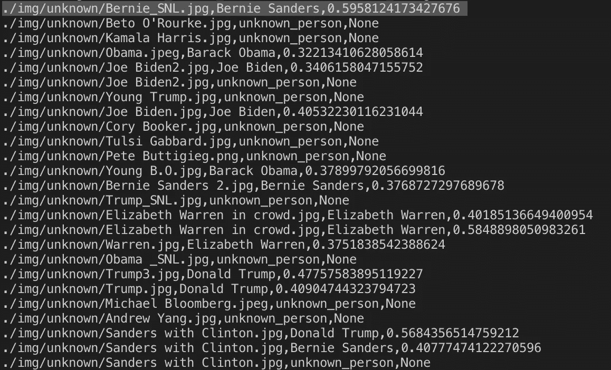

我将添加标志并更改容差，这样匹配算法将只接受某个数字以下的值。调整容差有助于获得更准确的结果。

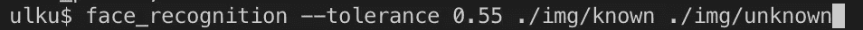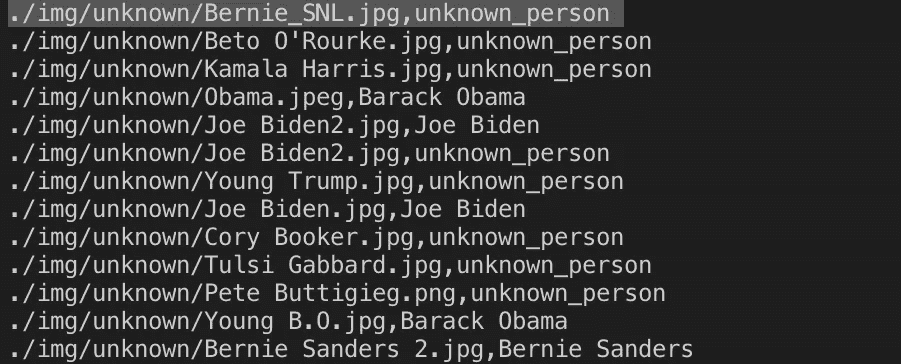

如上图所示，`Bernie_SNL.jpg`与真实的`Bernie Sanders.jpg`不符。

如果我只想得到图像中人物的名字，我将使用:

`face_recognition — show-distance true ./img/known ./img/unknown | cut -d ‘,’ -f2`

得到下面的输出。

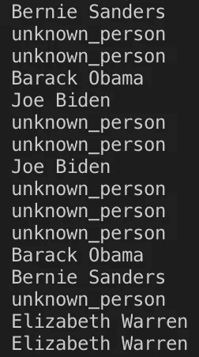

让我们将一个未知的人杨安泽移到我们的`known`文件夹中，并再次运行上面的代码。如下所示，杨安泽也将被定义为一个已知的人，它将显示来自`unknown`文件夹的匹配。

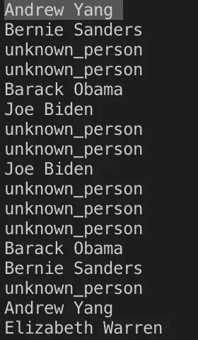

如果我们希望这个过程进行得更快，我们可以在命令行中添加`— cpus` 标志。

现在，我将创建 Python 文件来使用面部识别库。

# 1.findfaces.py

[股票照片](https://www.dreamstime.com/stock-photos-business-team-image635463)

我将在我的根目录下创建一个新的 python 文件。我将在我的`img`文件夹中有一个名为`group`的文件夹，并有两个图像:`team1`和`team2`。第一个图像包括五个人，另一个包括九个人。在本节中，我将识别人物，以 numpy 数组的形式获取他们的位置，并获取图像中人物的数量。

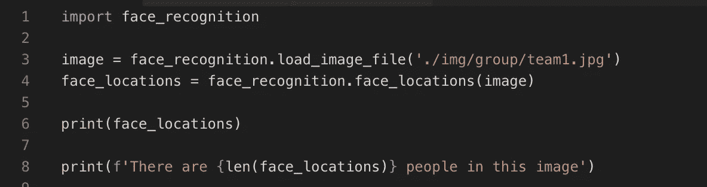

`face_locations`方法返回 css 中找到的面部位置的元组列表(按照上、右、下、左的顺序)。上面的代码将为每幅图像打印出一个 numpy 坐标数组。在`team1`图像中我们有五个人，所以我们将有五个项目，分别是上、右、下、左值。

# **2。facematch.py**

在本节中，我将重复我在 python 命令行中所做的事情，并比较面部，以查看它们是否与面部识别库中的内置方法`compare_faces`相匹配。这个内置的方法将人脸编码列表与候选编码进行比较，看它们是否匹配。

`Compare_faces`取以下参数:

*   `known_face_encodings` —已知人脸编码列表。
*   `face_encoding_to_check` —与列表进行比较的单一人脸编码。
*   `tolerance` —我们允许人脸之间有多远的距离才算匹配。越低越严格。0.6 是典型的最佳性能。

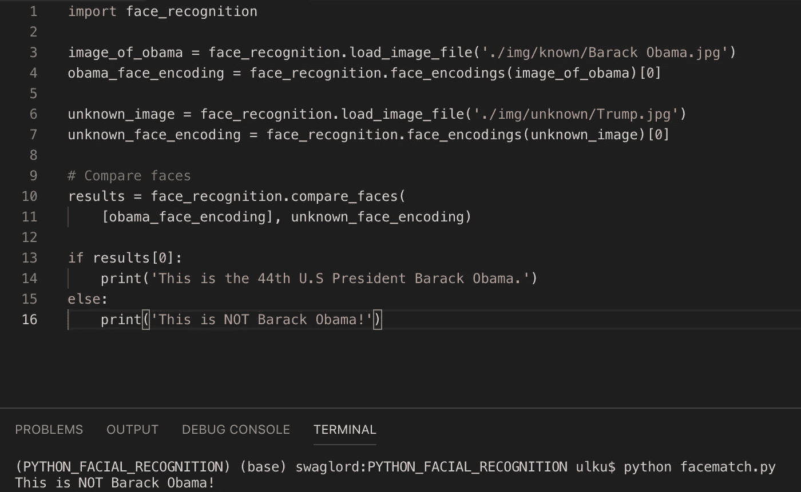

# 3.pullfaces.py

在这一节中，我将展示如何从图像中提取人脸，并将其保存在本地文件夹中。我们需要从枕头库导入图像模块。图像模块提供了一个同名的类，用于表示 PIL 图像。

首先，我将加载图像并以 numpy 数组的形式获取位置。然后，我将使用 for 循环遍历这些位置，并按照*上、右、下、左*的顺序保存图像位置。

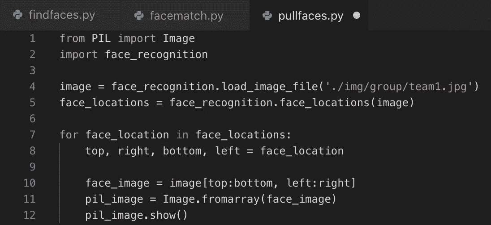

`face_image`以 numpy 数组的形式存储。我们可以使用 Pillow 库通过使用`fromarray`获得实际的图像，并传递 numpy 数组。`Image.fromarray`从导出数组接口的对象创建一个图像内存，并返回一个图像对象。

这将向我们展示图像中的每一张脸，如下图所示。我们可以用`pil_image.save(f’{top}.jpg’)` *。我们可以随心所欲地给图片命名。我使用了`{top}.jpg`,因为它是一个 for 循环。*

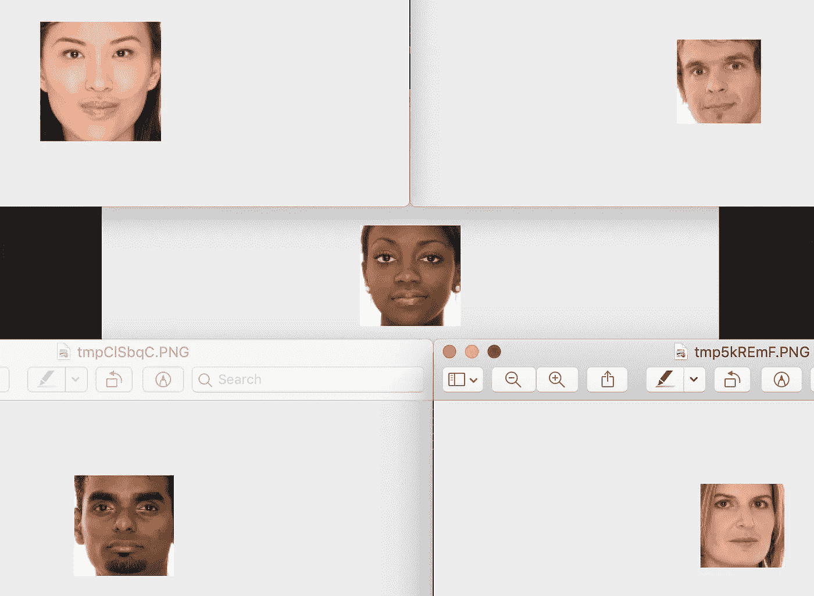

`team1`人物的面孔

# 4.identify.py:

我的目标是识别图像中的人，并在他们的脸上放一个盒子，上面有他们的名字。为了做到这一点，首先我需要确定我希望我的代码识别的人。对于这个例子，我将从 Pillow library 下载`Image`和`ImageDraw`，因为我将在图像上绘图。

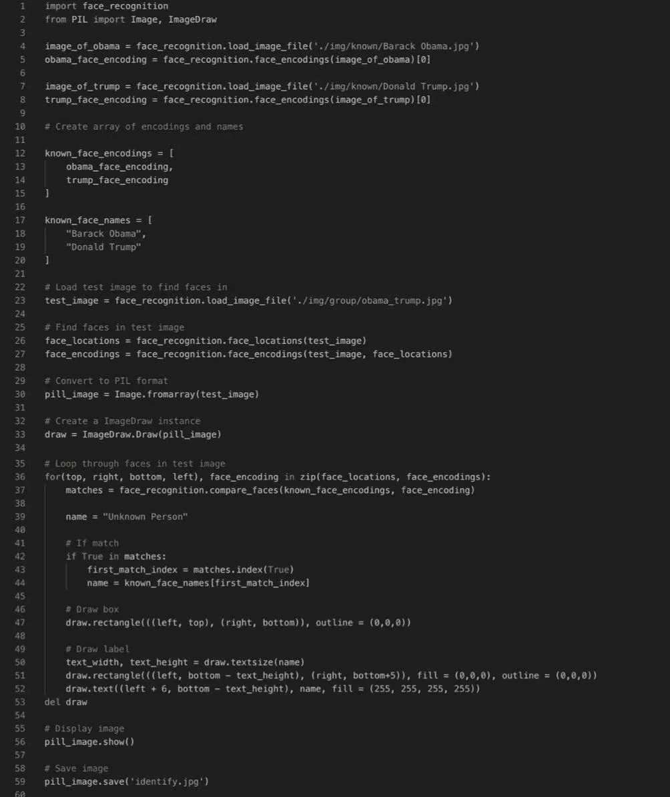

我将从识别巴拉克·奥巴马和唐纳德·特朗普开始，所以我首先将 load_image_file 作为一个 numpy 数组。然后我将使用 face_encodings 返回一个 128 维的人脸编码列表(图像中的每个人脸一个)。我们只需要第一项，所以我们将索引设置为[0]。现在，我们有两个人的面部编码。接下来我们要做的是创建单独的编码和名称列表。

接下来，我将加载测试图像，找到测试图像中的所有人脸，并通过传递测试图像和人脸位置来进行人脸编码。

因为我们的图像存储为 numpy 数组，所以我们使用`Image.fromarray`将其转换为枕头图像，这样我们就可以拥有 image 对象。

为了能够在图像上绘图，我们使用 pillow 库中的`ImageDraw`和`Draw`来创建一个实例并传递 Pillow 图像。

现在我们将循环测试图像中的人脸。首先，我将位置作为 top、right、bottom、left 和`face_encodings`传递，这样每次迭代都可以访问每个面部坐标及其编码。使用`compare_faces`，我将检查`known_faces_encodings`是否与我的 for 循环中的任何`face_encoding`匹配。

默认情况下，我将所有人脸的名称设置为“未知人”。如果存在匹配，那么得到的图像名称将采用来自`known_face_names`数组的匹配名称。在脸部周围画第一个方框。我使用黑色 rgb 颜色，所以我将轮廓设置为(0，0，0)。然后，我用`draw.rectangle`画了一个矩形，我将把标签放在上面。我添加了白色的`draw.text`标签(255，255，255，255)，并传递“*名称*”。

我们将使用`del draw`，因为我们需要从内存中删除 draw 实例。为了保存图像，我们可以简单地使用`pil_image.save()`。

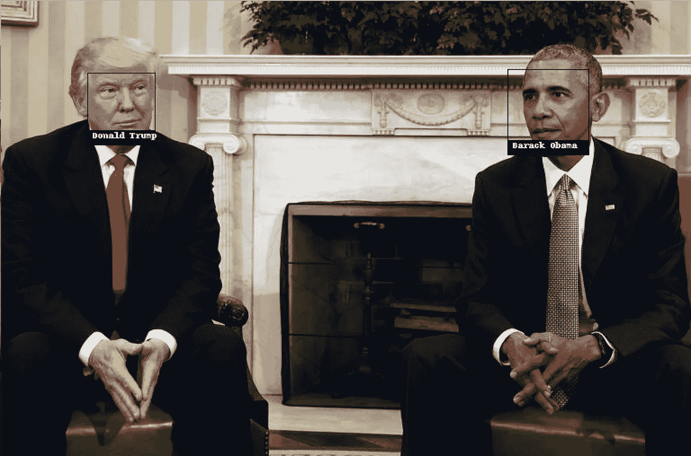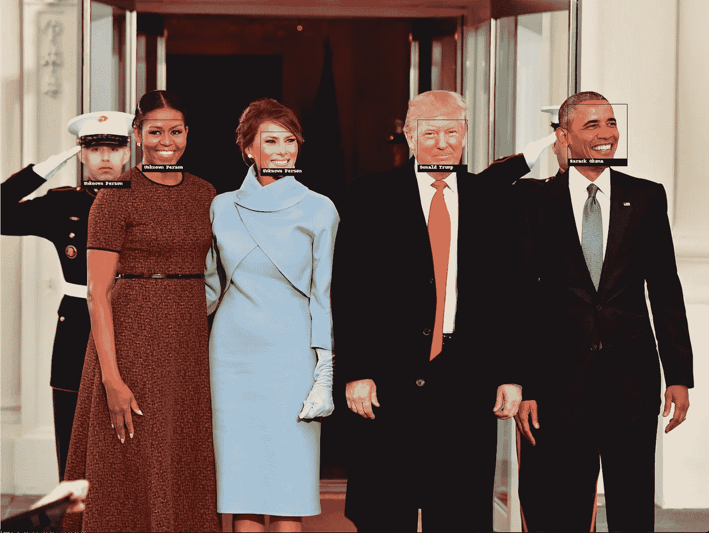

# 你自己试试吧

在本教程中，我给大家介绍了用 Python 进行面部识别。要自己开始，请访问下面的源代码链接。

## *来源*

*   [https://face-recognition . readthedocs . io](https://face-recognition.readthedocs.io/)
*   [https://github.com/ageitgey/face_recognition](https://github.com/ageitgey/face_recognition)
*   [https://www.youtube.com/watch?v=QSTnwsZj2yc](https://www.youtube.com/watch?v=QSTnwsZj2yc)