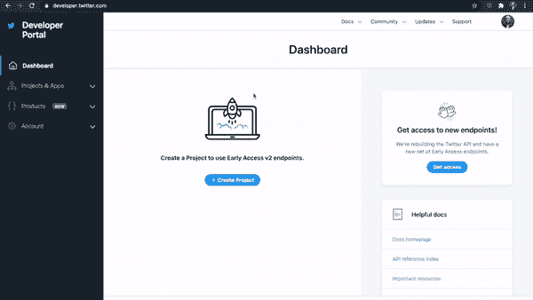
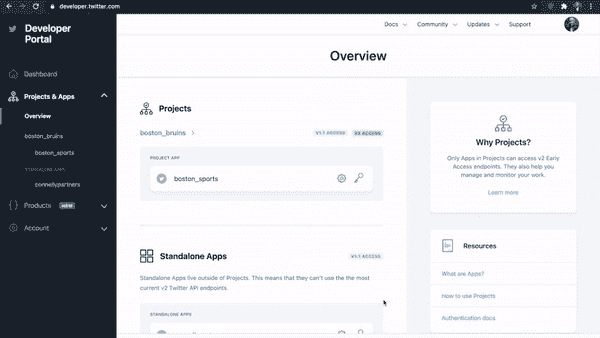
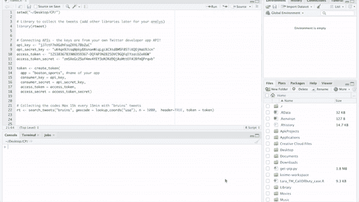
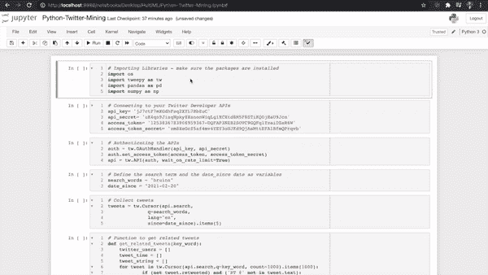
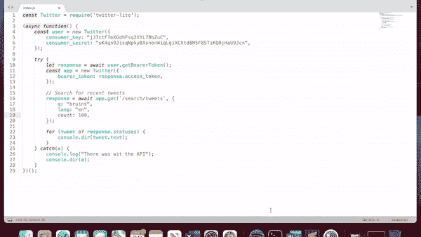

# 使用 Python、R 或 Node.js 抓取 Twitter 数据

> 原文：<https://betterprogramming.pub/step-by-step-guide-to-creating-a-twitter-developer-account-and-scraping-data-using-python-r-or-128e6f4287a>

## 通过 3 个简单的步骤创建你的 Twitter 开发者账户，并开始使用你选择的语言收集数据


由[亚历山大·沙托夫](https://unsplash.com/@alexbemore?utm_source=medium&utm_medium=referral)在 [Unsplash](https://unsplash.com?utm_source=medium&utm_medium=referral) 上拍摄

如果你对自然语言处理充满热情，或者你想收集和建立自己的数据，用于你的个人项目或分析，Twitter 是最好的社交媒体平台之一，在那里你可以获得大量的文本数据。

在开始收集公共推特之前，你需要做的第一件事是设置你的推特开发者账户。这里有一个分步指南，告诉你如何设置你的账户并生成一个 Twitter API。

# 用 3 个步骤建立你的 Twitter 环境

## **第一步:设置你的 Twitter 开发者账户**

首先你必须在这里注册一个 twitter 开发者账户:[https://developer.twitter.com/en](https://developer.twitter.com/en)

注册过程非常简单，可能需要几分钟才能完成，但之后你应该就一切就绪了。

## **步骤 2:在开发者门户**中创建项目&应用

设置您的开发人员帐户后，在开发人员门户中创建新的应用程序和项目。这将允许您获得连接到 Twitter API 的重要密钥。按照页面上的步骤操作，该页面会询问您有关项目和您的角色的基本信息。



(图片由作者提供)

## **步骤 3:生成连接 Twitter 公共数据所需的 API 密钥**

如果您在上一步中还没有这样做，您可以通过单击项目和密钥图标在项目中生成您的消费者密钥。然后，您将被重定向到消费者密钥，在这里您可以生成和复制所需的密钥，以便以后能够使用您选择的任何语言收集 twitter 数据。



(图片由作者提供)

复印完钥匙后——把它们放在手边，因为我们刮东西时会用到它们。如果你忘了复制不用担心，只需生成新的！

# 使用不同编程语言的 Twitter 数据收集

这是有趣的部分，您可以使用自己选择的任何编程语言来收集数据。有几种方法可以让你做到这一点，我试图探索和完善我在网上看到的方法。

## **使用 R**

如果您更喜欢使用 R，您只需要库`rtweet`并连接 API 和创建令牌。这里有一段代码将帮助您连接到 Twitter API:

成功连接后，使用函数 search_tweet 收集与您要查找的关键字相关的 tweet。



使用 R 收集 Twitter 数据

## **使用 Python**

对于 python 用户，你可以`tweetpy` Python 库来访问 Twitter API。您可以使用下面的示例代码建立连接。

设置完成后，您可以将数据放入 pandas 数据框架并开始分析。



(图片由作者提供)

## **使用 JavaScript: Node.js**

Node.js 用于创建这个应用程序，要创建一个新项目，请确保运行:

```
npm init
npm install twitter-lite
```

这将创建新的 node.js 项目，并安装 twitter-lite，使用 API 键提取 tweets。

下一步是用下面的代码创建一个. js 文件:

完成上述配置后，返回命令行并运行:

```
node whateverfilenameyouhave.js
```



使用 Node.js 收集 Twitter 数据

设置好您的 Twitter 开发人员帐户并使用您选择的语言连接到您的 Twitter API 后，您就可以开始做一些分析了。

我在 GitHub repo 中包含了完整的代码:

[](https://github.com/kathleenlara/Twitter-Data-Collection-Using-Different-Languages) [## GitHub-Kathleen Lara/Twitter-数据收集-使用不同的语言:这将是一个积极的…

### 这将是一个关于如何使用不同的编程轻松快速地收集 Twitter 数据的动态存储库…

github.com `网站](https://github.com/kathleenlara/Twitter-Data-Collection-Using-Different-Languages) 

```
Want to Connect?Check out my website**:** [https://www.kathleenlara.com/](https://www.kathleenlara.com/)
```