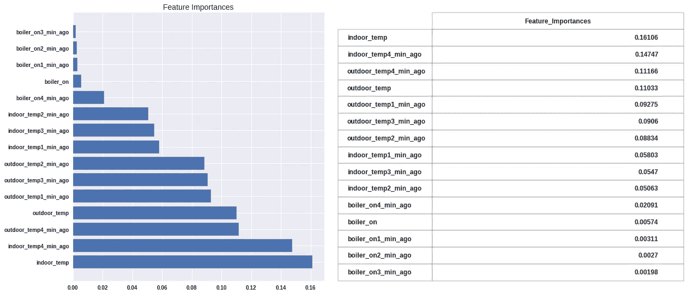
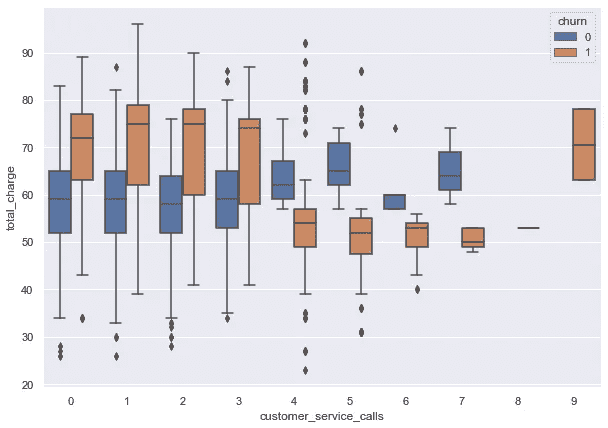
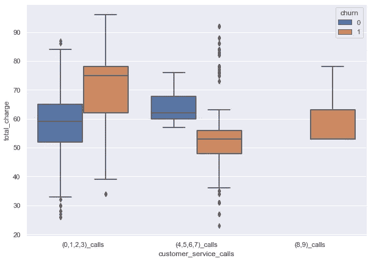

# 回归建模分步指南

> 原文：<https://betterprogramming.pub/step-by-step-regression-modeling-7940bdce070e>

## 如何创建树和集成回归模型


照片来自 [TADVISER](https://tadviser.com/index.php/Product:Professional_Machine_Learning_Engineer_(certificate_of_Google)) 。

回归分析是一组统计过程，旨在估计因变量(目标、结果变量、`y`)和自变量(预测因子、特征、`X`)之间的关系。

[Scikit-learn](https://scikit-learn.org/stable/user_guide.html) 提供内置的监督和非监督学习方法来解决回归问题。在本教程中，我们将研究决策树和集成方法的建模。

在开始进行任何分析之前，首先要做的是清理数据集并执行探索性数据分析:

*   检查空值
*   数据类型转换
*   占位符
*   检查异常值
*   特征工程
*   绘制有意义的图形

如果您的数据没有标准化或者数据集中有分类值，请不要担心。我将向您展示如何使用必备的数据科学工具来使用方法。我将创建一个模型，通过它我们将转换分类变量，应用标准化，创建`GridSearchCV`，训练和测试模型，并创建特征重要性图。

# 1.训练测试数据集

## 确定目标变量和预测值

在列车试运行前，确定因变量`y`和自变量`X`:

```
y = df['target']X = df.drop('target', axis=1)
```

## 列车测试分离

训练测试分割是任何建模中最重要的步骤之一。这一步将允许您测试您的结果并观察您的准确性。在训练集上训练该模型，然后将结果与测试集进行比较。训练测试分割有助于避免过度适应或适应不足。

Sklearn 有一个内置的函数叫做`train_test_split`。训练模型时，必须设置`random_state`参数，以获得相同的训练和测试数据集。

这是一个包含因变量和自变量的训练测试分割。存在 70/30 的分流比，并且`random_state`被设置为`123`:

```
X_train, X_test, y_train, y_test = train_test_split(X, y,  test_size=.3, random_state=123)
```

# 2.预处理数据

将预处理步骤分别应用于训练和测试数据集，以避免数据泄漏。

## OneHotEncoder()

如果用于回归模型的数据集包括分类和/或布尔型列，使用`OneHotEncoder`将其转换为数字数组。

下面，确定分类列并启动`OneHotEncoder`:

```
categorical_columns = df.select_dtypes(include=[‘object’,        ‘bool’]).columnsohe = OneHotEncoder(handle_unknown=’ignore’)
```

## 数据标准化

如果数据集具有不同比例的数字要素，请标准化数据以在相同比例内创建数据集。

`StandardScaler`和`MinMaxScaler`是非常流行的数据归一化方法:

```
numerical_columns = df.select_dtypes(include=[‘int64’,             ‘float64’]).columnsscaler = StandardScaler()
```

## 列变压器()

这会将转换器应用于数组或 pandas 数据帧的列。

更多信息参见[文档](https://scikit-learn.org/stable/modules/generated/sklearn.compose.ColumnTransformer.html)。

```
preprocessor = ColumnTransformer(
               transformers =[
                          ('num', 'scaler', 'numeric_columns),
                          ('cat', 'ohe', 'categorical_columns')])
```

## 递归特征消除

预测目标变量时，递归要素消除(简称 RFE)可确定数据集中最重要的要素。如果您的数据集中有太多的预测值，您可以使用此方法。

下面，用选择的 *n* 个特征来演示 RFE 算法的启动:

```
rfe = RFE(estimator = DecisionTreeRegressor(), 
          n_features_to_select = n)
```

# 3.建模

## 实例化回归算法

实例化你的回归算法。例如，我将选择随机森林回归。要应用`gridsearch`，首先要决定你想用作回归变量估计量的超参数。你可以在 sklearn 的网站上找到每个回归变量参数的详细信息。不要忘记将您的`random_state`设置为超参数，以避免收到不同的结果。

## 创建管道

在实例化`GridSearchCV`之后，您需要创建一个管道。该管道将允许您同时进行数据转换(一个热编码器和数据标准化)、特征选择和`GridSearchCV`。

```
pipeline = Pipeline(steps=[('preprocessor', preprocessor),
                           ('s', rfe), 
                           ('m', rf_gridsearch)])
```

## 拟合模型

记得在训练集上安装模型。使用测试数据集进行预测:

```
pipeline.fit(X_train, y_train)
```

使用`.score`方法控制训练和测试数据集分数。接近`1`的分数表明我们的模型做得很好。需要进一步评估以确定模型是否可信:

```
Train Score: 
pipeline.score(X_train, y_train)Test Score:
pipeline.score(X_test, y_test))
```

# 4.模型检查

## 模型预测和残差

`.predict`方法将提供模型预测器:

```
y_hat_train = pipeline.predict(X_train)y_hat_test = pipeline.predict(X_test)
```

可以通过从原始值中减去预测值来计算残差，即`y_train`和`y_test`。

## 均方误差

使用 sklearn 的`mean_squared_error`方法功能。该函数将计算均方误差回归损失。误差越小，模型越好。您的目标是降低模型的 MSE 值。

```
mse_train = mean_squared_error(y_train, y_hat_train)mse_test = mean_squared_error(y_test, y_hat_test)
```

## 特征重要性

`feature_importances_`是树的属性和集合回归量。如果您的模型没有`feature_importances_`属性，您可以使用`coef_`来代替。

上面的函数将为您提供预测要素重要性的条形图和要素重要性数据框。



# 5.模型调整

如果您的回归模型结果不令人满意，下一步就是模型调整。根据数据集和所选的回归算法，每个问题需要不同的解决方案。你可以尝试改变预测器的数量(这可能会消除 RFE)，通过特征工程创建新的特征，改变超参数，或改变标准化方法。

我喜欢做的一件事是特征工程，因为对于相同的数据集，你可以将你的 MSE 值提高到某一点。下面，我将分享一些我喜欢做的事情:

*   分别分析数据集中的所有列。有时，有些列以数字形式出现，但它们可以用作分类变量。
*   如果我们有太多具有许多唯一值的分类变量，为这些列创建一个方框图，看看是否有任何相似之处。你可以把相似的放在一起。



相似箱线图分组



*   观察目标和预测值之间的关系。假设你用回归法预测房子的卖出价值(这是你的目标),你的预测值中有买入价值。可以想象，这两者的关联度会极高。相反，你把你的目标改为买入价值和卖出价值之间的差额。

特征工程需要一定的灵活性和尽可能多的不同数据处理方法。非常了解你的数据是很重要的。

# 结论

这些只是我喜欢在我的模型中使用的一些方法。如果我将执行重复的模型，比如当尝试不同的回归模型时，我喜欢创建以有序的方式运行我的模型的函数。