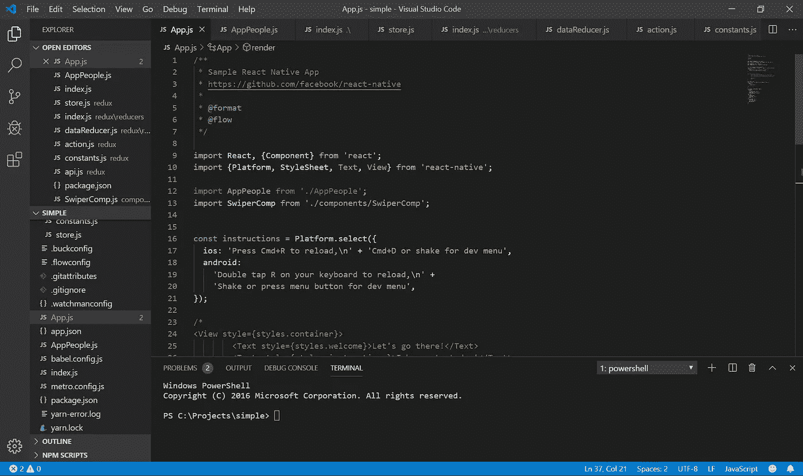

# 精通任何编程语言的步骤

> 原文：<https://betterprogramming.pub/steps-to-proficiency-in-any-programming-language-8931ed4fe766>

## 熟练的七个步骤，从主动学习到解决实际问题

过去，我曾犯过停在“你好世界”的错误。我希望我能进入 Hello World 的历史，但老实说，我不感兴趣。

你学习的每一种编程语言都会让你打印出“Hello world ”,但实际上，这并不是开始。我认为真正的开始是当你能够利用每一块积木来建造一些有意义的东西的时候。

让我们直接进入精通所需的步骤。

# 1.做一个积极的学习者

不要只是坐在那里看视频教程，而你认为你明白发生了什么，不管它看起来多么有趣。

复制遇到的每一行代码，并测试它是否产生预期的结果，这一点很重要。您可以稍后修改相关的变量，看看会发生什么，因为这将帮助您完全掌握它是如何工作的。

# 2.为每种语法寻找真实的用例

这意味着你必须超越知道方法是什么或者如何使用它们——你需要部署它们来解决现实生活中的问题。

例如，如果您正在学习 JavaScript，并且您遇到了`Array map()`方法，那么当您探索您想要迭代一个数组并基于原始数组返回一个修改后的数组的情况时，它将对您更有意义。

# 3.首先计划和建造简单的东西

此时，您觉得已经理解了开始编写有意义的应用程序所需的大多数基本构件。

抵制匆忙编写复杂应用程序的诱惑。不要逞英雄，从最简单的东西开始——一个简单的 CRUD(创建、读取、更新和删除)应用程序会派上用场，例如一个简单的待办事项列表。

在简单版本成功后，您可以选择添加更多功能。然后，您可以继续进行更复杂的任务。

事实是，即使是简单的东西，你也会遇到从打字错误到语法错误的挑战，这就是为什么你需要最大限度地减少你的挫折感，首先保持简单，监控你的进度，并推进到下一个任务。

# 4.至少学习一个框架

当你选择一个框架来学习的时候，你所学到的一切都将被付诸实践。这是因为框架是它们自己的世界，以一种比你理解的更结构化的方式实现编程语言。

复杂性层实际上解决了一些初学者根本不知道的问题。

如今，框架的数量比编程语言的数量还要多，因此，你可能需要根据你希望用这种语言实现的目标，研究一下应该从哪一种开始。

例如，我学习 React.js 的目标是我想用 React-Native 创建移动应用程序，所以很明显我需要从 React 开始。当你探索的时候，不要忘记先建造简单的东西。

# 5.了解最新的最佳实践和惯例

编程的奇妙之处在于，总是有更好的方法来做你觉得舒服的事情。

订阅博客，关注游戏中的大玩家，探索 GitHub 上的开源项目。我向你保证，通过浏览别人的代码，你会学到做事的新方法。

# 6.解决实际问题

是时候通过做复杂的事情来面对现实了。真正意义上的生活是复杂的。

环顾四周，你会发现一个你可以解决的问题，如果你认为别人已经做了你想做的事情，我会说这是一个更大的机会，你可以通过建立一些东西来解决现有解决方案中的所有缺陷，从而重新发明轮子。

# 7.不要急着成为专业人士

我们生活在一个动态的世界里，事物瞬息万变。昨天的趋势明天就可能成为历史。保持谦逊，对新趋势保持开放的态度。

我不会建议你跳上每一辆行驶中的火车，我只会说，仔细阅读下一个新事物，甚至尝试一点也不会有什么坏处。然后，你就会知道你是否感兴趣，或者还不是时候。

这个想法是，你不能无所事事——坚持做有意义的事情。

业余时间在平台上为别人的问题提供解答，比如[栈溢出](https://stackoverflow.com/)，在 [GitHub](https://github.com) 上贡献开源项目，用自己丰富的知识去协助别人。

我向你保证，你付出的越多，得到的也越多。