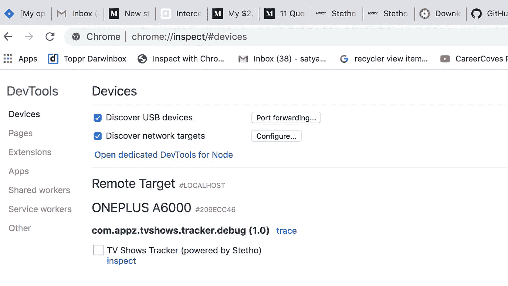
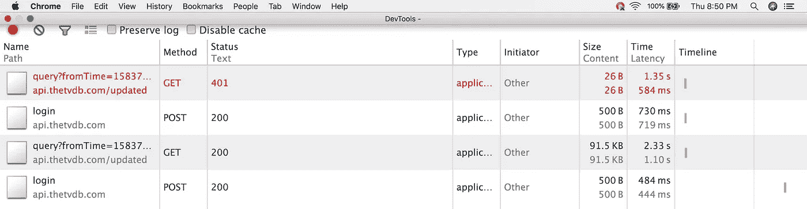
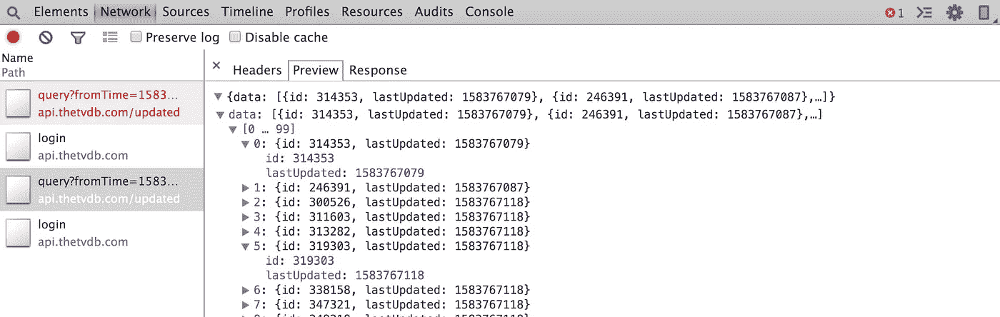
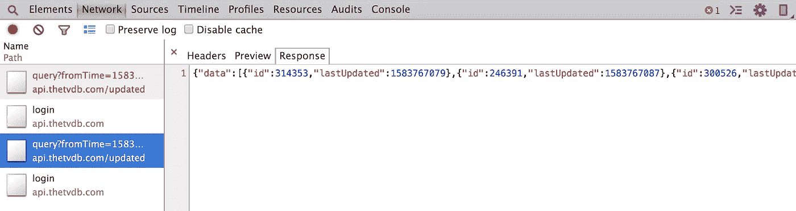
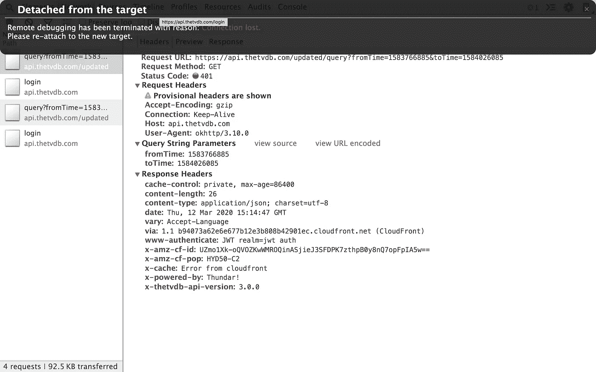

# ste tho:Android 应用程序的最佳调试工具

> 原文：<https://betterprogramming.pub/stetho-the-best-debugging-tool-for-android-applications-1b1f0b99dc0e>

## 让我们探索脸书的调试工具，并了解检查网络请求是多么容易


由 [Rami Al-zayat](https://unsplash.com/@rami_alzayat?utm_source=medium&utm_medium=referral) 在 [Unsplash](https://unsplash.com?utm_source=medium&utm_medium=referral) 拍摄的照片。

作为 Android 开发人员，我们的开发生活经常涉及在构建动态应用程序时集成 API 或 web 服务。以前，在 API 响应中查找响应和缺少的字段有点麻烦，因为我们过去常常保存日志来检查输出或使用 Studio 中可用的调试器调试应用程序。

在花了大量时间之后，我们意识到有一些意想不到的数据类型来自后端。因此，这个过程需要一点时间和耐心来探索，因为如果您连接多个设备，您总是需要在它们之间切换以检查输出。

但是后来我发现 [Stetho](https://github.com/facebook/stetho) ，这样工作更轻松，也更节省时间。虽然已经过去很长时间了，但仍有许多开发人员在为网络调用检查做日志记录或调试工作。我写这篇文章是为了那些需要一些指导来简化工作的人。


# 问题

您需要耐心和时间来探究网络请求被拒绝的次数。在处理多个设备时，您需要在设备之间切换以查看日志或附加调试器，这使得检查网络请求有点困难。

# 解决办法

我们需要一个库或工具，用几行代码就能轻松地自动化网络呼叫检查。我们需要能够在某一点并行检查一定数量设备的网络调用，以检查事件是否正确触发。这就是斯特索发挥作用的地方。

# Stetho 是什么？

Stetho 是脸书的一个简单的库，用它我们可以很容易地调试网络调用。无需在开发期间添加日志，也无需在发布时删除日志。不需要使用调试器。只要遵循三个步骤，我们就可以在 Chrome 桌面浏览器中获得所有网络呼叫。我们可以看到应用程序发出的所有网络请求，如延迟、大小快照、触发序列、请求参数、响应数据等。除了网络检查之外，Stetho 还有许多特性，但是本文将简要讨论网络请求检查。所以让我们开始吧。

## **第一步:**在 build.gradle 中添加**依赖关系**

```
implementation 'com.facebook.**stetho:stetho**:1.5.1'
```

只有主`stetho`依赖项是严格要求的。但是，我们也可以使用网络助手之一:

```
implementation 'com.facebook.stetho:stetho-**okhttp3**:1.5.1' **OR**implementation 'com.facebook.stetho:stetho-**urlconnection**:1.5.1'
```

您也可以启用 JavaScript 控制台:

```
implementation 'com.facebook.stetho:**stetho-js-rhino**:1.5.1'
```

## **第二步:**我**用一行代码在应用程序类中初始化**

不要忘记在`AndroidManifest.xml`中注册您的班级:

## **第三步:**启用网络**检查**

如果您在 3.x 版本中使用流行的 [OkHttp 库](https://square.github.io/okhttp/)，您可以使用拦截器系统自动挂钩到您现有的栈。这是目前启用网络检查的最简单、最直接的方法:

```
 **OkHttpClient**.Builder()
    .**addNetworkInterceptor**(**StethoInterceptor**())
    .build()
```

拦截器是一种强大的机制，可以监控、重写和重试调用。查看更多关于[拦截器](https://square.github.io/okhttp/interceptors/)的信息。

就是这样！我们已经准备好检查应用程序发出的每一个网络呼叫。很简单，对吧？

下一个问题是在哪里检查输出。

# 如何使用 Chrome DevTools 进行检查

与 Chrome DevTools 前端的集成是使用 Stetho 软件为您的应用程序提供的客户机/服务器协议实现的。既然基本设置已经完成，我们需要打开 Chrome 并连接设备来检查请求触发。

打开你的 Chrome 浏览器，在地址栏输入`chrome://inspect`。然后按下回车键，你将能够看到你的设备连接如下图所示。点击*检查*看魔术！



在上面的屏幕中，您可以看到我连接的设备，其起始名称为 ONEPLUS。在这里，它将列出所有与启用的 USB 调试选项连接的设备，以及每个集成了 Stetho 的设备上的应用程序列表。

因此，当你点击应用名称下方的*检查*时，神奇的事情发生了。它会打开一个单独的窗口，以列表格式提供所有服务的概述，以及所需的每个细节。



您还可以找到任何容易被触发的重复请求，就像我们使用 Log 一样。

当你点击任何一个请求时，它会显示三个不同的部分:标题、预览和响应。要查看单个部分，您可以单击每个部分。例如，如果您单击标题，它将显示以下内容:


您可以在此处查看完整的请求参数部分。这对于查看请求头部分的细节非常方便。您可以很容易地找出在触发请求时丢失的任何请求参数。

现在让我们检查预览部分:



当您单击第一个节点时，它以 JSON 折叠格式显示，然后打开其中的对象，对内部节点也是如此。这可以帮助您非常容易地构建模型类。您甚至可以在几秒钟内找出不匹配的数据格式和期望值的缺失情况。

响应部分是原始格式的数据。您可以简单地将它复制粘贴到任何地方:



如果您的设备断开连接，它会显示以下提示:



单击保留日志选项的复选框，这样即使设备断开连接，您也可以查看数据。否则，数据将会丢失，您需要重新连接设备并重试。查看由脸书开发者在 [GitHub](https://github.com/facebook/stetho/tree/master/stetho-sample) 上发布的 Stetho 的[样本，了解更多信息。](https://github.com/facebook/stetho/tree/master/stetho-sample)

# 结论

到目前为止，您应该已经了解了使用 Stetho 库检查网络火灾有多容易。这还不是斯特索的全部。我们只讨论了网络检查，但 Stetho 有更多的功能，如可视化 SQLite 数据库、视图层次结构、转储应用程序、JavaScript 控制台等。我们可以在以后的文章中探讨这些问题。

感谢阅读。请让我知道你的建议和意见。