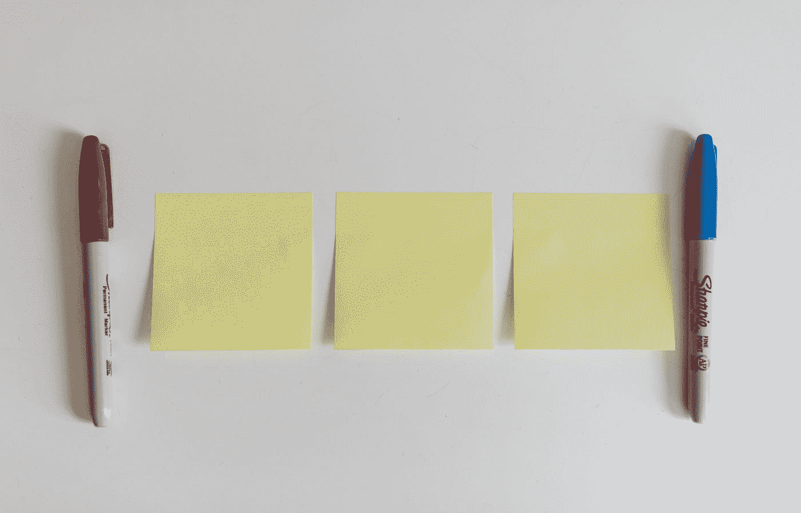
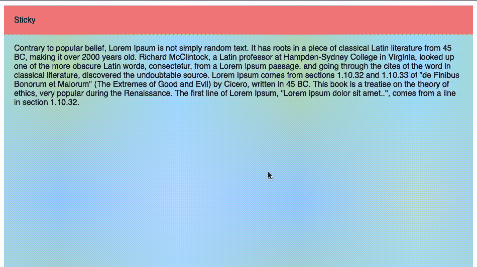
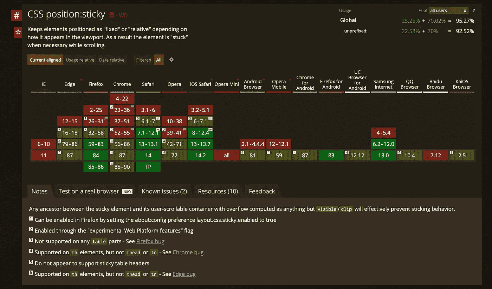
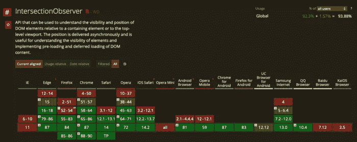

# 用正确的方法制作粘性 HTML 元素

> 原文：<https://betterprogramming.pub/sticky-done-the-right-way-880af0122a71>

## 创建滚动时保持不变的元素的最佳实践

由 [Kelly Sikkema](https://unsplash.com/@kellysikkema?utm_source=medium&utm_medium=referral) 在 [Unsplash](https://unsplash.com?utm_source=medium&utm_medium=referral) 上拍摄的照片

如今，当滚动经过一个重要元素时，有一个非常常见的模式，我们希望用户一直留在那里:**使它保持不变**。CSS 中内置了一个现成的解决方案，即`position: sticky`和`position: -webkit-sticky`。为了让这个属性工作，它需要更多关于如何行为的信息，这就是`bottom`、`top`、`left`和`right`发挥作用的地方。没有这些额外的信息，`position: sticky`不会做任何事情，因为它缺少关键的信息；会像`position: relative`一样对待。如果你曾经尝试过，但它对你不起作用，那可能就是原因。

假设这是一条快乐的路径，你可以用几行 CSS 代码实现粘性效果，如下例所示:

作为回报，您将得到如下内容。

这是非常甜蜜的，文章可能会在这里结束。但是不支持这个的浏览器会怎么样呢？你可以看到这个特性得到了很大的支持，但是仍然有一些浏览器落后了。对于浏览器支持，[caniuse.com](https://caniuse.com)永远是我们最好的朋友:

幸运的是，我们有一个工具可以随时检查浏览器是否支持一些 CSS 属性。`Css.supports`方法返回一个`Boolean`值，指示浏览器是否支持给定的 CSS 特性。这是一个非常有趣的 API，你可以[查看](https://developer.mozilla.org/en-US/docs/Web/CSS/@supports)的更多细节。

对于我们的用例，我们想要检查的是:

因此，下一个问题是，将这一功能添加到这些旧式浏览器中的最有效方式是什么。事情从这里开始变得非常有趣。让我们深入探讨一下最佳解决方案。

# 最常见的方法

没有我们的 CSS 超能力，我们只能在 JavaScript 领域想出一个解决方案。需要做的是:

1.  检查滚动是否经过那个 div。
2.  如果是，将位置从`static`更改为`fixed`。
3.  如果用户确实从该 div 向上滚动，只需再次将位置从`absolute`更改为`static`。

你可以看到方法非常简单。然而，有一个问题:你需要不断地监视浏览器上发生了什么，并对其做出反应。监控浏览器活动最常见的方法是`onScroll`或`requestAnimationFrame`。我们将检查两者，包括它们的缺点。

我们将从`onScroll`方法开始。您可以在这里看到一个实现示例:

请注意，当用户滚动并根据窗口滚动偏移量检查位置时，我们会不断触发事件。大概 99%的事件对我们没有任何用处。

如前所述，另一种方法是使用`requestAnimationFrame`。我们要做的不是检查每个事件滚动，而是检查每一帧的元素是否应该是粘性的。

您可以看到，这种方法使用了与以前几乎相同的代码，但是依赖于不同的触发器。`requestAnimationFrame`触发器仅适用于非常特殊的用例及动画。您可以看到，现在触发的事件数量比以前更多了。这将保证您不会在同一个帧中触发两个事件，但这需要付出很高的代价。

总结一下，我们已经知道这两个事件是非常愚蠢和昂贵的，它们导致了一个非常必要的实现:由我们来决定这个项目是否在屏幕上。应该有更好的方法来解决这个问题。

# 十字路口观察员前来救援

不久前，[路口观察者](https://developer.mozilla.org/en-US/docs/Web/API/Intersection_Observer_API)功能发布。这个 API 使我们能够被动地观察元素并获取事件，或者查看这些元素何时在视口中可见或隐藏。

这对我们来说意味着我们可以放置一个元素，通过检查它是可见的还是隐藏的，我们将知道我们是否需要使我们的 div 具有粘性。这听起来更具宣示性，而不那么粗鲁。此外，我们将避免听到大量的事件和计算。完成所有繁重的工作后，我们可以专注于我们想要实现的功能，而将所有的计算留给浏览器。这听起来像一个可怕的交易。

让我们看看如何重写之前低效的代码，使之更具可读性。

您可以看到我们的代码变得更加简单和高效。这是双赢的局面。代码越少，错误越少。

# 支持交叉点观察器

对这个特性的支持是相当大的:92.3%。

如果你担心的是那另外 7.7%的用户，不要慌。你可以只使用:

只有在浏览器确实需要时，此聚合填充工具才会加载回退实现。

# 包裹

总结一下，让我们看看解决方案最终会是什么样子:

当然，通过在真正需要的时候发布代码，这种方法可以变得更好。因此，我们可以延迟加载我们所有的交叉点观察器代码，只在用户需要时才发布。我认为这需要另一篇文章来深入探讨如何在不影响全功能浏览器性能的情况下优化多填充特性。我认为现在明智的做法是一次只专注于一件事，一步一步地尽我们所能做到最好。

我希望你玩得开心并学到了新的东西。随着浏览器生态系统越来越成熟，看到曾经非常困难或低效的事情如何变得非常琐碎是非常有趣的。

干杯！