# C++中的标准模板库(STL)——容器介绍

> 原文：<https://betterprogramming.pub/stl-containers-be7bdaa222b0>

## 现代有效的 C++

## 像专家一样介绍、理解、选择、使用和可视化容器！


```
· [Overview](#3e78)
  ∘ [Why use STL?](#6c8b)
· [STL Containers](#98fe)
  ∘ [Container types](#08f3)
  ∘ [Containers Visualized](#7914)
  ∘ [Why use STL Containers?](#af6e)
· [Container Specifications](#e9a9)
· [Sequential Containers](#659b)
· [Choosing the right container](#1fc7)
· [Conclusion](#f2ad)
· [References](#c5ec)
· [Supplemental Material](#3b99)
  ∘ [Vectors](#42a9)
  ∘ [Deques](#7f10)
  ∘ [Stacks](#a5a2)
  ∘ [Lists and forward lists](#9974)
  ∘ [Demo Code](#1cb0)
· [Additional Resources: Dig Deeper](#b63a)
· [Contact](#5cd2)
```

作为我们探索 C++的*标准模板库* ( *STL* )的一部分，我们接下来着手该库的一个关键方面， *STL 容器*。

本教程结束时，您将理解以下内容。

*   如何选择正确的*容器*以及这样做的重要性。
*   STL 提供的*容器*的类型，以及它们的优缺点。
*   给定算法的最佳数据结构(即*容器*)选择。

首先，我们介绍*容器*以及它们在交付*有效 c++*【1】中的重要性。

对于不熟悉 *STL* 的读者，或者那些寻找完整故事的人，强烈建议回到第 1 部分。

[](/a-standard-template-library-stl-tutorial-series-9379bcbcd2fb) [## 标准模板库(STL)教程系列

### 第 1 部分:概述和动机

better 编程. pub](/a-standard-template-library-stl-tutorial-series-9379bcbcd2fb) 

# 概观

与第一部分中的[一样， *STL* 包括如下所示的模块:](/a-standard-template-library-stl-tutorial-series-9379bcbcd2fb?sk=a450fff61e254ecb6c5f2000f81eb8a2)

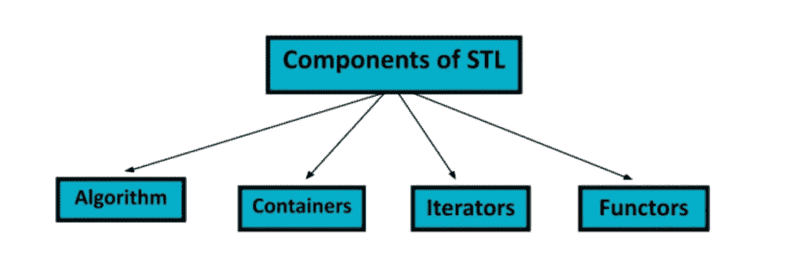

图来源:[https://www . mygreatlearning . com/blog/standard-template-library-in-c/](https://www.mygreatlearning.com/blog/standard-template-library-in-c/)

每个孩子都是博客的主题。因此， *STL* 作为一个整体，将跨越多个部分。

## 为什么要用 *STL* ？

STL 为基本算法和数据结构提供了额外的功能，使用户受益。

1.  它经过了很好的测试和优化。
2.  没有必要重新发明轮子。
3.  它导致更短、更紧凑的源代码。

注:(2)假设动机是实际的或解决了研究或工业中的一个问题。当学习数据结构(如堆栈)的*和*时，一个有用的练习可能包括没有 *STL* 的类实现；然而，我相信在学习这些概念的同时，还有更有效的方法来学习现成的 STL。例如，作为 C++入门课程或自学的一部分，重新实现`<string>`头文件也在核心 C++中(参见 [Part 1](/a-standard-template-library-stl-tutorial-series-9379bcbcd2fb) )。也许是未来的主题:)

此外， *STL* 作为一个整体，在相关算法和数据结构方面是可扩展的和高效的(参见[第一部分](/a-standard-template-library-stl-tutorial-series-9379bcbcd2fb))。

**回忆。**提供了 *M 个容器*和 *N 个算法*，当穷举运行组合时，通常会有*个 NxM* 个进程。然而，*迭代器是 STL 哲学的核心*和结构，将操作数量减少到了 *N* *+* M。

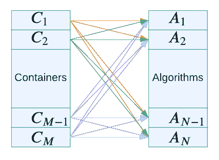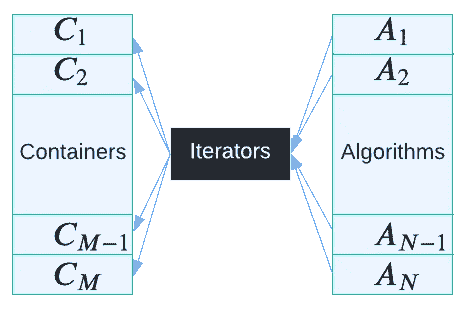

处理 N 个算法和 M 个容器通常需要 NxM 次操作(左图)；STL 迭代器允许进程的数量急剧减少(即 N + M，右)。作者创作的插图([第一部分](/a-standard-template-library-stl-tutorial-series-9379bcbcd2fb))。

包括*容器*、*算法*、*迭代器*或*函子*的头，后三个主题是未来博客的主题。

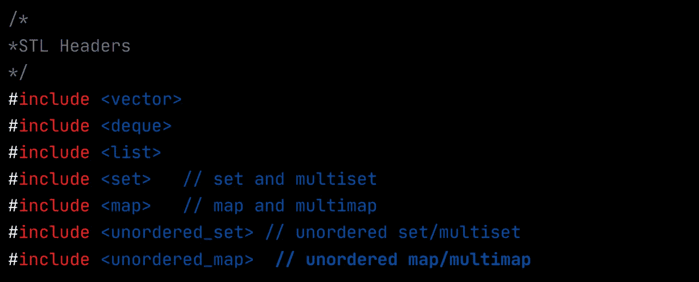

作为标准 C++的一部分，包含头文件以使用 STL。由作者创作。

在本系列结束时，将会很好地理解图(右)中所示的所有组件及其连接。所以现在让我们更深入地研究一下*STL*容器。

# STL 容器

STL 容器是具有各自功能的通用数据结构。为什么不实现我们自己的目标呢——上一节 1–3 中列出的动机非常简洁地总结了原因。让我们参考一位有效 C++技术专家和领导者的话。

```
They’re simply better than their competition, regardless of whether that competition comes from containers in other libraries or is a container type you’d write yourself. STL containers aren’t just good. They’re really good. — Scott Meyers
```

## 容器类型

在列出作为 *STL* API 的一部分提供的具体数据结构之前，让我们从更高的层面来看一下它的内容。

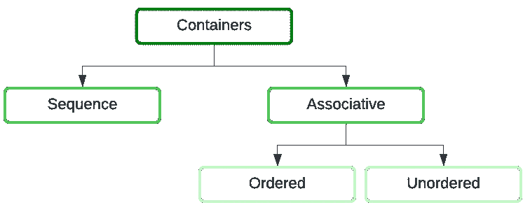

**顺序**和**关联**容器类型。**关联**包含 ***有序*** *和* ***无序*** *。作者创造了可视化。*

虽然我们将关注基于序列的数据结构的*容器*，但是让我们用每种类型的例子来重温前面的图。

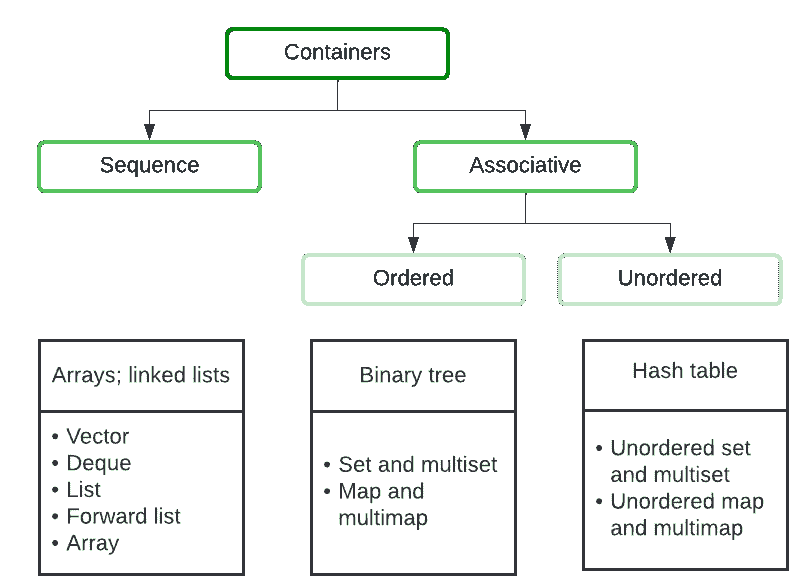

STL 提供的每个容器类型的例子。对于每个样本用例(列表的顶部)，其各自的容器类型可能是基础，特定的容器，如传统的命名和在 STL API 中，被列为项目符号(底部)。

这里是对*容器*类型的一个浏览，以及一个简短的描述。在阅读完这篇文章后，这张表以及其他一些内容将会变得清晰。

STL 容器名称、类型(即顺序、关联或适配器)和简要描述。

## 可视化容器

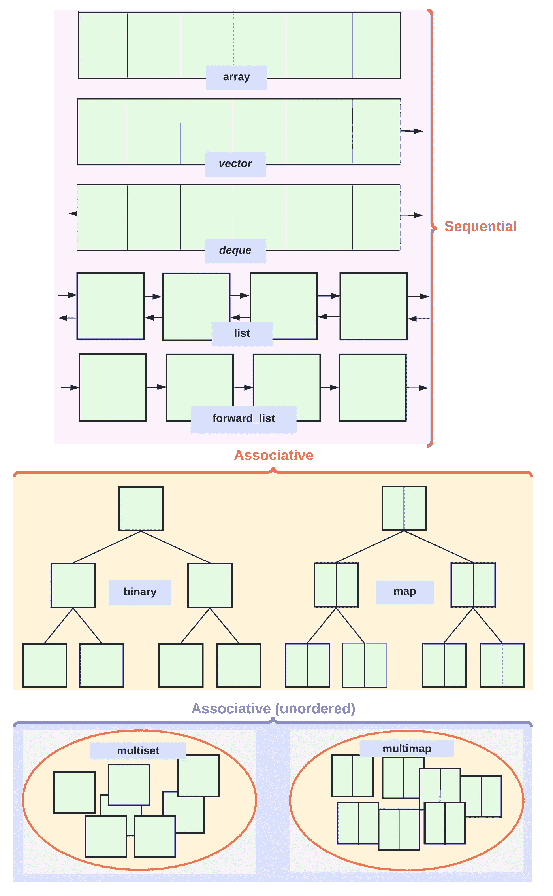

每种类型的 STL 容器，描述每种容器的结构。图片由作者提供。

## 为什么使用 STL 容器？

在他的*现代有效的 STL*【1】中，史蒂夫·迈耶选择了以下项目作为他的名著的开头。

```
ℹ️ **Item 1.** Choose your containers with care.
```

正如我们将看到的，不同的*容器*最适合特定的场景。虽然 *STL* 接口足够干净和一致，可以很容易地用一种类型替换另一种类型(如下面的示例代码所示)，但是容器的选择会极大地影响源代码的速度和清晰度。另外，*算法*对于*容器*中的选项不是不可知的。(即，当我们到达下面的**项目 2** 时将被覆盖。

在采用一种手段选择最佳容器之前，让我们先来看一组*序列容器*。

# 容器规格

让我们首先阅读下表中列出的*类型*列(参见本博客后面的*描述*列，或者现在浏览一下)。

STL 容器类型、描述和源(即构造函数签名)。顶部的表格列出了基于序列的容器，而底部的表格是关联容器。

# 顺序容器

总之，对于基于序列的容器:

*   尺寸是静态的，而其他的都是动态的。
*   `array`和`array`序列分别包括`vector`和`deque`；`list`和`forward_list`使用双链表和单链表。
*   只有`list`和`forward_list`不支持随机接入而是分别支持前向/后向和前向。
*   只有`list`和`forward_list`总是释放内存；`vector`和`deque`有方法`shrink_to_fit()`，后者有时会自己释放内存。
*   最后，`vector`和`list`有内存预留，而`deque`和`forward_list`没有。

# 选择正确的容器

```
ℹ️ **Item 2.** Beware the illusion of container-independent code.
```

让我们总结一个*的情况*和相应的*容器*最好交给*挑选。*

RA 表示随机访问(即查找)。

现在让我们利用不同类型的*容器*的特征，使用以下流程图中的逻辑来选择最佳容器。

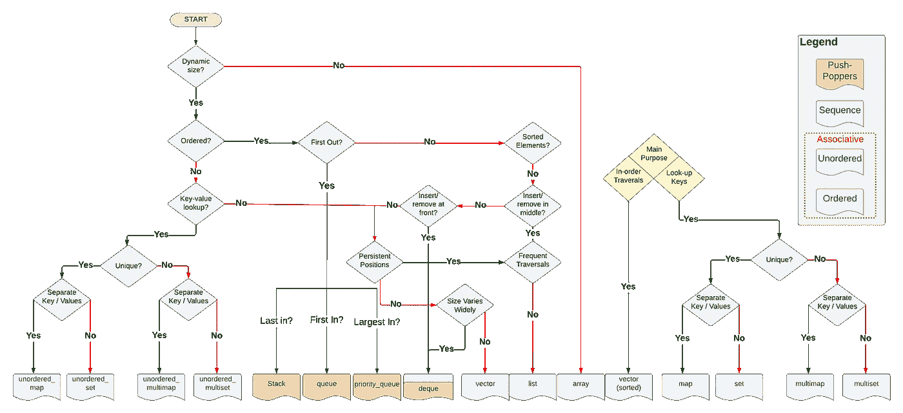

一个流程图，它导致表示容器类型的叶子。请注意，图例根据上面列出的不同类别对容器进行分组。在 [LucidChart](https://lucid.app/lucidchart/65b0aa00-dc28-4df6-9f9b-5c6c64e3e9f0/edit?viewport_loc=-2214%2C-2874%2C4379%2C1958%2C0_0&invitationId=inv_77d799d9-49fa-4e91-9da7-85cbcfa32f65#) 上查看作者创建的原始图表。

然而，在问题中并不总是提供这样的逻辑。为了概括起见，让我们在下表中分解不同类型的 big-O 复杂性。

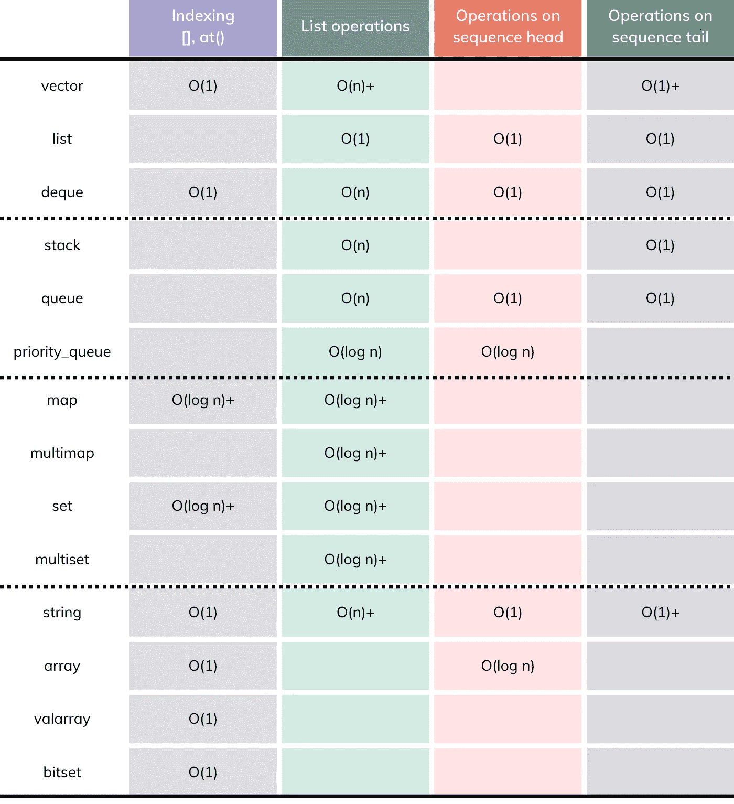

集装箱:操作复杂性。如果为空，则相应的操作(即方法)不包含在该容器的接口中。它是作者使用 [Canva](https://www.canva.com/) 创建的。

[Mai Pham](https://medium.com/u/13cdd863b4c?source=post_page-----be7bdaa222b0--------------------------------) 在下面的博文中总结了 Big-O 的复杂性。

[](https://medium.com/nerd-for-tech/the-big-o-18fea712ae6b) [## 大 O

### 理解 Big-O 符号的初学者指南

medium.com](https://medium.com/nerd-for-tech/the-big-o-18fea712ae6b) 

**总之**

```
💡 Vector, list, and deque offer the programmer different complexity trade-offs and should be used accordingly; the vector is the type of sequence that should be used by default, and a list should be used when there are frequent insertions and deletions from the middle of the sequence, the deque is the data structure of choice when most insertions and deletions take place at the beginning or at the end of the sequence.
```

# 结论

STL 容器是 C++中存储数据的最佳方式。与其他方法(如数组)相比，它们有很多优点。我们已经了解了几种不同类型的容器及其用途。通过了解各种选项之间的权衡，可以确定给定算法的最佳容器。STL 提供了一个易于使用的接口，使其成为大多数应用程序的最佳选择。我们现在知道 STL 容器为数据结构提供了各种各样的选择，都有不同的优点和缺点。最佳容器取决于具体的算法和目标数据。一般来说，STL 容器是算法的最佳选择，因为它们高效且通用。

总之，STL 容器是这项工作的最佳工具。它们为您的数据结构和算法选择完美的容器提供了广泛的选项。此外，STL 经过了充分的测试，非常可靠，因此您可以确信您的代码将按预期工作。

# 参考

[1][http://www.uml.org.cn/c%2B%2B/pdf/EffectiveSTL.pdf](http://www.uml.org.cn/c%2B%2B/pdf/EffectiveSTL.pdf)

[2][https://www . Abe books . com/Effective-STL-Specific-Ways-Improve-Use/22536211326/BD](https://www.abebooks.com/Effective-STL-Specific-Ways-Improve-Use/22536211326/bd)

 [## 9780201749625:有效的 STL: 50 种改善你使用标准模板库的具体方法…

### 评论:写给中级或高级 C++程序员，著名的 C++专家斯科特迈耶斯提供了基本的…

www.abebooks.com](https://www.abebooks.com/Effective-STL-Specific-Ways-Improve-Use/22536211326/bd) 

[**【3】有效的现代 C++**](https://www.oreilly.com/library/view/effective-modern-c/9781491908419/)

[](https://www.oreilly.com/library/view/effective-modern-c/9781491908419/) [## 有效的现代 C++

### 掌握 C++11 和 C++14 不仅仅是熟悉它们引入的特性…

www.oreilly.com](https://www.oreilly.com/library/view/effective-modern-c/9781491908419/) 

# 补充材料

## 向量

我们还没有讨论实现(例如，如何使用*容器* ) —这是有意的；这一系列的进程博客将会告诉我们这一点！但是，首先，我们必须理解*容器和*当面对实现细节时我们拥有的选项。

如上所述，不同的 STL *容器*提供了接口的一致性。此外，应该已经很简单，并将继续变得越来越明显，对于底层结构中的差异，每个都有独特的特征:这是我们将在即将到来的博客中深入探讨的主题。

让我们以`std::vector`为例，它类似于其他*容器*。

`std::vector`模板提供了动态大小的基于堆的数组，而不需要显式的内存管理。

```
std::vector v; 
v.push_back(1); 
v.push_back(2); 
v.push_back(3); 
std::cout << v[0] <<‘, ‘<< v[1] <<‘, ‘<< v[2] << std::endl; 
// 1, 2, 3
```

**构造函数**

STL 提供了多种构造函数。对于`std::vector`来说有以下几点:

*   *默认构造函数:*创建一个空向量。
*   *复制构造器:*创建一个现有向量的副本。
*   `vector v(*N*, *V*)`:用`*K*`值设置的`*N*`元素创建一个矢量。
*   `vector v(*N*)`:创建一个带有`*N*`元素(零值)的矢量

**转换为数组**

如果你有一个条目`v`的向量，但是需要通过函数调用`void f(int *a)`来传递它(也就是说，接受一个指向条目数组`*a`的指针)，你认为我们该怎么做呢？

*解决方案*:

```
void f(int *a); 
vector v; 
f(&v[0]);
```

*解释*:

利用向量是数组的优势，将指向底层数组开头的指针传递给函数:

## **德克斯特**

`std::deque`模板是一个双端队列，与 vectors 的接口类似，但是在数据结构的前端和后端高效地插入和删除。`push_back()`和`pop_back()`，以及大多数其他`std::vector`操作也可用于 deques 还有，`std::deque`提供`push_front()`和`pop_front()`。

```
💡 **Note.** Deques are not guaranteed to be implemented internally as contiguous arrays.
```

## **堆栈**

模板不是一个独立的数据结构。它是一个*适配器模板*——一个现有模板的专用接口。

默认情况下，`std::stack`是用`std::deque`实现的，但是用户可以指定使用`std::vector`或`std::list`。

```
💡 **Note.** The pop method does not return the item that was popped. If you want this item, use the top method before the pop method.
```

堆栈提供了基本的堆栈操作:

```
stack s; if (!s.empty()) { 
// Test if empty
    std::cout << s.size() << std::endl; // Size of the stack 
} 
s.push(4); // “push” operation 
std::cout << s.top() << std::endl; // top of stack 
s.pop(); // “pop” operation
```

## **列表和转发列表**

基于链表的容器，`std::forward_list`和`std::list`在一些关键方面有所不同。首先，前者只包含一个到下一个元素的链接，而后者有两个与前一个组件相关的连接。两个链接在任一方向上高效地迭代列表，这带来了额外的内存开销，并且在插入和移除元素时会有轻微的时间开销。因此 forward_list 对象比 [list](http://www.cplusplus.com/list) 对象更有效，尽管它们只是向前迭代。

与其他基本的标准序列容器([数组](http://www.cplusplus.com/array)、[向量](http://www.cplusplus.com/vector)和[队列](http://www.cplusplus.com/deque))相比，forward_list 在插入、提取和移动元素到容器中的任意位置方面更胜一筹。正如我们将在本系列的下一部分中讨论的，算法经常使用这些优势(例如，排序算法)。

## 演示代码

让我们使用不同的*顺序容器*来存储滚动骰子的值。然后，我们将查看所有值的内存地址，以分析不同*容器*在内存分配中的时间和趋势。

请注意，在已经分配内存的情况下，向量速度最快，但在由于空间不足而需要进行新分配的情况下，向量速度最慢(参见视频末尾的总结)。

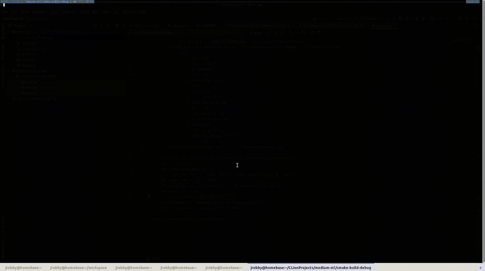

向量。请注意，内存保持连续，因为当需要额外空间时，所有元素都会移动。点击观看原视频[。](https://drive.google.com/file/d/1nk6RP5qw-SDHfCEF4KY564Ay1SlDUwEC/view?usp=sharing)

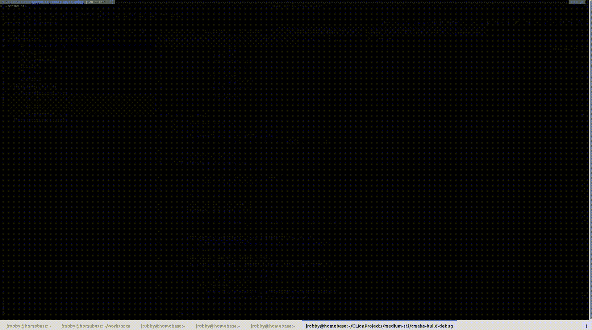

**得缺。**看原文视频[这里](https://drive.google.com/file/d/1kzSFuQVhl3lghU2RXPBrGDqvx1NFHb4N/view?usp=sharing)。

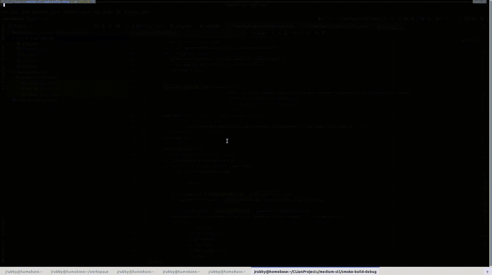

**转发 _ 列表**。这里看原视频[。](https://drive.google.com/file/d/1cI3Iu7sB7a555j8hYiM9NgOrMmA4y4MP/view?usp=sharing)

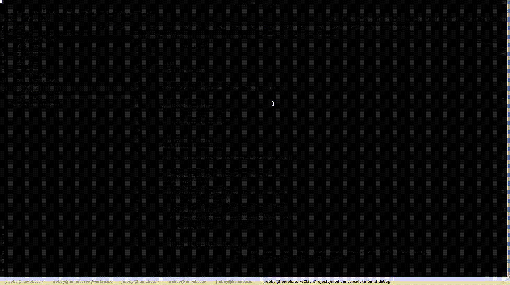

**列表**。这里看原视频[。](https://drive.google.com/file/d/12AU5ypMuv5rlxaBthjQNsQRbMBOHexlq/view?usp=sharing)

# 其他资源:深入挖掘

*STL* *容器*有一个可选参数(即`Allocator()`)，允许控制内存(即管理)。王思然·尼万在这个话题上做得非常出色。

[](/how-to-not-fragment-memory-when-using-c-stl-containers-b634adb76dc1) [## 如何在使用 C++ STL 容器时不产生内存碎片

### STL 容器为什么会碎片化你的内存，如何避免。

better 编程. pub](/how-to-not-fragment-memory-when-using-c-stl-containers-b634adb76dc1) 

Abhishek Rathore 写了一个涵盖 STL 所有组件的实用指南。

[](https://abhiarrathore.medium.com/the-magic-of-c-stl-standard-template-library-e910f43379ea) [## C++ STL(标准模板库)完全实用指南

### C++ STL 是 C++中竞争性编程的一个组成部分。如果你是…

abhiarrathore.medium.com](https://abhiarrathore.medium.com/the-magic-of-c-stl-standard-template-library-e910f43379ea) 

[迈克·麦克米兰](https://medium.com/u/aee547023ab2?source=post_page-----be7bdaa222b0--------------------------------)深究*STL*。

[](https://levelup.gitconnected.com/learning-c-the-stl-and-the-vector-class-beead0ac745f) [## 学习 c++:STL 和 vector 类

### 标准模板库中最流行的容器是 vector 类。向量正迅速成为…

levelup.gitconnected.com](https://levelup.gitconnected.com/learning-c-the-stl-and-the-vector-class-beead0ac745f) 

还有`map`和`multimap`。

[](https://levelup.gitconnected.com/learning-c-the-stl-and-maps-and-multimaps-993f5b931287) [## 学习 c++:STL、地图和多重地图

### 有许多应用程序要求数据以键值关系与其他数据相关联…

levelup.gitconnected.com](https://levelup.gitconnected.com/learning-c-the-stl-and-maps-and-multimaps-993f5b931287) 

[Aditya Jain](https://medium.com/u/c70e57fc0605?source=post_page-----be7bdaa222b0--------------------------------) 演示了使用 *STL* 容器来实现*树*和*图*结构。

[](https://medium.com/the-programming-club-iit-indore/graphs-and-trees-using-c-stl-322e5779eef9) [## 使用 C++ (STL)的图形和树

### 入门研讨会(IITI PClub)

medium.com](https://medium.com/the-programming-club-iit-indore/graphs-and-trees-using-c-stl-322e5779eef9) 

斯科特迈耶的有效的 STL 高度启发了这个博客。Vanand Gasparyan 对这本书的评价相当不错。

[](https://medium.com/tech-book-reviews/effective-stl-90c2bebed852) [## 有效 STL

### 改进标准模板库使用的 50 种具体方法

medium.com](https://medium.com/tech-book-reviews/effective-stl-90c2bebed852) 

在我的(即[约瑟夫·罗宾逊，博士](https://medium.com/u/8049fa781539?source=post_page-----be7bdaa222b0--------------------------------))关于*智能指针*的博客中了解更多关于内存管理的知识，这是一个由三部分组成的系列。

[](/smart-pointers-in-cpp-708486276526) [## 理解 C++中的智能指针

### 更聪明地工作，而不是更努力

better 编程. pub](/smart-pointers-in-cpp-708486276526) [](/understanding-smart-pointers-in-cpp-6c3854593503) [## 现代 C++:智能指针的近距离观察

### 《理解智能指针》续集 betterprogramming.pub](/understanding-smart-pointers-in-cpp-6c3854593503) [](/understanding-smart-pointer-iii-909512a5eb05) [## 通过直观的视觉效果解释 C++智能指针

### 我的 C++指针系列的第 3 部分

better 编程. pub](/understanding-smart-pointer-iii-909512a5eb05) 

# 接触

```
**Want to Connect?** Follow Dr. Robinson on [LinkedIn](https://www.linkedin.com/company/superannotate/), [Twitter](https://twitter.com/jrobvision), [Facebook](https://www.facebook.com/superannotate), and [Instagram](https://www.instagram.com/doctor__jjj/). Visit my homepage for papers, blogs, email signups, and more!
```

[](https://www.jrobs-vision.com/) [## 人工智能工程师|约瑟夫·p·罗宾逊

### 问候！我是 Vicarious Surgical 的人工智能工程师，致力于推进下一代外科机器人技术。我的…

www.jrobs-vision.com](https://www.jrobs-vision.com/)