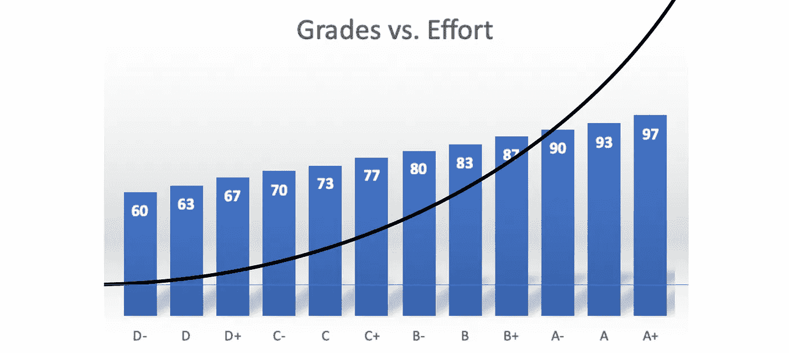

# 不要在工作中成为优等生

> 原文：<https://betterprogramming.pub/stop-being-an-a-student-at-work-547944ce9b3e>

## 我老板给我的最伟大的建议

塞巴斯蒂安·沃特曼在[山](https://www.pexels.com)拍摄的照片。

在学校，我几乎是所有学科的优等生。我不够聪明，拿不到 A+，但我足够聪明，也足够努力，勉强进入 A 的行列。

小学的时候上冰箱就够我用了。对我来说，在大学里毫无愧疚地参加派对就足够了。

这就是我努力追求的——对我来说效果很好。我在夏天得到了可靠的实习机会，我在大学做物理家教赚了一点外快，我甚至还参加了工程荣誉计划。据说，我正在成功。

当我在一家有趣的小公司找到第一份软件工程师的工作时，问题就来了。我继续做我的 A-事情，但是因为某些原因，我只是没有得到同样的结果。

我没有得到我认为应得的那么多的赞扬和认可。更糟糕的是，我知道我的老板是那种该表扬就表扬的人。

所以很明显，我做错了什么。

那种典型的冒名顶替综合症恐惧开始蔓延，我开始怀疑自己是不是那种典型的有资格的孩子，他们太习惯于获得参与奖，以至于我对优秀作品的真正意义没有任何认识。这个问题还没有定论。

但我问我的老板，我们是否可以开始每月一对一的会议。很明显，如果我没有得到表扬，那是因为我不配得到它——我想知道为什么。

我不是做了我应该做的一切吗？难道我不是在为所有最大、最难、最卑鄙的项目做志愿者，并满怀热情、毫无怨言地为之努力吗？

我们第一次一对一的那天到了，我不得不说，我真的很紧张他们要说什么。但是我的老板对他们的智慧很仁慈和慷慨。

他们最终给了我迄今为止收到的最好的工作建议。

老实说，这个建议是如此的基本，如此的简单，如此的显而易见，以至于它需要被说出来的时候几乎令人尴尬。即使是现在，当我写这篇文章的时候，我也在想这是否会对任何人有所帮助。但即使这只能帮助另一个优等生，这就是:

> “提升你职业生涯的事情是学会少接一些项目，但要让这些项目 100%完成。”

哇哦。回想起来，这再明显不过了。

但事实是:终点线实际上比你想象的要远。我不是说我交了半吊子项目。我会完成代码，把它交给 QA 团队，然后继续下一个项目。

但我错了。

实际上我离终点线只有三步之遥。

# 1.准备 QA 团队

我认为我的 QA 团队就像足球中的守门员。我不知道在其他工作领域是否有类似的东西，但在软件领域，他们会确保你不会因为推出一个不起作用的功能而出丑，或者更糟的是，让整个系统崩溃，从而挽救你的生命。

我的质量保证团队在他们的工作中是绝对的专家。我不知道没有他们我该怎么办。

但问题是当我给他们一个特性时，我只是期望他们知道如何测试它，这在很多层面上都是错误的。

首先，如果严格来说它是一个后端特性，那么如果没有适当的日志记录或正确的数据库查询，它实际上是不可见的，也不可能进行测试。我常常没想到要提供那些东西。

即使对于前端功能，我也没有明确告诉我的 QA 人员他们应该寻找什么。这就像在向我的守门员开枪前蒙住他们的眼睛一样。

尽管不是他们自己的错，他们也不知道该做什么。

由[像素](https://www.pexels.com/)上的[赖爷 Subiyanto](https://www.pexels.com/@ketut-subiyanto) 拍摄。

这也意味着授权 QA 团队测试我的功能。这意味着要写足够多的文档，这样他们就知道如何测试和寻找什么。这意味着为部署准备好我的功能，必要时培训支持团队如何使用它，添加开发人员文档，甚至撰写电子邮件公告。

所以我学到的第一课是，为了在工作中取得成功，我必须让我的队友也在工作中取得成功。

# 2.一路冲过终点线

最明显的是，如果 QA 人员*确实*在我的代码中发现了一个 bug(这是软件中常见的情况)，我需要准备好修复它——而不仅仅是把它推给其他人，认为他们不会花太多时间。

在这里，我认为这是一种方式:承担每一个项目，贡献我的时间，对每一件事都说好。

但我错了，因为在学校获得 93 分是很棒的，但在工作中却相当糟糕。原因如下。

我们都知道学校里最后的 7%是有史以来最糟糕的事情，因为你可能会花五个小时来完成第一个 93%的工作，然后再花整整 2-3 个小时来完成最后的 7% 工作，对吗？

如果你不相信我，看看我这张完全不科学的、仅基于个人经验的图表，它比较了分数和努力程度:

作者照片。

你知道从 A-到 A 要付出多少努力吗？从 D+到 B-的努力程度差不多。

尽管分数看起来像一个楼梯，但从百分比来看，达到这些分数的努力更像是试图爬上半个管道。从 D 区到 C 区很容易，但要达到 B 区需要更多的努力，有时要达到 A+几乎是不可能的。

这是你的努力和时间收益递减的概念。我明白了。为了优化你在学校的成绩，花足够的时间在一门课上获得 A，然后转到另一门课，努力提高成绩，这更有意义。然后在季度末，你可能会有四个亮闪闪的 A-。

聪明！甚至高效！但在现实世界中，这不再是收益递减的问题。当我给他们三个 A+的时候，我的老板比四个 A-的时候要高兴得多，这三个 A+是他不需要接触的，而四个 A-是他必须检查、调整和最终确定的。

当你交给你的老板一个几乎完成但只需要一些收尾工作的项目时，你的老板看到的只是他们现在必须为你完成的最后一部分。

这对他们来说是一项巨大的努力——特别是因为他们必须在充分理解并修复项目之前跟上整个项目的进度。

因此，修复那些错误，处理那些边缘情况，编写那些单元测试，看在上帝的份上，完成所有需要的文档。它不一定是一本小说，但它应该足够让其他人在以后捡起它时不会完全丢失。

相信我，你的老板会喜欢你的。在现实世界中，一个完成了 93%的项目看起来更像是一个完成了 50%的项目，这是因为其他人需要花费大量的时间来查看你的项目、切换上下文、跟上进度并完成它。

所以，即使你不得不寻求一些建议和提示来继续，也要确保你是那个能帮助你越过终点线的人。不要把它像接力棒一样传给下一个人，并认为你完成了大部分工作，因为其他人可能不会这么看。

# 3.营销你的作品

在[像素](https://www.pexels.com/@runffwpu)上运行 4 个 FFWPU 。

我曾经认为一个好的功能本身就说明了问题——用户会对你赞不绝口。但这与事实相去甚远。

通常情况下，人们太拘泥于他们做事的方式，除非你给他们一个令人信服的理由，否则他们不会真的想要改变。

同样的事情也适用于与软件无关的工作。你必须展示你带来的价值，因为没有人会为你做这件事。

一旦我的代码准备好投入使用，我必须写一份公告，让用户知道如何使用新功能。此外，他们需要了解他们从中获得的价值(例如，“将 XYZ 的速度提高 10 倍！”).

所以最后一步是推销你的作品。事实上，这一步实际上是在你跨过终点线之后，但它同样重要。

这是你的终点线照片。

它不仅仅是向用户或任何从你的作品中获得价值的人推销你的功能。你还应该确保你的老板理解你所做的出色工作。

你不能只是跑一场马拉松，然后期望每个人都祝贺你。我不是说你应该到处炫耀，因为那很烦人。

但是你也不能总是期望人们认可你的工作。通常，他们只是忙于自己的项目。不像在学校，老师的工作是检查你的作业和测试，在工作中，每个人都有自己的工作要专注。

当谈到加薪或升职时，你必须能够证明你的价值，指出你在哪些项目中发挥了关键作用，展示这一特点如何提高了生产率或客户忠诚度，或创造了更好的体验，或带来了更多的收入。你必须能够展示你的终点线照片。

> "[闭着的嘴不吃饭](https://www.youtube.com/watch?v=4ODvb56Vh6s)"——艾伦·旁派，他在《实习医生格蕾》中谈妥了一份 2000 万美元的合同，成为当时收入最高的电视演员

这也意味着表现出责任感。如果你开始把你的名字放在事物上并获得荣誉，当用户发现特性中的错误时，你也必须准备好承担责任。准备好返回代码来修复它。随时准备灭火并处理周围的沟通。

取得所有权。

# 外卖食品

有人曾经告诉我，他们学到的最重要的一课是如何更经常地说不，直到我的老板给了我这条终点线建议，我才终于明白过来。他们宁愿我对新项目说不，这样我就可以 100%上交我当前的项目。

> “只有说不，你才能专注于真正重要的事情。”— [史蒂夫·乔布斯](https://www.brainyquote.com/quotes/steve_jobs_416938)

学校不会让你为此做好准备。在学校，你被期望在截止日期上交所有的家庭作业，不管它们是否完成。

在现实世界中，为了保护你当前项目的成功，你必须学会如何说不。

显然，如果你一年只制作一个功能，那可能不够快。但是根据我的经验，交一个完成的项目比交两个半吊子的好，而在学校里却不是这样。

所以做一个 A+的工作者吧！把你的项目一路带到终点线，让你的队友为成功做好准备，并确保人们看到你所做工作的价值。