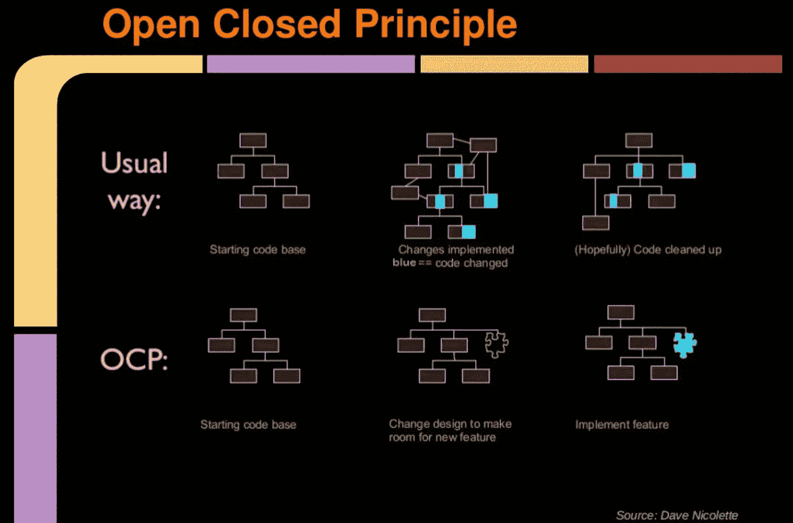

# 停止打破开闭原则

> 原文：<https://betterprogramming.pub/stop-breaking-the-ocp-108dcba14a07>

## 当你打破 OCP 原理时，你能做什么？

照片由[蒂姆·莫斯霍尔德](https://unsplash.com/@timmossholder?utm_source=medium&utm_medium=referral)在 [Unsplash](https://unsplash.com?utm_source=medium&utm_medium=referral) 上拍摄

技术工程面试中最常见的一个问题是:什么是`S.O.L.I.D`以及你是否能为每个原则提供一些例子。

有很多资源宣扬 SOLID 应该如何工作。然而，实际上，魔鬼就在细节中。

# 开闭原则

这是什么？

> 对象或实体应该对扩展开放，但对修改关闭。

这意味着实体应该是可扩展的，而不需要修改实体本身。

违反 OCP 的头号标志是使用`if-else`或`switch`语句。顺便提一下，`if-else`或`switch`的任何分支都应该为可能的代码味道打上一个小问号。

您可能在代码库中找到的情况示例:

假设业务需求发生了变化，您需要添加一个`AnalyticsLogger`，它将记录在`GoogleAnalytics`或`FacebookAnalytics`中。

你的`Logger`类是开放扩展的，但同时也会开放修改(因为你实际上需要添加一个新的`switch case`)，这就违反了`OCP`。

让我们看另一个例子:

使用`if-else`分支逻辑在不同的存储可能性之间进行选择:首先也是最重要的，糟糕的代码味道是使用了不是常量或枚举的字符串文字:这样会导致很多不好的事情和错误，但那是另一回事了。

假设`Product Owner`在一个月后到来，并且希望应用程序能够在内存中存储一些东西，而不是两种持久的方式。接下来会发生什么？另一个`else if`案例场景，然后是另一个，以此类推。

其他情况可能是，但不限于:

> 我们可以清楚地看到这里出现了一种模式。

现在自然的问题是，我们如何解决它？怎么才能预防呢？

所有可能的实现场景都应该符合某种抽象(接口、协议等)。)，正确实施的决策者应该在责任链中被移到更高的位置。

为了在带有`StorageService`的例子中说明这一点，我们将使用一个叫做`Strategy`的行为设计模式。

如果您仔细查看第 32 行，然后查看第 38–40 行，我们可以得出这样的结论:`StorageService`实体现在已经被“锁定”，对修改关闭，并对扩展开放。第 38–40 行告诉我们，我们可以根据需要添加多少新的存储方法，而不需要修改`StorageService`中的代码。

现在，我们回到了一个干净的架构的轨道上，只需要根据设计模式进行简单的代码转换。

由于一张图片胜过千言万语，如果代码库没有针对可伸缩性进行适当的架构和构建，我将提供一个可视化的表示，说明代码中的一个简单更改是如何在如此多的级别上产生影响的。

来源:戴夫·尼科莱特

*感谢阅读！*

*敬请期待更多。*

 [## 用我的推荐链接加入媒体- Catalin Patrascu

### 阅读 Catalin Patrascu 的每一个故事(以及媒体上成千上万的其他作家)。您的会员费直接…

medium.com](https://medium.com/@catalin.patrascu/membership)