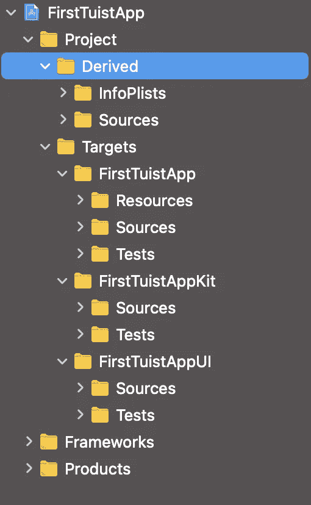

# 停止提交 Xcodeproj

> 原文：<https://betterprogramming.pub/stop-committing-the-xcodeproj-fa83527ba156>

## 如何从 Swift 文件自动生成. xcodeproj 文件


照片由 [Unsplash](https://unsplash.com?utm_source=medium&utm_medium=referral) 上的 [freestocks](https://unsplash.com/@freestocks?utm_source=medium&utm_medium=referral) 拍摄。

当团队中的工程师数量开始增加时，他们应该使用[版本控制系统(VCS)](https://en.wikipedia.org/wiki/Version_control) 来共享他们的代码。其中最著名和最常用的是 [Git](https://git-scm.com/) 。 [GitHub](https://github.com/) 和 [GitLab](https://about.gitlab.com/) 是我们每天利用的服务。

Git 和它的兄弟姐妹非常适合存储和与同事共享代码。它们提供了许多特性，如文件区分、责备、恢复等等。当两个或更多的人处理同一个文件时，这些文件会同时被修改。迟早，两个开发人员中的一个必须将他们同事的变更与他们的工作合并。在一些非常不幸的情况下，他们还必须解决一些冲突。当同一行代码在不同的分支上以不同的方式被修改，并且它们需要被合并在一起时，就会发生这种事件。

代码中的冲突可能非常复杂，但一般来说，它们可以通过一些时间和协作来解决。相反，当文件中存在冲突时，还有其他几种文件是合并的噩梦。

作为一名 iOS 工程师，我很容易想到三种这样的文件类型:

*   `Storyboard`
*   `Xcodeproj`
*   `Xcworkspace`

所有这些文件都有一个共同的特点:它们都是由一个工具(例如 Xcode)自动生成的，它们隐藏了大量的复杂性。例如，`Xcodeproj`实际上是更多文件夹和文件的捆绑包！

团队需要共享项目的配置，但是人们不想花一整天的时间来解决自动生成文件的愚蠢冲突。那么解决办法是什么呢？

不要提交这些文件！

但是我们如何分享它们呢？想法是提交一个描述项目的更简单的文件。然后这个文件被输入到一个特殊的工具中，这个工具能够从中生成`.xcodeproj`和`.xcworspace`！

今天我们要探索一个极其简单却功能强大的工具: [Tuist](https://tuist.io/) 。这个社区充满活力，他们每天都在开发新的功能。

# **推斯特**

Tuist 允许 iOS 开发人员使用我们钟爱的语言 Swift 来描述项目。一切都是强类型的，Xcode 可以帮助我们自动完成。我们还能问些什么吗？

要安装它，我们只需运行来自他们的[入门](https://tuist.io/docs/usage/getting-started/)指南的以下命令:

```
bash <(curl -Ls [https://install.tuist.io)](https://install.tuist.io))
```

然后，为了生成我们的第一个项目，我们需要:

```
# create a new folder
$ mkdir FirstTuistApp# navigate into it
$ cd FirstTuistApp# create the project
$ tuist init --platform ios
```

最后一个命令准备 Tuist 项目。如果我们检查文件夹，我们看不到任何与 Xcode 相关的内容。为了实际生成`xcodeproj`，我们需要另一行代码:

```
# generate the project
$ tuist generate# Open project
$ open FirstTuistApp.xcworkspace
```

最后一个命令打开 Xcode 和新创建的项目。下图显示了项目结构:



项目的根由一个:

*   `Derived`文件夹。这个文件夹包含了 Tuist 从项目中包含的资源开始为我们生成的一些代码。例如，它包含了一种轻松访问`Bundle`和资源的方法。更多信息可在文档中找到[。](https://tuist.io/docs/usage/resources/)
*   `Targets`文件夹。该文件夹包含项目中指定的目标。默认情况下，项目由应用程序、逻辑框架和 UI 框架组成。虽然应用程序与项目同名，但逻辑框架的后缀是`Kit`，UI 框架的后缀是`UI`。

自动生成的项目已经在工作了。点击播放按钮，查看模拟器中启动的应用程序！

# 探索项目描述

这看起来像魔术！控制台中的几行代码，我们就有了一个完全工作的模块化项目！这怎么可能呢？让我们揭开谜底！

要了解创建项目的起点，请返回到终端并键入:

```
# Open the Tuist project
$ tuist edit 
```

这个命令将启动 Xcode 的一个实例，用几个助手围绕着`Project.swift`。看起来是这样的:


`Manifest`是根文件夹。

它包含了`Project.swift`，在这里我们可以描述我们的应用程序是如何组成的。

然后，有一个包含所有助手的`Tuist`文件夹:一个`Config.swift`文件和一个`ProjectDescriptionHelpers`文件夹。这个文件夹包含一些描述项目的其他助手。让我们检查一下`Project.swift`和`Project+Template.swift`文件。

## Project.swift

这是`Project.swift`:

这个文件唯一的职责是创建一个`Project`结构。这是通过利用`app`函数来指定:

*   应用程序的名称。
*   站台。
*   附加目标(即我们想要实现的模块以及应用程序所依赖的模块)。

app 函数在`Project+Template.swift`文件中定义。

## 项目+模板. swift

让我们看看`Project+Template`的内容:

在这个文件中，我们可以定义函数和结构来简化 Xcode 项目的描述。在初始配置中，这个文件公开了一个静态的`app`函数，由`Project.swift`文件使用。该函数使用几个其他函数来构建主目标和辅助模块。

用于创建主目标(应用程序)的功能称为`makeAppTargets`。这将通过以下方式配置应用:

1.  定义所需的 Plist 键，如`CFBundleShortVersionString`和`CFBundleVersion`。
2.  使用正确的路径创建类型为`.app`的主目标，以加载`Source`文件和`Resources`。
3.  创建一个测试目标来为应用程序编写单元测试。

一个重要的参数是`dependencies`。这用于建立应用程序所依赖的模块，这些模块是项目中的其他目标或第三方依赖项。

`dependencies`参数通过`makeFrameworkTargets`填充，这是用于创建项目的另一个函数。

这个功能非常类似于`makeAppTargets`。唯一的区别是它创建了`framework`类型的目标。在初始配置中，它们是`<AppName>Kit`和`<AppName>UI`目标。

最后，`app`函数返回填充了正确参数的`Project`结构。

# 结论

在今天的文章中，我们开始探索创建 Xcode 项目的新工具。这允许 iOS 开发者只提交和共享 Tuist Swift 文件，忽略`xcodeproj`和`xcworkspace`。这是一个强大的解决方案，因为可以利用 Xcode 编译和自动完成功能，以更易于阅读的方式使用 Swift 解决合并冲突。

我们只是触及了它的表面，理解了它的基础以及它是如何描述这个项目的。我们已经可以利用它的基本架构，开始在它为我们生成的两个框架中实现我们的应用程序。

我们仍然需要探索如何创建新模块和安装依赖项。如果我们一次性完成所有这些工作，那么这篇文章将会过长。

Tuist 和生成的 app 已经有很好的发挥空间了。 [Tuist 的文档](https://tuist.io/docs/usage/project-description/)是惊人的，如果你想立即修补它。下周，我们将继续探索定制它的几种方法。