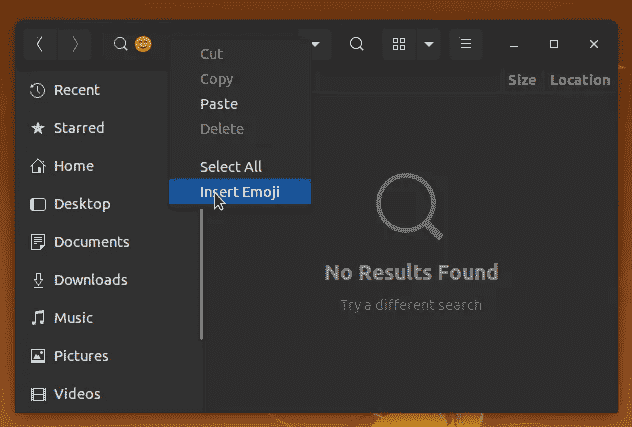
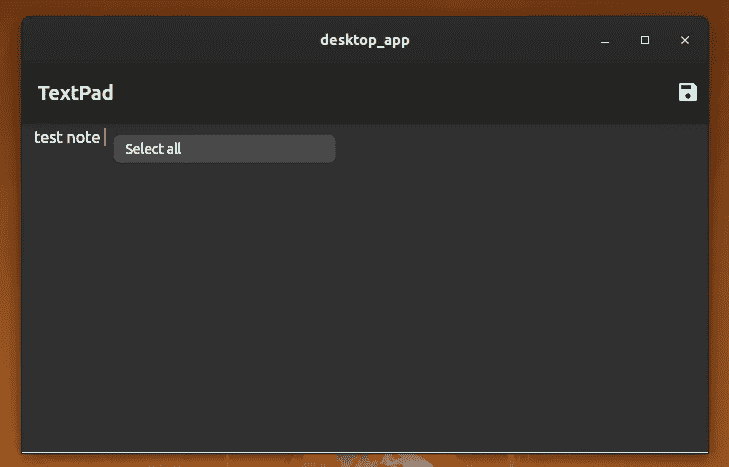

# 停止将 Flutter 的当前阶段与其他成熟的框架进行比较

> 原文：<https://betterprogramming.pub/stop-comparing-flutters-current-stage-with-other-matured-frameworks-fcdbcf1e204b>

## 颤振还是新的。给它一些时间来发光

在 [Unsplash](/s/photos/flutter?utm_source=unsplash&utm_medium=referral&utm_content=creditCopyText) 上[简新](https://unsplash.com/@lyianko?utm_source=unsplash&utm_medium=referral&utm_content=creditCopyText)的照片

每天，我们都看到有人说 [Flutter](https://flutter.dev/docs) 的坏话。大多数开发者提到 [Ionic](https://ionicframework.com/docs/v1/guide/preface.html) 和 [React Native](https://reactnative.dev/) 比 Flutter 好，因为 Flutter 有太多的渲染问题。另一方面，一些开发者提到现有的插件不足以完成他们计划完成的任务。极少数开发人员已经注意到，Flutter bundler 会在几个平台上生成较大的最终二进制文件。

这些东西按照颤振框架的现阶段来看都是正确的。与其他成熟的框架相比，Flutter 只是一个三年前的项目。Ionic 最初发布于近八年前。React Native 现在是一个五年的项目。一切都需要一段时间才能发光。

还记得 [Golang](https://golang.org/) 吗？最初，每个人都认为它是另一种编译语言。现在每个人都知道它的目标是对硬件和开发者都友好。换句话说，Golang 在对人类友好的语言语法方面具有良好的性能。现在 Golang 对于各种需要高性能的复杂软件开发项目来说无疑是非常棒的。同样，Flutter 试图对硬件和开发者都友好。

Flutter 拥有真正的原生 GUI 控件，因为没有用于渲染的 webview。此外，它还能有效地与本机系统 API 进行对话。下面的文章深入解释了 Dart 到本机的通信通道。

 [## 颤振平台通道

### “不错的 UI。但是 Flutter 是如何处理特定于平台的 API 的？”

medium.com](https://medium.com/flutter/flutter-platform-channels-ce7f540a104e) 

# Flutter 是一个通用的本地框架

Flutter 最初是作为跨平台移动应用程序开发的解决方案出现的。Flutter 团队也为桌面平台扩展了 Flutter，因为 [Skia 图形库](https://skia.org/)和 Dart 运行时都是跨平台的项目。现在我们可以使用 Flutter 为 Android、iOS、Linux、Windows、macOS、Web 和 Fuchsia OS 构建软件。如果你选择了 Ionic 来制作你的移动应用，你可能不得不用[电子的 API](https://www.electronjs.org/docs/api) 为你的桌面应用编写另一个代码库。Flutter 确实支持几乎所有的现代操作系统。它使 Flutter 成为一个通用的框架。因此，您可以为您的移动应用程序、桌面应用程序和 web 应用程序维护一个单一的代码库。

如今，所有的服务都在向云发展。因此，网络就像另一个平台。毫无疑问，Flutter 是构建渐进式 web 应用程序(pwa)和单页应用程序(spa)的绝佳选择。

Flutter 是世界上第一个用于 GUI 应用程序开发的一次编写随处运行(WORA)工具。

# 性能和易用性

如果您的应用程序有许多动态 GUI 元素，那么 React Native 可以很好地工作，因为它将使用操作系统提供的 GUI 部件。但对于如此多的本机 API 调用，它的性能不会很好，因为本机操作要通过一个类似于 Ionic 的 JavaScript 桥。开发人员仍然喜欢 React Native，因为它提供了一个友好的 React 驱动的开发环境。另一方面，Flutter 显示了良好的性能，因为它没有 JavaScript 桥——而且它也有友好的开发工作流程。

Flutter 是唯一一个为您提供不太复杂的开发环境 API 和良好性能的框架。其他框架未能平衡这两个因素，因为它们选择使用 JavaScript 桥。由于高于平均水平的资源消耗，基于 JavaScript bridge 的应用程序在低端设备上表现不佳。

# Flutter 只有一个竞争者

如果将 Flutter 的核心概念与其他跨平台框架的概念进行比较，可以看出 Flutter 在各方面都胜出。Flutter 使用自己的图形后端。因此，我们不需要担心我们的应用程序在不同平台上的观感。在任何现代操作系统上，Flutter 应用程序的行为都是一样的。

但是，如果我们使用 Flutter 框架构建一个桌面或移动应用程序，它就变成了一个 Flutter 应用程序，而不是一个特定于平台的原生应用程序。原因是 Flutter 用它的 widgets 工具包定义了自己的用户体验。另一方面，每个操作系统都用自己的 widgets 工具包定义了自己的用户体验。当我在 Linux 上开发一个简单的 Flutter 应用程序时，我注意到了这种情况。

上下文菜单有一个插入表情符号的选项，如下图所示。

Ubuntu 上文本字段的上下文菜单。作者截图。

但是我的 Flutter 应用程序在文本字段上有一个非常不同的上下文菜单，如下所示。

Flutter widgets 系统中文本字段的上下文菜单。作者截图。

Flutter 的概念确实比其他框架的方法要好。但它将无法赢得与特定平台原生应用程序的竞争，因为用户不喜欢错过与他们喜爱的操作系统相关的特定平台用户体验。

然而，Flutter 实现了一个类似 iOS 的 widgets 主题，开发者可以使用它来代替 iOS 的材质设计。但是像 Ubuntu 这样的操作系统没有 UI 控件的标准主题，外观和感觉取决于安装的桌面环境。因此，特定平台的本地应用程序开发是 Flutter 概念的唯一竞争者。

# 结论

几乎所有的跨平台应用程序开发框架都关注开发的容易程度。我们应该感谢 Flutter 团队，因为他们在公开开发人员友好的 API 时也考虑了性能。所有这些关于渲染、有些臃肿的二进制文件和插件缺乏的问题都是暂时的——是可以解决的。给颤振一些时间来展示它的力量。也许 Flutter 可以实现比所有现有的特定平台应用程序更好的用户体验。

也许将来我们都会在 Fuchsia 操作系统上使用 Flutter 应用程序。然后我们将不得不用 Fuchsia 操作系统的 Flutter 重写我们所有的应用程序。