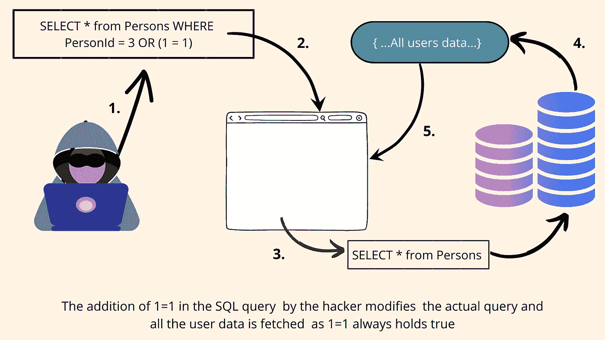
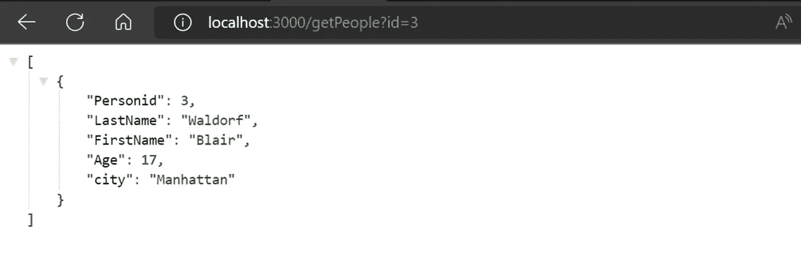
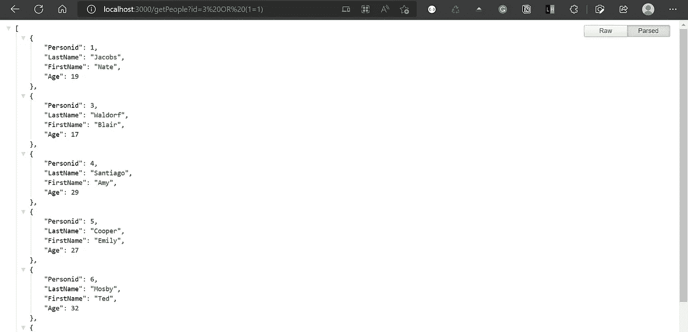
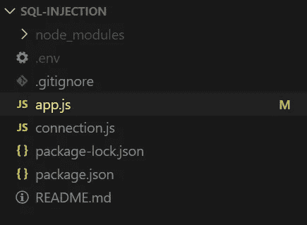
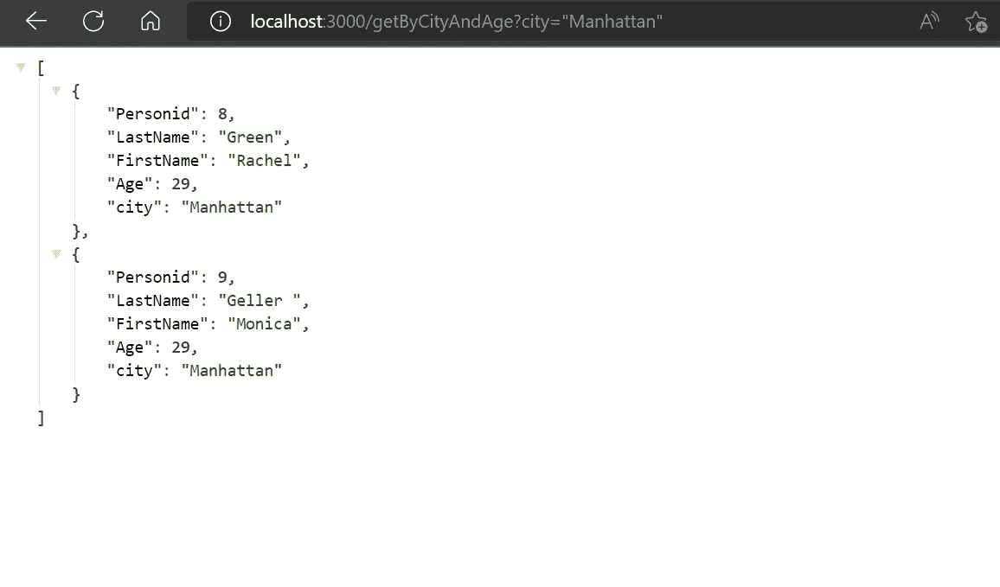
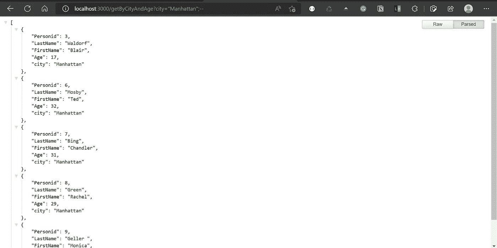
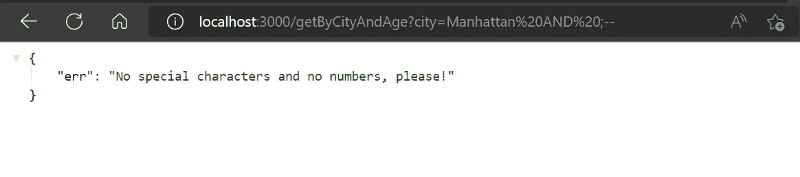

# 防止 Node.js 中的 SQL 注入攻击

> 原文：<https://betterprogramming.pub/stop-doing-this-in-your-sql-queries-if-you-already-are-252b3f8c1029>

## 如果您已经这样做了，请停止在 SQL 查询中这样做


卡斯帕·卡米尔·鲁宾在 [Unsplash](https://unsplash.com?utm_source=medium&utm_medium=referral) 上拍摄的照片

想知道 SQL 注入是什么吗？

SQL 注入是最流行的网络黑客技术之一，它允许攻击者通过简单地注入几行代码来窥视你的数据库。

攻击者可以读取、修改甚至删除数据库中的数据，只需在向服务器发送请求时对参数进行一些更改，从而修改原始 SQL 查询。

迷茫？

让我们用最简单的例子来理解这一点:



SQL 注入的例子

下面是一个 GET 请求，请求后端用`id = 3`发送用户的数据:



按 ID 获取用户

下面的示例显示了查询中的一个更改如何从数据库中获取所有用户数据:



在请求参数中添加(1==1)

*注:这是理解 SQL 注入*最简单的例子之一

幕后发生了什么？

在上面的例子中，用户以`id = 3 OR (1 = 1)`的身份发送查询。

当在后端从请求中提取这个查询时，它将整个事情作为一个字符串处理，这个字符串将在 SQL 查询中进一步处理。

从技术上讲，SQL 查询应该是:

```
SELECT * from Persons WHERE PersonId = 3
```

但是现在有了给定的输入，SQL 查询变成了:

```
SELECT * from Persons WHERE PersonId = 3 OR (1 = 1)
```

因为(1 = 1)始终为真，所以它返回存在于`Persons`表中的所有用户。

毫无疑问，你不希望这个问题出现在你的下一个开发项目中！

让我们更深入地了解这一点，动手用 MySQL 数据库编写一些 express 后端，并实现更好的实践来避免 SQL 注入。

我们将使用以下文件夹结构创建最小的 express 项目:



文件夹结构

## ***包装要求***

*   `mysql2`
*   `dotenv`(确保每一件私人物品都留在。环境文件)
*   `express`

我在 MySQL 数据库中建立了一个虚拟表。要将数据库与 express 后端连接起来，请设置`connection.js`文件:

注意:我已经建立了一个. env 文件来存储连接细节

让我们跳到编写 API 来通过 ID 获取这个人的详细信息:

使用这段代码，我们将面临第一个例子中显示的问题。注意，这里出了什么问题？作为 JavaScript 开发人员，我们倾向于使用 ES6 模板文字。但是这样做，我们只是让我们的代码容易受到攻击。

# 我们如何防止这种情况发生？

一些方法是:

## **1。使用占位符:**

我们可以使用占位符，而不是在 SQL 查询中使用 ES6 文字，瞧！

使用占位符更正了 SQL 查询


更正的 SQL 查询的输出

## 2.输入验证

让我们再举一个例子来理解为什么我们需要验证从请求中提取的输入。考虑获取给定城市中 29 岁的人的详细信息。我们将从用户那里获取城市信息:



GetPeopleByCity api 预期输出

下面是该请求的 API:

假设，输入城市是“曼哈顿”。

如果攻击者将参数作为`“Manhattan”; —` 而不是`**“Manhattan”**`发送，那么“—”注释掉 SQL 查询的其余部分，而“；”充当分隔符:



添加“；—“导致产量的变化

因此，SQL 查询现在变成了:

```
SELECT * FROM persons WHERE city = Manhattan ; --AND Age = 29
```

而不是:

```
SELECT * FROM persons WHERE city = Manhattan AND Age = 29
```

因此获取了停留在曼哈顿的所有用户的详细资料，从而影响了系统的数据隐私。

与此示例类似，攻击者可以发送各种特殊字符组合来修改原始 SQL 查询。我们可以通过检查输入字符串是否只有字母或者根据用例来验证查询。

下面是相同的代码:

验证从请求中提取的输入参数



验证输入并避免 SQL 注入

有用！！

# 摘要

这些是理解 SQL 注入以及如何在 node.js 项目中防止它们以避免崩溃的一些最简单的例子。您可以通过寻找特定于语言的方法来避免 SQL 注入，从而更深入地了解这个主题。您还可以了解不同类型的 SQL 注入及其对代码库的影响。

结帐: [SQL 注入备忘单](https://www.invicti.com/blog/web-security/sql-injection-cheat-sheet/#LineComments)

代码 GitHub 链接:

[](https://github.com/dsrao711/sql-injection.git) [## GitHub - dsrao711/sql-injection:这篇文章用代码解释了什么是 sql 注入以及如何…

### SQL 注入是最流行的网络黑客技术之一，它允许攻击者通过…

github.com](https://github.com/dsrao711/sql-injection.git) 

```
**Want to Connect?**Here's my [LinkedIn handle](https://www.linkedin.com/in/divya-rao-739a8b143).
```