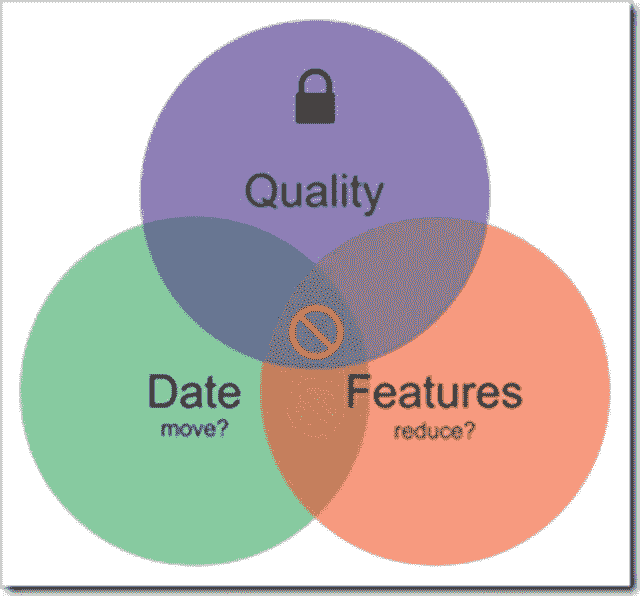

# 在你说你做不到之后，停止做事情

> 原文：<https://betterprogramming.pub/stop-getting-stuff-done-after-you-said-you-couldnt-38eda173a3d3>

## Scrum 学习

## 作为 Scrum 教练的经验教训


照片由 [goxy bgd](https://unsplash.com/@goranab?utm_source=medium&utm_medium=referral) 在 [Unsplash](https://unsplash.com?utm_source=medium&utm_medium=referral) 上拍摄

我们都经历过。我们正在开会，被告知我们必须在某个日期前完成所有这些功能。我们一直告诉他们这是不可能的。在那个日期之前要完成的工作实在太多了。但不知何故，当那个日期到来时，所有的功能都完成了！

发生了什么事？你怎么能完成你声称不可能完成的事情？如果我提出了最初被描述为不切实际的要求，但是所有的功能都按时完成了，我想我可以要求更多。显然，开发团队错了；他们可以全部完成。我意识到我是一个令人难以置信的激励者！

如果你是一个开发人员，你会想，“我不得不在晚上和周末工作，并取消单元测试来完成这个日期。”但我敢打赌，你们中的许多人从来没有对提出要求的人说过这句话。但我还是要问，“这是怎么做到的？谁为后果买单？”你做到了。当你在挑灯夜战的时候，他们正和家人在一起。

他们不会在晚上或周末看到你，因为他们和家人在一起。我不是说他们是邪恶的人。但是，因为他们晚上或周末不在那里，他们不知道你所做的牺牲。

我认为这种再熟悉不过的情况存在几个问题。第一个问题是大多数对话都是从约会开始的。这是第一个错误。当你以一个日期开始，然后问我们是否能做到，开发人员开始在他们的头脑中减去那个日期，并开始做出妥协。第一个节省时间的方法是省去测试，这将导致客户满意度问题和技术债务。技术债务就像信用卡债务一样，会产生利息，最终你必须支付。你在顾客中的声誉受到的打击需要更长的时间来修复。

过去，我不得不与我的产品负责人坐下来，要求他们不要在我们的计划会议中提及任何日期。我知道如果提到日期，我们将永远无法得到团队完成任务所需时间的真实度量。即使这项工作需要更多的时间，团队也会想办法让它适应。我需要的是团队对每项任务的诚实、公正的意见。一旦建立起来，产品所有者就有责任设置项目的优先级，这样他们就可以在只有他们知道的日期之前得到他们需要的东西。约会被禁止了。一个简单的事实是，如果你需要在 5 天内完成 9 天的工作，你就没有完成。


在 [Unsplash](https://unsplash.com?utm_source=medium&utm_medium=referral) 上由[Towfiqu barb huya](https://unsplash.com/@towfiqu999999?utm_source=medium&utm_medium=referral)拍摄的照片

这也迫使我的产品负责人在团队交付的东西上妥协。当他们处理实数时，很明显他们没有足够的时间。预算变成了项目的成本，而产品所有者只有这么多小时的现金可以花。一个额外的好处是让我的产品所有者认真审视他们的优先事项。一旦他们意识到他们不能拥有一切，他们会迅速调整待办事项，以确保他们得到他们所需要的。



具有锁定质量的文氏图

我们都见过约会质量下降。如果有什么是不可谈判的，那就是质量。这让我想起了那张图，你可以在好、快或便宜之间选择两个。我也有类似的想法。选项有日期、功能或质量，但您只能在日期和功能之间选择一个，因为质量是不可协商的。您可以移动日期或减少功能集。如果没有一个日期作为目标，你可以估计到我们同意的完成的定义，而不是偷工减料制造日期。

我知道日期是存在的，但许多日期并不像我们最初被引导去相信的那样重要。它们被用来激励员工，但弊大于利。有多少次你被告知日期不能改变，但是当你不能实现时，日期改变了？

当你有一个不可移动的日期，一个可能会因为违反规定而使公司付出代价的日期，我仍然建议你不要分享这个日期。您必须做的是将符合规定的项目排在不符合规定的项目之前。不要贪心。这会咬你的屁股。最终，开发者会被不断的消防演习和死亡行军搞得筋疲力尽。我有消息告诉你。第一批离开的开发人员是你拥有的最好的开发人员，因为他们有选择权。

那么如何解决这个问题呢？多诺万不可能暗示我们是故意失败的。简单的答案是雇佣“傻瓜”

我的意思是很难对你的老板说不。我自己也在纠结。但是我很容易拒绝你的老板。当我是一名过程顾问时，我觉得我的工作就是进来保护团队免受这些不切实际的要求，并对那些可能从未听说过的人说不。我还需要分享为什么他们所要求的是不可能的数字。

然后，我帮助他们真正优先处理积压的工作。如此多的产品负责人认为在你完成订单上的每一项之前他们不能发货，那么为什么订单很重要呢？当你完成后，我们将船舶，我需要这一切。但这不是敏捷的工作方式。你不需要在发货前到达你的积压订单的底部。一看到价值就可以出货。

我使用的另一个技巧是让产品负责人关注产品积压的真正优先级，让他们设置优先级，就好像这是我们为他们工作的最后一次冲刺。在这次冲刺之后，我们将进行另一个项目。那么，假设你只剩下一次冲刺，你必须完成什么？我学会了这个技巧，因为在一家公司，情况就是这样。团队会很快地从一个项目转移到另一个项目，从一个平台转移到另一个平台。一旦产品负责人意识到他们不会永远拥有团队，他们就会把积压的产品整理好。这迫使他们真正证明他们是否需要他们所要求的每一个铃铛和哨子。这是他们参与这一过程的强大动力。

一旦产品负责人站出来，真正掌握了积压的工作，并使用真实的数据，整个团队将会兴旺发达。开发人员现在可以花时间和他们的家人在一起，并交付更高质量的代码，让他们感到自豪，也让您的客户兴奋地使用。收回和你爱的人在一起的时间。

感谢阅读。下次见！

```
Originally published at [https://www.donovanbrown.com](https://www.donovanbrown.com/post/Stop-Getting-Stuff-Done-After-You-Said-You-Couldnt).
```