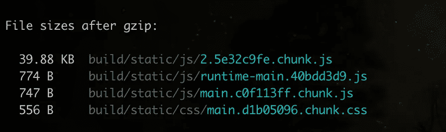
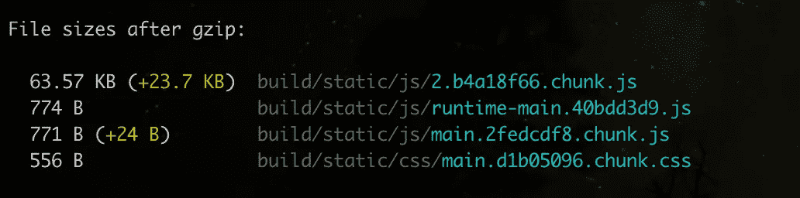
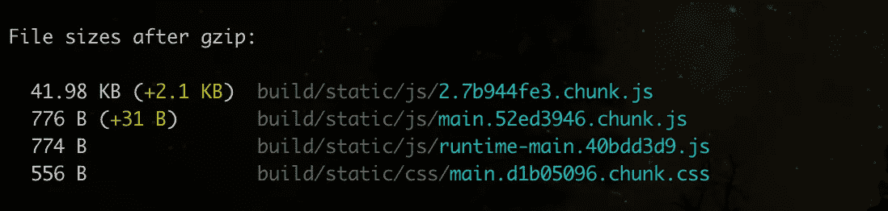

# 停止导入整个 JavaScript 包

> 原文：<https://betterprogramming.pub/stop-importing-whole-javascript-packages-39a5f3d4c8>

## 通过只导入包中您需要的部分来减小包的大小


照片由 [Pankaj Patel](https://unsplash.com/@pankajpatel?utm_source=medium&utm_medium=referral) 在 [Unsplash](https://unsplash.com?utm_source=medium&utm_medium=referral) 上拍摄

有多少次您导入了一个完整的包，但只需要其中很少的功能？可能，很多。

这种场景最常见的例子 [Lodash](https://lodash.com/) 。对于那些没有听说过它的人，您应该查看一下文档。

> “Lodash 通过消除处理数组、数字、对象、字符串等的麻烦，使 JavaScript 变得更加简单。”—Lodash.com

它有 200 多个功能，这意味着它真的解决了所有的麻烦。然而，你可能最终在你的项目中只使用了 4-5 个，这让我想知道*当我只使用了包的 2-3%时，我真的应该导入整个包吗？*

我最喜欢的函数之一是`get`，它可以让你安全地访问嵌套的对象，并提供默认值。

这使你的代码更加整洁，避免了错误，因为当你期望一个空数组时，它不会返回 null。不会在空数组上误调用`map`之类的。

让我们看看当我只使用`get`函数时，包的大小增加了多少。我将在一个 React 项目中使用它，并分析前后的包大小。

## 以前



使用 Lodash 之前的文件大小

## 在...之后

1.  以传统方式导入:

`import _ from ‘lodash’;`或`const _ = require('lodash');`


导入完整包时的文件大小

2.ES6 导入方式:

`import { get} from 'lodash';`或`const { get } = require('lodash');`



使用 ES6 解构器导入“get”时的文件大小

您会看到这两种方法都增加了 23 KB 的大小，这相当大——特别是当我们只使用一个函数来访问对象属性时。该函数是 Lodash 提供的 200 多个函数中的一个，然而我们的包大小增加了，就好像我们使用了所有 200 多个函数一样。

**就捆绑包大小而言，您付出的价格是否值得？**否

有没有更好的做事方式？是的。

让我们分析 Lodash 包文件夹。

直接去`node_modules/lodash`。您会看到每个实用函数都有很多文件。你可以很容易地找到`get.js`。所以不要导入整个包，只导入这个文件。

3.仅进口`get.js`:

`import get from 'lodash/get';`或`const get = require('lodash/get');`



仅导入 get.js 时的文件大小

仅仅通过改变导入包的方式，您就将包的大小减少了 20 KB 以上。这只是一个包——想象一下，对如何导入包保持谨慎并跟踪包的大小会对你的网站或服务器产生多大的影响。

既然你已经看到了它的重要性，你可能会有一些疑问。

**所有的包都支持这种选择性导入吗？**

不，这完全取决于一个包的结构。但是，幸运的是，大多数足够大且常用的包都是以这样一种方式构造的，只需一些努力就可以让它工作。

**如何对其他库进行同样的操作？**

移除未使用代码的过程被称为*树抖动。*如果你想实现这个，比方说蚂蚁设计，在你的浏览器里搜索*蚂蚁树摇*就可以了。你可能会在 GitHub 上找到一个讨论或问题——浏览一下，可能已经有人提供了解决方案。

另一种方法需要更多的努力。前往`node_modules`中的包文件夹，开始分析代码。检查代码是否被分解成可以独立导入的小模块。

**其他可以实现摇树的例子**

树在晃动`antd`:

```
//Before
import { Menu} from 'antd';
// After 
import Menu from 'antd/es/menu';
import 'antd/es/menu/style/css';
```

树在晃动`material ui`:

```
//Before
import { Button } from '@material-ui/core';
//After
import Button from '@material-ui/core/Button';
```

树在晃动`Moment.js`:

这会变得有点复杂，所以我只发布一个 GitHub 问题的链接。如果需要可以参考[这个](https://github.com/moment/moment/issues/2373)。

# 结论

您已经看到了有多少未使用的代码被不必要地添加到您的代码中。您可以通过一些努力来消除这种情况，并使您的网站加载速度更快。因此，采取一种方法，始终关注包的大小。