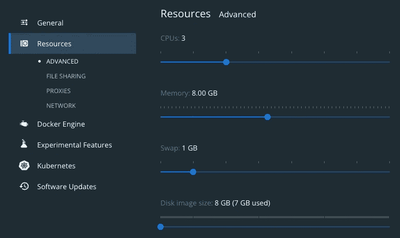
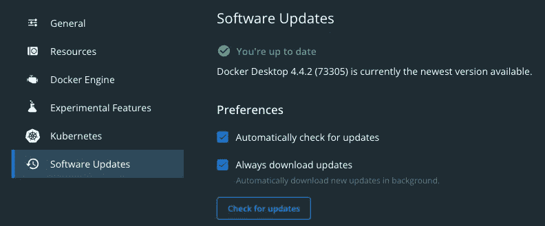
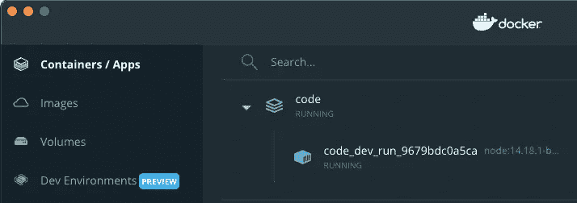
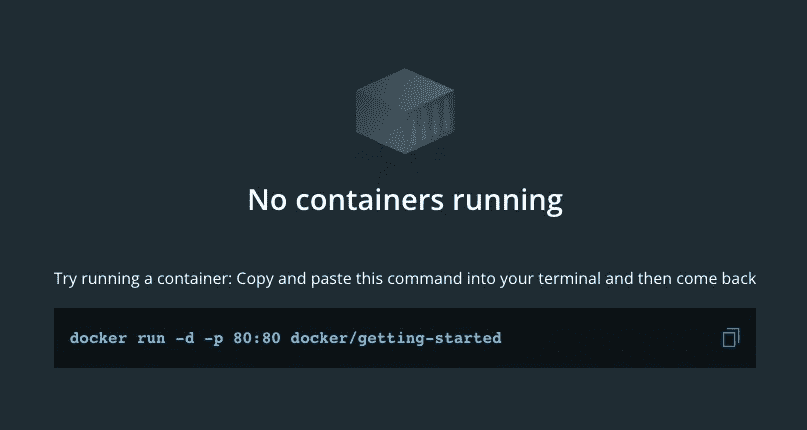
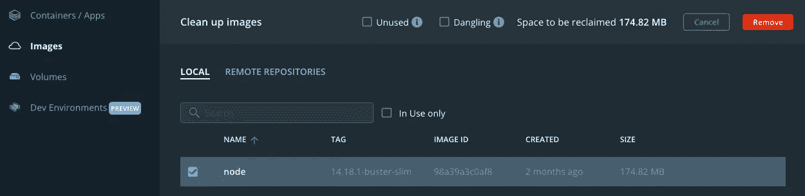
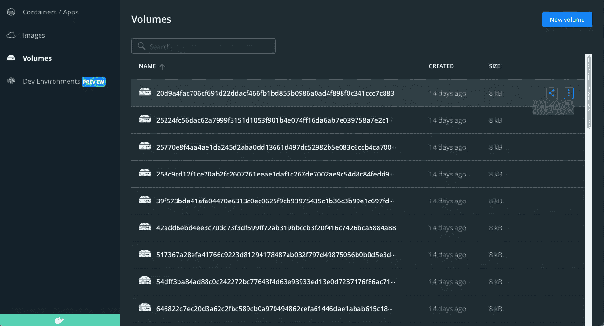

# 停止安装 Node.js 和全局 Npm 包，改用 Docker

> 原文：<https://betterprogramming.pub/stop-installing-node-js-and-global-npm-packages-use-docker-instead-42597990db13>

## 保护您的系统免受漏洞攻击


汤姆·温克尔斯在 [Unsplash](https://unsplash.com?utm_source=medium&utm_medium=referral) 上的照片

有一种方法可以让我们的计算机免受恶意 npm 软件包和网络安全漏洞的影响。这几乎就像 Node 和 npm 将在一个孤岛上。

我们可以使用 Docker 容器来运行 Node.js 并安装 npm 包。

# 什么是 Docker 容器，我们为什么要使用它们？

Docker 是一种软件技术，它创建了一个在我们的计算机上运行的容器。容器就像是在我们的内部运行一台小型计算机，限制对我们文件的访问。

在我们的计算机上运行 Node.js 的问题是恶意 npm 包的增长。一些恶意行为者故意将恶意软件放入 npm 包中。他们创建名称相似的包(称为域名仿冒),希望我们安装不正确的版本，这样他们就可以传播恶意软件。

这些类型的 npm 攻击已经[显著增长](https://threatpost.com/5-top-threatpost-stories-2021/177278/)，并将继续[成为 2022 年](https://www.securityweek.com/cyber-insights-2022-supply-chain)和未来几年的一个问题。

如果我们安装了一个恶意的 npm 包，我们可以限制损害的程度。这就是容器可以发挥作用的地方。

假设我们安装了一个[部署了勒索软件](https://blog.sonatype.com/fake-npm-roblox-api-package-installs-ransomware-spooky-surprise)的 npm 包。如果我们在电脑上运行 Node.js，我们所有的文件都会成为勒索软件攻击的受害者。

假设我们把它安装在一个容器里。正确配置的容器将限制对添加到容器中的文件的访问。理论上，只有那些特定的文件会被泄露，我们的个人文件应该受到保护。为了安全起见，我们可以停止容器，删除容器映像，清除与容器相关的所有文件，并运行防病毒扫描。假设我们将代码提交给一个软件库，我们可能只丢失了一点点代码。

使用 Docker 容器运行 Node.js 就像将我们的代码隔离起来，这样感染就不会对整个计算机造成压力。

# 如何在我的机器上设置 Node.js 和 npm？

从在我们的开发机器上安装 [Docker 桌面](https://www.docker.com/products/docker-desktop)开始。我们还想创建一个 Docker 帐户，以利用我们稍后将讨论的 Docker 扫描功能。

在我们安装它之后，去设置。

在“通用”部分启用“Docker 撰写 V2”。


常规设置。

在“资源高级”部分设置所需的资源负载。



高级资源设置。

确保软件更新已启用。



软件更新设置。

转到我们的代码文件夹。在顶层目录中(或者在我们想要定制容器的每个文件夹中)创建一个名为“docker-compose.yml”的文件。

```
version: "3"
services:
  dev:
    image: "node:14.18.1-buster-slim"
    user: "node"
    working_dir: /home/node/dev
    volumes:
      - /var/run/docker.sock:/var/run/docker.sock
      - ./:/home/node/dev
```

Docker 合成文件创建并运行 Docker 容器，而无需构建它。

属性定义了节点容器。该示例使用了一个正式的 Node.js 容器映像。版本是根据 Docker 扫描的建议选择的。

属性将主目录定义为`/home/node/dev`。(当我们启动容器时，它会将`dev`显示为当前文件夹。)

`volumes:`属性允许在容器内运行 Docker，并将所有文件放在`docker-compose.yml`所在的位置，并将其挂载到容器内的`/home/node/dev`目录。(如果我们不需要 Docker 在容器中运行，我们可以删除第一行。)

使用 Circle 中的另一个映像(例如`circleci/node:14-bullseye`)提供了 git 和其他常见的 Linux 实用程序。

```
version: "3"
services:
  node:
    image: "circleci/node:14-bullseye"
    working_dir: /home/node/dev
    volumes:
      - /var/run/docker.sock:/var/run/docker.sock
      - ./:/home/node/dev
```

在我们计算机的终端中，运行以下命令来启动容器。

```
docker compose run --rm dev bash
# Or the following if Docker Compose v2 was not checked above
docker-compose run --rm dev bash
```

我们现在将在终端中看到类似`node@502104098e72:~/code$`的提示。这意味着我们的终端现在位于 Docker 容器运行节点内部。

**好处:**用`PS1` Linux 变量定制命令提示符，让它对你更有意义。

```
node@502104098e72:~/code$ PS1="MyProject:\w$ "
MyProject:~/code$
```

键入`ls`命令来查看我们的文件。我们应该会看到目录中的文件。

打开 Docker 桌面，我们将看到我们的容器运行。



容器正在运行。

我们现在可以在容器中运行`npm i -g some_package_name`和`npm ci`。

(如果我们的机器上安装了节点，我们可以尝试在我们的容器中安装一个不同的全局 npm 包。我们打开一个新的终端窗口，尝试运行全局 npm 包，我们应该得到一个错误，因为它只安装在我们的容器中。)

在容器的终端中，键入`exit`命令。转到 Docker 桌面，我们应该不再看到容器。



没有容器在运行。

`docker compose run`命令中的`--rm`标志告诉 Docker 在容器终止后删除它。这样我们可以保持我们的机器更干净。

## 保持 Docker 的更新和整洁

当 Docker 软件更新可用时，我们应该应用它们。

在我们应用更新后，我们应该用 [Docker 扫描](https://docs.docker.com/engine/scan/)来扫描我们的容器的漏洞。

我们需要接受许可证来开始 Docker 扫描。

```
docker scan --accept-license --version
```

我们可以用下面的命令扫描 Node.js 容器。

```
docker scan node
```

扫描输出将推荐使用哪个容器图像。我们将更新`docker-compose.yml`文件中的`image:`属性，以获得推荐的图像。

我们应该时常清理图像。



清理图像。

并删除旧卷。



正在删除卷。

# 结论

使用 Docker 容器是保护我们的计算机免受恶意 npm 包和 Node.js 漏洞攻击的一种方式，因为代码执行和运行时是与容器隔离的。

## 在你走之前

这些是你可能喜欢的其他文章。

[](https://javascript.plainenglish.io/add-typescript-to-nuxt-or-vue-in-3-easy-steps-360a356460b4) [## 通过 3 个简单的步骤将 TypeScript 添加到 Vue 或 Nuxt 中

### 在 Nuxt 或 Vue 中使用 TypeScript 可能非常复杂。我只想做类型检查！仅此而已。我花了很长时间才…

javascript.plainenglish.io](https://javascript.plainenglish.io/add-typescript-to-nuxt-or-vue-in-3-easy-steps-360a356460b4) [](https://medium.com/serverless-is-cool/finding-winning-stocks-with-serverless-d8d64d890fce) [## 用网页抓取器和无服务器(AWS Lambda 和 DynamoDB)寻找获胜的股票

### 我和几个朋友聊股票，分享想法，互相鼓励。几个月前，我意识到我们需要…

medium.com](https://medium.com/serverless-is-cool/finding-winning-stocks-with-serverless-d8d64d890fce) [](https://javascript.plainenglish.io/should-you-ditch-serverless-for-aws-cdk-fc5ac904688a) [## 你应该放弃 AWS CDK 的无服务器吗？

### 无服务器框架是构建无服务器应用程序的最流行的框架，但是它与……

javascript.plainenglish.io](https://javascript.plainenglish.io/should-you-ditch-serverless-for-aws-cdk-fc5ac904688a) [](https://miguelacallesmba.medium.com/if-you-build-it-you-should-break-it-25e06f2d53b6) [## 如果你建立了它，你就应该打破它。

### 你可能听过，“你建了，他们就来了。”

miguelacallesmba.medium.com](https://miguelacallesmba.medium.com/if-you-build-it-you-should-break-it-25e06f2d53b6)