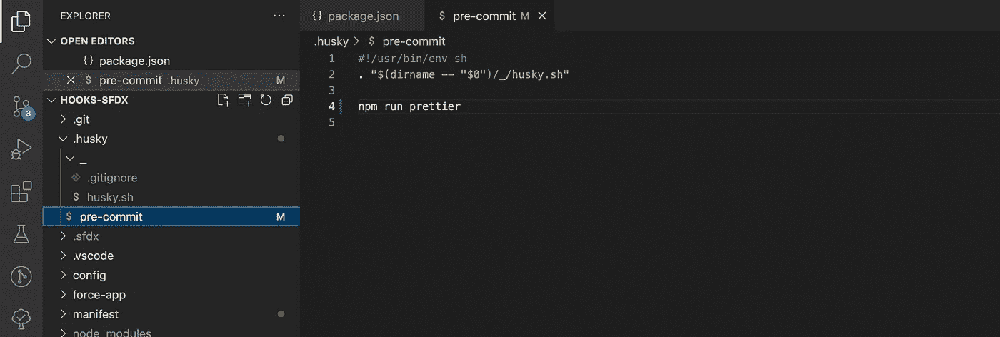
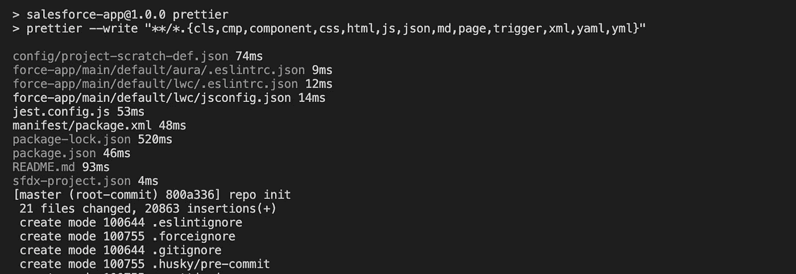

# 停止手动格式化代码，改用预提交挂钩

> 原文：<https://betterprogramming.pub/stop-manually-formatting-your-code-dcca34de7b1e>

## 在 SFDX 项目中添加预提交挂钩


照片由[西格蒙德](https://unsplash.com/@sigmund?utm_source=medium&utm_medium=referral)在 [Unsplash](https://unsplash.com?utm_source=medium&utm_medium=referral) 拍摄

你曾经手工格式化过你的代码吗？你花时间追赶你的团队来维护一个同质的代码吗？停在那里！你应该把时间花在更有成效的事情上，而不是在代码中手工添加空格。

如果您曾经在同一个代码库中与多个开发人员一起工作过，您很可能会遇到不同的编码和格式风格。我知道，我有过，尽管学习不同的方法可以丰富自己，但随着团队的成长，处理起来会很有挑战性。

我有机会和一群热爱自动化的人一起工作。正是通过他们中的一个，我了解了 git 的钩子，以及在管理每个开发人员都有自己的编码风格的项目时，如何让我的生活变得更简单。虽然拥有多样性和不同的做事方式是一件好事，但在与大型团队打交道时，我们也喜欢同质化。它让我们在审查代码时更容易，并确保我们都遵守相同的规则。因此，在本教程中，我将带来一点，我将展示我们如何在提交新功能或修复时自动调整代码格式，以及如何为您的团队实现无缝衔接。

> 生命太短暂，无法手动移除所有这些空间。

正如我之前所说的，我们可以无缝地自动格式化我们的代码。为了做到这一点，我们可以使用[挂钩](https://git-scm.com/docs/githooks)。不要在这里引用我的话，但是我会把它们描述为当某个事件发生时被触发和执行的小脚本。这听起来很普通，但是请相信我，一旦你看到一个用例，它就会变得有意义。

在我们的例子中，我将使用一个 git 钩子——或者 git 动作——当我们向我们的存储库提交一些代码时触发。

首先，我们应该确保我们已经将项目初始化为 git 存储库，如果您还没有这样做，您可以运行下面的命令。

```
#initialize your project as a git repository 
git init
```

一旦执行完成，您应该会看到一个名为。加入你的项目。现在，我们将使用 [husky](https://typicode.github.io/husky/#/) ，一个允许我们轻松处理 git 挂钩和运行脚本的工具。它通过在我们的`package.json`文件中包含一个对象来配置 Husky 运行我们指定的脚本。你可以在这里找到最新的文档。我们将使用以下命令，按照推荐的方式进行安装和设置。

```
# installing husky and npm
npx husky-init && npm install
```

它将设置 husky，修改`package.json`并创建一个您可以编辑的样本`[pre-commit](https://git-scm.com/docs/githooks#_pre_commit)`钩子。默认情况下，它会在您提交时运行`npm test`。

您将在 package.json 中看到 husky 的依赖项，并在 husky 的文件夹中看到新创建的预提交钩子。


默认情况下为 sfdx 项目创建的项目包。

将您要在预提交中运行的命令添加到文件中。我将运行一个预定义的更漂亮的脚本，你可以在创建一个新的 *sfdx* 项目时找到，但是你也可以在 package.json 中定义你自己的脚本。



添加提交时要运行的脚本。

现在，每次你提交一些新的代码，你会看到预提交钩子被执行。它将显示由更漂亮的脚本更改的文件以及提交的文件。



使用预提交钩子提交文件时终端中的输出。

你可以走了！在提交新代码时，可以随意添加您可能想要包含的其他脚本或操作，如格式化、测试或您能想到的任何东西！

在这里，您可以找到一个项目的[示例，我在其中遵循了与文章中相同的步骤。](https://github.com/nereagit/hooks-sfdx)