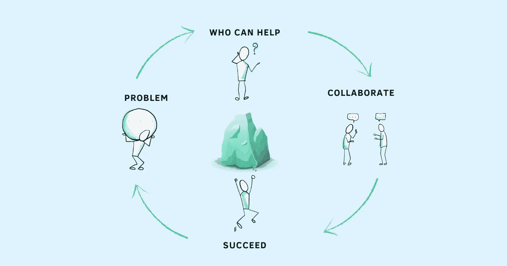

# 不要告诉你的团队“不要给我带来问题”。相反，这样做

> 原文：<https://betterprogramming.pub/stop-telling-your-team-dont-bring-me-problems-instead-do-this-2fe239eea81e>

## 你是鼓励合作的心态还是重视独自完成？

鸣谢:作者

“不要给我带来问题，给我带来解决方案”是许多经理使用的一个短语，甚至是那些善意的经理，他们认为这鼓励他们的团队成员成为创造性的思考者，而它所做的只是促进孤立的思考。

你想传递的信息是一种鼓励和授权，但相反，它阻止你的团队提出问题——他们发现很难解决的问题或需要你支持和指导的问题。

你想挑战他们，更努力地推动他们自己找到解决方案，并向他们表明你信任他们，但当你告诉他们不要再带来问题时，他们听到的不是这些。这表明你只对他们能解决的问题感兴趣。当他们不知道如何自己解决问题时，你认为他们会怎么做？

将授权误认为只有解决方案的思维模式实际上很常见。赋权带来了一种探究感，以及一种鼓励多种观点的协作心态，而“只解决问题”的心态则不鼓励分享意见，而是重视单独行动。

作为经理，当你的团队成员给你带来问题或试图寻求你的建议时，观察你的反应是很重要的。例如，当他们面临挑战或不知道如何实现目标时，生气或恼怒不会解决问题。这只会让事情变得更糟。你的团队将被鼓励只分享好消息，而隐藏任何可能让你生气的事情。

告诉你的团队不要再给你带来问题，会创造一种环境，让员工觉得谈论真正的问题不安全。

*   这让你[对影响你团队的真正问题一无所知](https://www.techtello.com/ignorant-leader/)，或者你听到这些问题时已经太晚了。
*   你的团队浪费了太多的时间试图自己解决问题，经常影响交付时间。
*   由于害怕遭到报复，他们被说服掩盖问题。
*   小问题长时间得不到解决可能会演变成危机。
*   当你的团队面临挑战或挫折时，他们的士气会下降

# 1.更改您的信息

不要说“不要给我带来问题，给我带来解决方案”，而是告诉你的团队“给我带来问题，让我们分享解决方案，并在接下来的步骤中进行合作。”你不会告诉你的团队在一有问题的迹象就跑来找你，而没有运用他们的尽职调查或思考解决方案。你没有告诉他们你需要参与每一个决定。你的信息是赋权，而不是倡导封闭员工的唯解决方案思维。

工作上的很多问题，一个人解决不了。他们经常需要他人的意见。优秀的领导者会提供支持并合作解决问题。他们提倡“[委派和授权](https://techtello.com/how-to-delegate-work-effectively/)，而不是“委派和放弃”他们支持他们的团队，指导他们，帮助他们摆脱困境。这样做，他们并不是自己做每一个决定。相反，他们帮助他们的团队建立自己做这件事所需的批判性思维技能。

告诉你的团队“给你带来问题”，创造一个心理上安全的环境，在这个环境中，员工感到被鼓励说出他们最关心的问题。它不是试图正确，而是促进寻找正确解决方案的心态。当他们前进受阻时，他们会毫不犹豫地寻求帮助或建议。他们学会欣赏寻求意见和合作寻找答案的价值。

*   错误不再隐藏，而是公开的。
*   挫折不会让你的团队气馁，而是学习的信号。
*   没有解决方案并不是焦虑、紧张或[感到无能的理由。它们是培养新技能的机会。](https://www.techtello.com/what-type-of-imposter-are-you/)

“齐心协力，成为团队的一员”这一信息促进了一种[成长心态](https://www.techtello.com/fixed-mindset-vs-growth-mindset/)，在这种心态下，你的团队成员不会感到受到他们当前技能和能力的限制。他们被鼓励投资于学习而不是证明。努力对自己自怜，而不是努力建立自我价值。在你的团队中建立这种心态的好处不仅仅是解决问题。

斯坦福大学心理学家卡罗尔·德韦克的研究发现,“成长型”公司的员工:

*   47%的人认为他们的同事值得信任，
*   34%的人对公司有强烈的归属感和责任感，
*   65%的人认为公司支持冒险，并且
*   49%的人认为公司鼓励创新。

> 思维固定的公司的员工不仅表示，他们的公司不太可能支持他们冒险和创新，他们也更有可能同意他们的组织充斥着残酷或不道德的行为。当组织重视天生的才能时，每个人都想成为超级明星，每个人都想比其他人更耀眼，人们可能更容易作弊或偷工减料。团队合作可能会急转直下——卡罗尔·德韦克

她建议“我们最好的办法不是简单地雇佣我们能找到的最有才华的经理，然后让他们自由发展，而是寻找那些也体现了成长思维的经理:对教学和学习的热情，给予和接受反馈的开放态度，以及面对和克服障碍的能力。这还意味着，除了在有效沟通和指导的细节方面对他们进行培训之外，我们还需要培训领导者、经理和员工，让他们相信增长。”

# 帮助你的团队从受害者转变为主人翁

当你的团队带着受害者的心态运作时，他们会把问题的责任推到他们无法控制的事情上——其他人、情况、条件或环境。扮演受害者的角色会导致抱怨、责备游戏和回避问题。

*我无法完成这个项目，因为另一个团队被耽搁了，没有按时交付他们的代码。*

*没有成功是因为我们的资源更少了。*

*我没有按时拿到需求。*

当员工不断抱怨并拒绝为他们的结果负责时，这是令人沮丧的。但是告诉他们停止带来问题并不是解决办法。你想让他们感到有责任感并拥有所有权。你希望他们不要再以“被屏蔽”为借口。

斯蒂芬·R·科维称受害者心态是一种由外向内的状态。指责和抱怨来自缺乏控制的感觉，这使他们对自己的处境感到无助和绝望。这阻碍了他们找到创新的前进方式。他建议从*由外向内*转变为*由内向外*的状态。由内而外的状态来自于对他们决策的控制感。为此:

*   通过设定明确的期望并与这些期望保持一致，培养对[问责措施的认识](https://www.techtello.com/building-accountability-at-work/)。
*   创造对表现责任感的行为和行动的认可。
*   坦诚地表达你的关心。
*   通过充当他们的支持结构与他们互动。

要求你的团队把他们的语言从抱怨或责备转变成把它说成是一个问题。当你设定期望、提出问题、合作解决他们的问题时，会激活他们大脑的思考部分。他们觉得自己能控制自己的结果。他们愿意主动做出积极的改变。

# 确定缺失的元素:背景、清晰度或能力

在大多数情况下，如果员工无法独立解决问题，他们要么缺乏背景知识——没有足够的背景信息来决定接下来的步骤，缺乏清晰度——不清楚自己的目标，要么缺乏能力——问题超出了他们解决问题的范围和能力。

不要说“不要给我带来问题”，试着找出是哪一个——环境、清晰性或能力——让他们陷入困境。了解两者的区别对于建立一支真正有能力的员工队伍至关重要。你不能把问题扔给别人，指望他们总是自己解决问题。作为经理，你的职责是确定你的团队需要你支持和介入的领域。给他们合适的机会，挑战他们，除了优秀别无他求。但是当他们也需要你的支持时，不要视而不见。

当他们遇到问题时，问这些问题:

*   他们只是需要你的认可吗？
*   他们需要指导吗？
*   他们需要牵手吗？

处于职业生涯早期的员工可能缺乏自己做出决定的信心。他们可能知道解决方案，只需要你的认可就可以放心地继续前进。其他人在处理复杂问题或他们的决策对组织有重大影响的问题时，可能需要您的意见。尽管过去已经解决了类似的问题，一些员工也可能会陷入困境。在这种情况下，指派一位能与他们密切合作的导师可能是正确的做法。

你不能将一个解决方案适用于所有员工。如果你想让你的团队自己解决问题，你必须愿意做艰苦的工作。“不要给我带来问题，给我带来解决方案”会让你逃避责任，也就是你希望你的团队承担的责任。改变你的信息，将你团队的想法从责备转变为拥有，并在他们需要的时候给予他们支持。这是建立一个强大团队的唯一方法，一个不会抱怨或用小问题打扰你的团队。一个通过将你的注意力引向真正的问题来明智地利用你的时间的团队。

# 摘要

1.  告诉你的团队“不要给我带来问题，给我带来解决方案”创造了一种文化，在这种文化中，员工不会感到分享问题或合作解决方案是安全的。
2.  没有解决方案或需要你投入的员工害怕面对批评和负面评价。他们要么试图掩盖真相，要么让问题恶化太久，让小问题演变成大危机。
3.  当你的团队没有得到前进所需的支持时，他们的士气会受到打击。他们觉得工作参与度降低，这会影响团队的生产力和绩效。
4.  与其告诉你的团队不要再给你带来问题，不如宣传合作解决问题的信息。当他们发现自己陷入前进的困境时，帮助他们认识到提出正确的问题、寻找解决方案和寻求帮助的价值。
5.  通过设定正确的期望、重新规划问题和承担责任，将你的团队从责备和抱怨转变为拥有的心态，这是另一个增强团队能力的伟大策略。
6.  最后，通过建立背景、提供清晰性和帮助他们建立正确的技能来给予他们支持，可以使他们自己找到解决方案。

在 Twitter 上关注我，了解更多故事。

*这个故事最初发表于*[*【https://www.techtello.com】*](https://www.techtello.com/dont-bring-me-problems-bring-me-solutions/)*。*