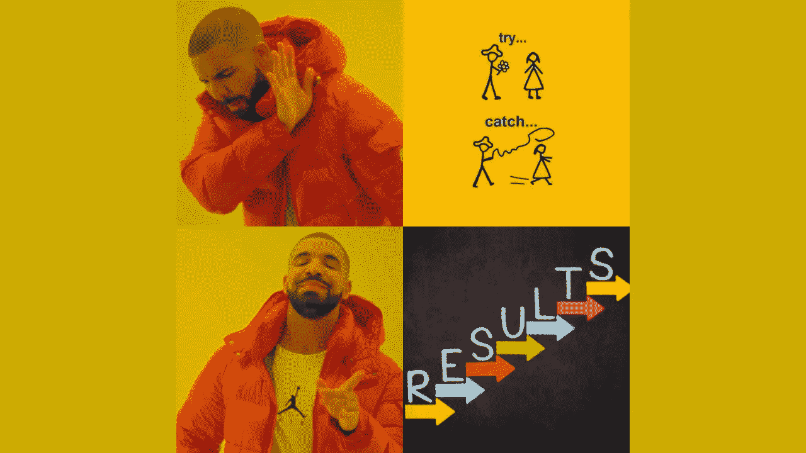

# 不要到处抛出错误。您还可以考虑结果对象

> 原文：<https://betterprogramming.pub/stop-throwing-errors-everywhere-you-can-also-consider-result-objects-4fb5936a9e2d>

## 抛出错误的替代方法是返回这个



*事情可能就这么简单。*抛出一个错误通知任何人出错。但是错误是例外，你需要像生鸡蛋一样处理它们。

生鸡蛋的替代品是结果对象。您可以更精确地控制它们的处理。而抛出异常会在代码中形成一条新的路径，这条路径只能用`try-catch`语句捕获。

# 每个程序的 3 个路径实质路径

你必须考虑任何程序都可能采取的 3 条一般路径:

1.  快乐之路
2.  替代路径
3.  异常路径

老实说，第三个问题被遗忘的次数远远超过了它应该被遗忘的次数。永远永远。当我们最终使代码工作并完成特性时，你和我总是很高兴。谁在乎第三条路？！

除非您是在 TDD(测试驱动开发)之后进行开发，否则情节会发生转折。**让它“消失”！🚬**

# 为什么还要让常规错误消失呢？

例外的代价可能不是很熟悉，但它们是沉重的。

后台正在进行大量的计算。抛出异常时，每次都会生成当前程序执行的调用栈。这无疑是一项昂贵的行动。现在，如果调用栈对你或程序流程不重要，*为什么还要抛出一个严重的计算错误呢？*

此外，异常真的是处理*错误的唯一方式吗？*需要一点实践来确定什么时候*异常*是合适的，什么时候*结果对象*适合“错误处理”

仅仅因为理论上有一个程序性错误，并不一定意味着它是一个戏剧性的错误。通常，您只想指出用户输入了错误的内容。尤其是这种输入可能无法处理，导致代码崩溃。

现在你有了:Result *Objects* 应该被任何一个像投手投球一样抛出错误的开发人员所考虑。

# 如何让例外路径消失

如果没有被捕获，您将返回一个`Result<T, E>`对象，而不是抛出导致程序崩溃的错误。类似铁锈。

在你阅读解释之前，试着理解下面的代码。

方法`AddMusicAlbum`的结果被一个`Result`类封装。结果是*快乐路径*中的实际返回参数或*异常*路径*中的错误描述*。

无论发生什么(成功或错误)，您将总是得到相同的对象，但是写入了不同的属性。

# **如何设置你的结果< T，E >对象**

有几种方法来建模一个结果对象，这是一个基本的结构。

所有的变体都有一个共同点，那就是它们都有一些属性可以用来查询操作的`Boolean`状态(`hasFailed`、`wasSuccesful`)，还有一些属性可以用来获取具体的结果(`Value`)或发生的错误(`Errors`)。

我提到**这个词基本结构**是因为`errors`只是简单的`strings`。这完全取决于您的上下文，但是您也可以自由使用特殊的错误类。一个例子是像这样按位组合错误掩码:`00000010`可能意味着在将相册写入存储库时发生了错误。

*   **如何通过依赖快速实现** — [有一些 NuGet 包你可以直接使用。由于有了适当的文档，您很快就可以实现它们了。](https://www.google.com/search?q=result+error+librarires+nuget&rlz=1C5CHFA_enDE911DE911&oq=result+error+librarires+nuget&aqs=chrome..69i57j33i10i160.5008j0j7&sourceid=chrome&ie=UTF-8)
*   **自己实现(至少手写复制)** — [万一你想要的依赖更少，可以自己实现结果对象，不用费多大力气。核心功能用大约 100 行代码和测试快速编写而成。](https://jamiewright.dev/2020/06/23/result-pattern/)

# 比较引发错误的两种方式的异常

既然我让你相信了结果对象。让我们回顾一下，看看你是否做对了每一件事。

作为软件开发中的常规业务，无论是使用异常还是使用结果对象都不是最终的解决方案。这两种概念各有利弊。在某些情况下，传统的错误抛出是最好的。在其他情况下，使用结果对象。

## 例外优势

*   一旦抛出，它们就会在调用堆栈中向上移动几个调用级别
*   中间的方法不需要任何处理错误的代码
*   异常基本上更适合意外错误
*   处理意外的异常，一个完美的地方是在中间件内部
*   通过实现所需的尽可能多的细节来找到问题的根源
*   出现异常的最好地方是使用公共库(自己实现处理库对象的结果对象将是一场噩梦)

## 结果对象优势

*   验证来自外部系统的用户输入或数据变得更加容易访问(例如，具有用户反馈的前端)
*   预期会出现错误，但不会导致崩溃
*   如果域模型禁止特定的操作——让用户知道
*   用 result 对象调出面向域的代码，以消除与 try-catch 语句相关的样板代码。

# 不确定结果是对象还是抛出错误？

> “最小惊讶原则(T1)(**POLA**)，又名**最小惊讶原则**(或者是**法则**或**法则**)，适用于用户界面和软件设计。它建议系统的组件应该以大多数用户期望的方式运行。这种行为不应该让用户感到惊讶。以下是该原则的正式陈述:“如果一个必要的特征具有很高的惊奇因子，则可能需要重新设计该特征。”——[来源](https://en.wikipedia.org/wiki/Principle_of_least_astonishment)

## 老实说…

…必须指出，调用者必须显式检查返回值。没有其他人真正响应。发生的异常需要特殊处理。否则，应用程序将被运行时终止。这是你最不想发生的情况。

另一方面，如果返回的 Result 对象可能没有被计算，错误可能会被忽略。发生这种情况时，应用程序可能会出现不一致的状态。这甚至比运行时崩溃的最坏情况还要糟糕。

***你自己决定，但是你现在已经拥有了决定和发光的所有工具***

# 为了完整起见

下面的代码片段处理将相册添加到数据库中的操作，您之前已经发现了结果对象。但是现在使用了异常。

```
**Want to Connect?**[***Get 8 long-lasting golden rules for successful developers that are worth several pay raises.***](https://arnoldcodeacademy.ck.page/8rulesforsuccessfuldevelopers)
```