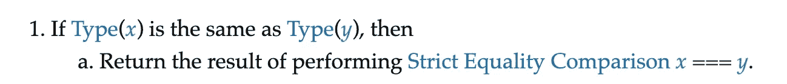
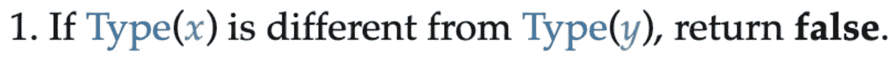

# 停止到处使用===

> 原文：<https://betterprogramming.pub/stop-using-everywhere-fd025342132d>

## 一个冷门的观点，我们来看看


照片由 [JC Gellidon](https://unsplash.com/@jcgellidon?utm_source=unsplash&utm_medium=referral&utm_content=creditCopyText) 在 [Unsplash](https://unsplash.com/s/photos/stop?utm_source=unsplash&utm_medium=referral&utm_content=creditCopyText) 上拍摄

很多开发者总是用`===`而不是`==`但是为什么呢？

我在网上看到的大多数教程都认为预测 JavaScript 强制是如何工作的太复杂了，因此建议总是使用`===`。

互联网上有几个教程支持不正确的信息和神话。除此之外，许多林挺规则和受欢迎的网站都固执地认为总是优先选择`===`。

这些都导致许多程序员排除了语言的一部分，并将其视为一种缺陷，而不是扩展他们的理解。

这里有两个最好使用`==`来说明这一点的用例。

# 1.测试空值

```
if (x == null)**vs**if (x === undefined || x === null)
```

# 2.读取来自用户的输入

在这篇文章中，我们将通过发现差异、理解强制、查看一些流行的用例，以及最后有一个指导方针来帮助我们做出决定，来深入理解这个主题。

# 介绍

在 Javascript 中，相等是由两个运算符完成的。

1.  `===` —严格的相等比较，又称三重相等。
2.  `==` —抽象的相等比较，又称双等。

我一直在使用`===`，因为我被告知它比`==`更好，更高级，而且我根本不用考虑它，作为一个懒人，我发现这非常方便。

直到我在[](https://medium.com/u/1b199ed2dfd#sec-abstract-equality-comparison)

## [ECMAScript 2020 语言规范](https://medium.com/u/1b199ed2dfd#sec-abstract-equality-comparison)

### [编辑描述](https://medium.com/u/1b199ed2dfd#sec-abstract-equality-comparison)

[tc39.es](https://medium.com/u/1b199ed2dfd#sec-abstract-equality-comparison)

# 打破神话

## 1.==仅检查值(宽松)

如果我们看一下规范，从定义中可以很清楚地看出，算法做的第一件事实际上是检查类型。



## 2.===检查值和类型(严格)

在这里，我们同样可以从规范中看到，它检查类型，如果它们不同，它根本不检查值。



双重平等和三重平等的真正区别在于我们是否允许强迫。

# JavaScript 中的强制

强制或类型转换是任何编程语言的基础之一。这对于动态类型化的语言(如 JavaScript)更为重要，因为如果类型改变，编译器不会对你大喊大叫。

理解强制意味着我们能够像 JavaScript 那样解释我们的代码，因此，给我们更多的可扩展性和最小化错误。

## 显性胁迫

当程序员调用这些方法中的一个，从而强制改变变量的类型时，强制可以显式地发生。

`Boolean(), Number(), BigInt(), String(), Object()`

示例:

```
let x = 'foo';typeof x // stringx = Boolean('foo')typeof x // boolean
```

## 隐性强制

在 JavaScript 中，变量是弱类型的，所以这意味着它们可以自动转换(隐式强制)。当我们使用算术运算`+ / — *`、上下文或者使用`==`时，通常就是这种情况。

隐式强制是一把双刃剑，明智地使用它可以增加可读性，减少冗长。误用或误解，你有一个失望的公式，人们咆哮和指责 JavaScript。

# 简单地说，等式算法

## 抽象相等比较==

1.  如果 X 和 Y 的类型相同，执行`===`。
2.  如果 X 是`null`，Y 是`undefined`或者反过来——`true`。
3.  如果一个是数字，强制另一个是数字。
4.  如果一个是对象，则强制为基元。
5.  返回`false`。

## 严格相等比较===

1.  如果类型不匹配— `false`。
2.  如果类型匹配-比较值，则为 NaN 返回 false。
3.  -0 —正确。

# 流行的使用案例

## 1.相同类型(大多数情况下)

如果类型相同，那么`===`就是*与*和`==`完全相同。所以，你应该用更有语义的那个。

```
1 == 1 // true                ......        1 === 1 // true'foo' == 'foo' // true        ......       'foo' === 'foo' //true
```

"我更喜欢用`===`，以防类型不同."

这不是逻辑论证，就像按了两次保存，刷新了五次。为了以防万一，我们不会在代码中两次调用一个方法，不是吗？

## 2.不同类型(基本类型)

首先，我想提醒大家的是，**不同的**类型并不意味着*未知的* 类型。

不知道类型表明你的代码中存在比仅仅使用`===` vs. `==`更大的问题。

了解类型表明对代码有更深的理解，这将导致更少的错误和更可靠的软件。

在我们有几种可能类型的情况下，通过理解强制，我们现在可以选择强制或不强制，因此使用`===`或`==`。

假设我们有一个数字或者一个字符串的可能性。

请记住，算法更喜欢数字，所以它会尝试使用`[toNumber()](https://tc39.es/ecma262/#sec-tonumber)`。

```
let foo = 2;
let bar = 32; // number or stringfoo == bar // if bar is string it will be coreced to numberfoo === Number(bar) // doing basically the samefoo === bar // would always fail if bar comes as string
```

## 3.空且未定义

使用`==`时`null`和`undefined`都相等。

```
let foo = null
let bar = undefined; foo == bar // truefoo === bar // false
```

## 4.非本原[对象，数组]

不应该使用`==`或`===`来比较对象和数组等非基本元素。

# 决策指南

1.  在所有可以使用的情况下优先选择`==`。
2.  `==`用已知的类型，当你想强制转换类型时可选。
3.  知道类型总比不知道好。
4.  不知道类型就不要用`==`。
5.  如果知道类型，`==`就是`===`。
6.  当类型不匹配时`===`是没有意义的。
7.  类型匹配时不需要`===`。

# **避免的理由==**

有些情况下，如果没有真正理解 JavaScript 中的 falsy 值，就不应该使用`==`。

```
== with 0 or "" or "   "== with non primtives== true  or  == false
```

# 摘要

根据我的经验，到目前为止，我总是知道我正在处理的变量的类型，如果我不知道，我使用`typeof`只允许我期望的类型。

对于滚动到帖子末尾的人，这里有四点建议。

1.  如果你不能或者不愿意知道类型，使用`===`是唯一合理的选择。
2.  不知道类型可能意味着你不理解代码，尝试重构你的代码。
3.  了解类型可以产生更好的代码。
4.  如果类型已知，最好使用`==`，否则返回`===`。

感谢阅读，希望这篇文章对你加深对 JavaScript 的理解有所帮助。我建议你去看看*你不知道的 JS* 系列，因为这是一个充满深度知识的矿井。

[](https://github.com/getify/You-Dont-Know-JS) [## getify/你不知道

### JavaScript 系列丛书。推特上的@YDKJS。为 getify/You-don-Know-JS 开发做出贡献，创建一个…

github.com](https://github.com/getify/You-Dont-Know-JS)