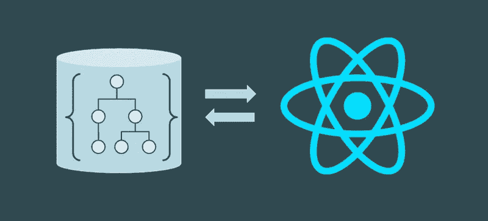
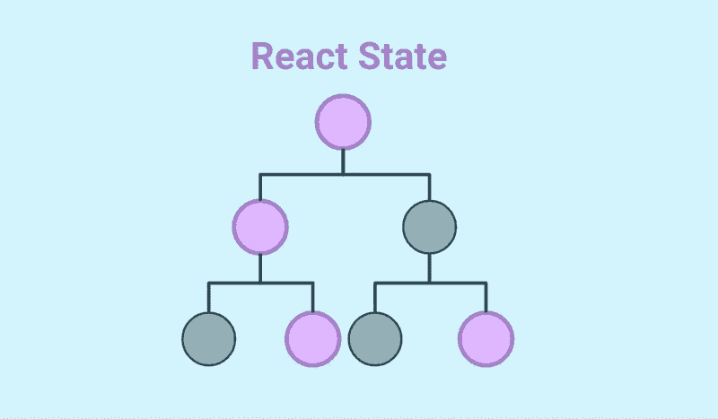
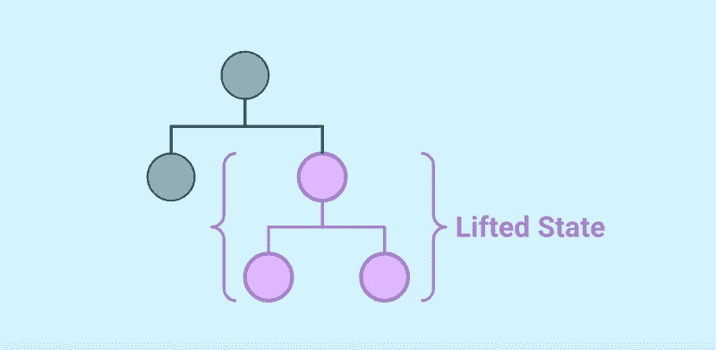
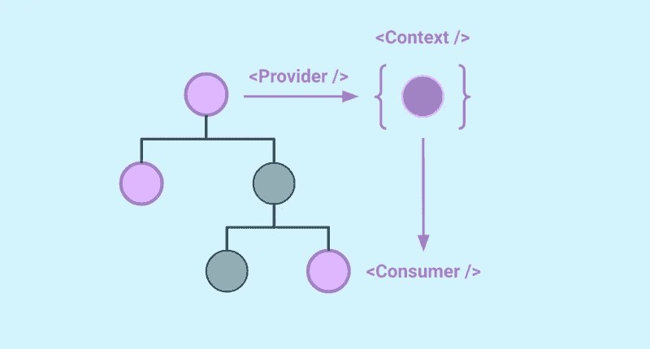

# React 中简化状态管理的 6 种方法(不使用全局状态)

> 原文：<https://betterprogramming.pub/stop-using-global-state-6-ways-to-manage-state-in-react-c53ac9503e96>

## 如何简化 React 中的状态管理？

简化 React 中的状态管理。

不要用全局状态来描述*的一切*。在工作中始终使用正确的工具。

React 是一个令人惊叹的框架，但远非完美，它的一个不足之处是状态管理。

当 React 在 2015 年兴起时，高性能虚拟 DOM、react-ful 状态、单向数据绑定以及在遗留项目中迭代采用的承诺令人难以置信。

然而，一旦我开始为大型应用程序使用 React，我很快就遇到了挑战，比如管理提取的数据、跨应用程序共享状态、在会话之间持久化和水合数据，以及用户会话管理。

如果你想在 2015 年将 React 用于任何大规模应用，你*有*可以使用 Redux。

如果使用不当，很容易引入一百万个样板文件，使您的代码库变成意大利面条，并减慢开发速度。然而，Redux 是一个神奇的、经过战斗考验的状态管理工具。但也不过如此:*一个工具*。如今，我们有了更多可用的工具——它们都非常适合不同的使用情形。

我想向你展示使用你已经掌握的技巧来简化你的反应状态的方法。所以你不需要马上使用这些工具。

这是由两部分组成的系列文章的第一部分，我将向您展示在 React 应用程序中管理状态的更简单的方法。对于使用非生命周期工具，如原生浏览器存储检查:[https://oskari.io/blog/stop-react-global-state-part-2/](https://oskari.io/blog/stop-react-global-state-part-2/)。

# 不是它！

仅仅因为你写了 React 并不意味着每个变量都应该处于 React 状态！不幸的是，我看到许多新人犯这个错误。

有状态数据带来了性能成本、可维护性以及处理渲染生命周期的麻烦。组件生命周期是 React 的基础，状态是它的核心。但是如果您不需要对数据做出“反应”,那么就让它保持在状态之外！

# 状态类型

在整个 React 应用程序中使用状态。

我们将重点介绍 React 应用程序中存储和访问数据的六种机制:

1.  本地状态:只有一个组件需要该状态
2.  钩子:可重用的状态模式
3.  解除状态:一些相关组件需要该状态
4.  上下文:共享提升状态状态
5.  全局状态:第三方库
6.  提取的数据

最后还有奖金！

# 1.地方州

本地状态是最简单的，也是最易维护的(在某种程度上)状态管理。如果你的组件只需要在内部管理状态，那么就把它放在那里！让你的状态尽可能接近它的用法。

在 React 的新版本中，本地状态是最简单的，因为使用了`useState`和`useEffect`钩子。

*注意:使用像* `*useReducer*` *这样的钩子可以有更高级的用例，但是要小心，因为这样的用例可能很快看起来像 Redux 的重写。*

小贴士:

*   尽可能保持你的状态平坦。嵌套对象难以管理，并且会引入重新渲染错误。
*   并非所有东西都需要是状态对象。
*   使用简洁和描述性的名称。

然而，我们不能只使用本地状态来构建 React 应用程序。这将导致非常糟糕的用户体验。我们的组件需要通信和共享数据。这就是状态管理在 React 架构中如此重要的原因。

# 2.胡克呢？！

自定义的 React 钩子本身并不是一种状态管理，而是访问共享状态(如上下文、URL 和浏览器存储)的优秀工具。您还可以使用它们将本地或提升的状态抽象成可重用的状态模式，在整个组件中使用，而无需在组件之间共享数据。

小贴士:

*   让你的钩子集中在特定的用例上。不要试图把所有东西都塞进一个钩子里。通过用例将它分成多个挂钩。
*   如果它是可重用的:编写钩子的文档，并把它放在其他开发人员可以访问的目录中。我喜欢为`@hooks`使用别名，并将所有全局可重用的钩子放在一个地方。

可重用的表单状态挂钩示例:

# 3.解除状态

在父/子组件之间使用提升状态。

React 的强大之处在于能够从许多组件构建可组合的应用程序。为了协调这些组件并创建流畅的用户体验，他们通常需要相互交流或共享数据。为此，我们可以将 React 树中的状态“上移”到共享父组件中的本地状态。

您仍然应该尽可能地将状态保持在树中需要它的组件附近。实现这种模式最简单的方法是将本地状态存储在父组件中，并将`props`传递给子组件。

小贴士:

*   尽可能保持道具平整，以避免不必要的重新渲染。
*   保持提升状态尽可能局限于需要它的组件。

然而，正如你们中的许多人所知道的，当你的父子树变得太大，并且你开始通过组件传递道具以将它传递到较低的节点时，这种模式很快就失效了。这被称为“prop drilling ”,当它发生时，你需要考虑分解你的用例并引入其他状态模式，如 React 上下文。

# 4.反应上下文

在应用程序中使用 React 上下文进行状态管理。

当您的状态需要由整个 React 树中的组件访问时，最好将您的状态管理从树本身中分离出来，以避免钻取。一个很好的方法是使用 React 的上下文 API。您可以构建自己的“迷你”全局状态来满足您的特定需求。

小贴士:

*   不要试图把你所有的状态都塞进一个上下文中。如果您这样做，您将重新创建一个全局状态管理工具，有许多第三方工具可以为您解决这个问题。
*   一定要让你的上下文特定于一个用例。关注对状态数据的需求，并且只解决这个问题。尽可能保持简单的上下文。
*   如果你开始注意到大量嵌套的提供者互相包装，考虑使用提供者组件模式:[https://dev.to/hyposlasher/no-more-react-context-hell-4pm3](https://dev.to/hyposlasher/no-more-react-context-hell-4pm3)
*   创建一个钩子，将`useContext(MyContext)`的用法简化为`useMyContext`。

# 5.全球州立图书馆

涌现出的大量新的状态管理库的好处不像 Redux 它对状态管理采取了自顶向下的观点，迫使您从状态树的顶端开始，一步步向下。许多这些新的库指导你从底层开始。首先从消费组件及其用例开始。这更有助于消费组件的模块化和可组合性。

这也正是我们通过使状态尽可能地靠近消费组件所要做的——将状态“推”到树的更下方。

当您发现自己处于 React 上下文和其他方法不再足够的情况下，并开始引入调试问题时。或者你发现自己在用`useReducer`重写 Redux，看看这些新的流行和崛起的库:

*   [Zustand](https://github.com/pmndrs/zustand) :遵循 Flux 原则的小型、快速、可扩展的全局状态工具。
*   [反冲](https://recoiljs.org/):原子图结构中的全局反应状态，与你的反应树平行。
*   [Jotai](https://jotai.org/) :受反冲启发的原子态管理。
*   Xstate :用于在状态机中构建状态和 UI 交互的框架不可知工具。

# 9.提取的数据应该放在哪里？

通过 API 从数据库获取的数据应该遵循与所有其他类型的数据相同的状态规则。但它确实带来了一些我们应该考虑的新模式。

如果提取的数据很大，可能有缓存的机会——但是要小心！缓存看起来像是一种优化，但是如果不小心的话，它会引入许多具有挑战性的错误。您应该在尽可能靠近数据源的地方缓存数据。第一种选择应该始终是在浏览器外部缓存数据，以获得更具可伸缩性的解决方案。

如果您需要在浏览器中执行此操作，请让它靠近您用来获取数据的机制。无论是`axios`、`superagent`、`fetch`，还是你自己对这些的包装。我喜欢使用 React 钩子来控制 API 交互，这样你就可以轻松地跟踪数据、加载和错误状态。如果这听起来很有趣，请查看`[react-query](https://react-query-v2.tanstack.com/)`。

与其他数据一样，如果其他组件需要访问它，只需在“树”中将它向上移动到可重用的钩子、上下文或全局状态。将数据保存在树中最低的共享点，以避免污染整个应用程序。

# 奖金！派生状态

派生状态不是状态管理的一种新形式，而是避免状态管理的另一个技巧。

如果您有一个现有的状态，并需要将其转换为不同的形式或使用子集，您不需要将结果存储在另一个状态对象中。事实的来源已经处于状态，所以任何生命周期都将触发组件的重新呈现。利用这一点，从现有的状态值中“导出”新数据——无论是本地状态、道具还是其他地方。

不要这样做:

请改为这样做:

# 最后的想法

状态管理是一个棘手的问题，但对任何 React 架构的成功都至关重要。始终对您的状态用例持批评态度，并仔细考虑遵循哪种模式。尽可能保持状态接近它的用途，避免不必要地共享其他人不使用的状态而污染代码库。

不要停在那里！所有的软件都在不断变化，所以寻找机会重构你的状态，以最好地满足应用程序的需求，并帮助保持你的代码库的可伸缩性。最糟糕的事情莫过于试图构建一个新特性，却不知道应该使用什么状态或者如何访问它。

我希望这有助于您更加批判性地思考如何基于用例在 React 应用程序中最好地存储数据。

我很乐意收到你的来信。请在评论中告诉我你的想法。你在国务院遇到过什么样的挑战？你最喜欢的状态模式是什么？

*最初发布于*[*https://oskari . io*](https://oskari.io/blog/stop-react-global-state-part-1)*。*