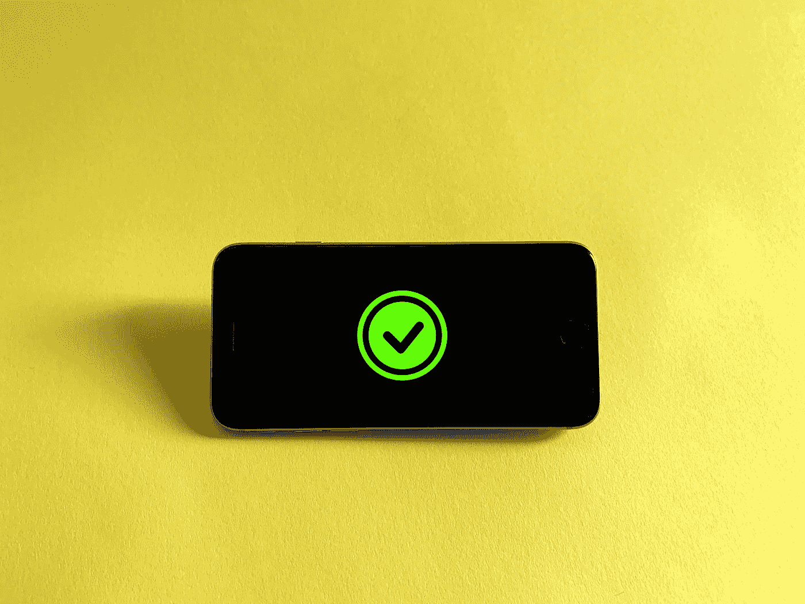

# 停止使用 JSON Web 令牌进行身份验证。请改用有状态会话

> 原文：<https://betterprogramming.pub/stop-using-json-web-tokens-for-authentication-use-stateful-sessions-instead-c0a803931a5d>

## 是的，你可能用错了

我厌倦了每隔几周就看到同样的教程出现。

*   "考虑到可伸缩性，JWTokens 是推荐的 auth 方法."
*   " JWTokens 更容易使用."
*   " JWTokens 是无状态的，所以你不使用服务器上的内存."

让我告诉你一些事情。这些人可能不知道更多。

我确信他们的意图是好的，但是他们共享了一种不安全的认证和授权用户的方式，至少对于 web 应用程序是这样。

但是，请不要难过；我用 JWT(不正确地)当我开始时，因为我不知道任何更好的。

我们开始吧！

> 免责声明:我并不主张您应该完全停止使用 JWT 或类似的机制。然而，我见过很多教程为了简单起见，用很糟糕的方式实现它们。
> 
> 您肯定可以安全地使用 JWT 令牌，但是，您可能不应该从头开始实现它们，因为在不陷入兔子洞的情况下广泛地保护它们会变得复杂。

由[本杰明·戴维斯](https://unsplash.com/@bendavisual?utm_source=medium&utm_medium=referral)在 [Unsplash](https://unsplash.com?utm_source=medium&utm_medium=referral) 拍摄的照片

# JWT 通常的实现方式(在教程中)

解决这个问题后，让我们来看一下使用 JWT 认证用户的流程。

*   **用户输入他们的用户名和密码—** 当用户点击登录按钮时，一个请求被发送到服务器，以向数据库验证用户的凭证。
*   **服务器成功认证用户** —服务器现在使用秘密密码创建并签署 JWT，并在响应中返回它。

教程通常将到期时间设置为大约一周到 30 天。

*   **客户端在响应**中接收 JWT——开发者(在 chrome 这样的客户端中)接收它，应用一些逻辑，然后存储它，通常存储在本地存储中。
*   **客户端使用存储在令牌中的信息来有条件地呈现** —通常，教程使用像用户的电子邮件、用户名这样的字段，以及像`isAdmin` **这样的布尔字段。**
*   **客户端为每个请求添加令牌作为标头** —如果令牌存在于本地存储中，则用户会话处于活动状态。

服务器现在可以通过在每个请求上解密签名的令牌来检查用户的身份。

令牌将一直有效，直到过期。

兰迪·雷伯恩在 Unsplash[上的照片](https://unsplash.com?utm_source=medium&utm_medium=referral)

# 这样利用 JWT 的所有错误。

如果您的开发人员感觉还不兴奋，不要担心，我强调了该方法的一些危险信号，我们将在下面进一步分解它们。

## 响应包含 JWT。

我们遇到的第一个危险信号是在响应中返回令牌。因此，前端代码可以自由地读取和存储令牌。

对令牌的访问使得跨站点脚本攻击能够窃取用户的身份并代表他们发送请求。因为我们没有关于用户的会话信息，所以可能没有办法知道。

## JWT 的永远有效，直到他们到期

由于 JWT 身份验证是无状态的，一旦服务器签署了有效的令牌，就没有办法撤销用户的会话。

因此，使用长过期窗口+不安全存储是黑客对我们的用户造成严重损害的完美组合。

撤销它们的唯一方法是更改签名密码，这实际上将注销您的整个用户群，因为所有令牌都将被视为无效。

## 长期在本地储存是不安全的。

将内容长时间存储在本地存储中是不安全的，因为任何人都可以在浏览器中访问它。

跨站点脚本可以从本地存储中检索令牌，因为它没有加密或保护。

## 信息可能不同步。

这个问题不像其他问题那样严重，但我想提一下。

存储字段，如`isAdmin`，用户的地址等。，可能本质上并不安全，但问题就在这里。

因为令牌是无状态的，所以当信息改变时没有办法更新它们。因此，用户的用户名、电子邮件或权限可能与数据库中的实际值不同步。

## 允许跨来源请求。

有了 JWT，任何有令牌的人都可以发送有效的请求。

恶意站点可以从不安全或假冒的域向您的网站发送请求，这些域可能看起来像您的网站，而浏览器会允许这样做。

您可以通过使用 CORS 来最小化这种风险，但是本教程可能没有提到这一点。

照片由[上](https://unsplash.com?utm_source=medium&utm_medium=referral)的[刻痕](https://unsplash.com/@jannerboy62?utm_source=medium&utm_medium=referral)拍摄

# 何时(以及如何)正确使用 JWT

这些令牌对于认证 web 应用程序并不安全，但这并不意味着它们毫无用处。相反，有几个用例非常适合这些令牌。

## **在下列情况下使用 JWT:**

*   到期窗口很小。(2 小时)
*   该请求不涉及在浏览器中存储令牌
*   该请求不需要加密。

## 一个真实的用例示例

最好的例子是控制对资源的访问，比如文件下载。

假设你的用户一个月前买了一个虚拟产品，想重新下载。

你会有一个任何人都可以用来下载你的虚拟产品的开放链接吗？

JWT 令牌非常方便，因为您可以创建短期访问令牌来验证用户的身份，并临时授予对所购买内容的访问权限。

令牌不会存储在任何地方，而且会很快过期。因此，它允许您轻松处理可验证的事务。

如果你曾经与谷歌或其他提供商集成过第三方登录，这是何时使用 JWT 的一个很好的例子。

照片由[弗兰克](https://unsplash.com/@franckinjapan?utm_source=medium&utm_medium=referral)在 [Unsplash](https://unsplash.com?utm_source=medium&utm_medium=referral) 上拍摄

# 服务器端会话

有状态会话意味着服务器将用户的会话存储在内存或数据库中。

尽管这确实带来了一些折衷，但如果适当实现，它消除了以前方法的大多数问题和安全顾虑。

然而，它也带来了一些其他的挑战。这取决于您项目的需求。

## 您可以跟踪用户的会话活动(更容易)

使用有状态会话，您可以存储有用的信息，如用户的 IP 地址、会话持续时间、上次请求时间戳，并查看每个用户有多少个活动会话。

## 服务器可以根据需要撤销会话。

一旦触发警告，(假设用户有三个来自不同国家的活动会话)，可以根据需要撤销会话，以防止被盗令牌被使用—无需每 30 分钟等待到期。

## 只有 HTTP 的 Cookies 更安全**

> * *没有一种方法可以 100%抵御所有攻击。

您必须将有状态会话令牌(如 UUID 字符串)**存储在仅支持 HTTP 的 cookie**中。

仅 HTTP cookie 意味着 cookie 自动附加到每个客户端的请求上，没有人可以在浏览器中访问令牌，甚至您也不能！

## 默认情况下，仅 HTTP cookie 会阻止跨站点请求

仅 HTTP cookie 应该对跨站点请求有严格的设置。默认情况下，如果请求来自第三方域，Cookies 将不起作用。

稍后我们将对此进行更深入的探讨。

## 会话在加密方面并不昂贵。

您不必验证已签名的 JWT 会话，因为令牌可以映射到用户 id，并存储在 Redis 等基于内存的数据库中，以便进行快速访问和读取操作。

布鲁诺·凯尔泽在 [Unsplash](https://unsplash.com?utm_source=medium&utm_medium=referral) 上的照片

# 权衡

通常，无状态是首选的方法，因为它允许服务大量运行，而没有任何依赖性(状态)

使用有状态会话确实给我们带来了潜在的新挑战。

## CSRF 袭击

跨站点请求伪造攻击是我们在使用 cookies 时需要注意的事情。

当在本地存储中存储令牌时，这种类型的攻击是不可能的。然而，有两种主要的方法可以防止这种情况。

## Cookie 设置

在生产环境中，您应该将**设置为仅 HTTP**，并将**安全**标志设置为**真**(如果请求不是 HTTPS，浏览器不会放置 cookie)

对于 CSRF 攻击，**同站点**标志应设置为**“严格”**

将此标志设置为 strict 可确保只允许来自与您的服务器相同的域的请求。

例如，如果第三方网站在 CSRF 攻击中试图使用您的用户会话执行请求，则不会设置身份验证 cookie，因为攻击者的域与您的域不匹配。

## 反 CSRF 代币

我不会详述这个主题，但是要确保您的 API 只使用 Post 请求来执行更改。

GET 请求应该只检索数据。

这些类型的攻击欺骗用户点击链接，然后使用用户的活动会话来嵌入请求表单，以在不访问实际 auth 令牌的情况下更改用户数据。

使用反 CSRF 令牌可以确保服务器能够验证客户端发送的 POST 请求来自实际的网站。

服务器检查收到的令牌是否与其最初发送给客户端的令牌相匹配。

## **可扩展性**

JWT 教程喜欢谈论他们的 Todo List React 应用程序有 12 个用户，需要可扩展以服务数百万活跃用户。

虽然这是一个合理的问题，也是一个不可思议的未来问题，但是将可伸缩性置于安全性之上是不好的。

只解决应用程序的即时需求，可伸缩性可能不在其中。一台服务器可以服务数百甚至数千用户。

Marc-Olivier Jodoin 在 [Unsplash](https://unsplash.com?utm_source=medium&utm_medium=referral) 上拍摄的照片

# 提供可扩展性

在结束本文之前，我必须提到服务器端会话的可伸缩性可能会成为一个问题。

如果可伸缩性是您的应用程序的一个主动关注点，您不必担心；我们将很快修理它。

> 需要注意的是，使用集群会产生额外的成本，但是根据工作负载的不同，成本不应该太高。一定要使用 AWS calculator for Redis 进行估算，并决定服务器端会话对您的项目来说是否是个好主意。

## 使我们的有状态会话“无状态”

如果应用程序不需要在运行它的同一个实例中存储任何状态，那么它就是无状态的。

如果您的数据库和您的应用程序运行在同一个服务器实例中，它就不会是无状态的。

但是，如果独立于服务器实例运行数据库，那么服务器就是无状态的，因为它的唯一目的是处理业务逻辑。

存储数据是数据库关心的事情。

## 将我们的会话存储在基于内存的数据库中

您的服务器应该要求对您的服务器的每个认证请求的会话数据。因此，我们希望优化读写操作。

使用我们常规的 SQL 或 NoSQL 数据库将非常费力，并可能导致高成本和速度下降。

## 使用 Redis

Redis 是一个内存(键，值)对数据库，允许快速读写访问。然而，我建议你做你的研究，因为有各种选择。

例如，AWS 提供 Redis 集群，确保您的操作通过自动缩放组自动保持可伸缩性。

Solen Feyissa 在 [Unsplash](https://unsplash.com?utm_source=medium&utm_medium=referral) 上拍摄的照片

# 服务器端会话工作流

最后，让我们来看一下使用有状态会话的工作流程，就像不久前我们使用 JWT 一样。

## 用户输入他们的用户名和密码。

当用户单击登录按钮时，会向服务器发送一个请求，使用数据库验证用户的凭证。

## 服务器成功验证了用户。

服务器创建一个令牌(UUID)，将其映射到用户的数据库 ID，并将其存储在 Redis 中。

服务器将 Cookie 附加到发送给浏览器的 HTTP 响应中。

## 客户端检查令牌是否有效。

仅仅在头中有一个 HTTP-Only cookie 并不意味着会话是活动的。

浏览器向处理用户会话数据的服务器端点发送 GET 请求。因为 Cookie 向服务器提供了这个信息，所以这个请求不需要任何参数。

前端现在可以在应用程序中存储会话数据，而无需保留实际的令牌。

## 客户端使用存储在令牌中的信息有条件地呈现

通常，教程使用用户的电子邮件、用户名等字段。这一次，信息通常是最新的，因为它在每次客户端刷新网站时都会更新。

## 只有 HTTP 的 Cookie 会在每次请求时自动发送

令牌将一直有效，直到过期。但是，服务器可以根据需要撤销它。

林赛·亨伍德在 [Unsplash](https://unsplash.com?utm_source=medium&utm_medium=referral) 上的照片

# 下一步是什么

你应该知道，没有一个解决方案是银弹，总会有权衡，没有一种方法是 100%安全的。漏洞总是会有的。但是，我们应该确保为我们的方法提供尽可能好的安全性。

本文讨论了 JWT 及其作为 web 认证解决方案的缺点。然后，我们发现了一种更好的(安全的)方法来为我们的 web 应用程序实现身份验证。

然而，我展示了一个使用有状态会话的简单实现。你可能想知道，过期怎么办？即使一周也可能是一个很长的到期窗口。

## 刷新令牌

我没有谈论刷新令牌，以保持事情简单，这篇文章变得不再长，但这里有一个总的想法。

您有两个令牌:验证身份的身份验证令牌和刷新令牌。

身份验证令牌可能是短期的，例如，1–2 天。当用户主动使用他们的会话时，浏览器将不断地进行检查，以查看 auth 令牌是否即将过期。当检测到这种情况时，它使用刷新令牌(具有更长的过期时间)在前一个授权令牌过期之前请求新的授权令牌。

长期刷新令牌引入了新的问题和复杂性，如令牌轮换和令牌重用检查，但我将把这个主题留给另一篇文章。

# *如果你还想使用无状态会话，就不要多此一举了*

像 AWS Cognito 或 Firebase 这样的库使用无状态令牌，并将它们存储在本地存储中。

如果您仍然想使用无状态会话，请确保您使用了一个经过良好测试且功能齐全的库来为您处理安全性。

这些库使用短期令牌，不断刷新它们，并提供令牌刷新循环以防范安全问题。

让我知道你的经验与 JWT 或认证一般。在你阅读这篇文章之前，你意识到这些问题了吗？

感谢阅读。