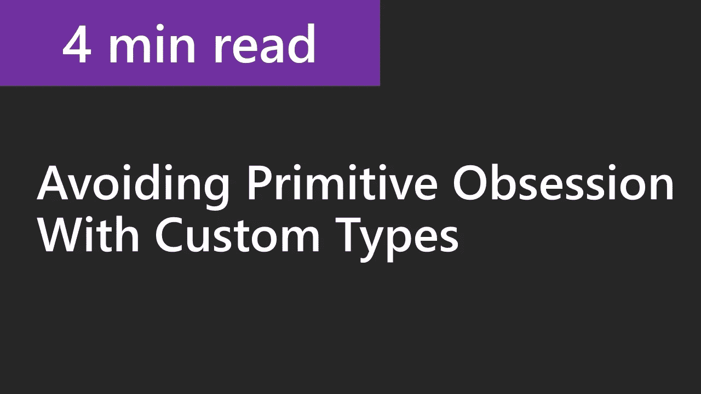
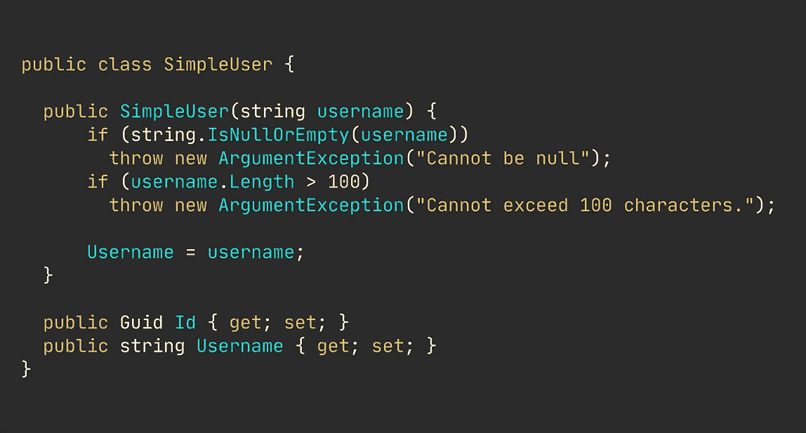
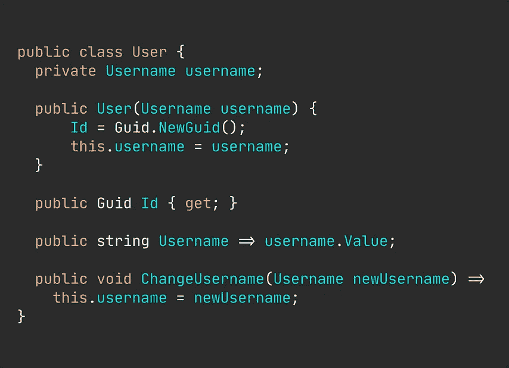
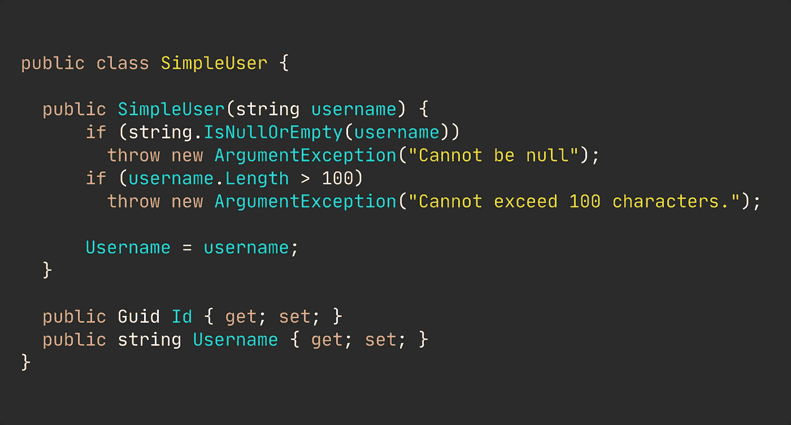
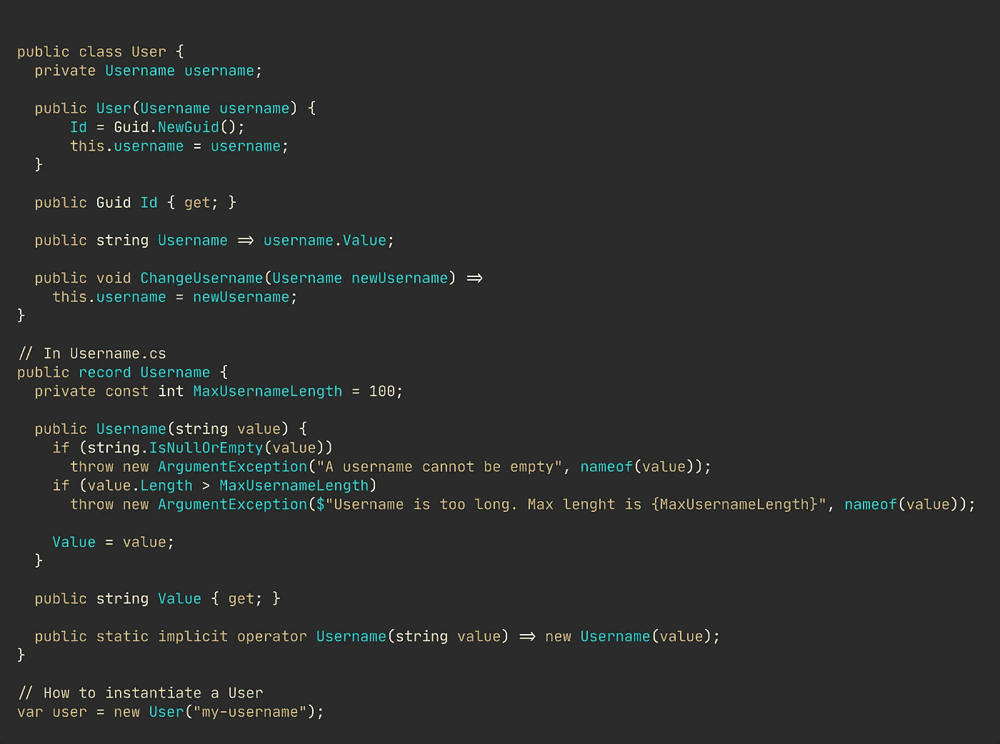

# 停止在域类中使用基本类型

> 原文：<https://betterprogramming.pub/stop-using-primitive-types-in-domain-classes-c45f5973d640>

## 避免字符串、整型、双精度和其他原始类型

图片由[尼克拉斯·米勒德](https://medium.com/u/7c7a43b3d9de?source=post_page-----c45f5973d640--------------------------------)提供

原始类型不传达任何有意义的领域知识——所以*不要仅仅用这些类型来构建你的领域类*。

显然，你不能完全避免字符串(虽然，技术上不是一个基本类型)、整型、双精度型和其他基本类型。它们是任何代码和应用程序的基本构件。但是，你可以在重要的地方做出努力。

> 忽略编写适当的域类和值对象是许多代码库反复出现的主题。

让我们看看如何编写更好的类，恰当地捕获特定领域的知识和业务规则，从而产生更安全、更灵活的代码。

## 在我们开始之前…

我制作了一个关于这个主题的短片。如果你是一个视觉学习者，或者喜欢文字材料和视觉效果的结合，那么请跟随这里。

## 我们将会研究什么

所以，我们会保持简单。我们的演示代码显然是一个虚构的例子，但它确实成功地实现了我的意图:说明如何轻松地将典型的原始类型转化为实际的域对象。

我们想把左边变成右边的代码。

典型类(左)变成了适当的域类(左)

您可以很容易地看到左边的代码片段看起来比右边的要干净得多。这个真的没什么特别的。没有魔法，没有一个“见鬼”的时刻。

因此，这两个类是一种尝试，来模拟我们希望如何在应用程序中定义我们的用途。

“两处房产？！就这些？”我听到你哭了！在你的狂热继续之前，让我提醒你——这只是一个例子，我可以使用任何其他东西。

我在塑造什么并不重要。我在这里所要讲的就是通过专门化的对象获取领域知识的概念。

这个第一，`SimpleUser`类已经抓住了一个原始痴迷的坏案例。绝对没有任何东西阻碍任何人用一个 2GB 的大文本串来初始化`Username`:

旁注，想想你在验证一个用户名是否有效时必须做什么:你需要一遍又一遍地写同样的检查。

这个类有太多的错误，所以我只关注一个子集，你可以很容易地马上修复它。

第一，构造函数很乱。通过逐行阅读代码，我们会注意到我们有两条管理用户名的规则。

用户名不能为 null 或空(显然)，并且不能超过 100 个字符。

其次，所有属性都有公共 setters。对于我曾经工作过的大多数领域来说，这是不可行的。任何公共 setter 都在尖叫“我不在乎你用什么值初始化我。你传给我什么我就储存什么。”

## 我们如何修复这个写得很差的类？

这是。超级棒。简单。

看看下面的代码片段。这没什么大不了的，但是，从概念上来说，它与`SimpleUser`有一个重要的区别，我会在你花点时间浏览代码后解释。

演示正确的域类。

当然，这比简单的实现要多得多——但是谁说过伟大的代码都是一行代码呢？

本质上，所有关于用户名构成的业务规则都被转移到一个单独的类型中，即`Username`类。

看看倒数第二行代码，隐式操作符。它传达的意思是，你可以隐式地使用字符串来代替这个类，就像最后一行演示的那样。

> *向丹麦人 Mads Torgersen 致敬，他创造了一种令人敬畏的语言！*

将业务逻辑和特定领域的知识转移到单独的类型中的主要好处之一是，您将不再需要重复自己。每当你需要一个用户名时，你现在可以很容易地将`Username`类型添加到任何方法或构造函数参数中，所有的检查都会为你完成。

现在，试着在您自己的代码库中想一些将从这种方法中受益的例子。

# 主要外卖

我会尽力为你很好地总结这一点，以防你在匆忙中浏览到最后。

努力捕获特殊类型的规则——您需要提前编写更多的代码，但是没关系。

# 好奇者的资源

*   [作者 Github 回购](https://github.com/NMillard/BasicSolutionStructure)
*   [干净。具有分离层的网络解决方案结构](http://Clean .NET solution structure with separate layers)
*   [没有原始类型的干净类——如何避免原始困扰](https://youtu.be/DGHH4m5squo)

更多这样的内容，查看我的 [YouTube 频道](https://www.youtube.com/channel/UCaUy83EAkVdXsZjF3xGSvMw)。