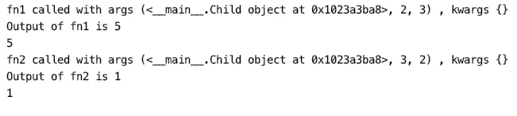

# 停止多余地使用 Python 装饰器

> 原文：<https://betterprogramming.pub/stop-using-python-decorators-redundantly-2f8467c9eeca>

## 如何在父类的每个子类函数上设置装饰器

[金伯利农民](https://unsplash.com/@kimberlyfarmer?utm_source=unsplash&utm_medium=referral&utm_content=creditCopyText)在 [Unsplash](https://unsplash.com/s/photos/class?utm_source=unsplash&utm_medium=referral&utm_content=creditCopyText) 拍摄的照片

`decorators`是 Python 中强大而有用的工具之一，因为它们允许我们修改类或函数的行为。装饰者通常将一个函数作为参数，并在另一个函数内部调用它，这通常被称为`wrapper`函数。

装饰器的用法示例

上面定义的`input_args`函数用于打印参数并返回被调用函数的输出。

但是如果我们需要调用一个类的每一个函数，这可能会产生冗余，如下面的代码片段所述。

多余的装饰用法

为了避免这种冗余，我们可以使用 Python 的`MetaClass`提供给我们的另一个强大的工具。这个`MetaClass`将帮助我们修改子类的函数定义，这将减少对装饰函数的冗余调用。

让我们看看如何…

元类用法

我们的`Parent`类将具有将我们的`decorator`设置为基类的所有函数的逻辑。

因此，我们的最终脚本将如下所示:

包含元类用法的最终脚本

元类使用的输出

`MetaClass Parent` 现在是我们的武器，可以在任何我们希望使用装饰器的职业中被继承。

# 结论

我希望这个解释有用。你对`metaclass`的用法有什么想法？你认为还有其他更简单或更好的语法吗？下面分享一下你的想法和经验吧！