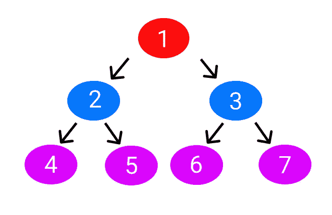

# 停止使用 Redux——如果你愿意，请考虑简单

> 原文：<https://betterprogramming.pub/stop-using-redux-consider-easy-peasy-if-you-want-3214c41bcce5>

## 较少的样板代码使它成为更好的选择


普里西拉·杜·普里兹在 [Unsplash](https://unsplash.com?utm_source=medium&utm_medium=referral) 上的照片

我是开发者，不是专家。但当我想创建网站/应用程序时，我会选择最简单的选项(它应该更好或足够好)。

当我们有一个大规模的应用程序时，我们都知道我们必须在 React 或任何其他框架中使用一些状态管理容器。

对于一个开发人员来说，学习这些概念总是让人不知所措。而且如果你学过 React，大部分公司会问你知不知道 [Redux](https://redux.js.org/) 。

嗯，没必要，但是公司更喜欢用 Redux。甚至 Redux 文档都说不是所有 app 都需要 Redux。

但是，Nitin，在哪些应用中我们需要 Redux？

朋友们，Redux 文档可以解决你们的问题。

根据 [Redux 文档](https://redux.js.org/faq/general)，您应该使用 Redux，如果:

*   您有大量的应用程序状态，应用程序中的许多地方都需要它们
*   应用状态经常更新
*   更新状态逻辑可能很复杂
*   该应用程序有一个中型或大型代码库，可能会有很多人在工作
*   您需要了解这种状态是如何随着时间的推移而更新的

因此，如果你的应用/网站属于这些类别，你可以使用 Redux。

但是，Nitin，Redux 有很多样板代码。是的，我的朋友，这就是这篇文章存在的原因。

这里我先说 Redux，然后再说 [Easy Peasy](https://easy-peasy.vercel.app/) 。我们甚至使用了一个使用两种状态管理容器的例子。

如果你是初学者，不要紧张。我会尽量保持简单。你也可以从这篇文章中学习 Redux 和 Easy Peasy。

**注意:**我不是在比较这些状态管理容器中的任何一个，也不是在推荐它们中的任何一个。这取决于你；没有人为此给我提供资金。Redux 附带了很多样板代码，让人感觉难以招架，所以我使用了 Easy Peasy。到目前为止，它运行良好。所以我也想帮你。那只是我的意图。还是那句话，看你了，谢谢。

# 为什么我们使用 Redux 和 Easy Peasy

在继续下一步之前，让我用简单的术语解释一下为什么我们要使用状态管理容器。

假设你有一个由许多状态组成的应用程序/网站，你必须在不同的组件中传递它。肯定会铺天盖地。

像这样:



来源:作者

您可以使用状态管理容器。是的，还有其他几个原因，但这是主要原因之一。

# 使用 Redux

现在我们从 Redux 开始。Redux 是一个状态管理工具(容器)，我们在其中创建一个 store，定义一个 action 和 reducer，调用 dispatch 函数。

但是什么是*储存*、*动作*、*减速*、*调度*？

一个*存储库*仅仅是一个保存你所有状态的状态容器。

一个*动作*顾名思义，会做一些事情。简单来说，就是说要做什么。

*减速器*知道怎么做动作。

最后， *dispatch* 是一个分派动作的函数。

就这样，再简单不过了。

现在让我们举一个简单的例子。这里的示例将数字增加 1。

为此，您需要创建一个 React 应用程序。

```
npx create-react-app myapp
```

这将创建一个名为`myapp`的 React 应用程序。你可以根据自己的选择来命名任何东西。

现在安装使用 Redux 所需的依赖项。

```
npm install redux react-redux
```

它将安装两个依赖项，Redux 和 [React Redux](https://react-redux.js.org/) 。Redux 是状态管理工具，React Redux 会将你的 React app 与 Redux 绑定。

在`src`文件夹中，你可以看到`index.js`文件。这里我们将创建商店，所以复制并粘贴下面的代码。

这里我们导入了`createStore`，会创建一个商店。并且`Provider`将为我们提供商店。

商店会带一个减压器。我们将在后面定义它。

简单来说，我们创建了一个商店。

```
let store = createStore();
```

然后我们将它应用到我们的应用程序组件中。

```
<Provider store={store}>
<App />
</Provider>
```

现在在你的`src`文件夹中创建两个文件夹。一个是`actions`，一个是`reducers`。

`actions`文件夹将包含一个动作文件，而`reducers`文件夹将包含一个减速器文件。

在`actions`文件夹中创建一个文件`index.js`。

```
export const increment = () => {
return {
 type: "INCREMENT",
};
};
```

这是一个告诉减速器增加的功能。

现在在`reducers`文件夹中，创建一个文件`add.js`。

这里将产生增加状态的逻辑。我们也将状态定义为等于 0。

简单地说，我们已经定义了一个将状态增加 1 的情况。

```
const add = (state = 0, action) => {switch (action.type) {
case "INCREMENT": return state + 1;
default: return state;
}};export default add;
```

在`reducers`文件夹中创建一个`index.js`文件，并粘贴以下代码。

```
import add from "./add";
import { combineReducers } from "redux";const everyReducers = combineReducers({
add: add
});export default everyReducers;
```

这里，我们已经导入了我们的 add reducer。

但是为什么是这个文件？将每个减速器组合起来，放在一个文件中。

简单来说，你需要在全局存储内部传递 reducer。但是如果你有不止一个减速器呢？那你可以这样做。

# 将减速器传递到商店

既然定义了动作和还原器，那就传给店家吧。

在您的`src`文件夹中，您可以看到`index.js`文件。(不要进入你的动作文件夹。)

我们已经从`reducers`文件夹中导入了`everyReducers`，并将其传递给了商店。

# 在我们的应用程序中显示

到目前为止，我们已经完成了创建商店的逻辑，但是还没有显示它。

在你的`src`文件夹里，你可以看到`App.js`文件。打开它，粘贴下面的代码。

这里我们导入了`useSelector`和`useDispatch`，`useSelector`来使用我们想要使用的减速器，`useDispatch`来调度动作。

仅此而已。我们已经实施了。

# 使用简单的豌豆

现在让我们用 Redux 的替代方案 Easy Peasy 实现相同的功能。

如果你已经清楚地阅读了上面的 Redux 概念，你将在几分钟内学会简单。为此，你不需要行动和减速器文件夹。

我正在创建一个新的文件夹以方便使用。您还可以在您的首选目录中创建新的 React 应用程序。

```
npx create-react-app learneasypeasy
```

在里面，安装简单的软件包。

```
npm install easy-peasy
```

# 创建存储文件夹

在您的`src`文件夹中创建一个存储文件夹。在其中，创建一个`add.js`文件。

这里我们在一个文件中定义了所有的东西，一个带有状态和动作的存储。

我们已经将计数器初始化为 0，一个名为`add`的动作将递增计数器。

# 将商店打包到您的应用程序

现在是时候用你的应用来包装商店了。

在`src`文件夹中，转到`index.js`文件并粘贴以下代码。

# 在你的应用程序中显示

我们已经创建了商店，应用了动作，甚至用商店包装了我们的应用。

现在是展示的时候了。

访问`src`文件夹内的`App.js`，粘贴以下代码。

要使用状态，必须导入`useStoreState`，要使用动作，必须导入`useStoreActions`。

要了解更多，你可以访问 npm 上的 [Easy Peasy。](https://www.npmjs.com/package/easy-peasy)

输出将保持不变。

# 让我们结束吧

因为我必须比较这两种状态管理工具，所以我必须保持简单。因此，我只应用了一个单一的行动，但它会帮助你得到一个想法。

同样，使用这些状态容器是你自己的选择。

***如果你喜欢我的工作，想要支持，可以*** [***请我喝杯咖啡！***](https://www.buymeacoffee.com/nitinfab)

谢了。

[](https://javascript.plainenglish.io/80-free-resources-for-web-designers-and-web-developers-in-2021-f400be2875ea) [## 2021 年为网页设计师和网页开发者提供 80+免费资源。

### 成为网页开发者的完整指南。

javascript.plainenglish.io](https://javascript.plainenglish.io/80-free-resources-for-web-designers-and-web-developers-in-2021-f400be2875ea)