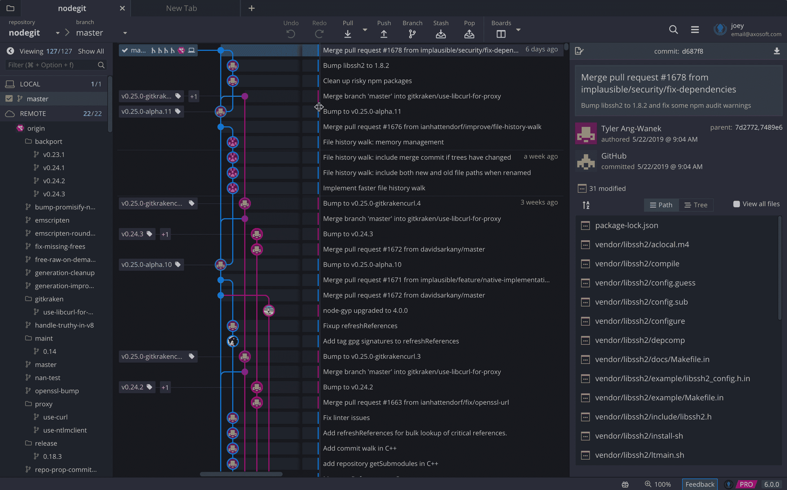
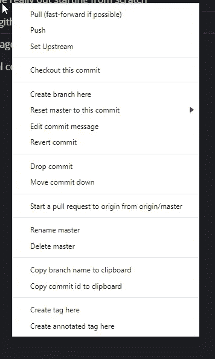

# 停止使用 Git CLI

> 原文：<https://betterprogramming.pub/stop-using-the-git-cli-d9cbee32cc27>

## 丢掉 Git GUI 污名，学习更多关于 Git 的知识，再也不会不小心推到 master 了

弗洛里安·克拉姆在 [Unsplash](https://unsplash.com?utm_source=medium&utm_medium=referral) 上拍摄的照片。

如果你是开发人员，你可能会使用 Git。如果您没有，我希望您正在使用某种源代码控制！

如果您正在使用 Git，那么您要么使用 CLI，要么使用包装了该功能的 GUI。使用*好的* GUI 更好。

# 哦，我的眼睛…

使用 GUI 的第一个主要优势是您获得了一个图形用户界面——一个为开发人员量身定制的实际 UI。开发人员编写这个程序是为了帮助其他开发人员完成他们的工作。我不能夸大这一点。一旦你掌握了使用 GUI 的诀窍，你将能够以一种完全不同的方式来看待你的代码库。

因此，我将介绍我喜欢的 Git GUI GitKraken:

GIF 来自 [GitKraken 支持](https://support.gitkraken.com/start-here/interface/)。

如果您已经使用 Git 有一段时间了，我希望这会让您满意。您可以立即轻松地看到代码库中每个人的每个提交。查看远程分支、合并和标记。

这不仅仅是漂亮。有了这个视图，您可以很容易地看到变化。这意味着您可以很容易地看到突破性的变化(例如对您的主分支)。

这影响了我的工作表现。在我的公司，所有的合并都会衍生出我们应用程序的新版本。突然，我们停止了构建。QA 在公共频道上发布了这个。我可以转到最后一个标记，在那里我们有一个工作构建，然后快速地一行一行点击每个提交。发现突破性的变化是微不足道的。我打开了一个快速公关来修复它，并有了我的五分钟的名气。但这都是因为吉克拉肯！

# 不要弄乱你的命令

我也不会花时间输入分支名称或者记住 Git 命令——或者记错它们！

GUI 的另一个优点是它更不容易出错。您可以更容易地看到您在哪个分支上，以及看到什么是提交的或未提交的。你不小心推到高手的可能性会小很多！我知道在 CLI 中猛敲一些命令可能很有趣，但是每次您键入时，您都可能出错或忘记您在哪个分支上。

# 了解有关您的工具的更多信息

说到 Git，您上一次真正去阅读文档或学习关于 Git 的新知识是什么时候？我几乎从来没有。尽管如此，我还是学到了一些东西……只是通过使用 GitKraken。例如，只需右键单击提交:

右键单击提交。

你知道这里每个选项的作用吗？你知道 Git 能做所有这些吗？Git 是一个非常强大的工具，有很多使用它的方法。但是当您使用 CLI 时，您学习了几个命令(`commit`、`push`、`branch`)，却不知道 Git 真正能提供什么。

或者也许 Git 的微妙之处并不清楚:

这四个选项有什么区别？

UI 向您展示了从远程 repo 获取代码的不同方式。从这里，你可以很容易地谷歌不同类型的拉。我不知道这些存在！如果你好奇，可以看看[的文档](https://git-scm.com/docs/git-pull)。

在真正了解 Git 如何工作之后，我现在可以挑选、制作演示分支、在它们之间进行合并，并且更容易地并行化我的工作，而不用担心会把事情搞砸。

# 耻辱

希望您有使用 Git GUI 的倾向。如果你已经读到这里，你可能对转换持开放态度，但是很多人没有。出于某种原因，使用 Git GUI 是一种耻辱。这并不“酷”我们都想感觉自己是下一级黑客，老实说，这是我们从事这一行的部分原因。

但这并不是限制自己的正当理由。这几乎类似于坚持使用一种旧的编程语言，仅仅是因为你对它感到舒服。好的工程师不会这么做！

我认为人们也瞧不起 GUI 的使用，认为它是一个拐杖。专业人士使用 CLI。嗯，专业人员不会出错，这可以说是 GUI 最大的优点。

在某些方面，更好地掌握 Git 甚至比学习新语言更重要，因为源代码控制是所有开发中都会用到的技能——不管是什么语言。

不要感受同辈的压力或者强化这些污名。可以使用 GUI，也可以使用 CLI。承认你喜欢命令行界面，因为它很有趣。

感谢阅读！