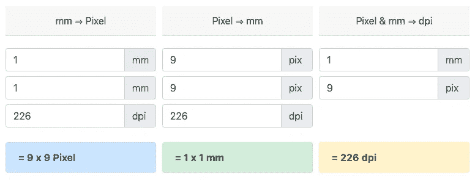
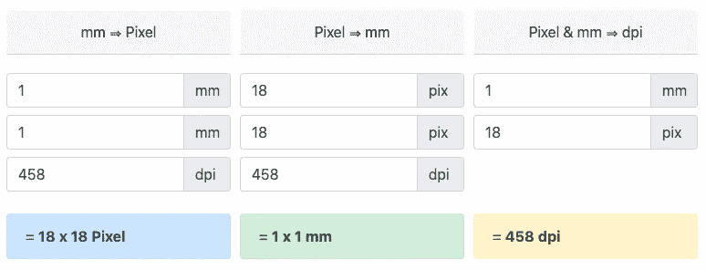
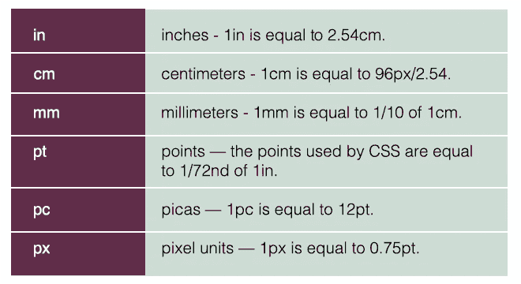
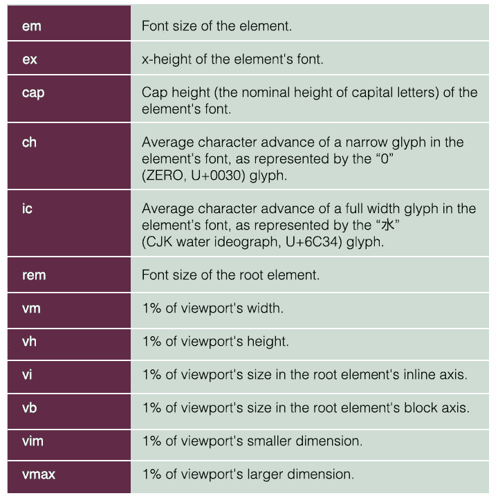
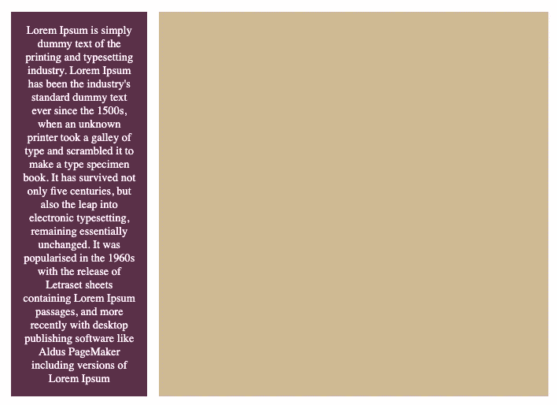
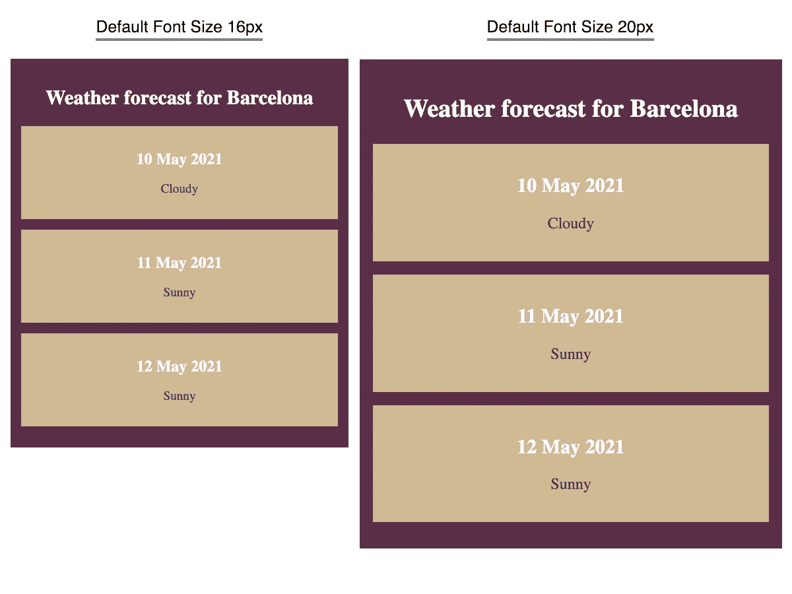

# 停止使用 CSS 中的像素单位

> 原文：<https://betterprogramming.pub/stop-using-the-pixel-unit-in-css-8b8788a1301f>

## 避免使用 px 装置的 3 个原因


[亚历山大·安德鲁斯](https://unsplash.com/@alex_andrews?utm_source=medium&utm_medium=referral)在 [Unsplash](https://unsplash.com?utm_source=medium&utm_medium=referral) 上拍照。

为什么 web 开发者如此盲目地使用`px`单元？这只是一个坏习惯？是因为缺乏对其他单位的了解吗？也许是因为设计团队依赖于`px`和`pt`的模拟？目前还不清楚为什么 pixel 是大多数团队的首选。

可能，主要原因是看起来简单方便。直觉上，我们认为我们理解这个单元，因为它看起来好像在映射我们的像素屏幕。

`px`单元是让你很容易开始的东西，但它后来变成了一个问题。在这篇文章中，我将揭露避免像素单元的三大原因。我们将讨论它的使用问题和一些可能的解决方案。

# 1.它们只是光学参考单元

像素值不再基于硬件像素。它就是不能工作，而且对于许多屏幕和分辨率来说看起来会非常不同。相反，它们基于光学参考单元。所以我们发现那个单元更直观的部分已经不存在了。

硬件每天都在变化，像素密度也在增加。我们不能依赖于设备像素密度为`96dpi`的假设。它们不再是一个稳定的参照点。

> 注意，如果锚单元是像素单元，则物理单元可能与其物理度量不匹配。或者，如果锚单元是物理单元，则像素单元可能不会映射到全部设备像素。
> 
> 请注意，像素单位和物理单位的定义不同于以前版本的 CSS。特别是，在以前的 CSS 版本中，像素单位和物理单位没有固定的比例关系:物理单位总是与它们的物理测量值相关联，而像素单位会变化以最接近地匹配参考像素。(之所以做出这样的改变，是因为太多的现有内容依赖于 96dpi 的假设，打破这个假设就等于打破了内容。)”— [W3C](https://www.w3.org/TR/2011/WD-css3-values-20110906/)

综上，说明像素不靠谱。由于其不可靠的性质，实现像素完美的布局可能是不可能的。

让我们看看 1 毫米与不同每英寸点数分辨率的像素的等效性:



在 Pixelcalculator 上，Macbook 的平均 dpi 为毫米到像素



在 Pixelcalculator 上平均 iPhone dpi 的毫米到像素

你可以在屏幕上分辨像素的日子已经一去不复返了。我们已经习惯了这种限制，这是我们需要放弃的想法。随着时间的推移， *pixel* 这个词已经失去了意义，是时候停止让它成为我们 CSS 代码中的默认单位了。

# 2.它们是绝对值

看上面的问题，为什么会这样？为什么我们的布局达不到像素的完美？因为像素单元是绝对的。这意味着它不会适应我们浏览器的像素比例/分辨率/尺寸等。

如果你想满足广泛的受众，绝对值通常不是很有用。`px`是唯一的绝对单位吗？不，CSS 支持的绝对单位多了六个。在下面找到一个参考:



CSS 支持的绝对单位列表

这意味着，如果你使用这些单元，你的观众将有各种各样的布局输出。测试你的页面的分辨率是不合理的。

我们如何解决这个问题？怎样才能让我们的布局有反应？通过使用`relative units`。那些到底是什么？

> 相对长度单位是相对于其他东西的，可能是父元素的字体大小，或者是视口的大小— [MDN 网络文档](https://developer.mozilla.org/en-US/docs/Learn/CSS/Building_blocks/Values_and_units)

让我们来看看我们所掌握的最相关的单元:



CSS 中可用的相关单位列表

你可以看到相对单位的列表比绝对单位的要大。为什么这么多？

每一种都有一些更适合使用的特定场景。有很多是好消息，因为我们知道我们可以涵盖很多不同的用例。这就是为什么理解它们变得很重要。

假设我们想要显示一列，每行最多 20 个字符。

大多数开发者目前在做什么？通过字体/系列/大小和粗细来测量字符的平均长度，然后乘以 20。

这种方法会产生硬编码的像素值。这意味着如果字体大小改变，你将不得不重新计算。这种方法只是一种近似，不能在不同的设备上一致地工作。

什么是更好的解决方案？使用`ch`单位。您可以将目标列宽基于`ch`单位的倍数。

让我们看看代码，以便更好地理解这一点:



使用 ch 单元设计动态内容宽度的示例。

正如你在上面看到的，我们将`content`的`max-width`限制为`20ch`。

```
#content {
 ...
 **max-width: 20ch;**
}
```

以上只是一个例子。像素单元有多种替代方式。有时候，你不需要相对的单位。您可以使用`flex`和`grid`布局的力量来相应地调整您的布局。不依赖一个绝对的单位会让你的布局保持一致。人们总是倾向于依赖浏览器来为我们做所有繁重的工作。

# 3.可访问性:它们不适应用户的默认字体大小

可访问性是一个被遗忘的主题，我们都应该给予更多的关注。像素单位的使用如何影响可访问性？

浏览器让你配置你的默认基地`font-size`。默认设置为`16px`，但是可以很容易的更改。这对有视觉障碍的人非常有用。然后，浏览器通过将基数`font-size`设置为该值来提示我们首选用户的`font-size`。

但是，如果开发人员使用绝对像素值，该信息将被忽略。基础`font-size`不会对我们的应用布局有任何影响。所有用户的字体大小都是一样的。这是一件坏事，因为你忽略了用户的偏好，损害了页面的可访问性。

我们如何能尊重基本字体大小？通过使用类似`rem`和`em`的相关单元。什么是`rem`和`em`？`rem`和`em`单位表示从框到文本的任何内容的字体相对于基本字体的大小。用简单的话来说，这意味着你的文本字体大小将是用户首选字体大小的倍数。两者有什么区别？

*   `rem`会相对于根`font-size`来表达。
*   `em`将表示它相对于元素的大小。

您不仅限于在`font-size`地产上使用这些单位。它们可以在 CSS 元素中的任何地方使用。这意味着您可以根据用户设置创建自适应布局。您可以确保为您的用户提供合适的体验。

让我们来看一个例子，我们将根据用户的基本字体大小来调整整个布局。对于这个特殊的例子，我们将依靠`rem`来设计适应性布局:



使用不同字体大小的并行可访问组件。

注意，我们使用了`rem`作为`padding`、`width`和`font-size`属性。

我们可以从上面看到布局是如何适应用户的浏览器设置的。字体大了，文章也大了。它们生长以保持比例。尽管对于不同的用户来说它们的尺寸不同，但它们的形状是一致的。

# 额外小费

当使用`rem`和`rem`单元时，你可能会发现用默认的基础字体`16px`来表达一切很麻烦。对于这种情况，有一个非常流行的技巧:

```
html {
  font-size: 62.5%; /* font-size 1em = 10px on default browser settings */
}
```

使用这个技巧，现在所有字体大小都将基于默认`16px`基本字体的`10px`因子。这会让你的代码不那么混乱。不会损害可访问性。这只会让你的生活变得轻松一点。

# 最后的想法

我们已经看到了我们应该抛弃像素单元的三个强有力的理由。依靠相对单位或布局功能将确保您的布局在不同设备和分辨率下保持一致。

幸运的是，像`rem`和`em`这样的相对单位的使用正在增长。与此同时，浏览器正在尽最大努力提出一些解决方案。使用绝对值时，如果用户正在缩放，浏览器单元将缩放以匹配用户应用的适当缩放。不是完美的体验，但也是不错的退路。

我希望这篇文章给了你最后一点动力，让你尽可能远离像素单元。

你不是中等会员吗？支持我[在这里](http://dioxmio.medium.com/membership)成为其中一员。

# 相关文章

[](/grid-vs-flexbox-which-one-should-you-be-using-471cb955d3b5) [## Grid 和 Flexbox——你应该使用哪一个？

### 为正确的工作寻找正确的工具的旅程

better 编程. pub](/grid-vs-flexbox-which-one-should-you-be-using-471cb955d3b5) [](/7-habits-of-productive-developers-bce60d880907) [## 高效开发人员的 7 个习惯

### 建立正确的习惯来保持每天的工作效率

better 编程. pub](/7-habits-of-productive-developers-bce60d880907)