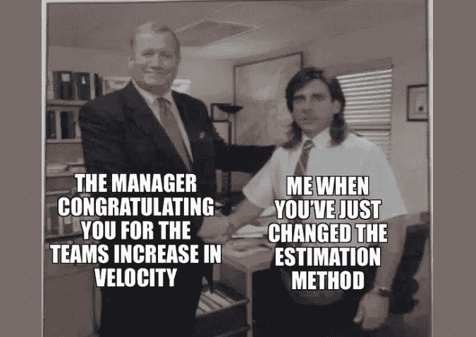
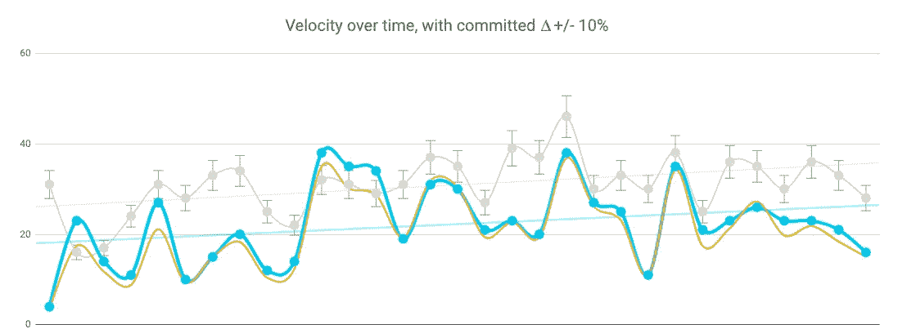
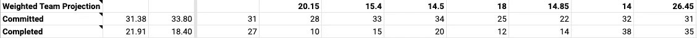
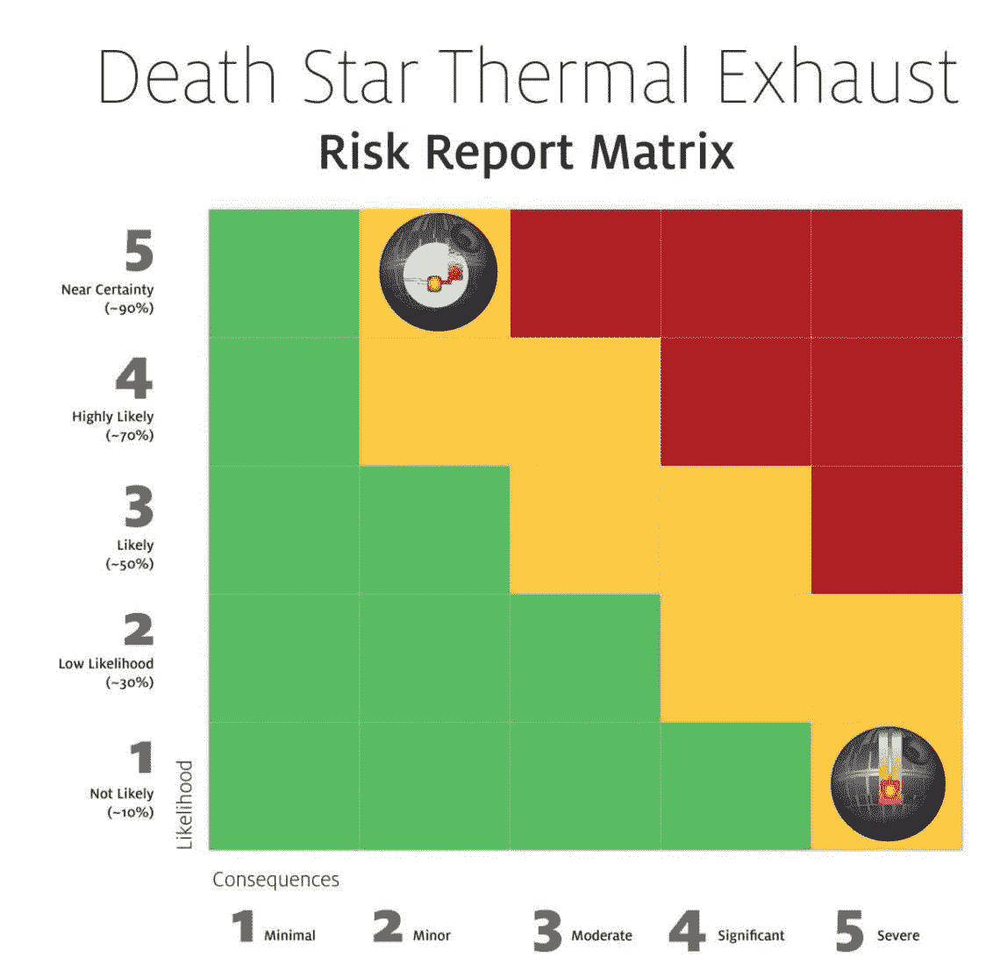
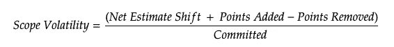
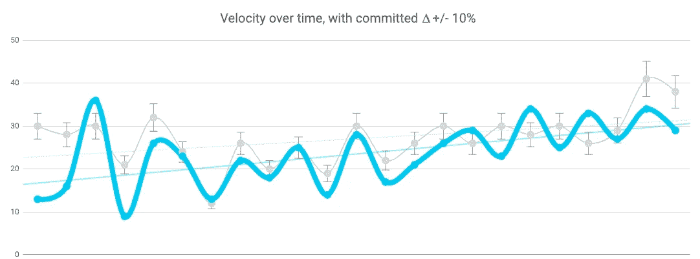

# 停止使用速度来衡量你的团队——尝试这些度量标准

> 原文：<https://betterprogramming.pub/stop-using-velocity-to-understand-how-your-team-gets-work-done-try-these-metrics-instead-f972d4ade1c4>

## 没有上下文的度量是浪费时间。



不要自欺欺人，速度很容易被人为操纵。

对于高管和经理来说，速度可以是一个有用的完成工作的数字表示，但它并不能说明全部情况。它忽略了关于冲刺过程中发生了什么的关键信息，不管它有多长。

velocity 能否回答:

*   那周有多少人生病或领 PTO？
*   添加/移除的卡？
*   添加/删除的点数？
*   一般范围波动趋势？
*   关于冲刺波动的其他问题？

答案是否定的



31 次两周冲刺的虚拟速度图

如果你仅仅用速度来衡量一个团队，你会很快变得白发苍苍，你的团队会开始鄙视你。下面我将概述一些额外的度量标准，我希望通过跟踪这些标准来了解团队工作的起伏。这不是一根衡量人的棍子，而是一种工具，用来理解你和你的团队在冲刺阶段面临的波动。

对于所有这些指标，随着时间的推移，波动性应该会最小化，从而更容易理解异常情况。

这里有一张[的谷歌表单，上面有两个样本团队](https://docs.google.com/spreadsheets/d/1j_veXNVzZXg9kLv70ydaULqCs8M-hns0li-lCDh1vh0/edit?usp=sharing)。

# 净估计移位+/-

根据你的团队在冲刺阶段如何接近和调整估算，**净估算转移**可能是不相关的。

当我开始与团队合作时，我们喜欢在进入工作时挑战评估，看看在评估和开始工作之间我们是否学到了什么新东西。

一般来说，这个数字应该很低，但是要添加一些条件格式，以便了解估计值何时会频繁变化。

# 添加/删除的点

特别是如果你所在的团队在积极支持应用程序的同时也在进入下一阶段的工作，那么增加的**点和删除的**点**点**可以让你感觉到你的冲刺阶段有什么新的工作要做。这里更高的易变性可能意味着需求不清楚，不够彻底，或者在某些情况下，涉众在冲刺阶段改变了主意。

当**点移除**高时，分析为什么会发生这种情况。

*   是否有一大块工作被降低了优先级？
*   在 sprint 开始的时候，有什么不清楚的东西变得清晰了吗？
*   你如何在未来走在前面？

# 加权团队预测

**注:** **加权团队预测**更多是为了预估你的下一次冲刺。为了让**加权团队预测**开始变得有用，你将需要 5 次冲刺，即使这样，它也需要几个月的时间才能开始更准确地排列。



到


这并不完美，但你应该看到对完全波动性的预测逐渐减少。

等式:

```
.05(s1)+.1(s2)+.1(s3)+.25(s4)+.5(s5) = WTP
```

**加权团队预测**查看您最近的五次冲刺(s1-s5 ),并根据冲刺过去的时间增加权重。重量会相应地添加到每一次冲刺中(5%、10%、10%、25%、50%)。

一旦加起来，**加权团队计划**给你一个粗略的估计，你的团队*应该*在下一次冲刺中能够完成什么。当看到下一个冲刺阶段要完成的合理工作量时，这种预测是有帮助的。

# 遗留问题

非常简单，但是这是有多少点被结转到下一个 sprint 中，以及有多少点被提交的百分比。这是一个原始数据点，没有考虑到*为什么*事情发生了变化。

# 调整后的承诺履行百分比

不是每个人都同意我的观点，但是没关系。**调整后的承诺完成百分比**的目的是将冲刺阶段发生的所有事情都考虑在内，并对我们的表现进行评估。


对我来说，一个可以忍受的数字在 80%到 120%之间。很大一部分在 90%到 110%之间。想想 **APCM** (多么伟大的缩写词啊？/s)作为死星上的排气口。两个方向都有一点回旋的余地，但是离 100%越远，结果就越不理想。



感谢 ASU 认真对待[死星风险分析](https://research.arizona.edu/stories/death-star-thermal-exhaust-port-design)

# 范围波动性

这里非常简单，但是范围波动性需要看一下**净估计偏移**、增加的**点**和移除的**点**，除以您冲刺中的总**承诺**点。



**范围波动**是我们观察冲刺阶段事情如何变化的最佳百分比，以及我们是否通过增加或删除点数来加速冲刺，以及我们是否在不平衡的情况下调整估计。绝对是快速参考数，类似于**调整重量完成**。

# 另一种表情

考虑到以上因素，如果你的团队的速度看起来像这样，你会有什么感觉？



你现在的答案应该是“视情况而定”，但它肯定是从*开始*来表示我们想从速度图中看到的。一个积极的趋势，通常在初始承诺的 10–20%范围内，随着时间的推移，可变性逐渐减弱。

# 最终注释

所有这些数字在吉拉都很容易找到。你*可以*通过一些花哨的谷歌表单脚本和连接到[吉拉云的表单加载项](https://workspace.google.com/marketplace/app/jira_cloud_for_sheets/1065669263016)来自动化一切，但这需要每两周花费大约 15 分钟，所以我从来没有抽出时间来。

如果你找不到这些号码，请在下面评论，我会帮你解决。大多数可以在吉拉的燃尽图和冲刺报告中找到。

希望上面的度量标准将有助于更好地理解 sprint 的波动性，这是纯速度绝对无法衡量的。阿曼达·金特写了另一篇名为“[除速度之外的工程团队成功的 3 个衡量标准](/3-metrics-for-engineering-team-success-other-than-velocity-5df9d79dbff9)”的文章，也给出了一些其他的想法。

在真空中，你可以编造任何你想要的故事，所以在改变流程之前，看看你的所有度量标准的故事。

最重要的是，想一想这些结果是否被记录在数字中。如果没有，那就想出其他方法来获得你想要的结果。