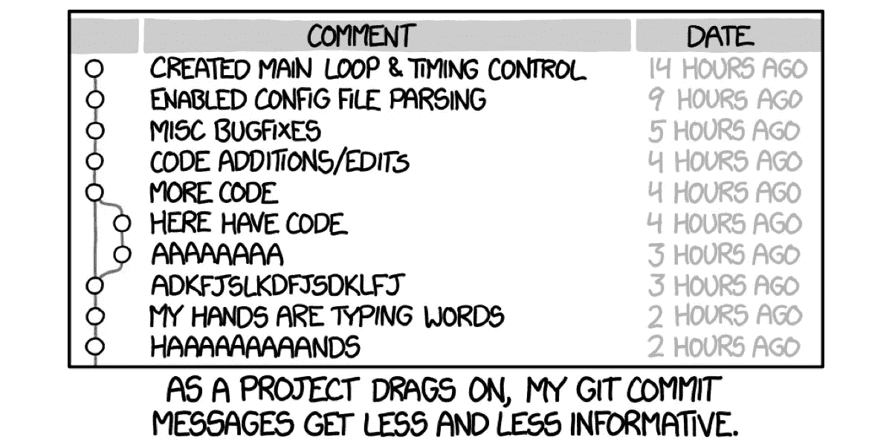

# 停止编写错误的提交消息

> 原文：<https://betterprogramming.pub/stop-writing-bad-commit-messages-8df79517177d>

## 开始遵循 Git 提交消息的最佳实践


[扬西·敏](https://unsplash.com/@yancymin?utm_source=medium&utm_medium=referral)在 [Unsplash](https://unsplash.com?utm_source=medium&utm_medium=referral) 上的照片

# 我们都看过了…

你正在做一个项目，它使用 Git 进行版本控制。

您刚刚完成了一项更改，并且想要快速更新您的分支。

因此，您打开您的终端，通过几个快速命令，您就可以用您的更改更新您的远程分支。

```
git add .
git commit -m "added new feature"
git push
```

但是你做了一点测试，发现你的实现中有一个 bug。

不用担心——你很快就找到了解决办法，并再次承诺解决问题。

```
git add .
git commit -m "fix bug"
git push
```

您重复这个过程几次，现在您得到的 git 提交日志看起来像这样:



目前，这对你来说似乎很好。

毕竟，你刚刚做了，你可以很容易地解释做了什么——即使信息没有清楚地传达出来。

# 问题是

几个月过去了，现在，另一个开发人员正在回顾您所做的更改。

他们试图理解您的更改的高级细节，但是由于提交消息不是描述性的，他们不能收集任何信息。

然后，他们求助于通读每个提交的差异。然而，即使这样做了，他们仍然不能识别您在实现中所做的选择背后的思维过程。

现在，由于软件工程是一个协作过程，并且存在`git blame`操作，他们会找出是谁做了这些改变，并开始询问你关于你的实现的问题。

不过，既然是那么久以前的事了，你也不太记得了。您检查您的提交，并且您不再记得在那个项目中做出的实现决策背后的逻辑。

你在 Slack 上给同事发了一个悲伤的表情符号(😔)并告诉他们，除了他们已经掌握的信息，你不能提供更多的信息。

# 编写良好的提交消息

希望上面的情况已经展示了为什么编写好的、信息丰富的 git 提交消息是重要的。

在像软件工程这样的合作领域，我们必须让合作者很容易地快速进入我们的工作环境。

理想情况下，一个好的提交消息应该由三部分组成——主题、正文和结束语。

## 主题行

主题应该是总结您的提交更改的单行内容。

它应该以祈使时态书写，以大写字母开头，不以句号结尾，长度不超过 50 个字符。

一个好的主题行将完成句子“这个提交将…”。

一个好的提交消息，比如“向后端添加新的神经网络模型”，很好地完成了句子。

一个错误的提交消息，比如“修复 bug”，并没有很好地完成句子，产生了一个尴尬的句子“这个提交将修复 bug”。

## 身体

正文包含了你的信息的主要部分，是你可以详细描述你的改变的地方。请注意，对于一些非常小的提交，例如修复一个打字错误，您可能不需要正文，因为主题行应该足够信息丰富。

在正文中，你应该更详细地描述你所做的改变，并解释你所做的事情的背景。

你可以解释为什么你要做这些改变，为什么你选择以这种特殊的方式来实现这些改变，以及其他任何有助于人们理解你的承诺背后的思维过程的事情。

尽量不要重复从代码变化中明显看出的东西。没有必要为您的更改提供逐行解释。专注于覆盖更高层次的细节，这些细节在阅读代码时可能并不明显。目标是最终围绕这一变化提供开发过程的背景，这主要涉及它的动机和目标。

## 封闭线

最后，最后一行是提交消息的最后一行。

您可以在这里放置关于提交的有用元数据，比如 JIRA 票号、GitHub 发行号、合著者姓名和附加链接。

这有助于将与您的变化相关的重要信息联系在一起。