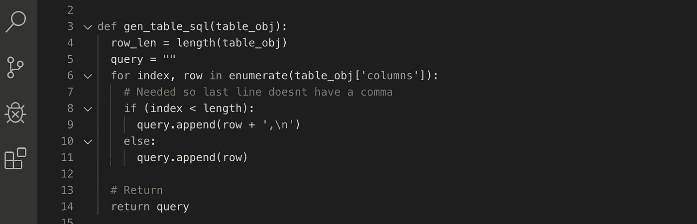
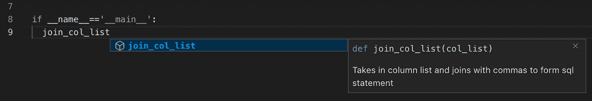

# 停止写垃圾代码

> 原文：<https://betterprogramming.pub/stop-writing-crap-code-7d3458f42384>

## 真的，你随时可以停下来。就现在。你能做到的。



*条可用波兰文* [*此处*](https://bulldogjob.pl/news/1204-4-rzeczy-ktore-pomoga-pisac-czytelny-kod) *。*

编写糟糕的代码是不可避免的。每个人在一生中的某个时候都会这样，这甚至可能不是他们的错。你典型的计算机科学学位不会教你如何写出简洁明了的代码。遵循一些简单的指导方针，编写更好的代码将会自然而然地开始。

# If 陷阱

停止[默认使用 else 语句](https://medium.com/better-programming/why-you-need-to-stop-using-else-statements-5b1fd09dea9e)。花一点时间仔细考虑你要做的事情可以节省你以后调试复杂逻辑的时间。以下面的例子为例:

```
if (index < length):
  query.append(row + ',\n')
else: 
  query.append(row)
```

这并不难理解，但是在它周围多加几行代码，你就会开始忘记你正在实现什么。这里有一个简单的说明，我们去掉重复的逻辑，简化我们正在评估的内容:

```
query.append(row)if(index != length):
  query.append(',\n')
```

通过简单的重构，我们现在可以看到我们将总是追加行。如果你在`if`和`else`做同样的事情，把它移到外面。此外，我们简化了比较。不是使用比较来显示所有的`if`被评估的时间，而是显示一个它没有被评估的情况。

# 使用内置功能

这是困扰我很久的问题之一。我不会花时间去寻找内置于语言中的函数。因此，我的代码会有很多膨胀的地方。例如，这是一小段代码，我曾用它来组合一个数组的所有行。除了最后一行，所有的行都需要逗号分隔。

```
def gen_table_sql(table_obj):
  row_len = length(table_obj)
  query = ""

  for index, row in enumerate(table_obj['columns']):
    query.append(row)

    # Needed so last line doesnt have a comma
    if (index < length):
      query.append(',\n')

  return query
```

我遍历了每一行，沿途检查是否在数组的最后一行。不可怕的代码，但需要一点时间来阅读它，并理解什么是说。然后我找了五分钟，发现我可以用字符串连接方法做同样的事情。我能够把所有的逻辑变成一行:

```
def gen_table_sql(table_obj):

  # Joins all rows with a comma and a newline except for the last
  query = ',\n'.join(table_obj['columns'])

  return query
```

# 停止在函数中隐藏逻辑

遵循[单一责任原则](https://en.wikipedia.org/wiki/Single_responsibility_principle)我们知道我们希望每个职能都有一项工作。在上面的例子中，看起来这个功能只有一个任务。然而，它隐藏了秘密的功能——它需要 table_obj 有一个名为 columns 的属性。最重要的是，它要求 columns 属性是一个列表。

```
def gen_table_sql(col_list):

  # Joins all rows with a comma and a newline except for the last
  query = ',\n'.join(col_list)

  return query
```

这是编写这个函数的更好的方法。您只需传入尽可能简单的数据，如 gen _ table _ SQL(table _ obj[' columns '])。

# 描述一下

编写更好的代码的最后一步是描述性的。下面我改变了函数的名字来描述它的功能。除了很好地命名，我还添加了一个 docstring，这样当我进行开发时，我可以在我的编辑器中得到一个简短的描述，如下所示:

```
def join_col_list(col_list):
  '''Takes in column list and joins with commas to form sql statement'''
  query = ',\n'.join(col_list)

  return query
```



# 就是这样！

这些小技巧将在你编写伟大代码的道路上助你一臂之力。当你的代码变得更容易阅读和编写时，为生产力的巨大提升和恢复你的理智做好准备。