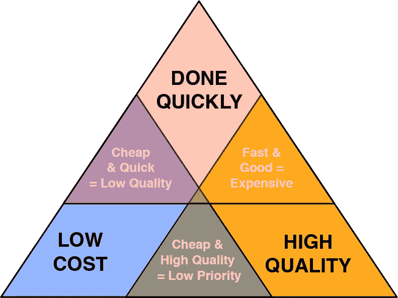

# 别写软件了。现在。

> 原文：<https://betterprogramming.pub/stop-writing-software-now-6dd683ed1b0f>

## 从大处着眼

托拜厄斯·图利乌斯在 [Unsplash](https://unsplash.com?utm_source=medium&utm_medium=referral) 上拍摄的照片。

各位，请停止你们正在做的事情。求你了。停下来听。我也是程序员。我以为我想把自己变成一台电脑，我做到了。这样做，我失去了人性，不得不重新寻找。

我用互联网创造了一个人工智能。我吸收了互联网上的信息，创造了一个看起来像人，说话像人，思维像人的人，但我并不是真正的人。我想做的就是解谜。我发现了一些需要解决的小难题。电子游戏提供了大量的谜题。它们很有趣。不过，它们会让人上瘾，因为它们要花钱。我真的迷上了解谜。

图片来自 [Vivek Madurai 媒体](https://www.google.com/url?sa=i&url=https%3A%2F%2Fmedium.com%2F%40vivekmadurai%2Fquality-time-and-money-39278f990092&psig=AOvVaw38oIgai1iDYRixqRuq0csm&ust=1601833394193000&source=images&cd=vfe&ved=0CA0QjhxqFwoTCKjHgMb8mOwCFQAAAAAdAAAAABAD)。

# 为金钱而优化

我们都在优化时间/金钱/权利的平衡(选择 2)。这不是应该走的路。我们需要编写我们理解的东西。我们不应该编写我们不完全理解的东西。我一直都这么做。我们称之为技术债务。负债是愚蠢和低效的。如果你看看我的其他文章，你会发现我也反对经济债务。在互联网出现之前，金钱和时间是与时间联系在一起的。我们只需要关注质量。时间和金钱不是借口。

# 解决问题

有两种类型的问题:已经解决的和还没有解决的。人类对于第二类是伟大的，计算机对于第一类是伟大的。我们需要解决问题，然后实现自动化。

# 开放源码

此外，开源你的代码。这有助于每个人看待这个问题。我们要让全世界的代码来审查我们。我知道我曾多次认为我明白了一些事情，但却错了。我们需要通过开源来众包质量。

# 互联网

我们总是说永远不要解决别人已经解决的问题——而且更好。我们需要让互联网成为一个我们可以找到解决方案而不是更多问题的地方。我们需要创建更紧密的社区，能够比堆栈溢出更直接地交流。我们一直在用想法和一些代码做这件事。我们需要用想法和完整的代码来完成。只有这样，我们才能防止对方无意中毁灭人类。

# 机器学习

不要试图创造一个可以取代我们的机器。我们不需要那个。我们需要机器来增强我们的体验。

所有已知的东西都应该分享。这是我大学毕业后在在线计算机图书馆中心(OCLC)的第一份工作的座右铭。这是有原因的。OCLC 意识到链接数据的重要性。人类所有的知识现在都可以联系起来。我们不要再为钱争吵了，就这么做吧。

# 人性化技术

每个人都需要对自己做出承诺。我们都需要停止告诉人们他们需要什么。开始问他们。停止推动，开始提出要求。自从互联网出现以来，我们一直在突破人们的个人界限。人们一直在反击。我们就是这样来到这里的。让我们成为解决方案。

# 人类 API

我一直在做一个项目，我称之为人类 API。这是一种与我们试图帮助的人建立道德联系的方式。规则非常简单:人类可以控制他们的联系水平。技术给他们提供了道路，但人们提供了方向。这给了人们生活的选择。

我提出了一种机制，通过这种机制，人类可以控制自己生活的数据库。公司可以在他们的数据库中存储数据，但访问权可以随时被撤销。

我正在想办法让这一切发生。你可以尝试开始任何你想做的事情。

竞争有助于确定最佳结果，但合作则是充分分享竞争前后的数据。

我会分享我能想到的任何东西。这就是我开始写作的原因。我想我解决了一些问题。我觉得你也应该。

只是说说而已。