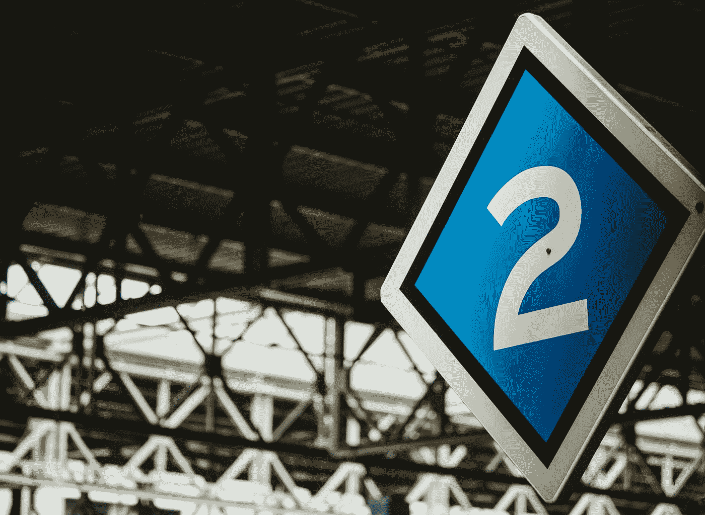
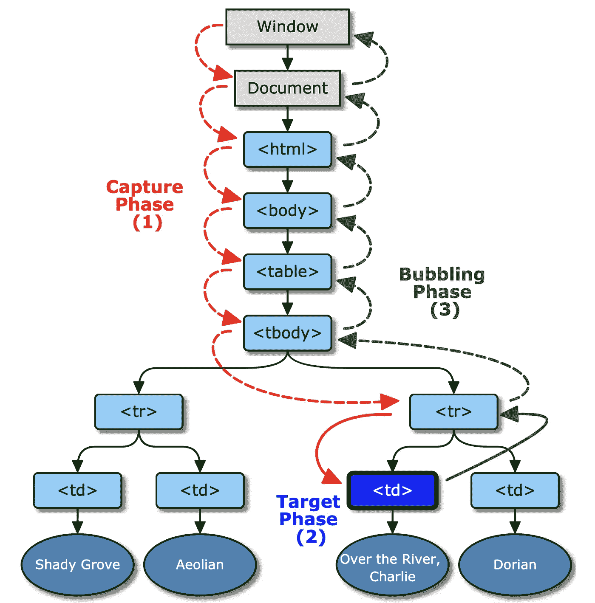
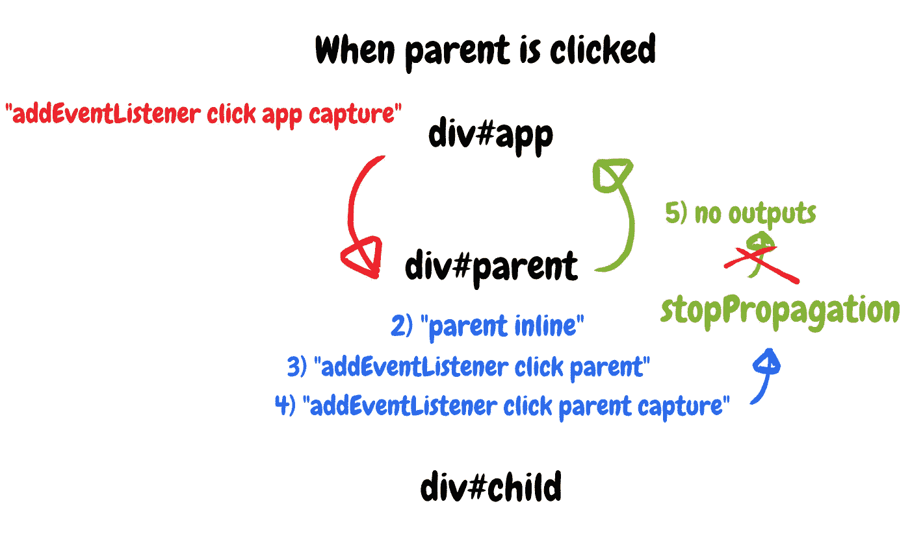
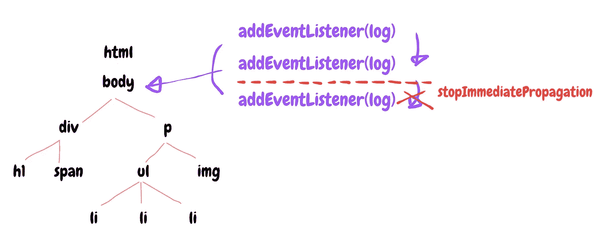
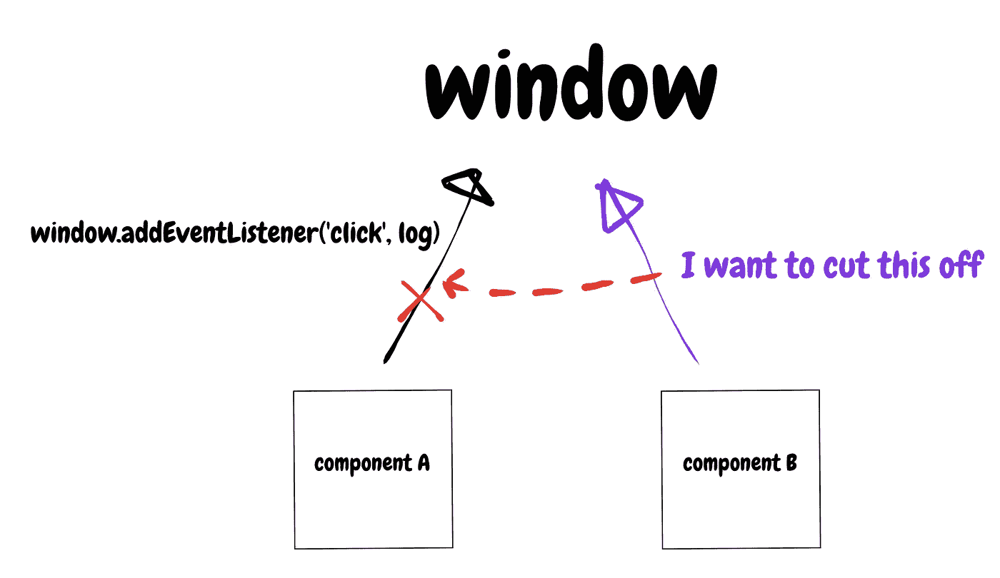

# JavaScript 中的 StopPropagation 与 StopImmediatePropagation

> 原文：<https://betterprogramming.pub/stoppropagation-vs-stopimmediatepropagation-in-javascript-27b9f8ce79b5>

## 处理事件传播的两种重要方法



照片由 [Sonny Ravesteijn](https://unsplash.com/@supersonnytje?utm_source=medium&utm_medium=referral) 在 [Unsplash](https://unsplash.com?utm_source=medium&utm_medium=referral) 拍摄

我的一个同事已经开始实现一个聊天应用程序，作为视频流服务的 Chrome 扩展的第三方库。不过，她已经陷入了许多问题，把我们其他人也拖了进来。我带来了一个我认为足够好的版本，可以与其他 JavaScript 开发人员分享。

在这篇文章中，我将讨论`EventTarget`对象中的两个方法，`stopPropagation`和`stopImmediatePropagation`，这两个方法你们很多人都知道但不知道如何正确使用。

# 放弃

本文只讨论普通 JavaScript，不涉及 React 或任何其他 JavaScript 框架的使用。因此，事件的实现可能在其他地方以不同的方式工作，因为 React 以自己的方式工作，例如，使用称为`SyntheticEvent`系统的事件系统。

另外，为了更好地理解本文，您应该知道什么是事件冒泡和捕获。

# 什么是 element.addEventListener？

如果你是一名 JavaScript 开发人员，我敢肯定你知道这是什么以及它是如何工作的，但是让我们确保我们每个人都知道同样的事情。

当 JavaScript 添加一个事件时，它的工作原理如下。

只有当类型、回调、包含它的应该被捕获的选项(或类似的东西)是相同的时候，它才会在事件句柄列表中设置一个新事件。否则，它忽略来自上下文的添加请求。

如果连续添加几个不同的事件会怎么样？

上面的代码将三种不同的事件类型注册到窗口对象，但是内部事件侦听器将事件保存如下。

```
[event_listener_list]
index  type    callback      ...
  0    click   (anonymous)
  1    keydown (anonymous)
  2    dbclick (anonymous)
```

当您双击窗口时，它会为双击运行回调，而不会给你任何错误。事件侦听器列表中的内容看起来有点混乱，但没关系:它通过从第一个索引开始查找来为您找到正确的内容。

那这个怎么样？

```
window.addEventListener('click', () => log(1));
window.addEventListener('click', () => log(2));
window.addEventListener('click', () => log(3));
```

你认为它会向你展示什么？正确，它显示了 1，2，3。它们看起来一样，但是每个回调都是匿名函数，所以 JavaScript 认为它们是不同的。

但是，这段代码不会打印三次日志，因为回调不是匿名的。它有内存地址，因此 JavaScript 认为它们都是相同的请求，所以它只接受第一个请求，忽略其他的。

# 什么是停止传播？

在跳入`stopImmediatePropagation`之前，我们先来考察一下`stopPropagation`是什么。在 JavaScript 事件系统中，有两个事件阶段——冒泡和捕获。



图片来源: [W3C](https://www.w3.org/TR/uievents/#event-flow)

不是每个 DOM 事件都支持冒泡和捕获，但是大多数都支持，尽管基本上 DOM 事件是从最顶层的元素——窗口对象开始的。无论您在网页上的什么地方单击元素，只要事件在捕获步骤是可服务的，DOM 元素总是从窗口对象触发事件。

然后，它一直向下到实际触发 click 事件的实际元素。这个元素被称为`target`事件。此时执行回调。并且通过访问每个祖先，它一直向上到达根元素。

```
window.addEventListener('click', log);
```

默认情况下，如果您添加事件，JavaScript 会使回调在捕获阶段无法被找到，如上面的示例所示。要在下一步查看它，您应该将第三个参数传递给`addEventListener`。

```
window.addEventListener('click', log, true);
// or
window.addEventListener('click', log, {
  capture: true
});
```

但是请记住:添加能够在捕获步骤捕获事件的回调，并不意味着它将在已经注册的其他回调之前执行。这是因为 JavaScript 管理事件侦听器列表中的事件，事件侦听器列表是一个类似数组的类型对象，它按照事件处理程序进来的顺序取出并调用事件处理程序。当然，带有`capture: true`的事件处理程序在其它带有`capture: false`的处理程序之前先被执行。

这个概念的重要性在于，当你想切断让事件在当前阶段后下降或上升的桥梁时。

要知道`target`和`currentTarget`是不一样的。`target`是您的事件侦听器所附加的实际 DOM 元素，而`currentTarget`则是此时捕获事件侦听器的 DOM 元素。例如，如果您单击最底部的元素，`target`始终是元素本身，但是当事件冒泡到最顶部的元素时，`currentTarget`会发生变化。

# 使用 stopPropagation 时应该注意什么？

每当你不想错过运行事件回调的机会时，就该使用`stopPropagation`了。

有太多关于`stopPropagation`的好例子，所以我将更多地关注你在使用`stopPropagation`时应该注意的地方。假设您在一个文件中编写 JavaScript 代码和 HTML 标记，如下所示。

还有一个功能直接附加在这个元素上。现在它被视为一种老派技能，但它仍然工作良好。如果您使用`addEventListener`向`parent`对象添加另一个回调，您将永远无法阻止流执行内联回调。

父对象的内联回调不被调用的唯一方法是要么从元素中删除它，要么触发另一个元素(父元素或子元素)。



图片来源:作者

当单击父元素时，在捕获阶段首先触发“app”元素的回调，因为它的一个回调有`capture: true`。然后它内部不调用`stopPropagation`，转到“parent”元素。“parent”元素有内联回调，所以它将首先被执行，打印“parent inline”然后使用`capture: false`的回调在使用`capture: true`的回调之前执行，这可能看起来很奇怪。

请注意，捕获或冒泡阶段意味着它在不同的 DOM 级别捕获事件。如果你点击这个元素，它有两个回调函数`capture: true`和`capture: false`，那么这些事件将按照它们被注册的顺序执行。

而“parent”的最后一次回调调用的是`stopPropagation`函数，所以不会再有事件向上冒泡。

# 什么是 stopImmediatePropagation？

好了，现在我很有信心，我对`addEventListener`的了解至少在你自己的知识范围之内。现在说下一个话题，`stopImmediatePropagation`。

```
window.addEventListener('click', () => log(1));
window.addEventListener('click', () => log(2));
window.addEventListener('click', () => log(3));// print 1 2 3
```

window 对象有三个事件监听器回调，分别输出 1、2 和 3。但我不希望最后一个被处决。我该怎么做呢？

`stopImmediatePropagation`防止 JavaScript 放弃调用下一个回调函数。

但是，请记住`stopImmediatePropagation`，一旦它完成运行，不仅停止将事件传播到同一级别的其他事件，也不会传播到更低级别的其他事件。就像一个以自我为中心，只关心自己的小男孩。

一旦回调结束运行，它就完全结束了事件流。



图片来源:作者

如果在当前元素的事件阶段调用`stopImmediatePropagation`，它不会让上下文传递给下一个等待的元素。

# 什么时候应该使用 stopImmediatePropagation？

通常，我猜你甚至不需要考虑是否应该调用`stopImmediatePropagation`,因为大多数时候，你不希望在相同的事件级别阻塞事件传播流。



图片来源:作者

假设组件 A 已经为窗口对象的点击设置了事件监听器— `window.addEventListener('click', cb_A)`。

但是您目前正在处理组件 B，并且您还注册了对窗口对象的回调— `window.addEventListener('click', cb_B)`。但是`cb_B`总是在`cb_A`被调用之后被调用，因为事件监听器列表按照事件处理程序进来的顺序保存它们。解决方法是将组件 B 的回调放在捕获阶段。

```
window.addEventListener('click', cb_B, true);
// or
window.addEventListener('click', cb_B, { 
  capture: true 
});
```

由于捕获选项默认为`false`，组件 A 的`cb_A`处于冒泡阶段。这样做的目的是将等待上下文转折放在更靠前的位置，然后调用`stopImmediatePropagation`。

图片来源:作者

下面是`stopImmediatePropagation`的演示。它们都向窗口对象注册了事件侦听器，并且都被调用。如果您让组件 B 在设置为`capture: true`的回调中调用`stopImmediatePropagation`，它将不允许在下一个捕获阶段或冒泡阶段执行下一个回调。

请注意，如果事件处理程序是在您实际单击的 DOM 元素中注册的，而不是在您单击的实际元素的父元素中注册的，那么这种方式就不起作用。即使您试图通过将事件注册为捕获事件来控制事件传播的流程，如果事件处理程序列表中存在现有的事件处理程序，它们也将总是首先执行。

# 结论

`stopPropagation`和`stopImmediatePropagation`是不同的功能方法，使用时要小心。`stopPropagation`防止事件向上冒泡或向下捕捉到下一个元素，`stopImmediatePropgation`防止事件在当前事件运行结束后被执行。

当元素上有事件作为内联回调时，您不能用`stopPropagation`来阻止它们调用。然而，如果内联回调点中的语句不是函数表达式(这意味着它类似于`console.log('hello')`)而不是调用其他函数，它可能会被`stopPropagation`停止，即使 JavaScript 用匿名函数体包装它。但这已经成为多年前的老一套了，所以你可能不需要再关心它了。

还要记住，其他 JavaScript 框架(如 React)的工作方式可能与纯 JavaScript 不同，因为它们可能有自己的事件系统。

# 资源

*   [https://DOM . spec . whatwg . org/# stop-immediate-propagation-flag](https://dom.spec.whatwg.org/#stop-immediate-propagation-flag)
*   [https://dom.spec.whatwg.org/#add-an-event-listener](https://dom.spec.whatwg.org/#add-an-event-listener)
*   [https://www.w3.org/TR/uievents/#event-flow](https://www.w3.org/TR/uievents/#event-flow)