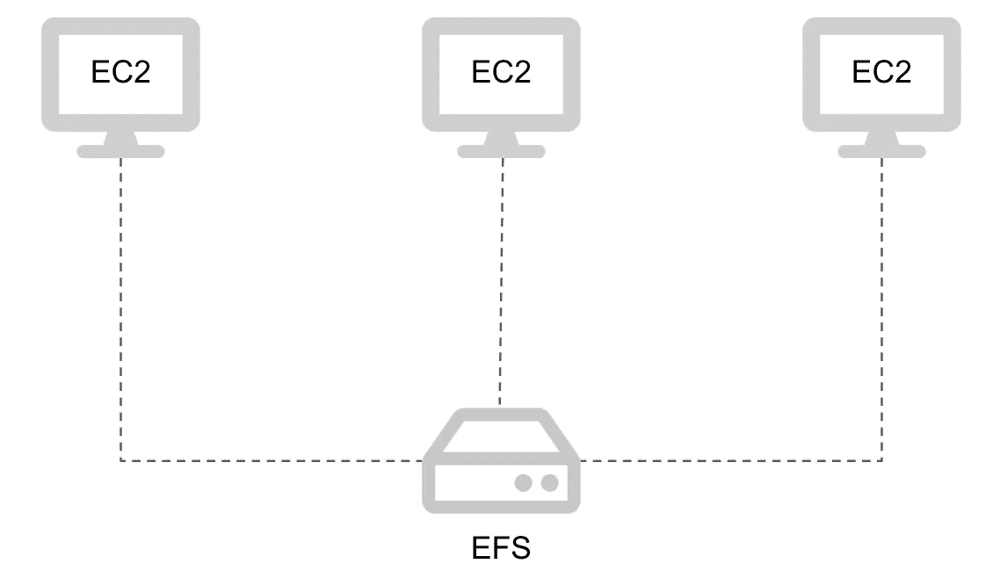

# AWS 上的存储选项:实例存储、弹性块存储和弹性文件系统

> 原文：<https://betterprogramming.pub/storage-options-on-aws-instance-store-elastic-block-storage-and-elastic-file-system-27f9aff570b6>

## 关于云中存储变体的所有知识

[被提升的照片](https://www.pexels.com/photo/person-using-forklift-1267338/)

如今，AWS 提供 200 多种不同的服务，而且这个数字每年都在增加。尽管新功能令人兴奋，但跟踪新闻变得越来越难。

然而，有些服务是 AWS 的核心。EC2 和 S3 等基本服务正被多个企业广泛使用。每个数字解决方案的基本需求是存储数据。数据管理是软件工程的支柱之一。收集的信息必须被分配到某个地方，以便以后访问。如果我们访问任何一个网站，你都会发现那里有大量的文本文件、图片和视频。所有这些数据都必须存储在某个地方。随着基于云的解决方案变得流行，我们需要了解 AWS 上与数据相关的组件的功能。

# 实例存储

当我们想到正在运行的服务器时，首先想到的存储类型是内部连接的驱动器。它必须是快速和高性能的。这就是 EC2 实例提供的选项之一。因此，这种类型的存储称为“实例存储”。它是一种存储类型，与正在运行的 EC2 实例进行物理连接，并作为它的一部分。

实例存储确实是其他存储类型中性能最好的。然而，随之而来的是，它也带来了严重的局限性。

首先，可以想象，存储只在 EC2 实例的生命周期内是活动的。一旦 EC2 实例停止、终止或失败，驱动器上的数据将永远丢失。因为它是 EC2 实例的一部分，我们不能保证它的一部分仍然存在，而另一部分被返回到资源池。除此之外，它不能连接到另一个 EC2 实例，也不能在升级时重新连接到正在运行的 EC2 实例。

其次，这种存储的大小仅限于 10 GB。在现代应用程序和云解决方案的世界中，这并不多。实例存储可以用作根卷，但这将占用最大可用大小 10 GB 的额外内存。

实例存储的最佳应用是什么？它最适合于临时存储频繁访问的信息。例如，缓存数据是实例存储的理想情况。但是对于持久化数据，我们需要考虑 AWS 上另一种可用的存储类型。

# 弹性块存储

AWS 上的下一个存储选项是弹性块存储或 EBS。这是实例存储的替代方案。正是数据块存储提供了可扩展性和高性能。

与实例存储的主要区别在于它是可附加的。存储具有独立于 EC2 的生命周期。当 EC2 实例终止时，EBS 将被分离。存储在卷上的所有数据都将保留，我们可以将它附加到另一个 EC2 实例。可以将这种类型的存储看作是可以连接到任何 EC2 实例的网络驱动器。

在引擎盖下，EBS 由 SSD 或 HDD 支持。基于此，EBS 提供了不同用途的卷类型。目前有四种可用的卷类型:

*   基于通用固态硬盘，结合最佳性价比；
*   基于 IO 优化的固态硬盘，性能最高；
*   基于低成本硬盘，吞吐量更高；
*   最便宜的冷硬盘驱动器，性能最低。

带有 HDD 卷类型的 EBS 不能用作根卷。那些适合存储档案和不经常访问的信息。然而，为了获得良好的解决方案性能，建议使用基于 SSD 的卷类型。要选择适合您需求的产品，请考虑所需的吞吐量和您愿意花费的预算。通常性能越好的越贵。

EBS 的主要限制是我们只能将一个卷附加到一个 EC2 实例。AWS 最近开始为 IO 优化的卷类型提供多附加选项。它们能够提供最佳性能，并能够处理多个连接的 EC2 实例之间的高吞吐量。这个特性也有一些限制，所以如果您真的需要一个与多个 EC2 实例连接的功能良好的存储驱动器，可以考虑弹性文件系统。

# 弹性文件系统

AWS 弹性文件系统(EFS)是一个无服务器文件系统。它像 EBS 一样充当网络驱动器，主要区别是:它允许来自 EC2 实例、Docker 容器、Lambda 函数和本地系统的多个连接。

首先，这项服务的主要特点是一个成熟的 Linux 文件系统。它有通常的文件结构和目录。因此，最好的使用情形是当我们有一个有效管理内容的应用程序时。例如，当我们有大量的视频、图片或任何其他媒体文件时，我们希望将它们提供给许多客户。由于有多个 EC2 实例访问存储，因此拥有一个高吞吐量的存储系统变得至关重要。EFS 服务完全满足需求。

EFS 连接到多个 EC2 实例

这是一项完全托管的服务，我们不需要担心维护和修补系统。它还具有高耐用性、多级安全性和数据保护。EFS 可以自动扩展和缩小，这意味着我们永远不会用完存储。

由于 EFS 提供了良好的吞吐量、性能和可伸缩性，因此与 EBS 相比，它的成本较高。文件系统的不同存储类别和吞吐量模式会对计费产生影响。例如，针对不经常访问的存储类别价格较低。根据需求，我们可以决定吞吐量模型:

*   预留-预留并提前支付；
*   爆发-获得有限的最高性能，以满足不断增长的需求。

通过正确的估计和计算，优化 EFS 的成本和性能是可能的。

# 结论

亚马逊有多种存储数据的选择。他们每个人都有自己的目的。在本文中，我对它们中的三个做了概述:实例存储、弹性块存储和弹性文件系统。何时使用它们中的每一个？

*   实例存储具有出色的性能，非常适合存储一些临时数据。但是当 EC2 实例终止时，实例存储上的所有信息都会被销毁。
*   弹性块存储(EBS)是一种可拆卸的网络磁盘。它可以同时连接到单个 EC2 实例。以后可以将它重新连接到另一个 EC2 实例，其中的数据将会保留。
*   弹性文件系统(EFS)是一个可挂载的网络磁盘。它可以同时连接到多个 EC2 实例或 Lambda 函数。它是在高负载系统上处理大量媒体文件的理想选择。

在下一篇文章中，我们将发现 AWS 上其他可用的存储选项以及何时使用它们。敬请期待！