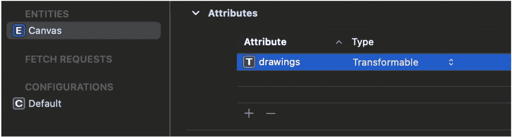
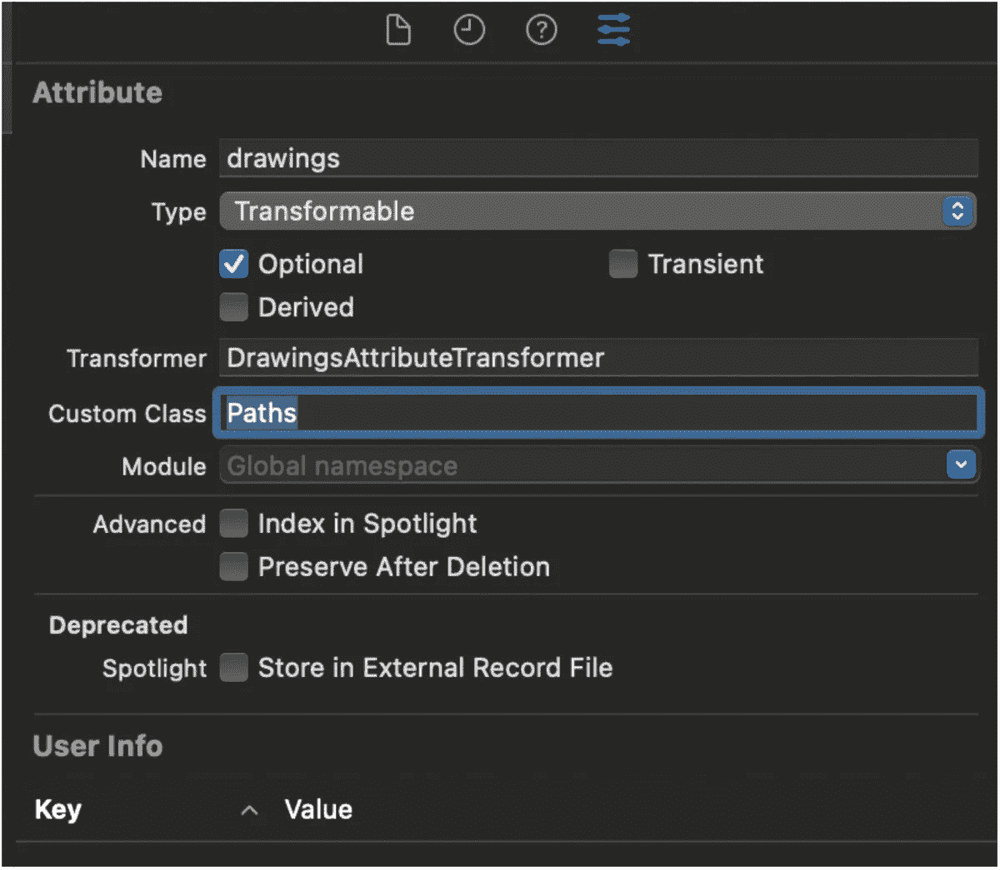

# 使用 Transformable 和 NSSecureCoding 在核心数据中存储一组自定义数据类型

> 原文：<https://betterprogramming.pub/store-an-array-of-custom-data-types-in-core-data-with-transformable-and-nssecurecoding-631c565589bb>

## 将用户的图形保存在核心数据中

伊利亚·巴甫洛夫在 [Unsplash](https://unsplash.com?utm_source=medium&utm_medium=referral) 上拍摄的照片

可转换属性对于在核心数据中存储非标准对象类型非常有用。

例如，您可以通过将属性类型设置为`Transformable`来将`UIImage`的实例存储在核心数据中。

在本文中，我们将更进一步，看看如何使用 Transformable 和`NSSecureCoding`在核心数据中存储一组自定义数据类型。

想象一下，我们希望将用户的绘图存储在一个虚构的绘图应用程序的核心数据中。我们创建了两个类来模拟绘图数据:

在我们的自定义 canvas `UIView`子类中，我们以这种方式绘制路径:

现在是时候将绘图数据保存在核心数据中了。

让我们打开我们的`CoreData`模型编辑器(扩展名为`.xcdatamodeld`的源文件)，为我们的画布实体添加一个名为 drawings 的属性，然后将其属性类型设置为 Transformable。

但是现在，我们收到一个警告，上面写着:

> `*Canvas.drawing*` *正在使用一个零或不安全的值转换器。请切换到* `*NSSecureUnarchiveFromDataTransformerName*` *或者自定义*`*NSValueTransformer*`*`*NSSecureUnarchiveFromDataTransformer*`的子类*

*我们收到这个警告的原因是，从 iOS 13 开始，苹果希望我们对我们的自定义 CoreData 数据类型使用`NSSecureCoding`(而不是`NSCoding`)以获得更好的安全性。*

*让我们继续让我们的数据模型类符合`NSSecureCoding`。*

*这里有相当多的变化，让我们回顾一些要点。*

1.  *我们使我们的模型类成为`NSObject`的子类，这样它们可以被序列化。此外，我们使它们符合`NSSecureCoding`协议；*
2.  *我们将静态属性`supportsSecureCoding`设置为 true*
3.  *当从核心数据中检索数据时，我们使用`decodeObject(of: forKey:)`来解码对象；*
4.  *由于`CGPoint`不符合`NSSecureCoding`协议，我们将其转换为`NSString`，然后进行编码。当我们解码它时，我们再把它转换回`CGPoint`；*
5.  *由于`Path`是一个定制类，我们需要在被解码的对象应该匹配的预期类数组中包含`Path`类型。*

*我们现在已经使我们的模型类符合`NSSecureCoding`。让我们继续为我们的`drawings`属性创建一个`NSSecureUnarchiveFromDataTransformer`子类，这样它就知道如何在从核心数据中检索时将其值从`NSData`转换为正确的数据类型。*

*这里，我们将`Paths`类添加到`allowedTopLevelClasses`数组中，因为它是值转换过程中的顶级类。我们还创建了一个名为`Register`的静态方法，它允许我们将自定义转换器注册到我们的应用程序中，这是我们接下来要做的。*

*让我们打开`AppDelegate.swift`文件，进行如下更改，以注册我们的自定义转换器:*

*然后，我们返回到核心数据模型编辑器，并为`drawings`属性指定`Transformer`和`CustomClass`:*

**

*在所有这些步骤之后，我们的应用程序能够将用户的绘图保存在核心数据中。*