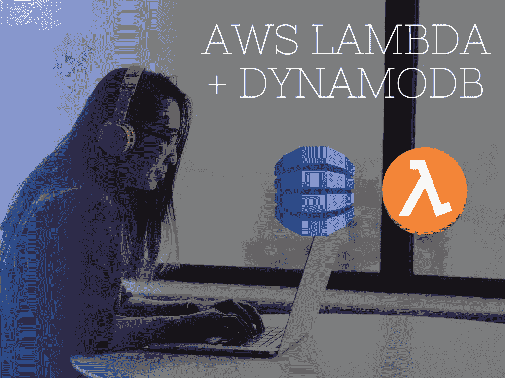
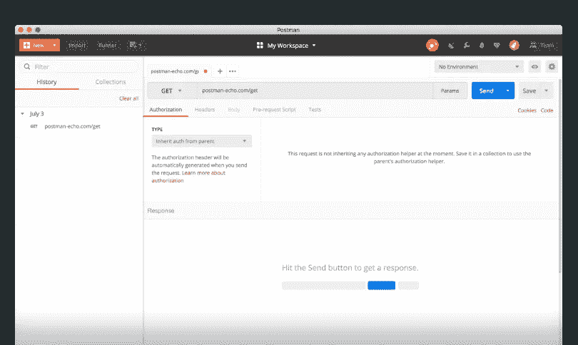
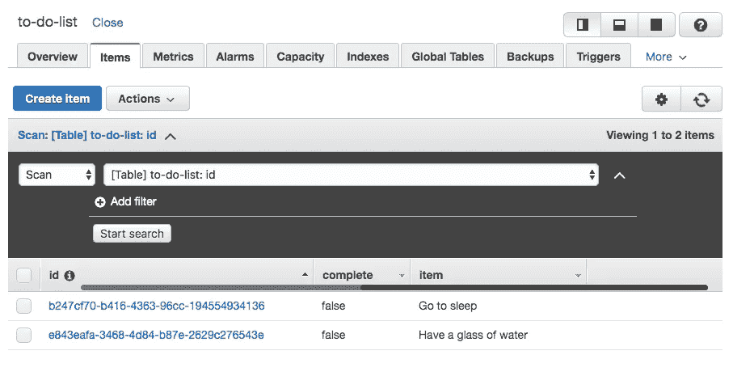

# 如何使用 AWS Lambda 从 DynamoDB 存储和获取数据

> 原文：<https://betterprogramming.pub/store-fetch-from-dynamodb-with-aws-lambda-342d1785a5d0>

## 将数据库存储添加到无服务器设置中



作者照片。

[AWS Lambda](https://aws.amazon.com/lambda/) 的最大好处之一是它可以很容易地与其他 AWS 技术集成。在本文中，我将给出一个快速指南，介绍如何创建一个 [DynamoDB](https://aws.amazon.com/dynamodb/) 表，并部署允许我们从表中存储和获取记录的函数。对于本演练，我们将使用[无服务器](https://serverless.com/)框架构建一个待办事项 API。

如果这是您第一次使用无服务器框架，您可以快速按照我在上一篇文章中概述的步骤进行设置。它应该只需要你几分钟。

如果你喜欢这篇文章，请在这里给我买杯咖啡[☕️😃。](https://www.buymeacoffee.com/lukemwila)

# **创建新的 SLS 项目**

第一步是在选定的文件夹中初始化一个新的无服务器项目。您可以使用以下命令来完成此操作:

```
sls create --template aws-nodejs-typescript --path aws-lambda-with-dynamodb
```

这将用一些样板代码建立我们的应用程序结构，包括一个基本的`lambda`函数。

# **安装依赖项并更新清单文件**

您可以通过运行`npm i`来安装任何缺失的依赖项。我们将使用的其他包有 [uuid](https://www.npmjs.com/package/uuid) (为数据库表中的记录生成唯一的 id)和[无服务器离线](https://www.npmjs.com/package/serverless-offline)插件(这样我们可以在本地模拟 AWS Lambda 和 API Gateway)。

```
npm i —-save aws-lambda uuid
npm i -D @types/uuid serverless-offline
```

一旦安装了这些依赖项，您就可以向您的`package.json`文件添加一个脚本，以触发`start lifecycle`事件来运行一个命令，该命令在一个特定的端口(在我的例子中是 4000)上启动无服务器离线仿真器。

```
"scripts": {
  "start": "sls offline start --port 4000",
  "test": "echo \"Error: no test specified\" && exit 1"
}
```

# **资源配置**

在你的无服务器应用目录中，创建一个名为`Resources`的文件夹。在这个文件夹中，我们将添加一个名为`dynamo-db.yml`的 [YAML](https://yaml.org/) 文件。在这里，我们将添加创建 DynamoDB 表的 [AWS::DynamoDB::Table](https://docs.aws.amazon.com/AWSCloudFormation/latest/UserGuide/aws-resource-dynamodb-table.html) 资源。

这个文件中定义的属性是什么？

1.  我们为将要创建的 DynamoDB 表资源设置一个描述(`ToDoListTable`)。
2.  我们将 DynamoDB 表的实际名称(`TableName`)定义为`to-do-list`。
3.  我们为描述键模式和索引的表设置了`[AttributeDefinitions](https://docs.aws.amazon.com/amazondynamodb/latest/APIReference/API_AttributeDefinition.html)`。我们的表有一个`id`的`AttributeName`和一个`AttributeType`的字符串。
4.  我们定义了`[KeySchema](https://docs.aws.amazon.com/AWSCloudFormation/latest/UserGuide/aws-properties-dynamodb-keyschema.html)`，它指定了构成表主键的属性。在这种情况下，它将是`id`。`KeySchema`属性中的属性也必须在`AttributeDefinitions`属性中定义。
5.  最后，我们使用`[ProvisionedThroughput](https://docs.aws.amazon.com/AWSCloudFormation/latest/UserGuide/aws-properties-dynamodb-provisionedthroughput.html)`属性为我们的`to-do-list`表提供读写容量。`[ReadCapacityUnits](https://docs.aws.amazon.com/AWSCloudFormation/latest/UserGuide/aws-properties-dynamodb-provisionedthroughput.html)`和`[WriteCapacityUnits](https://docs.aws.amazon.com/AWSCloudFormation/latest/UserGuide/aws-properties-dynamodb-provisionedthroughput.html)`定义了在 DynamoDB 抛出`[ThrottlingException](https://docs.aws.amazon.com/amazondynamodb/latest/developerguide/Programming.Errors.html)`之前，每秒消耗的最大强一致性读取和最大写入。你可以在亚马逊网络服务[上阅读更多关于这些属性及其设置的含义。](https://docs.aws.amazon.com/amazondynamodb/latest/developerguide/AutoScaling.html)

# **服务配置**

让我们把注意力转向`serverless.yml`文件。我首先将区域设置为`eu-west-1`，但是您可以继续选择最适合您的不同[区域](https://docs.aws.amazon.com/general/latest/gr/rande.html)。

为了加速本地开发，我们将配置我们之前安装的`serverless-offline`插件，它将模拟 AWS Lambda 和 API Gateway，如下所示:

```
plugins:
  - serverless-webpack
  - serverless-offline
```

接下来，让我们像这样引用我们刚刚添加的`DynamoDB`资源:

```
resources:
  # DynamoDB
  - ${file(resources/dynamodb-table.yml)}
```

我们想给 lambda 函数与 DynamoDB 表交互的权限。这些权限是通过 AWS IAM 角色设置的，我们可以通过`[provider.iamRoleStatements](https://serverless.com/framework/docs/providers/aws/guide/iam/)`属性在这个角色中设置权限策略语句。需要注意的是，使用这种配置，我们在该服务中部署的每个功能都将共享这些权限。

```
iamRoleStatements:
  - Effect: Allow
    Action:
      - dynamodb:DescribeTable
      - dynamodb:Query
      - dynamodb:Scan
      - dynamodb:GetItem
      - dynamodb:PutItem
```

出于安全目的，我们希望将 lambda 服务的访问权限限制在 to-do-list 表资源，因此我们可以在`Resource`属性中定义它，方法是使用 ARN (Amazon 资源名称)指定资源，如下所示:

```
Resource: "arn:aws:dynamodb:eu-west-1:**accountId**:table/to-do-list"
```

确保在`Resource`属性字段中包含您的 [AWS 帐户 ID](https://docs.aws.amazon.com/IAM/latest/UserGuide/console_account-alias.html) 来代替文本`accountId`。

当我们还在`serverless.yml`时，我将继续配置 lambda 函数，这些函数将用于生成 API 端点，我们将查询这些端点以在表中保存新记录，以及检索它们。

```
functions:
  saveToDoItem:
    handler: handler.saveToDoItem
    events:
      - http:
          method: post
          path: save-to-do-item
          cors: true
  getToDoItem:
    handler: handler.getToDoItem
    events:
      - http:
          method: get
          path: to-do-items/{id}
          cors: true
```

# **创建处理函数**

在我们的`handler.ts`文件中，我将创建一个名为`respond`的函数，包装发送回客户端的响应。这个函数有两个参数:

1.  我们作为回应发送的数据。
2.  HTTP 响应[状态码](https://developer.mozilla.org/en-US/docs/Web/HTTP/Status)。

```
export const respond = (fulfillmentText: any, statusCode: number): any => {
  return {
    statusCode,
    body: JSON.stringify(fulfillmentText),
    headers: {
      "Access-Control-Allow-Credentials": true,
      "Access-Control-Allow-Origin": "*",
      "Content-Type": "application/json"
    }
  };
};
```

接下来，我将创建两个我在`serverless.yml`文件中定义为函数的处理程序。

这两个函数调用了还不存在的其他函数，所以让我们继续创建它们。在你的 app 目录下，你可以创建另一个名为`dynamodb-actions`的文件夹，并在那里创建一个`index.ts`文件。在我们的`index.ts`文件中，我们将从 [JavaScript AWS SDK](https://aws.amazon.com/sdk-for-node-js/) 实例化`[DynamoDB DocumentClient](https://docs.aws.amazon.com/sdk-for-javascript/v2/developer-guide/dynamodb-example-document-client.html)`对象。

```
const dynamoDB = new AWS.DynamoDB.DocumentClient();
```

您应该不需要在项目级别安装它，因为 Lambda 环境附带了它。但是，我建议您在本地机器上全局安装 AWS SDK，以便进行本地开发。

我们将创建的第一个函数是`saveItemInDB`，它将接受在我们的`to-do-list`表中创建一个条目所需的两个相关参数。然后，我们为 DocumentClient 的`put`函数创建参数(`params`)，方法是指定表名和我们希望存储在表中的项。

我们要创建的第二个函数是`getItemFromDB`。我们将使用这个函数从`to-do-list`表中检索一个条目，方法是在 DocumentClient 的`get`函数的参数(`params`)中指定表名和条目 ID 作为关键字。

```
/** get a to-do item from the db table */
export function getItemFromDB(id: string) {
  const params = {
    TableName: "to-do-list",
    Key: {
      id
    }
  };return dynamoDB
    .get(params)
    .promise()
    .then(res => res.Item)
    .catch(err => err);
}
```

然后，我们可以将这两个函数导入到`handler.ts`文件中，以解决之前因为它们不存在而导致的任何错误。

# **测试 AWS Lambda 功能**

最后，我们开始测试我们的 lambda 函数。为此，我们可以使用类似于[失眠](https://insomnia.rest/)或[邮差](https://www.getpostman.com/)的 API 测试工具。我将使用后者。



Postman API 开发环境。

一旦你决定了一个 API 测试工具，你可以通过在终端运行`npm start`来启动你的无服务器离线模拟器。

为了测试我的`handler.saveToDoItem`，我向[http://localhost:4000/save-to-do-item](http://localhost:4000/save-to-do-item)发出一个 POST 请求，并得到如下响应:

```
{
    "created": {
        "item": "Write new post",
        "complete": false
    }
}
```

要获取项目的 ID，您可以修改代码使其包含在响应中，或者您可以转到 [AWS 控制台](https://aws.amazon.com/console/)并从`to-do-list`表中检索记录 ID。



AWS 控制台中的 DynamoDB 表。

然后，我们可以使用新创建记录的 ID 来测试我们的`handler.getToDoItem`是否正常工作。为此，我们向[http://localhost:4000/to-do-items/{ id }](http://localhost:4000/to-do-items/%7Bid%7D)发出一个 GET 请求，应该会得到如下响应:

```
{
    "id": "e843eafa-3468-4d84-b87e-2629c276543e",
    "complete": false,
    "item": "Have a glass of water"
}
```

如果一切正常(应该如此)，您可以使用以下命令部署您的服务(如果您之前没有这样做):

```
sls deploy --aws-profile devProfile
```

一旦你完成了这些，给自己一个小小的挑战，编写和部署允许你从`to-do-list`表中更新和删除记录的函数。

你可以在 GitHub 上找到这篇文章[的代码。](https://github.com/LukeMwila/aws-lambda-with-dynamo-db)