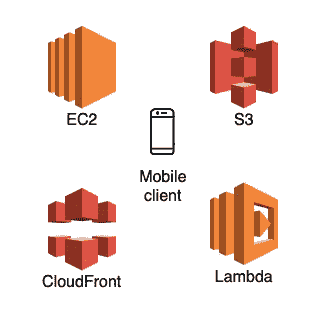
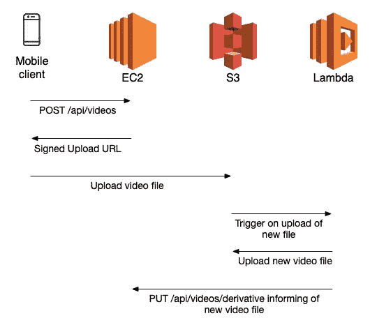

# 用 Ruby on Rails、Lambda 和 S3 存储和编码视频

> 原文：<https://betterprogramming.pub/storing-and-encoding-videos-with-ruby-on-rails-lambda-and-s3-3de934b2897e>

## 向您的新应用添加视频上传和处理功能的简单而可扩展的方法



# 介绍

随着用户偏好从基于图像的内容转向基于视频的内容，消费者应用程序必须上传和再现视频变得越来越普遍。

在不可靠的因特网连接上处理视频的需要要求视频在上传时被处理，并且以与可用带宽相称的质量被提供(由他人下载)。

已经开发了几种解决方案来实现这些目标，包括 SaaS 产品，如 [Mux](https://mux.com/) 和 [AWS Elemental](https://www.elemental.com/) 。

在这里，我们将介绍一种简单的方法，这种方法适用于集成到自定义后端的中小型应用程序，但使用 AWS 基础架构来处理和提供视频。

# 概观

我们将开发的方法将利用 3 个关键组件:

1.  AWS S3:我们将使用 S3(带[传输加速](https://docs.aws.amazon.com/AmazonS3/latest/userguide/transfer-acceleration.html))来提供一个可扩展的快速位置来上传和存储文件。
2.  AWS Lambda:将用于将视频文件重新编码为任意数量的所需格式和质量。
3.  自定义后端:一个 Ruby on Rails(任何语言都可以)后端，用于存储视频元数据并提供给客户端。

**上传**将遵循类似于下面文章中介绍的步骤，客户端从 Rails 后端请求一个签名的 URL，然后使用提供的 URL 直接将视频文件上传到 S3。

[](https://thepaulo.medium.com/secure-uploads-to-aws-s3-with-ruby-on-rails-1325e59827d) [## 使用 Ruby on Rails 安全上传到 AWS S3

### 不要在客户面前暴露你的秘密。下面的指南将概述如何上传文件直接到 S3 没有…

thepaulo.medium.com](https://thepaulo.medium.com/secure-uploads-to-aws-s3-with-ruby-on-rails-1325e59827d) 

一旦上传，我们将利用 [S3 通知事件](https://docs.aws.amazon.com/AmazonS3/latest/userguide/NotificationHowTo.html)触发λ来**处理视频**。生成的元数据(如 S3 键)将被保存到自定义后端。最终的流程如下所示。



上传新视频文件的数据流

# 履行

## 第 1 部分:后端的视频记录(对象)

为了跟踪上传的视频，我们将在后端创建一个具有一些重要属性的模型:

*   一个`key`字符串，用于存储原始上传文件的 S3 键和每个所需视频衍生文件的类似属性。
*   一个`low_res_key`来存储由 Lambda 处理的原始文件的低分辨率衍生物的 S3 密钥。

在 Ruby on Rails 中，所需的**迁移**如下所示:

相应的视频模型应该包括 2 种方法:

1.  为新视频分配唯一键的方法(可以使用视频对象的 id)。
2.  一种检索 AWS S3 存储桶的加密签名上传 URL 的方法。

生成的模型如下所示:

## 第 2 部分:从后端创建和检索视频记录

我们需要一种方法来创建视频记录，并让客户端首先检索上传视频所需的信息。

为此，我们需要一些控制器方法:

1.  创建新视频记录的`POST`方法。注意，在创建时，视频对象将具有自动分配的键，但是该键不会立即指向现有的 S3 文件，因为客户端可能还没有上传实际的视频文件。
2.  一个`GET`方法来检索视频记录。
3.  一个`PUT`方法，lambda 将使用它来创建视频衍生文件，并向服务器报告生成的衍生文件的密钥。

## 第 3 部分:处理上传的视频

我们将使用 [S3 的通知事件](https://docs.aws.amazon.com/AmazonS3/latest/userguide/NotificationHowTo.html)来自动触发 Lambda 的执行，以处理刚刚上传到 S3 的视频文件。

我们将使用 [AWS SAM](https://aws.amazon.com/serverless/sam/) 来声明和部署我们的 Lambda 和 S3，方式与下面的文章非常相似。但是，您可以使用本文剩余部分提供的代码，从 AWS 控制台手动创建您的 Lambda 和 S3。

[](https://towardsdatascience.com/a-simple-serverless-collaborative-filter-with-aws-lambda-surprise-309413fdf410) [## 带有 AWS Lambda + Surprise 的简单无服务器协作过滤器

### 我们将回顾使用 Python 的 Surprise……实现内容推荐的协作过滤器的简单部署

towardsdatascience.com](https://towardsdatascience.com/a-simple-serverless-collaborative-filter-with-aws-lambda-surprise-309413fdf410) 

创建如下所示的文件夹和文件结构:

```
video-processor/
├── cmd/
│   └── deploy.sh
├── src/
│   ├── s3-util.js
│   ├── child-process-promise.js
│   └── index.js
├── .gitignore 
└── template.yaml
```

`child-process-promise.js`定义了一个助手函数，它在一个承诺中旋转一个新流程。我们将用它在 Lambda 的主代码中调用 [FFMPEG](https://ffmpeg.org/) 。

`s3-util.js`定义从 S3 下载视频文件的帮助方法。

Lambda 的完整代码如下面的`index.js`所示。它可以分为 5 个部分:

1.  从 S3 下载视频资源到 Lambda 的工作目录中。客户端应用程序将文件上传到`/uploads`。
2.  使用 ffmpeg 处理下载的视频资源。
3.  上传新处理的视频文件到 S3。Lambda 上传衍生文件到`/processed`。
4.  通知服务器新文件准备好了。
5.  从 Lambda 中移除文件。这是必需的，因为 Lambdas 的存储空间可以在执行之间共享，并且如果文件没有被删除，它们可能累积并填满可用空间。

[AWS 无服务器应用模型(SAM)](https://aws.amazon.com/serverless/sam/) 允许在 YAML 文件中定义 Lambda 及其相关资源，并使用 AWS 提供的命令行工具自动部署和更新它。

`template.yaml`文件声明了我们将要使用的资源，以及在`/uploads`文件夹(也就是前缀)中创建文件的触发器。

# 结论

我们已经讨论了如何创建基础设施来支持移动(或类似)应用程序的视频文件上传和处理。该系统应该可以很好地扩展，因为它利用 AWS 的基础设施来处理更重的任务，如处理视频文件。

值得一提的几点:

1.  视频文件的服务器端处理并不排除在客户端处理文件的必要性，因为原始文件可能太大而无法通过合理的互联网连接上传。
2.  可以通过改变 Lambda 代码来添加额外的视频衍生物，以包括基于所需规范的更多视频文件的创建。例如，您可能希望在预览中使用上传视频文件的限时版本。

如果你有任何关于创业、创业、承包或工程的问题或只是想聊天，请发邮件给我，地址是 Paulo @[](https://avantsoft.com.br/)**。**