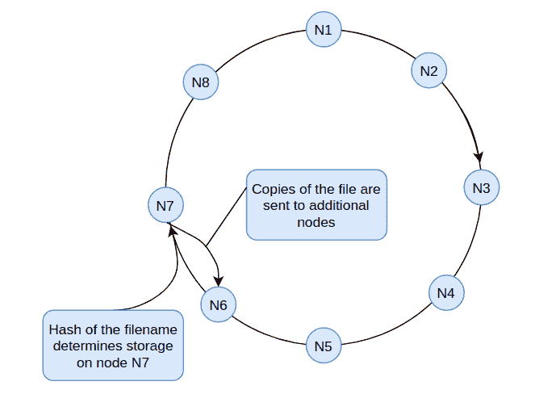
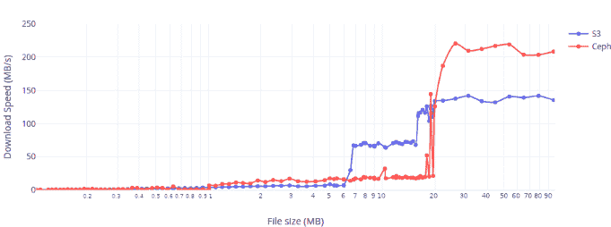
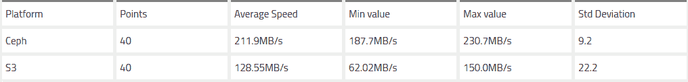
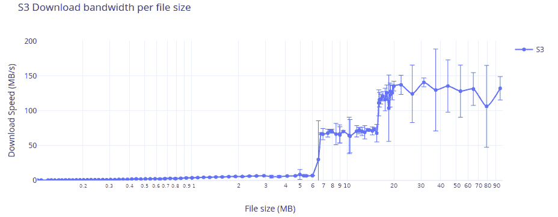
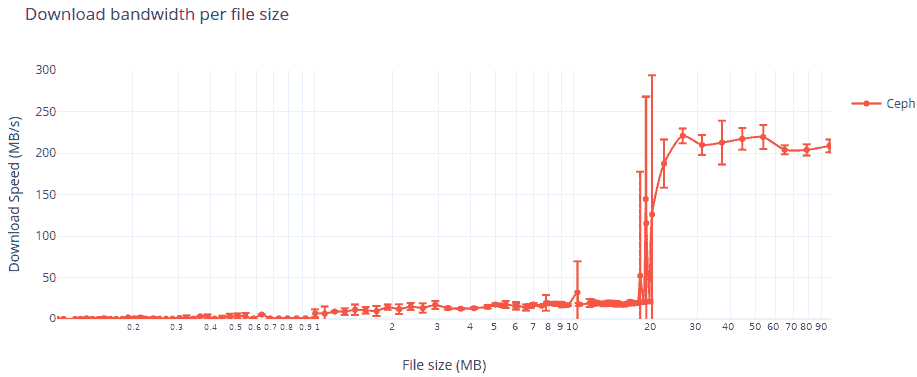
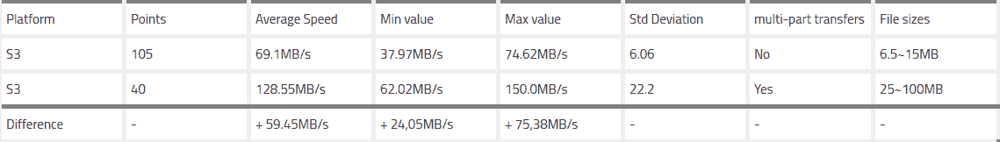
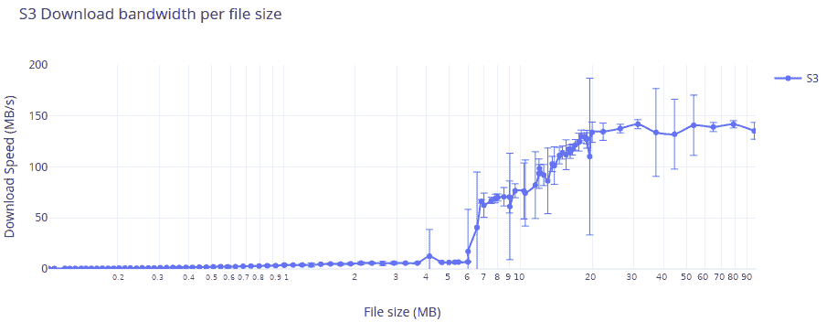

# 使用分布式对象存储大规模存储和检索机器学习模型

> 原文：<https://betterprogramming.pub/storing-and-retrieving-machine-learning-models-at-scale-with-distributed-object-storage-f592d8f0097b>

## 通过对 AWS S3 和 Red Hat Ceph 的初步性能评估

杰西卡·约翰斯顿在 [Unsplash](https://unsplash.com/search/photos/buckets?utm_source=unsplash&utm_medium=referral&utm_content=creditCopyText) 上的照片

快速创建、存储和获取大规模机器学习模型的需求正在快速增长。应用实例包括基于单个客户购买习惯的推荐系统，或基于每个客户过去行为的欺诈企图检测，等等。

因此，部署可扩展、经济高效且可靠的存储解决方案对于处理大量单个机器学习模型的平台来说变得至关重要。

在这篇文章中，我们探索对象存储系统作为解决这一特定场景的潜在替代方案，并测试两种实现: [AWS S3](https://aws.amazon.com/s3/) (公共云)和 [Red Hat Ceph](https://www.redhat.com/en/technologies/storage/ceph) (公共/私有云和裸机)，尽管也有其他好的竞争者，如 [OpenStack Swift](https://github.com/openstack/swift) 。

我们不仅分析它们是否可用，还分析它们之间的比较。虽然我们的测试集中在一个特定的用例上，但是结果对于涉及大量 blob(二进制大对象)项目的其他场景也是有用的。

# 分布式对象存储系统是如何工作的？

对象存储系统将数据包装到对象中，通过唯一的散列键来标识。该密钥通常基于上传文件的名称，并确定其存储位置(包括硬盘或服务器)。

考虑到这一点，我们可能希望避免上传名称中包含相同初始字符的多个文件。这种做法可以帮助一些系统(就像 S3 一样，[直到 2018 年 7 月](https://aws.amazon.com/about-aws/whats-new/2018/07/amazon-s3-announces-increased-request-rate-performance/))跨节点传播数据，提高性能。

这种体系结构还意味着不可能将数据附加到文件末尾或直接执行它们。我们必须首先从包含它的对象中检索并打开原始文件。

仅 S3 就存储了几万亿个对象[，而没有牺牲延迟或可靠性](https://www.allthingsdistributed.com/2007/10/amazons_dynamo.html)。其底层技术 Dynamo 是首批同时采用像[松散定额组](https://en.wikipedia.org/wiki/Quorum_(distributed_computing))和多个 [Merkle 树](https://en.wikipedia.org/wiki/Merkle_tree)(每个节点一个)这样的概念的解决方案之一，允许平台在服务器故障和网络分区的情况下保持运行。

大多数产品还可以存储一个文件的多个副本，以提高可用性。因此，如果对象被覆盖并立即读取，系统可能没有时间将更改传播到其他拷贝。

用户可能会收到文件的旧版本(例如，当 S3 简单地同时交付两个版本时，Ceph 仅在更改传播到所有副本后将对象标记为已更新)。

另一方面，这在多个用户同时请求文件的环境中提高了性能，并允许系统满足请求，即使节点离线也是如此。

图 1:通用分布式对象存储节点环的简化视图。

最重要的是，一些解决方案可以通过将对象的每个副本分成更小的部分来提高性能(类似于 [RAID 0](https://en.wikipedia.org/wiki/Standard_RAID_levels#RAID_0) )。默认情况下，Ceph 将对象分成 4MB 的片，并允许用户调整并发写操作的数量。

这使得能够并行地从多个磁盘写入和检索对象，并提供增加的队列深度。在某些设备上(在一定程度上)，这种提高可以转化为更好的性能。

# 实验

除了安全性或法规之外，在内部部署对象存储解决方案的一个主要优势是增加了性能调整的机会，比如在私有云中。

在机器学习的背景下，快速编写和检索数据集和模型可能是流水线的核心。然而，对于这个测试，我们将 Ceph 部署在 EC2 实例(公共云)上，以便更好地与 S3 进行比较。

我们通过 python 的 AWS SDK 对 Ceph 和 S3 进行了性能测试。通过使用相同的接口与两个平台交互，我们可以忽略由测试本身引起的开销。

此外，许多解决方案被设计为与 S3 一起运行，通过使用 AWS API，我们实现了否则不可能实现的场景(例如，将 Ceph 与 Apache Spark 一起使用)。

在我们的测试中，Ceph 部署在三台机器上，每台机器包含能够提供 20.000 IOPS 的固态硬盘。SSD 被细分为三个分区，并通过九个对象存储守护进程(每个分区一个)进行部署。

每台机器都有两个 CPU 内核和 4GB 内存。除了 OSD 之外，我们还为每个 OSD 部署了一个 Ceph Monitor 守护进程实例和一个 Ceph Manager 守护进程实例。

我们还在其中一台机器上部署了 Rados 网关守护进程。

这些请求是从第四台具有相同硬件配置的机器上执行的。最后，我们将所有机器连接到一个 10 Gbps 的网络以避免瓶颈。

我们测量了 100 个文件的上传和下载速度，大小从 100KB 到 100MB 不等，一次传输一个文件。

您可以在下图中查看结果，其中每个点代表五次测量的平均值。

# 每个文件大小的下载速度

Ceph 为单个文件提供了高达 230MB/s 的下载速度。考虑到所有大于 25MB 的文件，解决方案的平均速度为 211MB/s

S3 测量的峰值为 150.5MB/s，考虑到所有大于 25MB 的文件，平均值为 137MB/s。

我们可以在下表中看到更多细节。

表 1:红帽 Ceph 和 AWS S3 的实测下载带宽，文件大小在 25MB 到 100MB 之间。

在 S3 上，我们观察到下载较大文件时带宽偶尔会下降，最低为 62.02MB/s

这是观察到的解决方案不确定性水平的主要原因。在下图中，我们可以看到每个点的置信区间，为 95%。

## **S3 每文件大小的下载速度**

图二。每个文件大小的 AWS S3 下载速度。

Ceph 提供了更一致的结果，主要偏差仅出现在大约 16MB 到 25MB 点的斜率处。

## **Ceph 每文件大小的下载速度**

图 3。每个文件大小的下载速度。

两种解决方案都呈现了下载速度急剧增加的区域。S3 展出了其中的两款，分别是 8MB 和 16MB。

在这个平台中，第二次跳跃是由切换到多部分上传引起的。下表详细介绍了在两个斜率之间进行的测量。

表 2:使用和不使用多部分传输时测得的 AWS S3 下载带宽。

下面我们可以看到，将 Boto3 中的参数`multipart_threshold` 改为 8MB 也改变了这个斜率的位置。

我们可以观察到带宽逐渐增加，说明对于较小的文件大小，多部分传输的回报逐渐减少。

## **每文件大小的 S3 下载速度，Boto3 的 multipart_threshold 设置为 8MB**

然而，其他斜坡的原因并不清楚。我们很想听听你的想法！

我们还在 [GitHub](https://github.com/daitan-innovation/object-storage-evaluation) 上发布了一个 [Ansible](https://www.ansible.com/) playbook 来简化 Ceph 在测试环境中的部署，以防你想亲自尝试这个解决方案。

# 我们的结论

根据我们的初步实验，S3 和 Ceph 都是以合理的成本和性能实现我们大规模存储和检索机器学习模型的目标的潜在候选人。

从性能角度来看，两者都能够在大约 800 毫秒或更短的时间内检索到相对较大的 100MB 模型，这在我们的情况下是可以接受的。

虽然更好的性能固然不错，但他们以低成本提供可靠且可扩展的存储解决方案的能力是一个非常重要的方面。

比较每个解决方案的结果，我们注意到，对于较大的文件，Ceph 提供了比 S3 注册的性能更好的性能，证明了在定制硬件上部署对象存储解决方案的潜力。

适当调整我们的连接机制的重要性也变得显而易见。通过简单地激活多部分传输，我们将 S3 下载速度平均提高了 59.45MB/s

调整 TCP 窗口缩放等设置可以进一步提高这两种解决方案的速度。

值得注意的是，在测试 Ceph 时，我们没有改变最大并发写入或对象片的大小，而是选择保留默认配置。

针对特定环境进行优化后，该解决方案可以提供更好的性能，您应该在将其部署到生产环境之前测试多个设置。

此外，虽然本地裸机对象存储解决方案是一个可行的选择，甚至可以提供更高的性能(取决于硬件)，但也有一个权衡。

S3 是一个廉价的管理系统，可以自动扩展，如果性价比是您的主要考虑因素，它可能是最佳选择。将 Ceph 部署到私有云可能是一种中间解决方案。

虽然在这些解决方案的基础上已经进行了许多测试，但是这些平台的确切行为并不广为人知。我们希望我们从一个新的角度展示了他们的表现，并很高兴看到社区将在未来发现什么。

例如，根据您的用例，另一个有趣的测试是在多个并发用户造成的压力下测量性能(负载测试)。如果你已经做过了，我们很乐意学习！

感谢阅读！

来自 Daitan 创新和技术委员会团队的 Ranieri Castellar、Ivan Marin 和 Fernando Moraes。感谢评论家费利佩·佩雷拉、塔尔斯·席尔瓦和凯瑟琳·麦凯布。