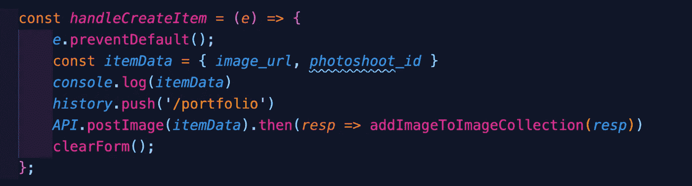
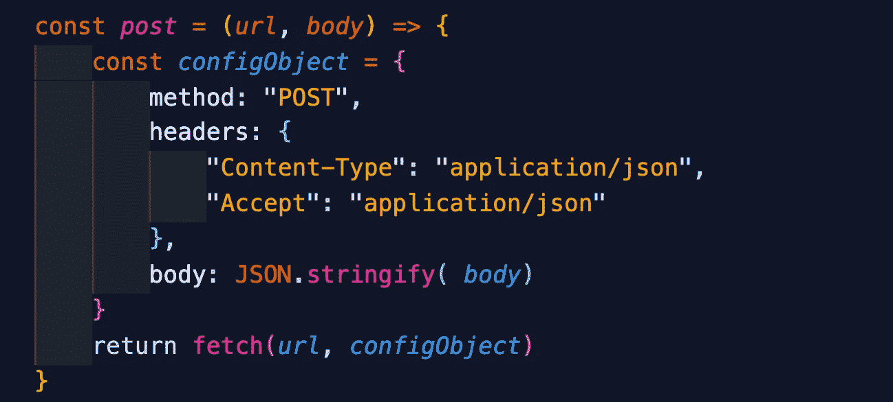
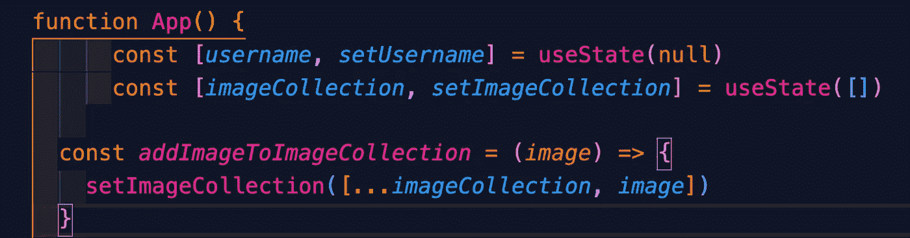

# 将图像存储在 Cloudinary 上以供 Rails 后端使用

> 原文：<https://betterprogramming.pub/storing-images-on-cloudinary-to-use-for-your-backend-ruby-on-rails-81c93cb53f69>

## 使用 React 上传到 Cloudinary

图片来源:作者

最近，我需要上传图片到我的 Rails 后端。然而，我不能使用原始图像文件(JPEG 或 PNG)，我需要这些图像的 URL。经过一番研究，我有了云存储的想法。我最初打算使用谷歌照片，但是，我一直被跨原产地资源共享(CORS)所阻止。我的解决方案是使用 [Cloudinary](https://cloudinary.com) 代替。我使用 React 将图像上传到 Cloudinary，并从 Cloudinary 中检索 url 以用于 Ruby on Rails 所需的 URL。

# 使用 React 上传到 Cloudinary

我使用 fetch 和 API url，通过 POST 方法将图像上传到我的 cloudinary 帐户上的特定文件夹中。

图片由作者提供。

## 从 Cloudinary 中检索 URL，以便在 Ruby on Rails 的后端使用

我需要在后端(Ruby)创建一个新的图像，以便存档。因此我创造了这个方法:

图片由作者提供。

上面的代码片段中有两个函数，对你来说，阅读是未定义的。首先是(API.postImage)，这是一个 post 方法，它将图像 URL 和主体作为参数，然后以 JSON 格式响应，如下所示:

图片由作者提供。

同样，上面的代码片段引用了 post 方法，对于您来说，读取是未定义的。这是 post 方法:

图片由作者提供。

这是一个通用的 post 方法，我是为了它的可重用性而创建的。您只需要调用它并传递一个 URL 和主体作为参数。

其次，是`addImageToImageCollection`法。该方法不言自明，定义如下:

图片由作者提供。

这里有一个使用 spread 操作符的图像集合，新的图像被无损地添加到集合中。

图片由作者提供。

因此，当您单击 upload image 按钮时，您将使用从 Cloudinary 检索的图像 URL 在后端(Ruby)创建一个新的图像。

一如既往地感谢您的阅读，祝您编码愉快，我希望这能帮助到其他人。