# Storj 分散式云存储:我的新宠云对象存储

> 原文：<https://betterprogramming.pub/storj-decentralized-cloud-storage-my-new-favorite-cloud-object-storage-99d95ddc4e6a>

## Storj 提供 150 GB 的免费存储和无缝 Python 集成


互联世界(来源: [unDraw](https://undraw.co/)

[Storj DCS](https://www.storj.io/) (以前的 Tardigrade)已经成熟到易于使用，并与 S3 工具(如`s3fs`)兼容，这使得从 AWS 迁移变得不费力。

在这篇文章中，我将简要概述 [Storj 分散云存储](https://www.storj.io/) (DCS)如何工作，如何使用命令行创建存储桶，以及如何将存储桶读取到 Python 中。

```
**Table of Contents**
[1\. Storj Decentralized Cloud Storage](#8f6d)
  [1.1 How it works](#d903)
  [1.2 Free tier](#12e9) 
[2\. Creating an account](#0049)
[3\. The Uplink CLI](#8bb2)
  [3.1 Uplink commands](#b615)
[4\. Read Data into Python](#0372)
  [4.1 Create an Access Grant](#3644)
  [4.2 Read a JSON file](#b458)
  [4.3 Read CSV file with Pandas](#dd42)
  [4.4 Read Multidimensional Data with Xarray](#3dfc)
[5\. Conclusions](#043f)
```

# 1.Storj 分散式云存储

Storj 为亚马逊网络服务(AWS)等云存储提供商提供了一个分散的替代方案。上传到 Storj 的数据经过加密、分成数据块，并分散在世界各地不相关的节点上，即不同地理位置的存储提供商、互联网服务提供商、电源等。网络节点是独立的，并通过对等通信协议进行通信。

任何人都可以操作节点来帮助保护网络。运行一个节点意味着托管别人数据的加密部分段，并为此获得补偿。补偿以 [Storj 代币](https://www.gemini.com/cryptopedia/storj-coin-decentralized-storage)的形式出现，这是以太坊区块链上的一种 ERC-20 代币。

## 1.1 其工作原理

上传到 Storj DCS 的文件经过加密、分割，并存储在世界各地的存储设备上。每个文件被分成 80 个或更多的片段，分布在网络上。由于没有中心故障点，由于系统内置的冗余，文件丢失在统计上不太可能。即使片段由于存储故障或节点离开网络而丢失，文件仍然可以重建，因为只需要 29 个片段。这是因为 Storj 使用了 [Reed-Solomon 编码](https://www.youtube.com/watch?v=jgO09opx56o)，与 QR 码、CD 和 DVD 使用的编码相同。到目前为止，网络从未丢失过一个文件。如果你想了解更多， [Cryptopedia](https://www.gemini.com/cryptopedia/storj-crypto-decentralized-storage) 对 Storj 有一个很好的概述，查看[storj.io/how-it-works](https://www.storj.io/how-it-works)的网页，或者查看[白皮书](https://www.storj.io/whitepaper)。

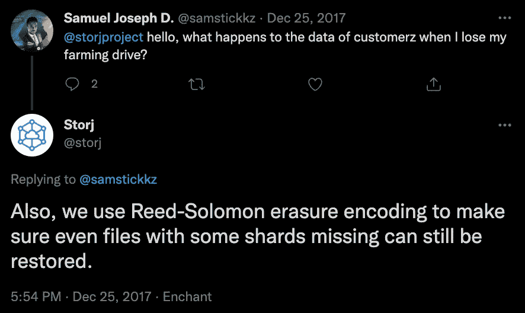

作者图片

## 1.2 自由层

Storj DCS 拥有我见过的最好的自由层之一— **150 GB 的自由存储空间**。最重要的是，付费存储计划每月每 TB 4 美元，比 AWS S3 更具成本效益。两者都可以很好地与 Python 集成，但是根据您的需求，Storj DCS 具有更大的价值。

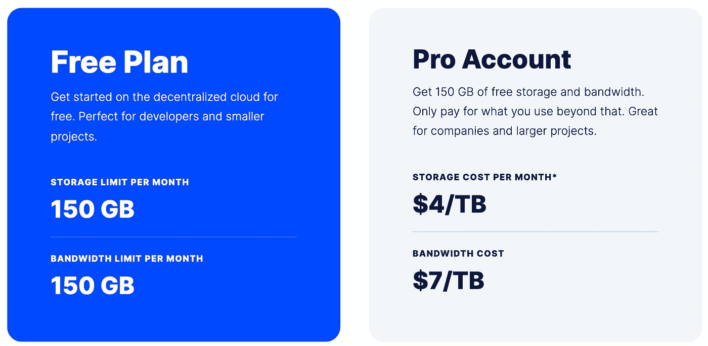

作者图片

# 2.创建帐户

如果您还没有 Storj 帐户，请先创建一个

[](https://www.storj.io/) [## Storj -分散式云存储

### Storj DCS 是面向开发人员的安全云对象存储，与 S3 兼容，成本降低高达 80%。免费试用并…

www.storj.io](https://www.storj.io/) 

创建时，您将看到如下所示的页面

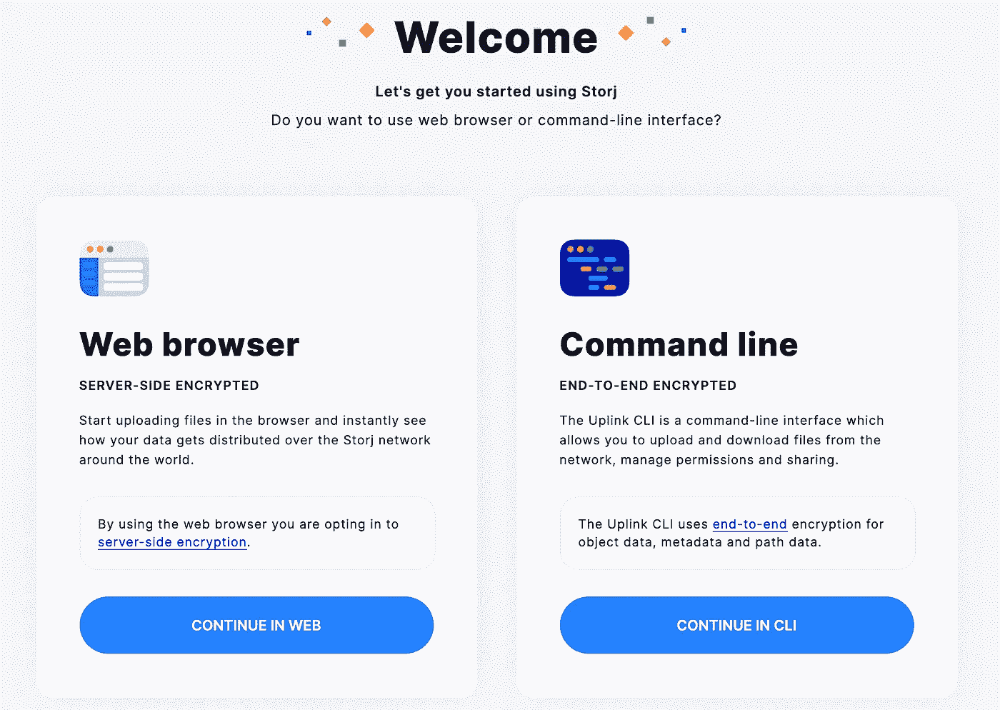

作者图片

我建议在 CLI 中点击**继续，**这将帮助您安装命令行界面(CLI)。您将首先看到您的卫星和 API 密钥。**确保保存好这些照片，因为你只会看一次。然后，您将看到安装上行 CLI 的命令提示。接下来的几页将向您介绍如何设置上行 CLI 以与 Storj 网络交互，并提供了一个如何制作存储桶并将数据上传到存储桶的示例。**

使用 Storj 并不需要 CLI，但它肯定会派上用场。如果你愿意，你可以一直使用干净直观的网络界面。

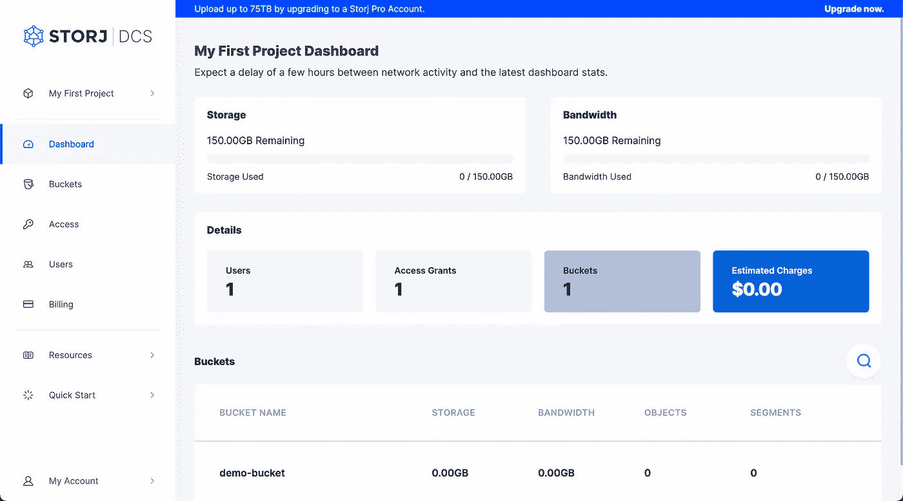

作者图片

# 3.上行链路 CLI

如果您已经有一个帐户并且没有安装上行 CLI，请登录，然后点击**快速启动**和**使用 CLI 上传**。这将引导您设置 CLI，并提供一个如何使用它的示例。

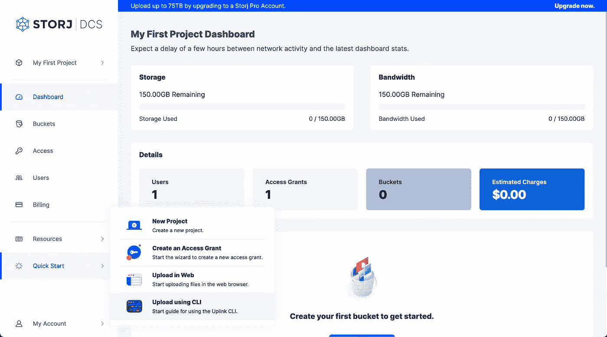

作者图片

## 3.1 上行链路命令

通过简短的命令列表，上行链路 CLI 易于使用

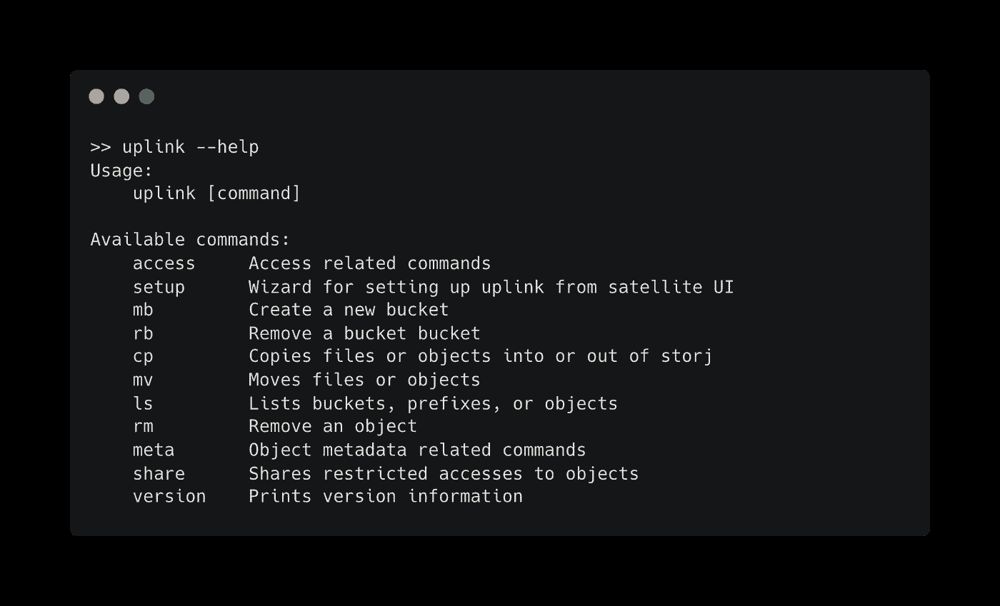

作者图片

命令很直观。下面是一些基本操作的列表。

**基本上行命令**

*   `uplink mb bucket_name` —制作一个桶
*   `uplink cp /file/path s3://bucket_name` —复制到存储桶
*   `uplink cp s3://bucket_name /file/path` —从桶里抄
*   `uplink ls s3://bucket_name` —列出一个桶的内容
*   `uplink share --url s3://bucket_name/file.txt` —在桶中生成文件的可共享 URL

# 4.将数据读入 Python

一旦你有了一个帐户设置和一些存储在网络上的数据，让我们学习如何从云中读取到 Python 中。

如果你过去在 Python 中使用过 S3 桶，那么你很可能使用过`s3fs`包。这个包可以与 Storj 铲斗交互。

```
conda install s3fs -c conda-forge
```

或者

```
pip install s3fs
```

## 4.1 创建访问授权

为了让`s3fs`与 Storj 互动，您需要创建一个访问授权。为此，登录 Storj 并点击左侧的**访问**，然后点击**创建访问授权。**按照提示的步骤操作。当您到达许可步骤时，请确保在浏览器中点击**继续**，当您到达最后一步时，点击底部的**生成 S3 网关凭证**。

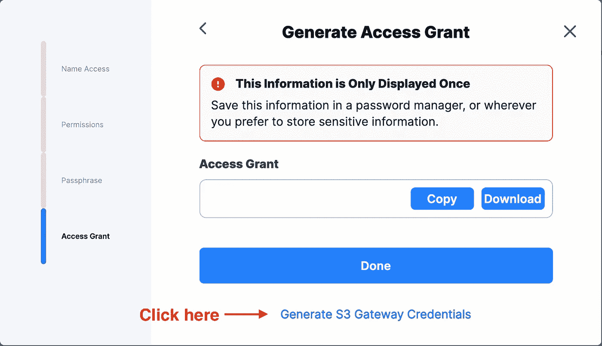

作者图片

将会提示您的凭证

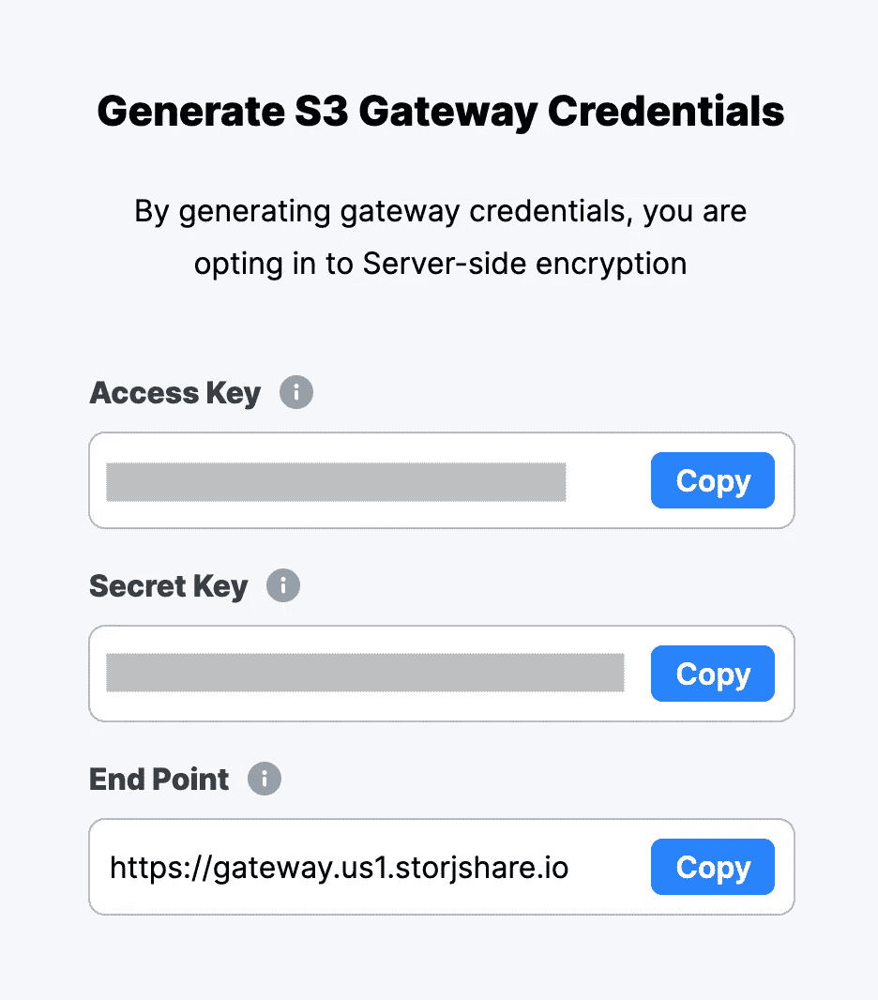

将这些字段保存到文件中，或者暂时打开此页面。

打开 Python，将这些字段复制到下面代码片段中相应的位置。这个代码片段让您可以从 Python 访问 Storj DCS 帐户。

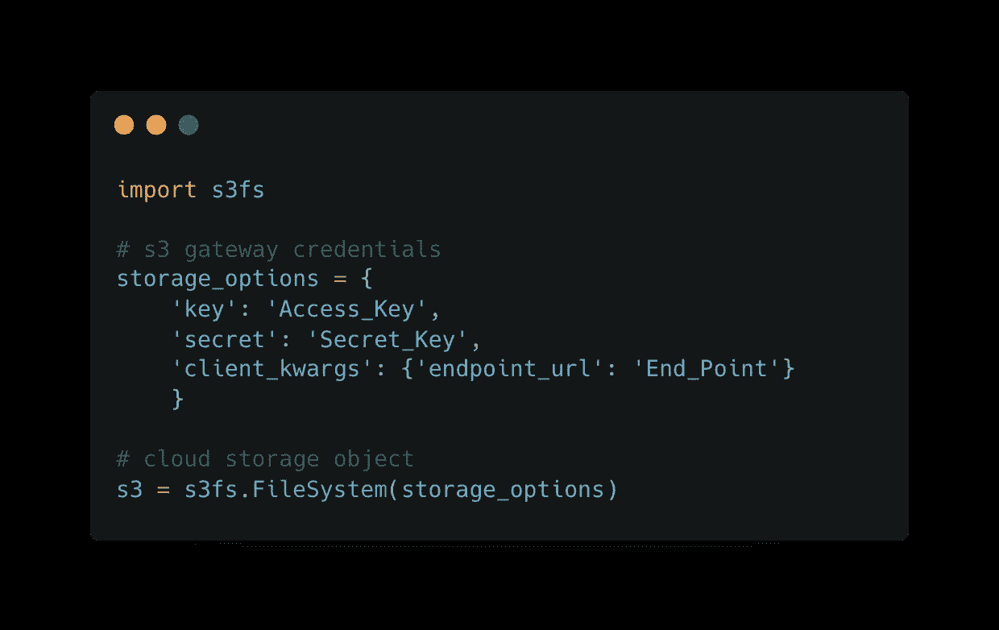

作者图片

> 最佳解决方案是将密钥存储在一个点文件中，这样就不会在脚本中暴露出来。

现在试着列出你一个桶里的东西

```
s3.ls(bucket_name)
```

## 4.2 读取一个 JSON 文件

这里有一种读取存储在桶中的 JSON 文件的方法

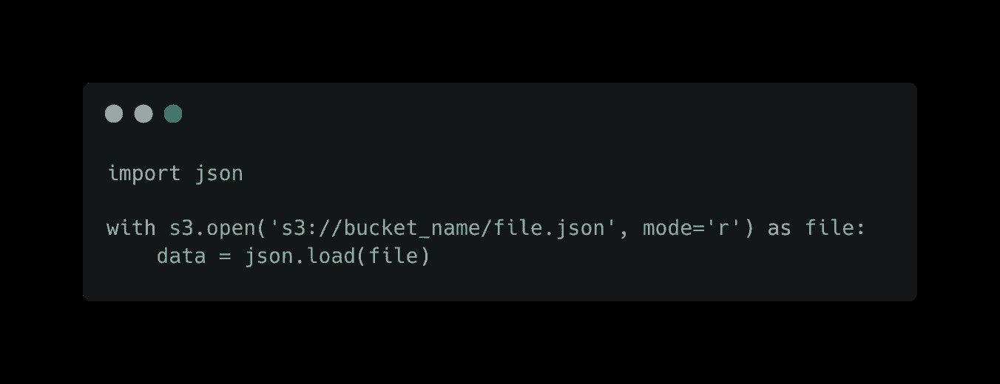

作者图片

## 4.3 与熊猫一起阅读 CSV 文件

`Pandas`使直接从云存储中读取 CSV 变得容易。

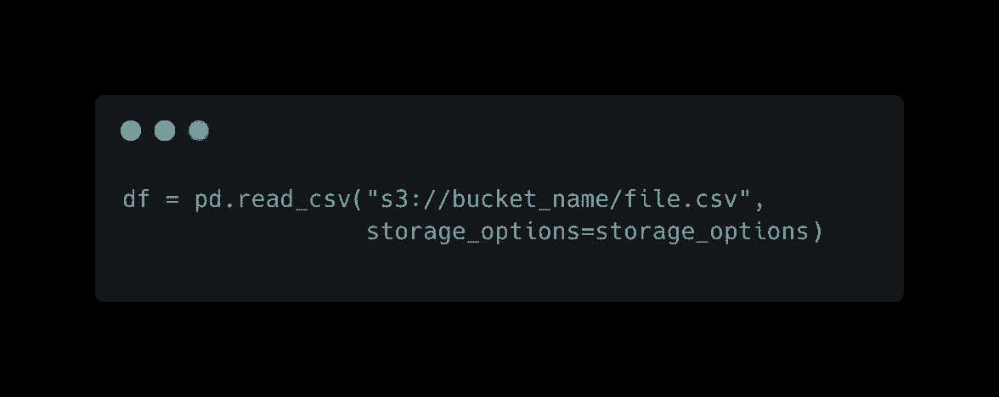

作者图片

> 不要忘记存储选项(参见第 4.1 节)

## 4.4 使用 Xarray 读取多维数据

`Zarr`文件是多维数据的云优化存储。从`zarr`读取数据看起来和感觉上与读取传统的`netCDF`文件是一样的。

`Xarray`使得将 NetCDF 输出转换为`zarr`变得容易，这比 NetCDF 更容易从对象存储中读取。

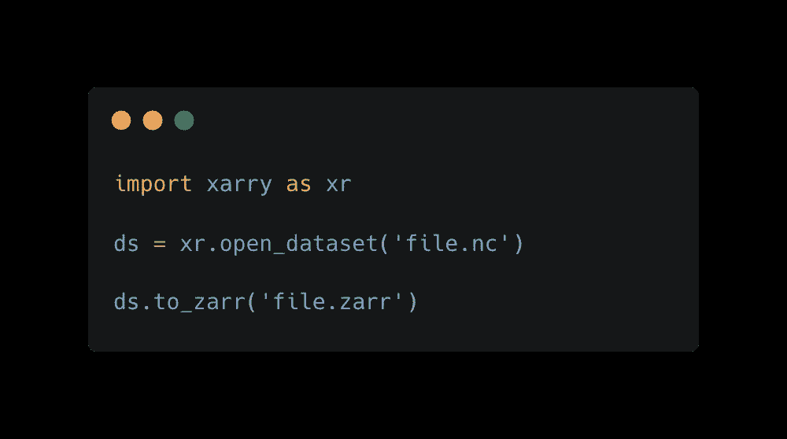

作者图片

一旦您有了一个`zarr`文件，您可以使用下面的代码将它上传到 Stroj:

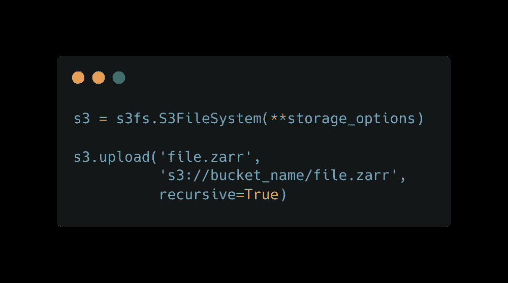

作者图片

> 不要忘记存储选项(参见第 4.1 节)

读取一个`zarr`文件可以简单地通过

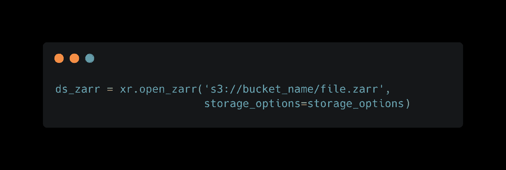

作者图片

> 不要忘记存储选项(参见第 4.1 节)

可以从云存储中读取一个 NetCDF 文件，但是感觉有点别扭。

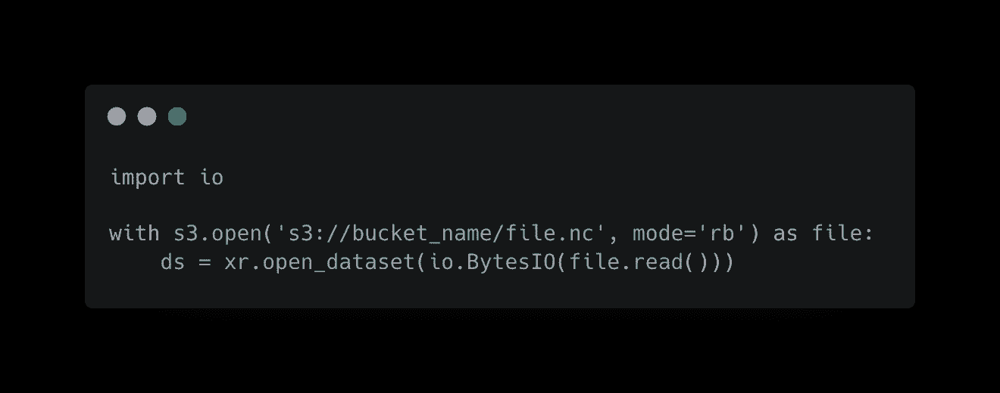

作者图片

> 我不建议上传和读取 NetCDF 文件到云对象存储。 [Zarr 是更好的解决方案](https://pangeo.io/data.html#data-in-the-cloud)。

# 5.结论

多年来，Storj 已经发展成为一个非常简单的对象存储解决方案，提供具有竞争力的免费层，包括 150 GB。相比之下，5 GB 的 AWS S3 提供。如果你需要更多的存储空间，Storj 每月将只收取每 TB 4 美元，而 [AWS S3 价格](https://aws.amazon.com/s3/pricing/)将在 23 美元左右。

除了具有竞争力的价格，Storj 还在[努力减少 Storj token 的环境影响](https://www.storj.io/blog/the-green-case-for-storj)，使其网络更具可持续性。随着以太坊完全迁移到预计于 2022 年在 Q2 进行的股权证明，该网络将变得更加可持续。

此外，Storj 云存储不依赖于建设新的数据中心，也没有砍伐任何树木或建造任何新建筑来生产其产品。相反，它依赖于现有的基础设施。

Storj 不是唯一的分散式云存储提供商。Filecoin 由 Protocol Labs 在 IPFS 开发，是这个领域中比较流行的产品。Filecoin 位于区块链，依靠将文件复制或“固定”到不同的节点来保护网络。复制使网络更加持久，但代价是要多次复制文件。这与 Storj 不同，Storj 通过擦除编码实现耐用性。话虽如此，Filecoin 和 IPFS 在 web3 堆栈中也有自己的位置，我鼓励你们深入了解他们。我感兴趣的一个基于 Filecoin 的产品是 web3.storage。

最后，尽管我很喜欢 Storj DCS，但我知道它可能不是所有人的最佳解决方案。定价结构简单，存储成本便宜，但如果你深深嵌入 AWS 生态系统，那么过渡可能不是最好的解决方案。