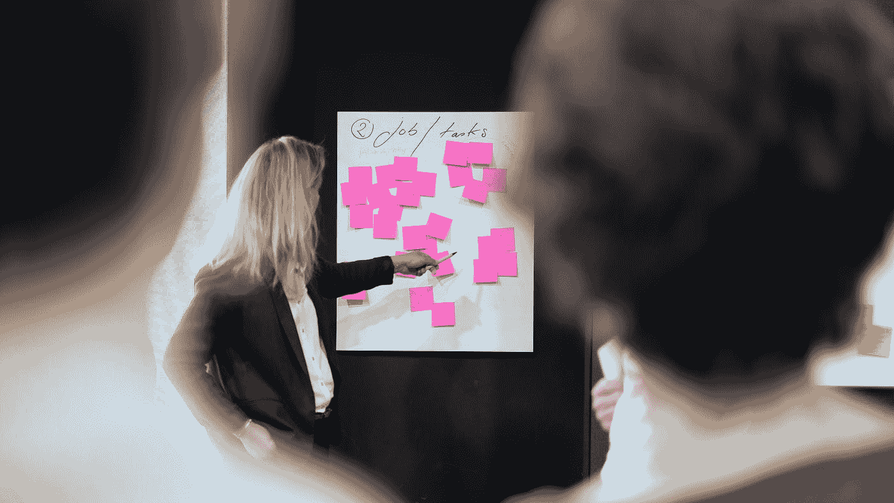

# 故事要点——你做错了

> 原文：<https://betterprogramming.pub/story-points-youre-doing-them-wrong-7d03d8de0696>

## 不要把故事点变成不存在的东西

她可能没有正确使用故事点。邦内瓦尔·塞巴斯蒂安在 [Unsplash](https://unsplash.com?utm_source=medium&utm_medium=referral) 上拍摄的照片

> 怎样才能把故事点变成时间？
> 你不要 T5。但是如果我做了呢？
> **你不要。**
> 听着，我做了一个表格来转换它们？
> **嗯，不能。**
> 但表？
> 号**号**
> 
> *然后大家鼓掌，开始正确使用故事点。*

正如在《绝对真实的对话》中所看到的，管理层喜欢把故事点变成他们不存在的东西。

scrum 中使用故事点来评估用户故事的复杂性。用户故事是通过个人故事描述用户眼中的特征的个人故事。在每次冲刺之前，团队坐在一起，通过给每个故事打分来评估它的复杂程度。一个复杂的故事比一个不复杂的故事有更多的要点。理想情况下，一个故事的复杂性是另一个故事的五倍，它的要点也是另一个故事的五倍。

管理层可能会要求团队更加努力地工作，并交付更多的故事点，或者管理层可能会根据产生的故事点的数量来比较团队。

管理层可能会使用故事点进行时间估计。“上次彼得每周讲五个故事点，这意味着一个故事点等于一天。”

管理层可能会假设一个五分的故事和五个一分的故事花费的时间是一样的。

或者团队决定一个故事点相当于一个人的一天。这并不难，是吗？

这些都是错误的。不是 90%错或者一点点错——他们根本就是错的。

他们也可能用错了故事点。照片由[i̇rfan·西姆萨尔](https://unsplash.com/@irfansimsar?utm_source=medium&utm_medium=referral)在 [Unsplash](https://unsplash.com?utm_source=medium&utm_medium=referral) 上拍摄

管理很难。估计很难。我明白了。我理解以这种方式使用故事点的诱惑。真的。我也不擅长估算，因为这真的很难。那么为什么不用故事点呢？团队已经花了时间讨论这些问题。他们是一个数字。它们与团队的产出有关。数字用于估算。管理者做评估。因此，使用故事点进行评估。

因为它们不是为管理层准备的。他们是为了团队。他们在团队的控制之下。他们唯一的功能是团队不会在每次冲刺中承担超过其处理能力的复杂性。

可以用来估计时间的东西。照片由 [STIL](https://unsplash.com/@stilclassics?utm_source=medium&utm_medium=referral) 在 [Unsplash](https://unsplash.com?utm_source=medium&utm_medium=referral) 上拍摄

当然，我听到你说。但是冲刺是一个时间单位。估计用时间。所以把生成的故事点除以冲刺的时间。估计！

故事点是团队的工具。他们在团队之外没有任何意义。如果他们获得了团队之外的意义，他们就会变得政治化。然后团队被问及为什么他们能够交付比以前更少的故事点。但是故事点是衡量团队复杂性的任意数字。你只需要在估计值上加 10 点，你就会突然变得更有效率。

故事点的作用是衡量复杂程度。团队每次冲刺能处理多少复杂性？这和时间根本不是一回事。

人类的大脑每天只能处理这么多困难的任务。开发者不是把时间变成功能的机器。“如果八小时意味着一个功能，那么 16 小时意味着每天两个功能”显然是不成立的。人会累的，一天只有这么多精力可以集中。在一两个小时的专注之后，每个人都需要休息。软件解决方案通常需要创造力。一个有创意的 bash 脚本有时可以做 300 行 Java 做不到的事情。但是创造力不仅仅是时间的函数。不管时间长短，一个人能处理的复杂性是相当大的。如果你每天学习一门语言四个小时，如果你每天学习八个小时，你一半的时间都不会理解。

这可能不止是一个故事点。照片由[布鲁斯·马尔斯](https://unsplash.com/@brucemars?utm_source=medium&utm_medium=referral)在 [Unsplash](https://unsplash.com?utm_source=medium&utm_medium=referral) 拍摄

你最终要做的是最多花四个小时学习，然后花很多时间喝咖啡、阅读 Reddit 或观看 YouTube，因为人的专注能力是有限的。

因此，如果一个故事有五个要点，这并不意味着它需要五倍于一个要点的时间。这意味着它的复杂程度是一点故事的五倍。

很有可能五个一分的故事比一个五分的故事花的时间还多。故事需要时间来切换上下文:看，你上次停止的地方，可能得到最新的代码，更新状态，等等。但是一个五点的故事和五个一点的故事一样复杂，所以可能需要相当多的专注和专注。另一方面，一个一点的故事可能更容易在一天结束时挤出来，那时大事情已经完成了。

另一个可以用来估计时间的东西。索尼娅·兰福德在 [Unsplash](https://unsplash.com?utm_source=medium&utm_medium=referral) 上拍摄的照片

在估算故事点时，也不清楚谁来完成任务。也许一些团队成员比其他人更有经验，可以更快地完成它。可能有的在忙别的事情，要花更长的时间才能完成。这些事实都不影响故事的复杂性。复杂度保持不变，与谁做无关，也与他们一天花多少时间做无关。

如果您需要测量和报告时间，您可以只报告将在 sprint 结束时交付的特性，或者简单地估计。使用良好的旧管理技术，并估计所需的时间。把它放入电子表格或项目规划工具中。但是不要把故事点用在那上面。

或者不用故事点。别再玩“策划扑克”了。scrum 过程不是必须的。还有其他过程。软件是在 scrum 之前开发的，很可能会在 scrum 之后开发。但是请不要假装 scrum，不要把故事点用在他们没有设计的地方。

故事点的功能是确保团队能够处理当前 sprint 中的复杂性。就是这样。