# 故事书:组件开发的正确方法

> 原文：<https://betterprogramming.pub/storybook-doing-component-development-the-right-way-d2dc5ef43c76>

## 因为每个应用都需要一个设计系统

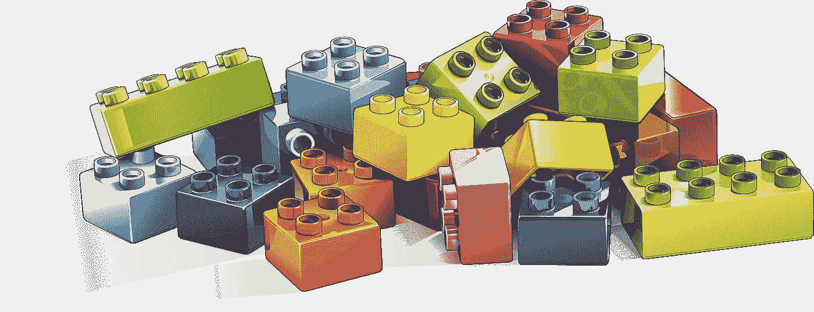

图片由[弗朗西斯·雷](https://pixabay.com/users/painter06-3732158/)在 [Pixabay](https://pixabay.com/illustrations/lego-building-game-toy-drawing-3388163/) 上拍摄

如今，如果你曾经试图构建一个用户界面，你可能会遇到很多问题。构建这些接口组件是一项非常昂贵和费力的任务。我们有设计师、产品经理和许多开发人员在一个项目上工作。

现代用户界面由成千上万的 UI 组件构建而成，这些组件在不同的屏幕、不同的用户界面之间重用，有时在同一公司的不同产品之间重用，以使设计看起来一致。现在，通常在这些场景中，有适当的设计系统，在一个地方有所有可重用组件的目录。这有助于提高 30-40%的开发人员的生产力。现代 UI 界面是由成千上万个可重用的 UI 组件构建而成的

现在，design systems 包含可重用的组件，这些组件可以在不同的应用程序中使用，以构建复杂、持久且可访问的用户界面。设计师和开发人员都对设计系统有贡献，所以它是真实的单一来源。这样，团队中的每个人都可以在不同的场景中测试他们构建的组件设计。

# 我们什么时候需要设计系统？

尽管设计系统有很多宣传和优点，但它并不适合所有人。如果你只做一个项目，没有设计系统你会更好。这只会增加应用程序的复杂性。

但是如果您在不同的项目中共享您的组件，那么构建一个设计系统对您来说是有意义的(而不是另一种选择:将组件从一个地方复制并粘贴到另一个地方)。

# 那么故事书到底是做什么的呢？

开发人员使用 Storybook 的原因如下

1.  独立构建 UI 组件
2.  防止用户界面错误
3.  跨不同项目标准化样式
4.  在不同的项目中分发 UI 组件

# 故事书对我有什么帮助？

## **UI/UX 设计师**

用户界面/UX 设计可以进入故事书，让你看到组件在不同场景下的外观和感觉。您还可以看到组件的所有状态，以及它们在不同状态变化期间的行为。它会给你提供有价值的反馈。

## **开发者**

开发人员可以轻松地在不同的项目之间共享这些组件，并查看它们的确切使用情况、这些组件的属性以及如何扩展它们。

这加快了开发过程，因为现在您只需构建一次组件，然后就可以导入并在其他地方使用它。代码共享变得更加容易，副作用可以在一个地方轻松处理。

# React 故事书入门

现在 Storybook 可以用于几乎所有可能的前端框架，而且有很多这样的框架。为什么我们不能只坚持一种，并使之成为标准呢？

好了，框架咆哮到此为止。先说 React。你可以在这里找到其他框架[的文档。](https://www.learnstorybook.com/intro-to-storybook/)

# 安装 React 故事书

现在，由于 Storybook 是 JavaScript 生态系统的一部分，您可以使用您最喜欢的包管理器来安装它。对于这个介绍，我将使用 yarn，但是 npm 也以同样的方式工作。

```
yarn global add @storybook/cli
```

它会在你的系统上全局安装故事书命令行界面。如果不想永久安装 Storybook CLI，也可以使用 npx。点击阅读更多关于那个[的内容。](https://github.com/storybookjs/storybook/tree/master/lib/cli)

现在，我们只需要 React 应用程序。我们将使用 create-react-app 来创建它。通过在您的系统上运行以下命令来安装 Create React App。

```
yarn create react-app storybook-intro --typescript
cd storybook-intro
```

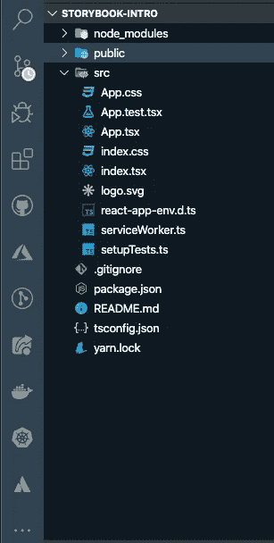

文件夹结构已生成

你可以在这里阅读更多关于 Create React App [的内容。让我们从添加故事书到我们的项目开始。](https://github.com/facebook/create-react-app)

运行以下命令将 Storybook 添加到您的项目中:

```
getstorybook
```

如果您注意到有一些额外的文件夹，请将它们添加到项目中:

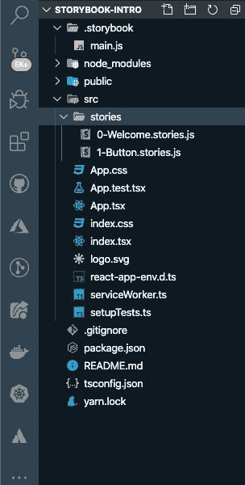

运行“getstorybook”后的文件夹结构

`.storybook`用于配置故事书。我们以后再做。

现在运行:

```
yarn storybook
```

如果你去`[http://localhost:9009/](http://localhost:9009/)` [，](http://localhost:9009/)你会看到下面的页面。每当您更改任何配置或添加任何新软件包时，请确保重新启动您的服务器。

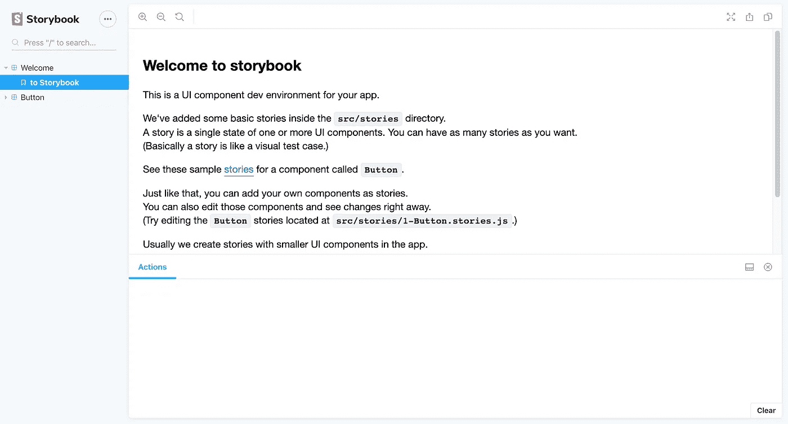

[http://localhost:9009/](http://localhost:9009/)

现在，让我们开始构建一些组件。然后，我们将看看如何配置 Storybook，使它更强大，并充分利用它。

让我们创建一个基本组件。让我们从一个按钮开始。

```
import React from "react";import "./index.css";interface IButtonProps {}
const Button: React.FC<IButtonProps> = () => {
return (
<>
<button className="button">Primary Button</button>
</>
);};export default Button;
export { Button };
```

添加以下 CSS:

```
.button {background-color: #4caf50; /* Green */border: none;color: white;padding: 15px 32px;text-align: center;text-decoration: none;display: inline-block;font-size: 16px;margin: 4px 2px;cursor: pointer;}
.primary {
background-color: #008cba;
}.danger {background-color: #f44336;}
```

让我们为这个组件添加一个故事。顺便说一下，你可以删除`stories`文件夹——反正我们也不需要。现在，在按钮组件旁边创建一个新文件`button.stories.TSX`。

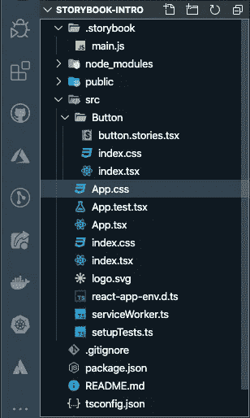

新文件夹结构

让我们在`button.stories.tsx`里面创造我们的第一个故事。

```
import React from "react";import { Button } from "./index";export default {title: "Button",component: Button};export const Primary = () => <Button>Hello Button</Button>;
```

让我们再次启动故事书服务器，看看我们的故事是什么样子的。

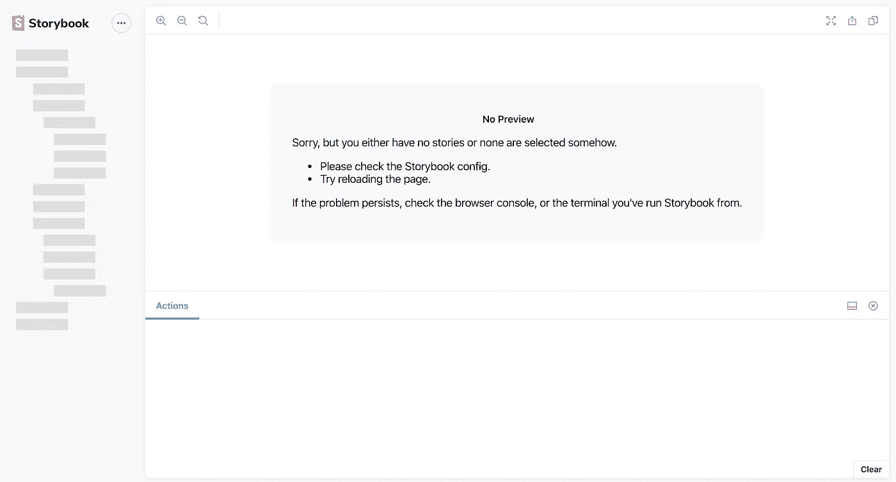

删除 stories 文件夹后的 Storybook

好了，我们没有看到我们新添加的故事。这是为什么呢？如果我们转到`.storybook/config.js file`，我们会看到 Storybook 是为 JavaScript 配置的，而不是 TypeScript。

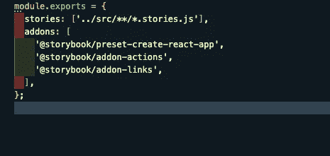

配置文件

现在让我们为 TypeScript 配置它。这很容易通过在`stories`中添加正确的正则表达式来完成。

```
../src/**/*.stories.(ts|tsx|js|jsx)
```

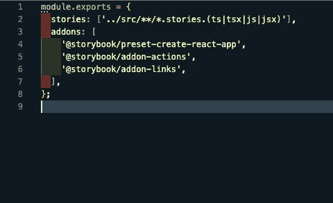

新配置. js

它将选择项目中所有的 JSX/TSX/JS/TS 文件。现在，如果你去`localhost:9009`，我们会看到我们的故事。请确保重新启动 Storybook 服务器，因为这是一个配置更改。

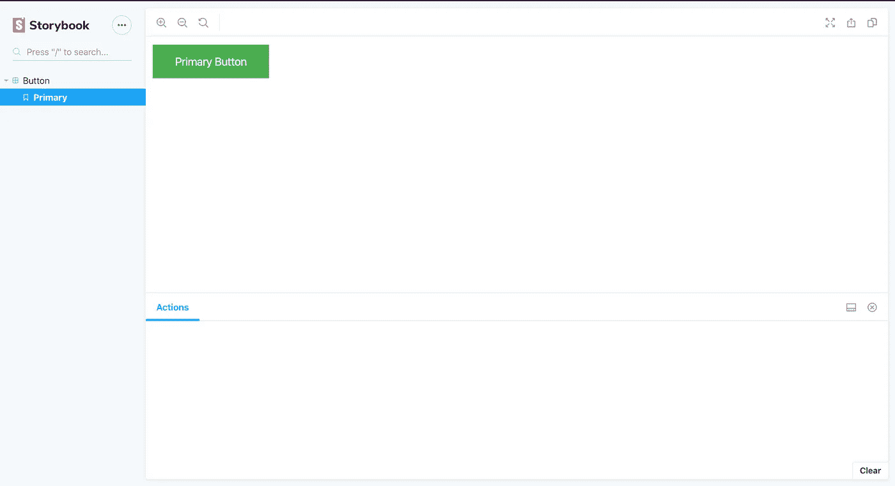

最后，我们看到了我们的故事

让我们使我们的组件更标准一点，这样我们就可以期待一些道具并做出改变。

```
import React from "react";import "./index.css";interface IButtonProps {buttonText: string;primary?: boolean;danger?: boolean;}const Button: React.FC<IButtonProps> = props => {
const { buttonText, primary, danger } = props;
let styles;
primary ? (styles = "primary") : danger ? (styles = "danger") : (styles = "");return (
<>
<button className={"button" + " " + styles}>{buttonText}</button>
</>);};export default Button;
export { Button };
```

因为我们更新了内容，所以我们也需要更新故事书组件来发送我们刚刚添加到组件中的道具。

```
import React from "react";import { Button } from "./index";export default {title: "Button",component: Button};export const Primary = () => (<Button buttonText="Primary Button" primary={true} />);export const DangerButton = () => (<Button buttonText="Danger Button" danger={true} />);
```

现在，如果我们回到我们的故事书，我们会看到两个故事——一个是主要按钮，另一个是危险按钮。

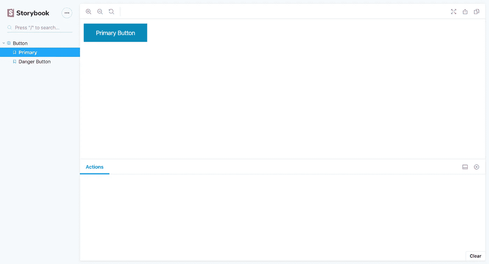

这只是开发的隔离部分。我们独立开发了一个故事书组件，但是我们如何告诉其他开发人员我们期待所有这些道具(比如带有主要、危险等的按钮文本)。)，而且他们可以通过改变这些来改变按钮的外观？

这就是故事书附件发挥作用的地方。这些使得 Storybook 在构建公共组件库方面非常强大。

Storybook 有几个推荐的附加组件:

*   `[a11y](https://github.com/storybooks/storybook/blob/master/addons/a11y)` —测试故事书中用户可访问性的组件
*   `[actions](https://github.com/storybooks/storybook/blob/master/addons/actions)` —记录用户在故事书用户界面中与组件交互的动作
*   `[knobs](https://github.com/storybooks/storybook/blob/master/addons/knobs)` —在故事书 UI 中交互编辑组件的输入数据
*   `[source](https://github.com/storybookjs/storybook/tree/master/addons/storysource)` —在故事书用户界面中查看故事的代码
*   `[viewport](https://github.com/storybooks/storybook/blob/master/addons/viewport)` —使用故事书更改响应式组件的显示大小和布局(这可以帮助您构建响应式布局)

你可以在这里看到所有的附加组件。除此之外，如果您愿意，还可以创建自己的附加组件。点击了解更多关于[的信息。](https://www.learnstorybook.com/intro-to-storybook/react/en/creating-addons/)

现在，让我们给我们的小项目添加一些附加组件。让我们从`knobs`附加组件开始，这样我们就可以与我们的组件进行交互。

## **安装**

首先，我们需要将附加组件安装到我们的项目中。

```
yarn add @storybook/addon-knobs @types/storybook__addon-knobs
```

现在，在你的`.storybook/main.js`文件中注册`knob`。

```
// .storybook/main.jsmodule.exports = {
stories: ["../src/**/*.stories.(ts|tsx|js|jsx)"],addons: ["@storybook/preset-create-react-app","@storybook/addon-actions",
"@storybook/addon-links",
"@storybook/addon-knobs"
]
};
```

我们把新加的`knob`加在那里吧。进入`.storybook`文件夹，新建一个名为`config.js`的文件。在那里添加新添加的附加组件。

像这样添加一个附加组件会将它添加到所有的故事中。如果你只是想给一个故事添加附加内容，也可以这样做。你可以在这里阅读相关内容。但是如果你正在构建一个库，你不会一个接一个地给每个文件添加插件。所以让我们从创建一个`config.js`文件开始。

```
// .storybook/config.jsimport { withKnobs } from "@storybook/addon-knobs";
import { addDecorator } from "@storybook/react";addDecorator(withKnobs);
```

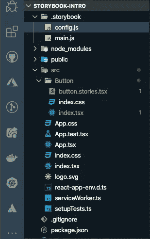

添加配置文件后的文件夹结构

在我们看到故事书的任何变化之前，我们需要在我们的故事中使用`knob`。

转到`button.stories.tsx`，使用`knob`。`knob`为我们提供了很多`knob`，比如`text`、`boolean`和`object` ，这取决于你的数据类型。

在我们的例子中，我们只需要`text`和`boolean`，因为这是我们在按钮组件中支持的唯一类型。从`@storybook/addon-knobs`中导入合适的`knob`。

```
// Button/button.stories.tsximport { text, boolean } from "@storybook/addon-knobs";
```

现在转到组件故事，如下使用`knob`:

```
// PrimaryButton inside Button/button.stories.tsx
<ButtonbuttonText={text("Button Text", "Primary Button")}primary={boolean("Primary button", true)}/>// DangerButton inside Button/button.stories.tsx<ButtonbuttonText={text("Button Text", "Danger Button")}danger={boolean("Danger Button", true)}/>
```

如果你回到`localhost:9009/`，你会看到你新添加的`knob`在起作用。

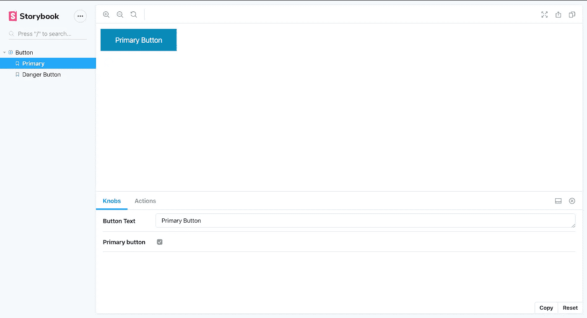

旋钮动作

我们可以更改按钮的文本，并使用布尔值来设置按钮的状态，并查看按钮在其状态改变时的行为。

另一个非常有用的插件是`info`。当您安装它时，库中的每个文章都会有一个文档页面。这些可以用于记录您的组件，以便其他开发人员了解如何以及为什么可以使用它。

要添加此加载项，只需安装该加载项:

```
yarn add @storybook/addon-info @types/storybook__addon-info
```

现在，让我们首先将它注册到我们的附加组件的`main.js`文件中。

```
// .storybook/main.js
module.exports = {stories: ["../src/**/*.stories.(ts|tsx|js|jsx)"],addons: ["@storybook/preset-create-react-app","@storybook/addon-actions","@storybook/addon-links","@storybook/addon-knobs","@storybook/addon-info"]};
```

在这之后，我们还需要配置这个附加组件来与我们的故事书一起工作。去`config.js`，注册这个新的插件。

```
// .storybook/config.jsimport { withKnobs } from "@storybook/addon-knobs";import { addDecorator, addParameters } from "@storybook/react";import { withInfo } from "@storybook/addon-info";addDecorator(withInfo);addDecorator(withKnobs);
```

回到你的按钮故事，并配置这个附加组件。

```
import PropTypes from "prop-types";import { Button } from "./index";export default {title: "Button",component: Button,parameters: {info: { inline: false }}};Button.propTypes = {buttonText: PropTypes.string.isRequired,primary: PropTypes.bool,danger: PropTypes.bool};
```

我们只需要使用`info`参数向您的故事传递某些选项或特定的文档文本(并添加道具类型以显示按钮组件信息接收的道具)。

也可以完全禁用附加组件。根据您想要禁用附加组件的范围，只需通过`info:{disable:true}`。现在，如果我们在重启服务器后回到`localhost:9009/`，我们会在右上角看到一个名为 Show Info 的新区域。

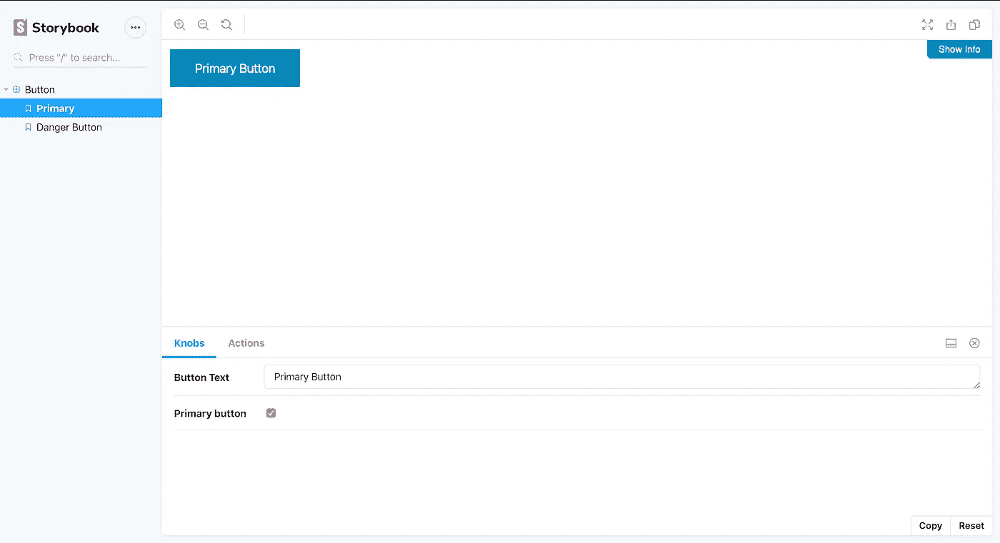

现在，如果我们转到 docs，我们看不到任何有趣的东西—只有组件及其使用方式。

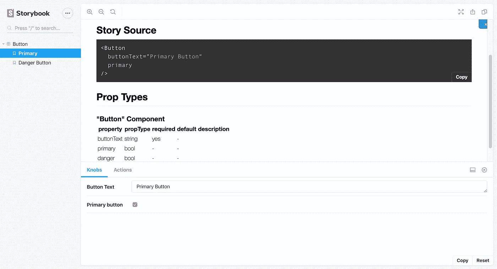

现在让我们添加一些文档来更好地阐述这个组件，它做什么，以及应该如何使用它。我们可以将另一个键传递给`info` ——被调用的文本描述了组件做什么以及如何使用它。

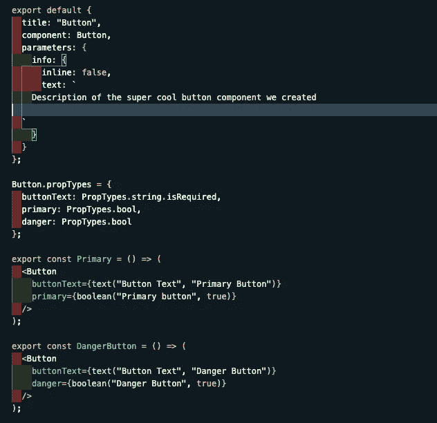

我们的按钮组件的描述

现在，在添加了`text`之后，如果我们返回到`localhost:9009/`并点击 show info，我们会看到我们的组件文档。

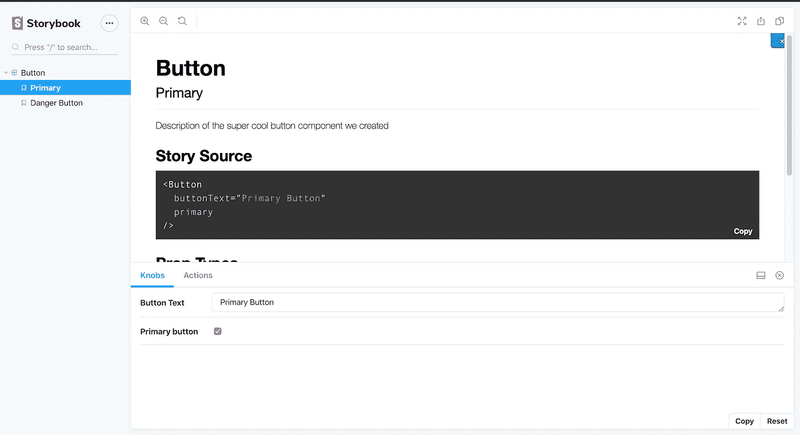

显示操作中的信息旋钮

# 结论

正如您在本文中所看到的，Storybook 易于使用，并且有许多附加组件，使得代码可以很容易地在不同的项目之间共享。它也有适当的文档，我们可以独立地构建我们所有的组件，这样所有的团队成员都可以看到已经构建了哪些组件，以及他们如何使用这些组件。

而如果有新人加入，他们就不用担心组件是否已经构建好，或者如何使用组件。这大大减少了开发时间，并有助于增强您的界面，使它们在不同的项目中保持一致。

本文的所有代码都可以在我的 GitHub 上获得[。](https://github.com/thakursachin467/storybook-intro)

感谢阅读！