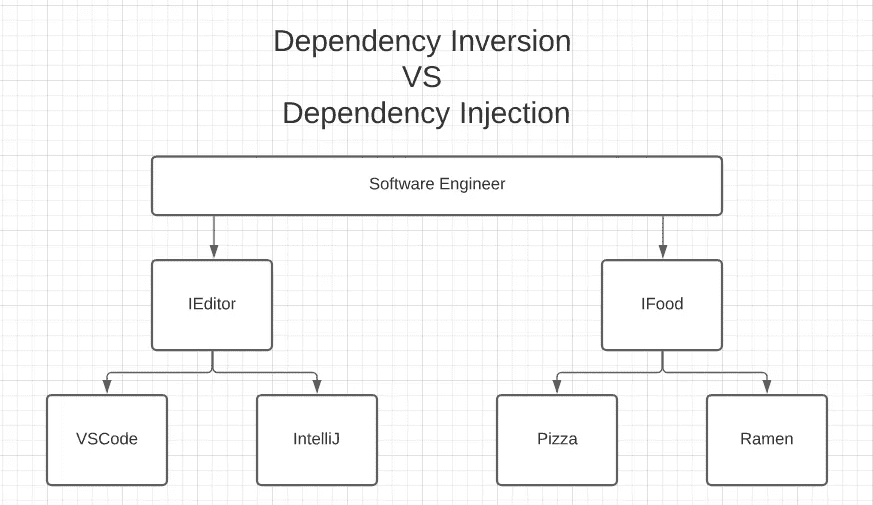

# 依赖倒置与依赖注入

> 原文：<https://betterprogramming.pub/straightforward-simple-dependency-inversion-vs-dependency-injection-7d8c0d0ed28e>

## 简单明了

皮特·诺维茨基在 [Unsplash](https://unsplash.com?utm_source=medium&utm_medium=referral) 上的照片

我做软件工程师已经有几年了，但是时不时地我喜欢回到基础上来。我们都“知道”我们应该遵循鲍勃大叔的[坚实原则](https://en.wikipedia.org/wiki/SOLID)，但是常识并不总是惯例。

最近，我突然意识到我真的不知道依赖倒置和依赖注入之间的区别。我大概知道它们的意思，但是我不确定这两者之间有什么区别，而且，为什么叫依赖倒置，到底什么是倒置？事实证明，就像所有美好的事物一样，背后都有一个故事。但是首先，让我们讨论一下这两个概念的区别。

# 依赖性倒置

依赖性反转是一种设计原则。简单地说，这意味着我们不应该依赖于底层的实现，而应该依赖于高层的抽象。这是有意义的，因为它允许我们不知道实现细节。无论我们想要改变一个特定的实现还是支持其他的实现，代码都将保持不变，因为它与底层的实现细节是分离的。

为了说明这个概念，让我们假设你是一名软件工程师。你有两个依赖，你的代码编辑器和你的食物。你不想事事都被 VSCode 缠住，也不想整天吃披萨。此外，如果他们改变了比萨饼的实现细节，现在它变得很糟糕，会发生什么？

这个可怕问题的解决方案是依靠高层次的抽象。你需要*一些*编辑，你需要*一些*食物，但是你宁愿保留你的选择权。如果比萨饼开始变得难吃，你总是可以使用另一种食物，去吃拉面，甚至汉堡。

# 依赖注入

依赖注入是一种设计模式，它允许我们将创建和使用分开。它允许我们在运行时“注入”所需的对象，而不用担心自己构造它们。它也倾向于与依赖倒置原则携手工作。

例如，我们可以依赖高级抽象类，并在运行时根据所需的用例注入特定的实现。这允许我们编写更多可配置的动态代码。它甚至提高了我们测试代码的能力，因为它允许我们轻松地模仿注入的类，所以我们可以专注于测试我们的核心逻辑。

为了说明这个概念，让我们再次假设你是一名软件工程师，有着同样的依赖——代码编辑器和食物。你肯定不想自己准备比萨饼，也不想自己构建代码编辑器。你是一个忙碌的软件工程师，你没有时间。

幸运的是，您身边有依赖注入！
你不需要准备比萨饼或构建代码编辑器——你可以假设它已经为你创建好了，并准确地注入到你需要的地方。
此外，你不会永远受困于披萨和 VSCode。你可以是食物不可知论者，让配置决定你今天是吃(或被注射，YIKES)披萨还是拉面。

因此，本质上依赖注入使我们能够使用依赖倒置并依赖高级抽象。

但是，我还是没有覆盖为什么叫“倒挂”，这里倒挂的到底是什么？我答应给你一个故事！(别担心它很短)

# 为什么我们称之为依赖“倒置”？

在传统的软件开发中，最佳实践似乎是在分层架构中构建软件，这使得越来越复杂的系统的构建成为可能。

在这种体系结构中，较高级别的组件直接依赖于较低级别的组件来完成复杂的任务。

# 准备披萨——老方法与“倒置”方法

为了说明“反转”，请看下面的`preparePizza`函数:

高级功能依赖于两个特定的实现来完成其任务。

现在让我们看一个使用依赖注入和依赖倒置的例子:

在这个例子中，我们依靠高级抽象来完成我们的任务。所以我们可以用网上找到的菜谱做披萨，自己动手做披萨，让奶奶好好休息一下。

# 我们今天学到了什么

我们讨论了依赖注入和依赖倒置之间的区别，以及它们如何一起工作来产生优秀的软件。我们还讨论了为什么我们使用“反转”这个术语，并在这个过程中学到了一些软件历史。

我希望这篇文章对你有用，在下一次之前，保持它简单明了！