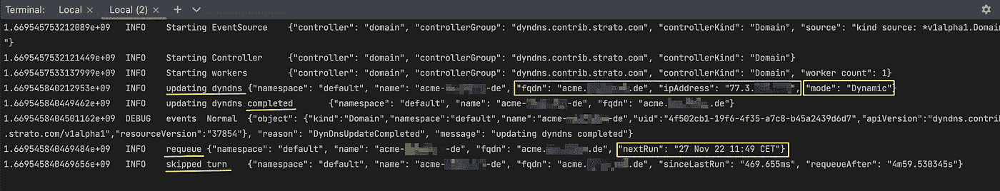
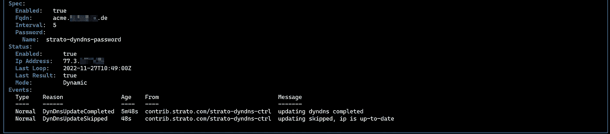
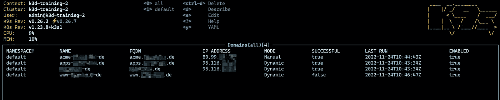
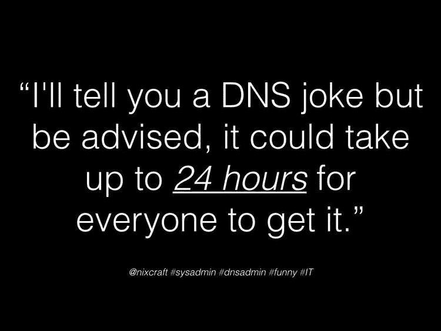

# Kubernetes 的斯特拉托 DynDNS 控制器

> 原文：<https://betterprogramming.pub/strato-dyndns-controller-for-kubernetes-9a59ae426c5b>

## K8S 控制器来更新 STRATO 服务器上的域名 DNS 记录


“总是 DNS…”阿什利·威利斯的作品[@阿什利·麦克纳马拉](https://twitter.com/ashleymcnamara)

# 介绍

几年来，我逐渐将家庭实验室的工作负载从虚拟机转移到 Docker 容器，最终，在 Kubernetes 中，我在寻找一个有效的解决方案，来保持我的域的 DNS 记录与我的 ISP 分配的动态 IP 地址同步。

我用了 [DirectUpdate](https://www.directupdate.net) 很长一段时间，虽然它花费了大约 25 欧元，确实物有所值，但它也有一个缺点:它只能在 Windows 上运行，而且浪费这么多资源只是为了一个简单的 DynDNS-updater 客户端是一种过度的杀戮。因此，我开始寻找其他解决方案，如 Cloudflare、DigitalOcean、No-IP DynDNS 等。但是我仍然不满意。我很无聊地在不同的仪表板、提供商和面板之间跳跃，以定期查看我的域名的 DNS 记录，所以我确保我的反向代理和我的 Kubernetes 入口没有遇到麻烦。我决定我需要自己的解决方案(为什么不呢？)必须满足三个标准:

1.  这不应该花我一分钱
2.  它应该与 Kubernetes 集成，所以我不需要从仪表板跳到仪表板
3.  它应该是完全自主的、自我修复的和周期性的

满足所有这些标准的显而易见的解决方案是使用定制的 CRDs 来定制 Kubernetes 控制器，还有比 Kubebuilder 更好的工具吗？Kubebuilder 是一个使用[定制资源定义(CRDs)](https://kubernetes.io/docs/tasks/access-kubernetes-api/extend-api-custom-resource-definitions) 构建 Kubernetes APIs 的框架。它为我们做所有繁重的工作，构建项目结构，搭建编码、构建和部署我们的工件所需的基本组件。

[](https://github.com/kubernetes-sigs/kubebuilder) [## GitHub-Kubernetes-sigs/kube builder:用于使用 CRDs 构建 Kubernetes APIs 的 Kubebuilder - SDK

### Kubebuilder 是一个使用自定义资源定义(CRD)构建 Kubernetes APIs 的框架。类似于 web…

github.com](https://github.com/kubernetes-sigs/kubebuilder) 

简而言之，这个故事非常简单，主要由两部分组成:通过将工件表示为定制资源定义(CRD)来扩展 Kubernetes 控制平面，并创建一个定制控制器，该控制器定期或通过响应 CRs 上的更改，尝试调整这些 CRs 的实际观察状态，以便与所需状态相匹配。


我们在 Kubernetes 中的解决方案的简单架构图(CRDs、秘密、控制器)

在我们的例子中，这转化为一个 CRD，它将被称为域，实际上是一个域(或子域)的表示，您希望在 [STRATO](https://www.strato.de) 上定期更新它的 DNS 记录；以及一个定制控制器，它接管协调 CRs 状态和将 IP 变化传播到 STRATO DynDNS 端点的 Sisyphean 任务。

此外，我们将需要一个秘密，但它的作用纯粹是辅助性的，因为它只作为对 STRATO DynDNS 端点发出请求所需的凭证的保管者。

> 为什么首先选择 STRATO？因为这是我注册所有域名的地方。
> 
> 斯特拉托公司是一家德国互联网托管服务提供商，总部设在柏林。它是联合互联网公司的子公司，于 2016 年从德国电信公司收购了它。斯特拉托主要在德国、荷兰、西班牙、法国、英国和瑞典开展业务，为 200 多万客户提供服务。

本文不是关于使用 Kubebuilder 创建定制控制器的入门文章。如果你是这个话题的新手，可以参考官方的 Kubebuilder 书籍或者看看赖的这篇非常好的文章:

[](https://medium.com/swlh/kubernetes-operator-for-beginners-what-why-how-21b23f0cb9b1) [## 面向初学者的 Kubernetes 运算符—什么、为什么、如何

### 解释基本知识和方法，使用 Kubebuilder 从头构建一个操作符

medium.com](https://medium.com/swlh/kubernetes-operator-for-beginners-what-why-how-21b23f0cb9b1) 

抛开这些不谈，现在让我们来剖析代码！

# 自定义资源定义(CRD)

`Domain`由两个属性组成(主要是——什么是`TypeMeta`和`ObjectMeta`你可以在 Kubebuilder 的书中找到它)，我们在前面已经简单讨论过了。`Spec`、`DomainSpec`类型是期望状态，而`Status`、`DomainStatus`类型是我们的`Domain`客户资源(CR)在任何给定时刻的实际(观察)状态。

如果你注意到，这个结构是用一堆以`+kubebuilder:printcolumn`为前缀的属性来修饰的，它们决定了当我们查询一个对象或该`Kind`的对象列表时，将显示哪些列。

```
kubectl get domains --all-namespaces
```

每列的值可以从期望状态(`.spec.XXX`)或观察状态(`.status.XXX`)中导出。

```
// Domain is the Schema for the domains API
// +kubebuilder:printcolumn:name="Fqdn",type=string,JSONPath=`.spec.fqdn`
// +kubebuilder:printcolumn:name="IP Address",type=string,JSONPath=`.status.ipAddress`
// +kubebuilder:printcolumn:name="Mode",type=string,JSONPath=`.status.mode`
// +kubebuilder:printcolumn:name="Successful",type=boolean,JSONPath=`.status.lastResult`
// +kubebuilder:printcolumn:name="Last Run",type=string,JSONPath=`.status.lastLoop`
// +kubebuilder:printcolumn:name="Enabled",type=boolean,JSONPath=`.spec.enabled`
type Domain struct {
 metav1.TypeMeta   `json:",inline"`
 metav1.ObjectMeta `json:"metadata,omitempty"`

 Spec   DomainSpec   `json:"spec,omitempty"`
 Status DomainStatus `json:"status,omitempty"`
}
```

期望的状态`DomainSpec`有五个属性。`Fqdn`这是您想要跟踪的域名或子域的完全限定名称。`IpAddress`是可选的，如果它被设置，那么我们隐式地强制手动模式，当它为空时，我们的控制器将发现由我们的 ISP 分配给我们的当前 IP 地址(动态模式)。是不需要进一步解释的事情。`IntervalInMinutes`正在定义两个连续协调循环之间的间隔，`Password`是对`Secret`资源的引用，该资源将保存我们的斯特拉托动态域名系统服务的密码。

这些属性也可以用强制或规定对象的各种行为方面的属性来修饰。例如，我们通过正则表达式对`Fqdn`进行验证，从而确保它是一个有效的域名，对`IpAddress`来说，它是一个有效的 IPv4 地址。对于`IntervalInMinutes`,我们希望确保其频率不超过五分钟，在缺席的情况下，这将是部署时自动分配的默认值。

```
// DomainSpec defines the desired state of Domain
type DomainSpec struct {
 // INSERT ADDITIONAL SPEC FIELDS - desired state of cluster
 // Important: Run "make" to regenerate code after modifying this file

 // +kubebuilder:validation:Required
 // +kubebuilder:validation:Pattern:=`^([a-zA-Z0-9]|[a-zA-Z0-9][a-zA-Z0-9\-]{0,61}[a-zA-Z0-9])(\.([a-zA-Z0-9]|[a-zA-Z0-9][a-zA-Z0-9\-]{0,61}[a-zA-Z0-9]))*$`
 Fqdn string `json:"fqdn"`

 // +optional
 // +kubebuilder:validation:Required
 // +kubebuilder:validation:Pattern:=`^((25[0-5]|(2[0-4]|1\d|[1-9]|)\d)\.?\b){4}$`
 IpAddress *string `json:"ipAddress,omitempty"`

 // +optional
 // +kubebuilder:default:=true
 // +kubebuilder:validation:Type=boolean
 Enabled bool `json:"enabled,omitempty"`

 // +optional
 // +kubebuilder:default=5
 // +kubebuilder:validation:Minimum=5
 IntervalInMinutes *int32 `json:"interval,omitempty"`

 Password *v1.SecretReference `json:"password"`
}
```

观察到的状态`DomainStatus`，要简单得多。在每个协调循环中，基于协调的输出(`IpAddress`在 STRATO 记录中更新的 IP，`LastReconciliationLoop`最后一次更新尝试发生的时间和`LastReconciliationResult`最后一次尝试是否成功)或者基于在该循环中处理的当前期望状态(`Enabled`或`Mode`)来计算它们的值。

```
// DomainStatus defines the observed state of Domain
type DomainStatus struct {
 // INSERT ADDITIONAL STATUS FIELD - define observed state of cluster
 // Important: Run "make" to regenerate code after modifying this file
 Enabled                  bool         `json:"enabled,omitempty"`
 IpAddress                string       `json:"ipAddress,omitempty"`
 Mode                     string       `json:"mode,omitempty"`
 LastReconciliationLoop   *metav1.Time `json:"lastLoop,omitempty"`
 LastReconciliationResult *bool        `json:"lastResult,omitempty"`
}
```

当我们完成这些结构的编码后，您可以在`/api/v1alpha1/domain_types.go`下找到它们，然后我们可以用 Kubebuilder 更新我们项目的其余部分，并将它们作为 CRD 安装到我们的开发集群中。

```
make manifests
make install
```

制作清单将会基于我们之前在`/config/samples`中编写的结构创建一些样本 YAML 文件。

```
apiVersion: dyndns.contrib.strato.com/v1alpha1
kind: Domain
metadata:
  name: www-example-de
spec:
  fqdn: "www.example.de"
  enabled: true
  interval: 5
  password:
    name: strato-dyndns-password
```

更改这些值，使它们指向您的域或子域。

# 秘密

清单不会为`Secret`创造一个脚手架——它不是 CRD，而是 Kubernetes 的核心资源。我们必须自己创造它。STRATO DynDNS 端点需要一个`username`和一个`password`，其中`username`始终是域或子域本身，`password`是您激活该(子)域的 DynDNS 时创建的密码或您的 STRATO 客户帐户的 DynDNS 主密码。您可以选择使用哪一个，但是在进行`Secret`的 YAML 之前，我们需要将这个密码编码为 base64:

```
echo -n "password" | base64
```

在`/config/samples`下创建一个空的 YAML 文件，将您在`Domain` YAML 中使用的`password.name`声明为`name`，将您刚刚生成的密码的编码值声明为`data.password`。

```
apiVersion: v1
kind: Secret
metadata:
  name: strato-dyndns-password
type: Opaque
data:
  password: cGFzc3dvcmQ=
```

将两个 YAMLs 都部署到集群中:

```
kubectl apply -f config/samples 
```

如果一切正常，您可以看到一个`www-example-de`(如果您请求获得`domains`)，如果您请求集群中的`secrets`，则可以看到 strato-dyndns-password:

```
kubectl get domains --all-namespaces
kubectl get secrets --all-namespaces
```

# 定制控制器

如前所述，向您解释定制控制器是如何工作的超出了本文的范围，所以我将坚持这个控制器是如何工作的。如果对你来说这是一个新的话题，做好准备。

首先，我们希望确保我们的控制器有足够的权限来监视或更新各种资源。当然，我们希望对`Domains`拥有完全的控制权，但是我们还希望能够获取和观察`Secrets`并创建或更新 Kubernetes `Events`。我们通过`+kubebuilder:rbac`属性对此进行管理。

```
//+kubebuilder:rbac:groups=dyndns.contrib.strato.com,resources=domains,verbs=get;list;watch;create;update;patch;delete
//+kubebuilder:rbac:groups=dyndns.contrib.strato.com,resources=domains/status,verbs=get;update;patch
//+kubebuilder:rbac:groups=dyndns.contrib.strato.com,resources=domains/finalizers,verbs=update
//+kubebuilder:rbac:groups="",resources=events,verbs=create;patch
//+kubebuilder:rbac:groups="",resources=secrets,verbs=get;list;watch;
```

当您发出`make manifests`命令时，一堆 YAML 文件，以及其他文件，将基于这些属性在`/config/rbac`下创建。

我们的协调循环流程很简单。获取`Domain`，如果失败，永久终止循环，不再排队。

```
var domain dyndnsv1alpha1.Domain
 if err := r.Get(ctx, req.NamespacedName, &domain); err != nil {
  if apierrors.IsNotFound(err) {
   logger.Error(err, "finding Domain failed")
   return ctrl.Result{}, nil
  }

  logger.Error(err, "fetching Domain failed")
  return ctrl.Result{}, err
 }
```

检查所需状态(`.Spec.Enabled`)，如果未启用，则相应更新 Kubernetes ( `.Status.Enabled`)中 CR 的状态，如果启用为假，则永久退出对账循环。

```
// update status and break reconciliation loop if is not enabled
 if !domain.Spec.Enabled {
  domainCopy.Status.Enabled = domain.Spec.Enabled
  // update the status of the CR
  if err := r.Status().Update(ctx, &domainCopy); err != nil {
   logger.Error(err, "updating status failed") //

   requeueAfterUpdateStatusFailure := time.Now().Add(time.Second * time.Duration(15))
   return ctrl.Result{RequeueAfter: time.Until(requeueAfterUpdateStatusFailure)}, err
  }

  return ctrl.Result{}, nil
 }
```

确保有一个可接受的间隔，并决定所需的状态是否指示我们以手动或动态模式进行。

```
// define interval between reconciliation loops
 interval := defaultIntervalInMinutes
 if domain.Spec.IntervalInMinutes != nil {
  interval = *domain.Spec.IntervalInMinutes
 }

 // change mode to manual in presence of an explicit ip address in specs
 if domain.Spec.IpAddress != nil {
  mode = Manual
 }
```

如果协调循环在定义的时间间隔之前开始(可能是 YAML 文件中的外部变化或内部 Kubernetes 事件)，请确保跳过这一轮，等待下一次计划的执行。

> 否则，我们可能会对 STRATO 造成频繁请求的溢出，我们不希望这样做，因为我们会触及 Kubernetes 或 STRATO 本身的速率限制器，而您最不希望的事情就是由于滥用他们的 API 而被搁置一段时间。

```
// is reconciliation loop started too soon because of an external event?
 if domain.Status.LastReconciliationLoop != nil && mode == Dynamic {
  if time.Since(domain.Status.LastReconciliationLoop.Time) < (time.Minute*time.Duration(interval)) && wasSuccess {
   sinceLastRunDuration := time.Since(domain.Status.LastReconciliationLoop.Time)
   intervalDuration := time.Minute * time.Duration(interval)
   requeueAfter := intervalDuration - sinceLastRunDuration

   logger.Info("skipped turn", "sinceLastRun", sinceLastRunDuration, "requeueAfter", requeueAfter)
   return ctrl.Result{RequeueAfter: time.Until(time.Now().Add(requeueAfter))}, nil
  }
 }
```

如果模式是`Manual`，我们的 IP 地址是在期望状态(`.Spec.IpAddress`)中定义的地址。否则，我们会发现我们的外部 IP 地址，即 ISP 分配给路由器的地址。

```
currentIpAddress := domain.Status.IpAddress
 var newIpAddress *string

 switch mode {
 case Dynamic:
  externalIpAddress, err := r.getExternalIpAddress()
  if err != nil {
   logger.Error(err, "retrieving external ip failed")
   r.Recorder.Eventf(instance, v1core.EventTypeWarning, "RetrieveExternalIpFailed", err.Error())

   success = false
  } else {
   newIpAddress = externalIpAddress
  }
 case Manual:
  newIpAddress = domain.Spec.IpAddress
 }
```

如果我们的 IP 地址的新的期望状态与观察到的状态匹配，什么也不要做——记住，友好地对待，不要无缘无故地滥用他们的端点。如果没有，获取`Secret`并检索您的`password`，将所需的更改传播到 STRATO DNS 服务器。

```
// proceed to update Strato DynDNS only if a valid IP address was found
 if newIpAddress != nil {
  // if last reconciliation loop was successful and there is no ip change skip the loop
  if *newIpAddress == currentIpAddress && wasSuccess {
   logger.Info("updating dyndns skipped, ip is up-to-date", "ipAddress", currentIpAddress, "mode", mode.String())
   r.Recorder.Event(instance, v1core.EventTypeNormal, "DynDnsUpdateSkipped", "updating skipped, ip is up-to-date")
  } else {
   logger.Info("updating dyndns", "ipAddress", newIpAddress, "mode", mode.String())

   passwordRef := domain.Spec.Password
   objectKey := client.ObjectKey{
    Namespace: req.Namespace,
    Name:      passwordRef.Name,
   }

   var secret v1core.Secret
   if err := r.Get(ctx, objectKey, &secret); err != nil {
    if apierrors.IsNotFound(err) {
     logger.Error(err, "finding Secret failed")
     return ctrl.Result{}, nil
    }

    logger.Error(err, "fetching Secret failed")
    return ctrl.Result{}, err
   }

   password := string(secret.Data["password"])
   if err := r.updateDns(domain.Spec.Fqdn, domain.Spec.Fqdn, password, *newIpAddress); err != nil {
    logger.Error(err, "updating dyndns failed")
    r.Recorder.Eventf(instance, v1core.EventTypeWarning, "DynDnsUpdateFailed", err.Error())

    success = false
   } else {
    logger.Info("updating dyndns completed")
    r.Recorder.Eventf(instance, v1core.EventTypeNormal, "DynDnsUpdateCompleted", "updating dyndns completed")

    success = true
   }
  }
 }
```

更新 STRATO DynDNS 非常简单。你需要发出一个`GET`请求去做，看起来像这样:

```
 https://%s:%s@dyndns.strato.com/nic/update?hostname=%s&myip=%s
```

前两个参数分别是`username`和`password`，`hostname`是你的(子)域名，`myip` 是你要更新 DNS 记录的新 IP 地址。

最后，我们更新了 CR 的状态，并重新安排了以下内容:

```
// update the status of the CR no matter what, but assign a new IP address in the status
 // only when Strato DynDNS update was successful
 if success {
  domainCopy.Status.IpAddress = *newIpAddress
 }

 domainCopy.Status.LastReconciliationLoop = &v1meta.Time{Time: time.Now()}
 domainCopy.Status.LastReconciliationResult = &success
 domainCopy.Status.Enabled = domain.Spec.Enabled
 domainCopy.Status.Mode = mode.String()

 // update the status of the CR
 if err := r.Status().Update(ctx, &domainCopy); err != nil {
  logger.Error(err, "updating status failed") //

  requeueAfterUpdateStatusFailure := time.Now().Add(time.Second * time.Duration(15))
  return ctrl.Result{RequeueAfter: time.Until(requeueAfterUpdateStatusFailure)}, err
 }

 // if Mode is Manual, and we updated DynDNS with success, then we don't requeue, and we will rely only on
 // events that will be triggered externally from YAML updates of the CR
 if mode == Manual && success {
  return ctrl.Result{}, nil
 }

 requeueAfter := time.Now().Add(time.Minute * time.Duration(interval))

 logger.Info("requeue", "nextRun", fmt.Sprintf("%s", requeueAfter.Local().Format(time.RFC822)))
 logger.V(10).Info("finished dyndns update")

 return ctrl.Result{RequeueAfter: time.Until(requeueAfter)}, nil
```

现在，我们准备尝试我们的控制器(在外部，不将它部署到集群):

```
make run
```



为我们的域更新 STRATO DynDNS 成功！



在协调和更新后，通过 K9S 对我们的领域进行“kubectl 描述…”



K9S 中的“kubectl get domains—all-namespaces”命令

# 摘要

您可以在 GitHub 中找到完整的源代码，以及如何将其构建为容器并部署到您的集群的说明:

[](https://github.com/akyriako/strato-dyndns) [## 斯特拉托动态域名系统控制器更新你的域名系统记录…

### 斯特拉托动态域名系统控制器在 STRATO AG 上更新你的域名系统记录。自定义控制器正在观察域 CRs…

github.com](https://github.com/akyriako/strato-dyndns) 

试用这个控制器，并在你认为合适的时候随意分叉和扩展它，或者在下面的评论或 Github 上留下你的反馈。直到下一次…

